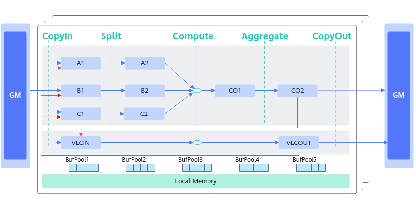
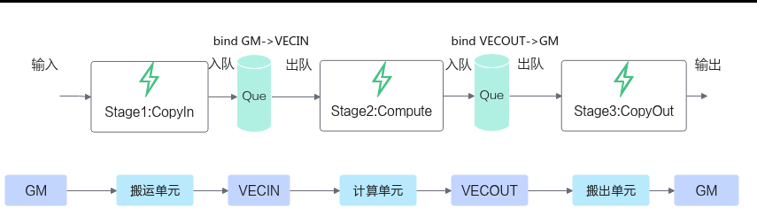
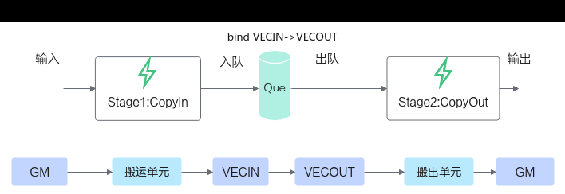

# DeQue

> **Section**: 5  
> **PDF Pages**: 1788–1790  

---

<!-- page 1788 -->

## ?.5. DeQue

产品支持情况

产品是否支持

Atlas 350 加速卡√

Atlas A3 训练系列产品/Atlas A3 推理系列产品x

Atlas A2 训练系列产品/Atlas A2 推理系列产品x

Atlas 200I/500 A2 推理产品x

Atlas 推理系列产品AI Corex

Atlas 推理系列产品Vector Corex

Atlas 训练系列产品x

功能说明

将tensor从队列中取出，用于后续处理。

函数原型

```cpp
template <typename T>__aicore__ inline LocalTensor<T> DeQue()
```

参数说明

无

约束说明

无

返回值说明

从队列中取出的LocalTensor。

调用示例

参考调用示例。

## 6.2.3.6.1.7 TQueBind

## ?.1. TQueBind 简介

TQueBind绑定源逻辑位置和目的逻辑位置，根据源位置和目的位置，来确定内存分配的位置、插入对应的同步事件，帮助开发者解决内存分配和管理、同步等问题。Tque是TQueBind的简化模式。通常情况下开发者使用TQue进行编程，TQueBind对外提供一些特殊数据通路的内存管理和同步控制，涉及这些通路时可以直接使用TQueBind。

<!-- page 1789 -->

如下图的数据通路示意图所示，红色线条和蓝色线条的通路可通过TQueBind定义表达，蓝色线条的通路可通过TQue进行简化表达。



表6-696 TQueBind 和TQue 对于数据通路的表达

数据通路TQueBind定义TQue定义

GM->VECINTQueBind<TPosition::GM, TPosition::VECIN, 1>

```cpp
TQue<TPosition::VECIN, 1>
```

VECOUT->GMTQueBind<TPosition::VECOUT, TPosition::GM, 1>

```cpp
TQue<TPosition::VECOUT, 1>
```

VECIN->VECOUT

-

```cpp
TQueBind<TPosition::VECIN, TPosition::VECOUT, 1>
```

GM->A1TQueBind<TPosition::GM, TPosition::A1, 1>

```cpp
TQue<TPosition::A1, 1>
```

GM->B1TQueBind<TPosition::GM, TPosition::B1, 1>

```cpp
TQue<TPosition::B1, 1>
```

GM->C1TQueBind<TPosition::GM, TPosition::C1, 1>

```cpp
TQue<TPosition::C1, 1>
```

A1->A2TQueBind<TPosition::A1, TPosition::A2, 1>

```cpp
TQue<TPosition::A2, 1>
```

B1->B2TQueBind<TPosition::B1, TPosition::B2, 1>

```cpp
TQue<TPosition::B2, 1>
```

C1->C2TQueBind<TPosition::C1, TPosition::C2, 1>

```cpp
TQue<TPosition::C2, 1>
```

CO1->CO2TQueBind<TPosition::CO1, TPosition::CO2, 1>

```cpp
TQue<TPosition::CO1, 1>
```

CO2->GMTQueBind<TPosition::CO2, TPosition::GM, 1>

```cpp
TQue<TPosition::CO2, 1>
```

<!-- page 1790 -->

数据通路TQueBind定义TQue定义

-

VECOUT->A1/B1/C1

```cpp
TQueBind<TPosition::VECOUT, TPosition::A1, 1>TQueBind<TPosition::VECOUT, TPosition::B1, 1>TQueBind<TPosition::VECOUT, TPosition::C1, 1>
```

CO2->VECINTQueBind<TPosition::CO2, TPosition::VECIN, 1>

-

说明

上述表格中的Cube相关数据通路建议使用Cube高阶API（如Matmul）实现，直接使用TQueBind控制会相对复杂。

下面通过两个具体的示例展示了矢量编程场景下TQueBind的使用方法：

●如下的编程范式示例，图中的两个队列分别绑定的是GM VECIN和VECOUT GM。



●如果不需要进行Vector计算，比如仅需要做格式随路转换等场景，可对上述流程进行优化，对VECIN和VECOUT进行绑定，绑定的效果可以实现输入输出使用相同buffer，实现double buffer。



模板参数

```cpp
template <TPosition src, TPosition dst, int32_t depth, auto mask = 0> class TQueBind {...};
```
