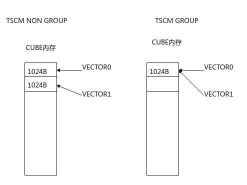

# TSCM

> **Section**: 6.2.3.6.1.6  
> **PDF Pages**: 1782–1784  

---

<!-- page 1782 -->

AscendC::TQue<AscendC::TPosition::VECOUT, 1> que;int num = 4;int len = 1024;pipe.InitBuffer(que, num, len);bool ret = que.HasIdleBuffer(); // 没有AllocTensor的操作，返回值为trueAscendC::LocalTensor<half> tensor1 = que.AllocTensor<half>();ret = que.HasIdleBuffer(); // AllocTensor了一块内存，返回值为trueAscendC::LocalTensor<half> tensor2 = que.AllocTensor<half>();AscendC::LocalTensor<half> tensor3 = que.AllocTensor<half>();AscendC::LocalTensor<half> tensor4 = que.AllocTensor<half>();ret = que.HasIdleBuffer(); // AllocTensor了四块内存，当前无空闲内存，返回值为false，继续AllocTensor会报错

## 6.2.3.6.1.6 TSCM

## ?.1. TSCM 简介

Vector和Cube之间通过队列（Queue）完成任务间通信和同步。TSCM是数据通路的目的地在TSCM Position时，用来管理执行队列相关操作、相关资源的数据结构。TSCM与TQueBind，TQue属于相同类型结构。TSCM定义如下：

```cpp
template <TPosition pos, int32_t depth, auto mask = 0>using TSCM = TQueBind<pos, TPosition::TSCM, depth, mask>;
```

表6-694模板参数介绍

参数名称含义

pos队列逻辑位置，可以为VECIN、GM。关于TPosition的具体介绍请参考6.2.6.7 TPosition。

depth队列的深度表示该队列可以连续进行入队/出队的次数，在代码运行时，对同一个队列有n次连续的EnQue（中间没有DeQue），那么该队列的深度就需要设置为n。

注意，这里的队列深度和double buffer无关，队列机制用于实现流水线并行，double buffer在此基础上进一步提高流水线的利用率。即使队列的深度为1，仍可以开启double buffer。

队列的深度设置为1时，编译器对这种场景做了特殊优化，性能通常更好，推荐设置为1。

●如下样例中队列没有连续入队，队列的深度设置为1。a1 = que.AllocTensor(); que.EnQue(a1);a1 = que.DeQue();que.FreeTensor(a1);

●如下样例中队列连续2次入队，队列的深度应设置为2，仅在极少数preload场景（比如连续搬入两份数据，计算处理一份，完成后再搬入一份，然后计算处理提前搬入的一份...）可能会使用。其他情况下均不推荐depth >= 2 。a1 = que.AllocTensor(); a2 = que.AllocTensor();que.EnQue(a1);que.EnQue(a2);a1 = que.DeQue();a2 = que.DeQue(); que.FreeTensor(a1);que.FreeTensor(a2);

<!-- page 1783 -->

参数名称含义

mask●mask是int类型时，采用比特位表达信息：

–bit 0位为预留参数。

–bit 1位为预留参数。

–bit 2位为0时，VECTOR0与VECTOR1映射到CUBE上的内存位置错开，为1时，VECTOR0与VECTOR1映射到CUBE上的内存位置相同。



●mask是const TQueConfig*类型时，TQueConfig结构定义和参数说明如下。struct TQueConfig {    bool nd2nz = false;  // 不支持，默认为false    bool nz2nd = false;  // 不支持，默认为false    bool scmBlockGroup = false;  // tscm相关参数，为false，VECTOR0与VECTOR1映射到CUBE上的内存位置错开，为true时，VECTOR0与VECTOR1映射到CUBE上的内存位置相同。    uint32_t bufferLen = 0;  // 与InitBuffer时输入的len参数保持一致，可以在编译期做性能优化，传0表示在InitBuffer时做资源分配。    uint32_t bufferNumber = 0;  // 与InitBuffer时输入的num参数保持一致，可以在编译期做性能优化，传0表示在InitBuffer时做资源分配。    uint32_t consumerSize = 0;  // 预留参数    TPosition consumer[8] = {}; // 预留参数    bool enableStaticEvtId = false; // 预留参数    bool enableLoopQueue = false;   // 预留参数};

<!-- page 1784 -->

说明

●TSCM通过using定义TSCM为TQueBind目的地址为TSCM Position时的别名。

●支持AllocTensor/EnQue/DeQue/FreeTensor接口。必须严格按照AllocTensor->EnQue->DeQue->FreeTensor的操作执行完整的生命周期，且配对使用。

●但TSCM并不需要支持TQueBind的所有接口。不支持VacantInQue/HasTensorInQue/GetTensorCountInQue/HasIdleBuffer。

●由于TSCM分配的Buffer中存储着同步事件eventID，且该结构伴随着与Cube类高阶API如（Matmul高阶API，宏函数调用方式)共同使用，故同一个TPosition上TSCM Buffer的数量与硬件的同步事件eventID以及Matmul对象数量有关。

**TSCM从VECIN发起的Buffer块数量与Matmul对象数量之和最大为10个。**

不允许申请的TSCM Buffer超出规格限制，超出规格可能会引起未定义行为。

如下是一个简单的使用示例：

TSCM<TPosition::VECIN, 1> tscm;for () {    auto scmTensor = tscm.AllocTensor<float>(); // 在搬运数据从UB->TSCM前分配Buffer    DataCopy(scmTensor, ubLocal, 1024); // 将UB数据搬运至TSCM，准备用于Matmul计算    tscm.EnQue(scmTensor); //搬运完成在Matmul计算前，EnQue/DeQue    LocalTensor<float> scmLocal = tscm.DeQue<float>();    mm.SetTensorA(scmLocal);    mm.SetTensorB(gm_b);    mm.IterateAll(gm_c);    tscm.FreeTensor(scmLocal); // Matmul计算完成后，释放tensor}

与高阶API Matmul配合使用，调用示例如下：

```cpp
{    typedef matmul::MatmulType<AscendC::TPosition::TSCM, CubeFormat::NZ, half, true, LayoutMode::NONE, false, AscendC::TPosition::VECIN> A_TYPE;
    typedef matmul::MatmulType<AscendC::TPosition::GM, CubeFormat::ND, half> B_TYPE;
    typedef matmul::MatmulType<AscendC::TPosition::GM, CubeFormat::ND, float> C_TYPE;
    typedef matmul::MatmulType<AscendC::TPosition::GM, CubeFormat::ND, float> BIAS_TYPE;
     matmul::Matmul<A_TYPE, B_TYPE, C_TYPE, BIAS_TYPE> mm1;
    constexpr uint32_t M = 32;
    constexpr uint32_t N = 32;
    constexpr uint32_t K = 32;
    AscendC::GlobalTensor<half> aGlobal;
    AscendC::GlobalTensor<half> bGlobal;
    AscendC::GlobalTensor<float> cGlobal;
    AscendC::GlobalTensor<float> biasGlobal;
    aGlobal.SetGlobalBuffer(reinterpret_cast<__gm__ half *>(aGM), M * K);
    bGlobal.SetGlobalBuffer(reinterpret_cast<__gm__ half *>(bGM), K * N);
    cGlobal.SetGlobalBuffer(reinterpret_cast<__gm__ float *>(cGM), M * N);
    TCubeTiling tiling;
    AscendC::TPipe pipe;
    AscendC::TSCM<AscendC::TPosition::VECIN, 1> scm;
    AscendC::TQue<AscendC::TPosition::VECIN, 1> qIn;
    pipe.InitBuffer(scm, 1, M * K * sizeof(half));
    pipe.InitBuffer(qIn, 1, M * K * sizeof(half));
    REGIST_MATMUL_OBJ(&pipe, workspaceGM, mm1, &tiling);
    auto scmTensor = scm.AllocTensor<half>();
    auto ubTensor = qIn.AllocTensor<half>();
    AscendC::Nd2NzParams intriParams;
    DataCopy(ubTensor, aGlobal, M * K);
    qIn.EnQue(ubTensor);
    AscendC::LocalTensor<half> ubLocal = qIn.DeQue<half>();
    AscendC::DataCopy(scmTensor, ubLocal, intriParams);
    scm.EnQue(scmTensor);
    AscendC::LocalTensor<half> scmLocal = scm.DeQue<half>();
    mm1.SetTensorA(scmLocal);
    mm1.SetTensorB(bGlobal);
    mm1.IterateAll(cGlobal);
    scm.FreeTensor(scmLocal);
```
