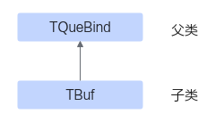

# TBuf

> **Section**: 6.2.3.6.1.8  
> **PDF Pages**: 1806–1806  

---

<!-- page 1806 -->

调用示例

完整示例请参考调用示例。

// 假设自定义tbufpool类为MyBufPool// 自定义tbufpool类内部对TQue初始化的InitBuffer函数：template<class T> __aicore__ inline bool MyBufPool::InitBuffer(T& que, uint8_t num, uint32_t len){   ...   // 对TQue的内存块进行初始化   uint32_t curPoolAddr  = 0;  // 内存块起始地址   auto bufhandle = xxx; // 具体的内存块，该变量可由自定义tbufpool内获得   srcQue0.InitStartBufHandle(bufhandle, num, len);   for (uint8_t i = 0; i < num; i++) {      que.InitBufHandle(this, i, bufhandle , curPoolAddr + i * len, len);   }   ...}

// 自定义tbufpool类内部对TBuf初始化的InitBuffer函数：template<class T> __aicore__ inline bool MyBufPool::InitBuffer(AscendC::TBuf<bufPos>& buf, uint32_t len){   ...   // 对TBuf的内存块进行初始化   uint32_t curPoolAddr  = 0;  // 内存块起始地址   auto bufhandle = xxx; // 具体的内存块，该变量可由自定义tbufpool内获得   srcBuf1.InitStartBufHandle(bufhandle, 1, len);   srcBuf1.InitBufHandle(this, 0, bufhandle , curPoolAddr, len);   ...}AscendC::TPipe pipe;AscendC::TQue<AscendC::TPosition::VECIN, 1> srcQue0;AscendC::TBuf<AscendC::TPosition::VECIN> srcBuf1;MyBufPool tbufPool;pipe.InitBufPool(tbufPool, 1024 * 2);tbufPool.InitBuffer(srcQue0, 1, 1024);tbufPool.InitBuffer(srcBuf1, 1024);

## 6.2.3.6.1.8 TBuf

## ?.1. TBuf 简介

使用Ascend C编程的过程中，可能会用到一些临时变量。这些临时变量占用的内存可以使用TBuf数据结构来管理，存储位置通过模板参数来设置，可以设置为不同的TPosition逻辑位置。

TBuf继承自TQueBind父类，继承关系如下：

TBuf占用的存储空间通过TPipe进行管理，您可以通过 InitBuffer接口为TBuf进行内存初始化操作，之后即可通过 Get获取指定长度的Tensor参与计算。

使用 InitBuffer为TBuf分配内存和为队列分配内存有以下差异：
