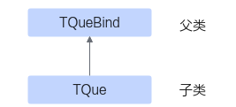

# GetCurBufSize

> **Section**: 8  
> **PDF Pages**: 1767–1770  

---

<!-- page 1767 -->

## ?.8. GetCurBufSize

产品支持情况

产品是否支持

Atlas 350 加速卡√

Atlas A3 训练系列产品/Atlas A3 推理系列产品√

Atlas A2 训练系列产品/Atlas A2 推理系列产品√

Atlas 200I/500 A2 推理产品x

Atlas 推理系列产品AI Core√

Atlas 推理系列产品Vector Corex

Atlas 训练系列产品√

功能说明

获取当前已经被自定义TBufPool分配的内存块个数。

函数原型

```cpp
__aicore__ inline uint8_t GetCurBufSize()
```

约束说明

无

返回值说明

已分配的内存块个数。

调用示例

请参考调用示例。

## 6.2.3.6.1.5 TQue

## ?.1. TQue 简介

流水任务之间通过队列（Queue）完成任务间通信和同步。TQue是用来执行队列相关操作、管理相关资源的数据结构。TQue继承自TQueBind父类，继承关系如下：



<!-- page 1768 -->

模板参数

```cpp
template <TPosition pos, int32_t depth, auto mask = 0> class TQue{...};
```

表6-685 TQue 模板参数介绍

参数名称含义

pos队列逻辑位置，可以为VECIN、VECOUT、A1、A2、B1、B2、CO1、CO2。关于TPosition的具体介绍请参考6.2.6.7 TPosition。

depth队列的深度表示该队列可以连续进行入队/出队的次数，在代码运行时，对同一个队列有n次连续的EnQue（中间没有DeQue），那么该队列的深度就需要设置为n。

注意，这里的队列深度和double buffer无关，队列机制用于实现流水线并行，double buffer在此基础上进一步提高流水线的利用率。即使队列的深度为1，仍可以开启double buffer。

非Tensor原地操作的场景下，队列的深度设置为1时，编译器对这种场景做了特殊优化，性能通常更好，推荐设置为1。

**Tensor原地操作的场景下，需要设置为0。**

●如下样例中队列没有连续入队，队列的深度设置为1。a1 = que.AllocTensor(); que.EnQue(a1);a1 = que.DeQue();que.FreeTensor(a1);

●如下样例中队列连续2次入队，队列的深度应设置为2，仅在极少数preload场景（比如连续搬入两份数据，计算处理一份，完成后再搬入一份，然后计算处理提前搬入的一份...）可能会使用。其他情况下均不推荐depth >= 2 。a1 = que.AllocTensor(); a2 = que.AllocTensor();que.EnQue(a1);que.EnQue(a2);a1 = que.DeQue();a2 = que.DeQue(); que.FreeTensor(a1);que.FreeTensor(a2);

<!-- page 1769 -->

参数名称含义

mask●mask是int类型时，采用比特位表达信息：

–bit 0位为1表示，数据格式从ND转换为NZ，TPosition仅支持A1或B1；

–bit 1位为1表示，数据格式从NZ转换为ND，TPosition仅支持CO2。

支持的型号如下：

Atlas 推理系列产品AI Core

●mask是const TQueConfig*类型时，TQueConfig结构定义和参数说明如下，调用示例见调用示例:struct TQueConfig {    bool nd2nz = false;  // true代表数据格式从ND转换为NZ，仅支持TPosition为A1或B1，默认为false    bool nz2nd = false;  // true代表数据格式从NZ转换为ND，仅支持TPosition为CO2，默认为false    bool scmBlockGroup = false;  // TSCM相关参数，预留参数，默认为false    uint32_t bufferLen = 0;  // 与InitBuffer时输入的len参数保持一致，可以在编译期做性能优化，传0表示在InitBuffer时做资源分配。    uint32_t bufferNumber = 0;  // 与InitBuffer时输入的num参数保持一致，可以在编译期做性能优化，传0表示在InitBuffer时做资源分配。    uint32_t consumerSize = 0;  // 预留参数    TPosition consumer[8] = {}; // 预留参数    bool enableStaticEvtId = false; // 预留参数    bool enableLoopQueue = false;   // 预留参数};上述ND、NZ格式转换相关参数支持的型号如下：

Atlas 推理系列产品AI Core

## TQue Buffer 限制

由于TQue分配的Buffer存储着同步事件eventID，故同一个TPosition上TQue Buffer的数量与硬件的同步事件eventID有关。

针对Atlas 训练系列产品，eventID的数量为4

Atlas 推理系列产品AI Core，eventID的数量为8

Atlas 推理系列产品Vector Core，eventID的数量为8

Atlas A2 训练系列产品/Atlas A2 推理系列产品，eventID的数量为8

Atlas A3 训练系列产品/Atlas A3 推理系列产品，eventID的数量为8

Atlas 200I/500 A2 推理产品，eventID的数量为8

QUE的Buffer数量最大也分别为8个或4个，即能插入的同步事件的个数为8个或4个。当用TPipe的InitBuffer申请TQue时，会受到Buffer数量的限制，TQue能申请到的最大个数分别为8个或4个。

如果同时使用的QUE Buffer超出限制，则无法再申请TQue。如果想要继续申请，可以调用FreeAllEvent接口来释放一些暂时不用的TQue。在使用完对应TQue后，用该接口释放对应队列中的所有事件，之后便可再次申请TQue。样例如下：

●不开启double buffer// 能申请的VECIN position上的buffer数量最大为8。如果超出该限制，在后续使用AllocTensor/FreeTensor可能会出现分配资源失败。故当不开启double buffer时，此时最多能申请8个TQue。

<!-- page 1770 -->

```cpp
AscendC::TPipe pipe;int len = 1024;AscendC::TQue<AscendC::TPosition::VECIN, 1> que0;AscendC::TQue<AscendC::TPosition::VECIN, 1> que1;AscendC::TQue<AscendC::TPosition::VECIN, 1> que2;AscendC::TQue<AscendC::TPosition::VECIN, 1> que3;AscendC::TQue<AscendC::TPosition::VECIN, 1> que4;AscendC::TQue<AscendC::TPosition::VECIN, 1> que5;AscendC::TQue<AscendC::TPosition::VECIN, 1> que6;AscendC::TQue<AscendC::TPosition::VECIN, 1> que7;pipe.InitBuffer(que0, 1, len);pipe.InitBuffer(que1, 1, len);pipe.InitBuffer(que2, 1, len);pipe.InitBuffer(que3, 1, len);pipe.InitBuffer(que4, 1, len);pipe.InitBuffer(que5, 1, len);pipe.InitBuffer(que6, 1, len);pipe.InitBuffer(que7, 1, len);
```

●开启double buffer// 如果开启double buffer，此时每一个TQue分配的内存块个数为2，故最多只能申请4个TQue。AscendC::TPipe pipe;int len = 1024;AscendC::TQue<AscendC::TPosition::VECIN, 1> que0;AscendC::TQue<AscendC::TPosition::VECIN, 1> que1;AscendC::TQue<AscendC::TPosition::VECIN, 1> que2;AscendC::TQue<AscendC::TPosition::VECIN, 1> que3;pipe.InitBuffer(que0, 2, len);pipe.InitBuffer(que1, 2, len);pipe.InitBuffer(que2, 2, len);pipe.InitBuffer(que3, 2, len);

●多次申请TQue// 如果TQue个数已达最大值，可以调用FreeAllEvent接口来继续申请TQue。AscendC::TPipe pipe;int len = 1024;AscendC::TQue<AscendC::TPosition::VECIN, 1> que0;pipe.InitBuffer(que0, 1, len);AscendC::LocalTensor<half> tensor1 = que0.AllocTensor<half>();que0.EnQue(tensor1);tensor1 = que0.DeQue<half>(); // 将tensor从VECOUT的Queue中搬出que0.FreeTensor<half>(tensor1);que0.FreeAllEvent(); // 释放que0的所有同步事件，之后可继续申请TQueAscendC::TQue<AscendC::TPosition::VECIN, 1> que1;pipe.InitBuffer(que1, 1, len);

调用示例

以下用例通过传入TQueConfig使能bufferNumber的编译期计算。vector算子不涉及数据格式的转换，所以nd2nz和nz2nd是false。

// 用户自定义的构造TQueConfig的元函数__aicore__ constexpr AscendC::TQueConfig GetMyTQueConfig(bool nd2nzIn, bool nz2ndIn, bool scmBlockGroupIn,    uint32_t bufferLenIn, uint32_t bufferNumberIn, uint32_t consumerSizeIn, const AscendC::TPosition consumerIn[]){    return {        .nd2nz = nd2nzIn,        .nz2nd = nz2ndIn,        .scmBlockGroup = scmBlockGroupIn,        .bufferLen = bufferLenIn,        .bufferNumber = bufferNumberIn,        .consumerSize = consumerSizeIn,        .consumer = {consumerIn[0], consumerIn[1], consumerIn[2], consumerIn[3],            consumerIn[4], consumerIn[5], consumerIn[6], consumerIn[7]}    };
