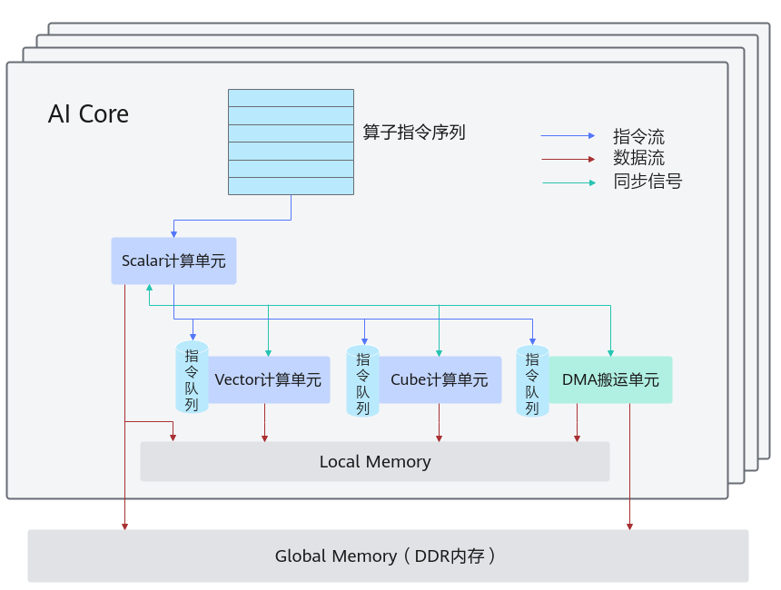
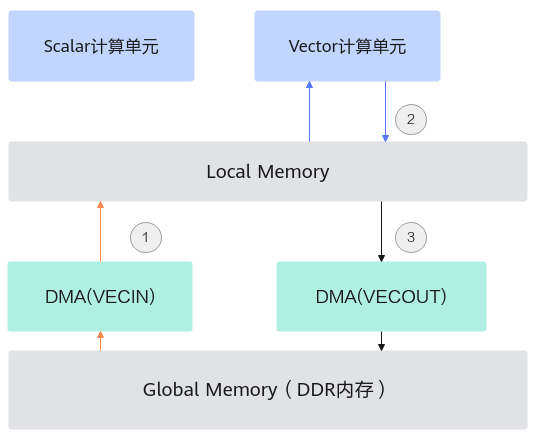
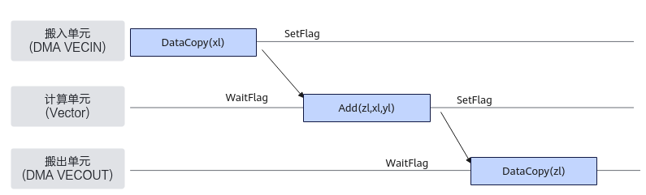

# 同步控制简介

> **Section**: 6.2.3.7.1.1  
> **PDF Pages**: 1820–1823  

---

<!-- page 1820 -->

表6-721原型2 参数说明

参数名输入/输出描述

tileSize输入LocalTensor的元素个数，其数量不应超过当前物理位置剩余的内存空间。

剩余的内存空间可以通过物理内存最大值与当前可用内存地址（GetCurAddr返回值）的差值来计算。

表6-722原型3 模板参数说明

参数名描述

TensorTraitType只支持传入TensorTrait类型，TensorTrait的数据类型/逻辑位置/Shape大小需要匹配LocalMemAllocator中指定的物理位置及其剩余空间。

返回值说明

根据用户输入构造的LocalTensor对象。

约束说明

无

调用示例

template <uint32_t v>using UIntImm = Std::integral_constant<uint32_t, v>;...AscendC::LocalMemAllocator allocator;// 原型1：float类型，Tensor中有1024个元素，用户可以指定逻辑位置(或者不指定，由Alloc函数根据物理位置给出默认值，不影响功能)auto tensor1 = allocator.Alloc<AscendC::TPosition::VECIN, float, 1024>();auto tensor1 = allocator.Alloc<float, 1024>();

// 原型2：float类型，Tensor中有tileLength个元素，用户可以指定逻辑位置(或者不指定，由Alloc函数根据物理位置给出默认值，不影响功能)auto tensor1 = allocator.Alloc<AscendC::TPosition::VECIN, float>(tileLength);

// 原型3：用户指定逻辑位置VECIN，数据类型为float，Tensor中元素个数为16*16*16auto shape = AscendC::MakeShape(UIntImm<16>{}, UIntImm<16>{}, UIntImm<16>{});auto stride = AscendC::MakeStride(UIntImm<0>{}, UIntImm<0>{}, UIntImm<0>{});auto layoutMake = AscendC::MakeLayout(shape, stride);auto tensorTraitMake = AscendC::MakeTensorTrait<float, AscendC::TPosition::VECIN>(layoutMake);auto tensor3 = allocator.Alloc<decltype(tensorTraitMake)>();

## 6.2.3.7 同步控制

## 6.2.3.7.1 核内同步

## 6.2.3.7.1.1 同步控制简介

开发者可以使用同步控制接口来自行完成同步控制。需要注意的是，通常情况下，开发者基于2.2 编程模型中介绍的编程模型和范式进行编程时不需要关注同步，编程模型

<!-- page 1821 -->

帮助开发者完成了同步控制；使用编程模型和范式是我们推荐的编程方式，自行同步控制可能会带来一定的编程复杂度，不建议开发者使用。TQueSync类接口和SetFlag/WaitFlag(ISASI)中提供的同步控制接口的区别在于， SetFlag/WaitFlag(ISASI)中的接口标注为ISASI类别，不能保证跨硬件版本兼容；TQueSync类接口可以保证跨硬件版本兼容。

同步控制简介

介绍同步控制之前需要先回顾一下图6-52。

AI Core内部的异步并行计算过程：Scalar计算单元读取指令序列，并把向量计算、矩阵计算、数据搬运指令发射给对应单元的指令队列，向量计算单元、矩阵计算单元、数据搬运单元异步的并行执行接收到的指令。该过程可以参考图1中蓝色箭头所示的指令流。

不同的指令间有可能存在依赖关系，为了保证不同指令队列间的指令按照正确的逻辑关系执行，Scalar计算单元也会给对应单元下发同步指令。各单元之间的同步过程可以参考图1中的绿色箭头所示的同步信号流。

AI Core内部数据处理的基本过程：DMA搬入单元把数据搬运到Local Memory，Vector/Cube计算单元完成数据计算，并把计算结果写回Local Memory，DMA搬出单元把处理好的数据搬运回Global Memory。该过程可以参考图1中的红色箭头所示的数据流。

图6-52 AI Core 内部并行计算架构抽象

从上图可以了解到AI Core内部的执行单元是异步并行的，在读写Local Memory内存时，可能存在依赖，需要进行同步控制。

下图示例描述了一个常见的Vector计算数据流：

<!-- page 1822 -->

1.先通过DMA执行单元将数据从Global Memory搬入到Local Memory；

2.进行计算；

3.然后再通过DMA执行单元将计算结果从Local Memory搬出到Global Memory。

四个执行单元Scalar、Vector、DMA(VECIN)、DMA(VECOUT)并行执行，若访问同一片Local Memory，需要同步机制来控制他们的访问时序：保证先搬入Local Memory后再计算，计算完成后再搬出。

硬件流水类型

AI Core内部并行的指令流水类型和解释如下所示：

说明

不同的硬件架构，每一种硬件流水类型包含的具体流水会有所差异，详细介绍请参考2.6 硬件实现章节。

<!-- page 1823 -->

表6-723指令流水类型和相关说明

流水类型含义

PIPE_S标量流水线，使用Tensor GetValue函数时为此流水

PIPE_V矢量计算流水及部分硬件架构下的L0C Buffer->UB数据搬运流水

PIPE_M矩阵计算流水

PIPE_MTE1L1 Buffer ->L0A Buffer、L1 Buffer->L0B Buffer数据搬运流水

PIPE_MTE2GM->L1 Buffer、GM->UB等数据搬运流水

PIPE_MTE3UB->GM等数据搬运流水

PIPE_FIXL0C Buffer->GM、L0C Buffer ->L1等数据搬运流水

同步控制分类

对上述并行流水的同步控制分为两种：

●多流水同步：通过TQueSync的SetFlag/WaitFlag或者 SetFlag/WaitFlag(ISASI)接口进行不同流水线间的同步控制。

–SetFlag：当前序指令的所有读写操作都完成之后，当前指令开始执行，并将硬件中的对应标志位设置为1。

–WaitFlag：当执行到该指令时，如果发现对应标志位为0，该队列的后续指令将一直被阻塞；如果发现对应标志位为1，则将对应标志位设置为0，同时后续指令开始执行。

●单流水同步：通过 PipeBarrier(ISASI)完成同一流水线内的同步控制，用于在同一流水线内部约束执行顺序。其作用是，保证前序指令中所有数据的读写工作全部完成，后序指令才能执行。

什么时候需要开发者手动插入同步

●Vector计算单元

–单流水同步：PIPE_V由编译器自动完成同步插入，PIPE_MTE2/PIPE_MTE3在搬运地址有重叠的情况下需要开发者插入同步（具体示例请参考注意事项）。

–多流水同步：PIPE_V、PIPE_MTE2、PIPE_MTE3、PIPE_S之间的多流水同步，都是双向的，如下图所示，黄色线条表示的同步由编译器自动完成同步插入，剩余的同步由Ascend C框架完成。例外情况：使用涉及标量计算的原子操作接口（如AtomicAdd）时，如果标量计算单元和搬运单元（MTE2/MTE3）在读写GM时存在数据依赖，开发者需要根据实际情况插入同步。详细内容参见具体的API说明。
