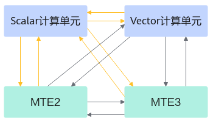

# TQueSync

> **Section**: 6.2.3.7.1.2  
> **PDF Pages**: 1824–1824  

---

<!-- page 1824 -->



●Cube计算单元

Cube侧所有流水同步都由Ascend C框架完成，不需要算子开发者插入同步。

说明

上文描述的编译器自动完成同步插入强依赖于LocalTensor间依赖关系，部分场景下需要开发者手动完成同步，具体的约束说明请参考《毕昇编译器》。

## 6.2.3.7.1.2 TQueSync

## ?.1. 模板参数

产品支持情况

产品是否支持

Atlas 350 加速卡√

Atlas A3 训练系列产品/Atlas A3 推理系列产品√

Atlas A2 训练系列产品/Atlas A2 推理系列产品√

Atlas 200I/500 A2 推理产品√

Atlas 推理系列产品AI Core√

Atlas 推理系列产品Vector Corex

Atlas 训练系列产品√

功能说明

TQueSync类的模板参数用于指定源流水和目标流水，目的流水等待源流水。

函数原型

```cpp
template<pipe_t src, pipe_t dst>class TQueSync {public:    __aicore__ inline void SetFlag(TEventID id);
    __aicore__ inline void WaitFlag(TEventID id);};
```
