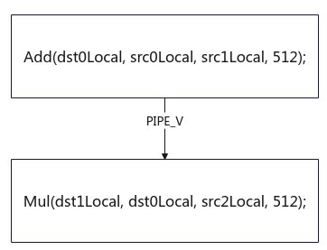

# DataSyncBarrier(ISASI)

> **Section**: 6.2.3.7.1.5  
> **PDF Pages**: 1830–1830  

---

<!-- page 1830 -->

调用示例

如下示例，Mul指令的输入dst0Local是Add指令的输出，两个矢量运算指令产生依赖，需要插入PipeBarrier保证两条指令的执行顺序。

注：仅作为示例参考，开启自动同步（Kernel直调算子工程和自定义算子开发工程已默认开启）的情况下，编译器自动插入PIPE_V同步，无需开发者手动插入。

图6-53 Mul 指令和Add 指令是串行关系，必须等待Add 指令执行完成后，才能执行Mul 指令。



```cpp
AscendC::LocalTensor<half> src0Local;AscendC::LocalTensor<half> src1Local;AscendC::LocalTensor<half> src2Local;AscendC::LocalTensor<half> dst0Local;AscendC::LocalTensor<half> dst1Local;
AscendC::Add(dst0Local, src0Local, src1Local, 512);AscendC::PipeBarrier<PIPE_V>();AscendC::Mul(dst1Local, dst0Local, src2Local, 512);
```

## 6.2.3.7.1.5 DataSyncBarrier(ISASI)

产品支持情况

产品是否支持

Atlas 350 加速卡√

Atlas A3 训练系列产品/Atlas A3 推理系列产品x

Atlas A2 训练系列产品/Atlas A2 推理系列产品√

Atlas 200I/500 A2 推理产品√

Atlas 推理系列产品AI Corex

Atlas 推理系列产品Vector Corex

Atlas 训练系列产品x
