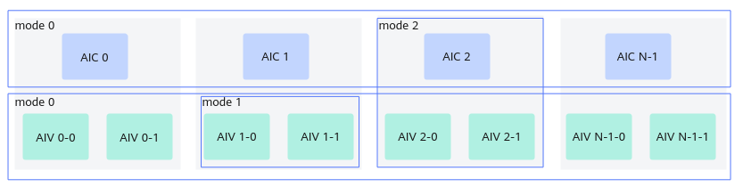

# CrossCoreSetFlag(ISASI)

> **Section**: 6.2.3.7.2.4  
> **PDF Pages**: 1843–1845  

---

<!-- page 1843 -->

–对于Vector和Cube混合场景，需根据实际情况灵活配置Kernel类型。

●使用该接口时，建议开启batchmode模式，使算子独占全部所需核资源，否则可能因满足以下条件导致死锁：

–多流并发场景（≥2条执行流）。

–≥2个算子并发执行。

–所有并发算子的核数总和超过物理核数。

–≥2个并发算子使用了核间同步功能。

具体而言，在多流场景下，某条流的核间同步算子虽分配到n个物理核，但可能仅有n-m个核先被调度执行，而其余m个核因被其他流的核间同步算子抢占而尚未启动。先启动的n-m个核执行到核间同步时等待剩余m核完成，而剩余m核因被其他流的核间同步算子占用而无法释放，形成死锁。

Kernel直调场景下通过__schedmode__(mode)限定符来设置batchmode模式；工程化算子开发场景下，通过TilingContext的SetScheduleMode接口来设置batchmode模式，具体请参考《基础数据结构和接口》。

调用示例

本示例实现功能为使用8个核进行数据处理，每个核均是处理32个float类型数据，对该数据乘2后再与其他核上进行同样乘2的数据进行相加，中间结果保存到workGm，因此多个核之间需要进行数据同步。此样例中，使用软同步，入口函数传入的syncGm里的值都已经在host侧初始化为0。若以下用例改成使用硬同步，则不需要传入syncGm，并且不需要使用workQueue。

...// syncGlobal为用户定义的全局Global空间，作为所有核共用的缓存，类型为GlobalTensor；workLocal为用户定义的局部Local空间，每个核单独自用，类型为LocalTensorint srcDataSize = 256; // 参与计算的元素个数int32_t blockNum = AscendC::GetBlockNum(); // 获取核总数int32_t blockIdx = AscendC::GetBlockIdx(); // 获取当前工作的核IDuint32_t perBlockSize = srcDataSize / blockNum; // 每个核平分处理相同个数// 当前工作核计算后的数据先保存到外部工作空间，workGlobal为GlobalTensor，dstLocal为LocalTensorAscendC::DataCopy(workGlobal[blockIdx * perBlockSize], dstLocal, perBlockSize);// 等待所有核都完成计算AscendC::SyncAll(syncGlobal, workLocal);...

## 6.2.3.7.2.4 CrossCoreSetFlag(ISASI)

产品支持情况

产品是否支持

Atlas 350 加速卡√

Atlas A3 训练系列产品/Atlas A3 推理系列产品√

Atlas A2 训练系列产品/Atlas A2 推理系列产品√

Atlas 200I/500 A2 推理产品x

Atlas 推理系列产品AI Corex

Atlas 推理系列产品Vector Corex

Atlas 训练系列产品x

<!-- page 1844 -->

功能说明

面向分离模式的核间同步控制接口。

该接口和CrossCoreWaitFlag接口配合使用。使用时需传入核间同步的标记ID(flagId)，每个ID对应一个用于控制同步的计数器。

同步控制分为以下几种模式，如图6-54所示：

●模式0：AI Core核间的同步控制。对于AIC场景，同步所有的AIC核，直到所有的AIC核都执行到CrossCoreSetFlag时，CrossCoreWaitFlag后续的指令才会执行；对于AIV场景，同步所有的AIV核，直到所有的AIV核都执行到CrossCoreSetFlag时，CrossCoreWaitFlag后续的指令才会执行。

●模式1：AI Core内部，AIV核之间的同步控制。如果两个AIV核都运行了CrossCoreSetFlag，CrossCoreWaitFlag后续的指令才会执行。

●模式2：AI Core内部，AIC与AIV之间的同步控制。在AIC核执行CrossCoreSetFlag之后，两个AIV上CrossCoreWaitFlag后续的指令才会继续执行；两个AIV都执行CrossCoreSetFlag后，AIC上CrossCoreWaitFlag后续的指令才能执行。

●模式4：AI Core内部，AIC与AIV之间的同步控制。AIV0与AIV1可单独触发AIC等待。比如，在AIC核执行CrossCoreSetFlag之后， AIV0上CrossCoreWaitFlag后续的指令才会继续执行；AIV0执行CrossCoreSetFlag后，AIC上CrossCoreWaitFlag后续的指令才能执行。

其中，模式4仅支持Atlas 350 加速卡。

图6-54同步控制模式示意图



函数原型

```cpp
template <uint8_t modeId, pipe_t pipe>__aicore__ inline void CrossCoreSetFlag(uint16_t flagId)
```

<!-- page 1845 -->

参数说明

表6-740模板参数说明

参数名描述

modeId核间同步的模式，取值如下：

●模式0：AI Core核间的同步控制。

●模式1：AI Core内部，Vector核（AIV）之间的同步控制。

●模式2：AI Core内部，Cube核（AIC）与Vector核（AIV）之间的同步控制。

●模式4：AI Core内部，AIC与AIV之间的同步控制。AIV0与AIV1可单独触发AIC等待。

pipe设置这条指令所在的流水类型，流水类型可参考硬件流水类型。

特别地，PIPE_S流水类型仅Atlas 350 加速卡支持。

表6-741参数说明

参数名输入/输出

描述

flagId输入核间同步的标记。

Atlas A2 训练系列产品/Atlas A2 推理系列产品，取值范围是0-10。

Atlas A3 训练系列产品/Atlas A3 推理系列产品，取值范围是0-10。

Atlas 350 加速卡，取值范围如下：

AIV0发起的flagId 0-10的CrossCoreSetFlag操作对应AICCrossCoreWaitFlag中flagId 0-10的操作。

AIV1发起的flagId 0-10的CrossCoreSetFlag操作对应AICCrossCoreWaitFlag中flagId 16-26的操作。

AIC发起的flagId 0-10的CrossCoreSetFlag操作对应AIV0CrossCoreWaitFlag中flagId 0-10的操作。

AIC发起的flagId 16-26的CrossCoreSetFlag操作对应AIV1CrossCoreWaitFlag中flagId 0-10的操作。

返回值说明

无

约束说明

●使用该同步接口时，需要按照如下规则设置Kernel类型：

–在纯Vector/Cube场景下，需设置Kernel类型为KERNEL_TYPE_MIX_AIV_1_0或KERNEL_TYPE_MIX_AIC_1_0。
