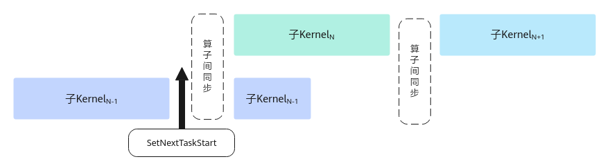

# SetNextTaskStart

> **Section**: 6.2.3.7.3.1  
> **PDF Pages**: 1853–1854  

---

<!-- page 1853 -->

●gmWorkspace申请的空间最少要求为：blockNum * 32Bytes；ubWorkspace申请的空间最少要求为：blockNum * 32 + 32Bytes；其中blockNum为调用的核数，可调用6.2.3.9.1 GetBlockNum获取。

●分离模式下，使用该接口进行多核同步时，仅对AIV核生效，WaitPreBlock和NotifyNextBlock之间仅支持插入矢量计算相关指令，对矩阵计算相关指令不生效。

●使用该接口进行多核控制时，算子调用时指定的逻辑numBlocks必须保证不大于实际运行该算子的AI处理器核数，否则框架进行多轮调度时会插入异常同步，导致Kernel“卡死”现象。

调用示例

请参考调用示例。

## 6.2.3.7.3 任务间同步

## 6.2.3.7.3.1 SetNextTaskStart

说明

本接口为试验接口，在后续版本中可能会调整或改进，不保证后续兼容性。请开发者在使用过程中关注后续版本更新。

产品支持情况

产品是否支持备注

Atlas 350 加速卡√该接口生效

Atlas A3 训练系列产品/Atlas A3 推理系列产品

√该接口生效

Atlas A2 训练系列产品/Atlas A2 推理系列产品

√仅保证编译兼容，实际功能不生效。

Atlas 200I/500 A2 推理产品√仅保证编译兼容，实际功能不生效。

Atlas 推理系列产品AI Core√仅保证编译兼容，实际功能不生效。

Atlas 推理系列产品Vector Core√仅保证编译兼容，实际功能不生效。

Atlas 训练系列产品√仅保证编译兼容，实际功能不生效。

<!-- page 1854 -->

功能说明

在SuperKernel的子Kernel中调用，调用后的指令可以和后续其他的子Kernel实现并行，提升整体性能。如图6-55所示，SuperKernel按序调用子Kernel，为保证子Kernel之间数据互不干扰，会在子Kernel间插入算子间同步进行保序，子KernelN-1调用该接口后，之后的指令会和后续子KernelN实现并行。

SuperKernel是一种算子的二进制融合技术，与源码融合不同，它聚焦于内核函数(Kernel) 的二进制的调度方案，展开深度优化，于已编译的二进制代码基础上融合创建一个超级Kernel函数（SuperKernel），以调用子函数的方式调用多个其他内核函数，也就是子Kernel。相对于单算子下发，SuperKernel技术可以减少任务调度等待时间和调度开销，同时利用Task间隙资源进一步优化算子头开销。

开发者需要自行保证调用此接口后的指令不会与后序算子互相干扰而导致精度问题，推荐在整个算子最后一条搬运指令后调用此接口。

图6-55通过SetNextTaskStart 实现并行示意图



函数原型

●该原型在如下产品型号支持：

Atlas 350 加速卡

Atlas A3 训练系列产品/Atlas A3 推理系列产品

Atlas A2 训练系列产品/Atlas A2 推理系列产品

Atlas 200I/500 A2 推理产品

```cpp
template<pipe_t AIV_PIPE = PIPE_MTE3, pipe_t AIC_PIPE = PIPE_FIX>__aicore__ inline void SetNextTaskStart()
```

●该原型在如下产品型号支持：

Atlas 推理系列产品AI Core

Atlas 训练系列产品

```cpp
template<pipe_t AIV_PIPE = PIPE_MTE3, pipe_t AIC_PIPE = PIPE_MTE3>__aicore__ inline void SetNextTaskStart()
```
