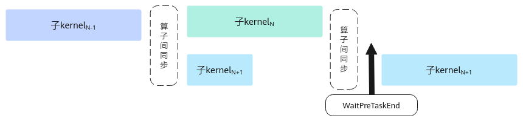

# WaitPreTaskEnd

> **Section**: 6.2.3.7.3.2  
> **PDF Pages**: 1855–1856  

---

<!-- page 1855 -->

参数说明

表6-747模板参数说明

参数名描述

AIV_PIPESetNextTaskStart之后运行的指令，如果位于AIV上的AIV_PIPE流水，可以与后序算子并行。AIV_PIPE的取值范围为PIPE_MTE2、PIPE_MTE3、PIPE_S、PIPE_V，流水类型介绍可参考硬件流水类型。

AIC_PIPESetNextTaskStart之后运行的指令，如果位于AIC上的AIC_PIPE流水，可以与后序算子并行。AIC_PIPE的取值范围为PIPE_MTE1、PIPE_MTE2、PIPE_MTE3、PIPE_FIX、PIPE_M，流水类型介绍可参考硬件流水类型。

返回值说明

无

约束说明

●该接口适用于TorchAir图模式开发场景，且需在启用SuperKernel特性后方可生效。相关信息可参考《PyTorch图模式使用指南(TorchAir)》中的“GE图模式 >GE图模式功能 > 图内标定SuperKernel范围”章节。

●在算子运行过程中，需要保证此接口在每个核上都被调用，且每个核上仅被调用一次。

●若子Kernel某个TilingKey分支调用了此接口，则开发者需要保证当前算子可能会运行的所有TilingKey均调用了此接口，否则会出现因同步指令数量不匹配而卡住的现象。

调用示例

```cpp
#include "kernel_operator.h"
```

AscendC::LocalTensor<half> dstLocal = outQueueDst.DeQue<half>();AscendC::DataCopy(dstGlobal, dstLocal, 512);// 算子最后一条搬运指令后插入，且保证只调用一次AscendC::SetNextTaskStart();outQueueDst.FreeTensor(dstLocal);

## 6.2.3.7.3.2 WaitPreTaskEnd

说明

本接口为试验接口，在后续版本中可能会调整或改进，不保证后续兼容性。请开发者在使用过程中关注后续版本更新。

<!-- page 1856 -->

产品支持情况

产品是否支持备注

Atlas 350 加速卡√该接口生效

Atlas A3 训练系列产品/Atlas A3 推理系列产品

√该接口生效

Atlas A2 训练系列产品/Atlas A2 推理系列产品

√仅保证编译兼容，实际功能不生效。

Atlas 200I/500 A2 推理产品√仅保证编译兼容，实际功能不生效。

Atlas 推理系列产品AI Core√仅保证编译兼容，实际功能不生效。

Atlas 推理系列产品Vector Core√仅保证编译兼容，实际功能不生效。

Atlas 训练系列产品√仅保证编译兼容，实际功能不生效。

功能说明

在SuperKernel的子Kernel中调用，调用前的指令可以和前序其他的子Kernel实现并行，提升整体性能。如图6-56所示，SuperKernel按序调用子Kernel，为保证子Kernel之间数据互不干扰，会在子Kernel间插入算子间同步进行保序，子KernelN+1调用该接口之前的指令会和前序子KernelN实现并行。

SuperKernel是一种算子的二进制融合技术，与源码融合不同，它聚焦于内核函数(Kernel) 的二进制的调度方案，展开深度优化，于已编译的二进制代码基础上融合创建一个超级Kernel函数（SuperKernel），以调用子函数的方式调用多个其他内核函数，也就是子Kernel。相对于单算子下发，SuperKernel技术可以减少任务调度等待时间和调度开销，同时利用Task间隙资源进一步优化算子头开销。

开发者需要自行保证调用此接口前的指令不会与前序算子互相干扰而导致精度问题，推荐在整个算子第一条搬运指令前调用此接口。

图6-56通过WaitPreTaskEnd 实现并行示意图



