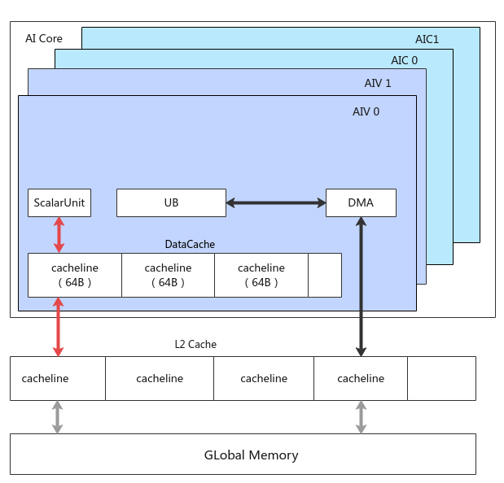

# DataCacheCleanAndInvalid

> **Section**: 6.2.3.8.2  
> **PDF Pages**: 1858–1861  

---

<!-- page 1858 -->

功能说明

从源地址所在的特定GM地址预加载数据到data cache中。

函数原型

```cpp
template <typename T>__aicore__ inline void DataCachePreload(const GlobalTensor<uint64_t>& src, const T cacheOffset)
```

参数说明

表6-748参数说明

参数名输入/输出

描述

src输入源操作数，类型为GlobalTensor。支持的数据类型为：uint64_t。

cacheOffset输入在源操作数上偏移cacheOffset大小开始加载数据，单位为byte，支持的数据类型为：int16_t/int64_t。

返回值说明

无

约束说明

频繁调用此接口可能导致保留站拥塞，这种情况下，此指令将被视为NOP指令，阻塞Scalar流水。因此不建议频繁调用该接口。

调用示例

```cpp
AscendC::GlobalTensor<uint64_t> srcGlobal;int64_t cacheOffset = 0;AscendC::DataCachePreload(srcGlobal, cacheOffset);
```

## 6.2.3.8.2 DataCacheCleanAndInvalid

产品支持情况

产品是否支持（支持配

是否支持（不支

持配置dcciDst

置dcciDst的原

型）

的原型）

Atlas 350 加速卡√√

Atlas A3 训练系列产品/Atlas A3 推理系列产品

√√

Atlas A2 训练系列产品/Atlas A2 推理系列产品

√√

<!-- page 1859 -->

是否支持（不支

产品是否支持（支持配

持配置dcciDst

置dcciDst的原

的原型）

型）

Atlas 200I/500 A2 推理产品√√

Atlas 推理系列产品AI Corex√

Atlas 推理系列产品Vector Corexx

Atlas 训练系列产品xx

功能说明

在AI Core内部，Scalar单元和DMA单元都可能对Global Memory进行访问。

图6-57 DataCache 内存层次示意图



如上图所示：

<!-- page 1860 -->

●DMA搬运单元读写Global Memory，数据通过DataCopy等接口在UB等LocalMemory和Global Memory间交互，没有Cache一致性问题；

●Scalar单元访问Global Memory，首先会访问每个核内的Data Cache，因此存在Data Cache与Global Memory的Cache一致性问题。

该接口用来刷新Cache，保证Cache的一致性，使用场景如下：

●读取Global Memory的数据，但该数据可能在外部被其余核修改，此时需要使用DataCacheCleanAndInvalid接口，直接访问Global Memory，获取最新数据；

●用户通过Scalar单元写Global Memory的数据，希望立刻写出，也需要使用DataCacheCleanAndInvalid接口。

●针对Atlas 350 加速卡，原子操作过程中，如果希望改变后续数据的饱和模式，需要先使用DataCacheCleanAndInvalid接口将Cache Line中现存的数据立刻写出，再调用SetCtrlSpr设置后续数据的饱和模式。

函数原型

●支持通过配置dcciDst确保Data Cache与GM存储的一致性template <typename T, CacheLine entireType, DcciDst dcciDst>__aicore__ inline void DataCacheCleanAndInvalid(const GlobalTensor<T>& dst)

●支持通过配置dcciDst确保Data Cache与Local Memory存储的一致性template <typename T, CacheLine entireType, DcciDst dcciDst>__aicore__ inline void DataCacheCleanAndInvalid(const LocalTensor<T>& dst)

●不支持配置dcciDst，仅支持保证Data Cache与GM的一致性template <typename T, CacheLine entireType>__aicore__ inline void DataCacheCleanAndInvalid(const GlobalTensor<T>& dst)

参数说明

表6-749模板参数说明

参数名描述

Tdst的数据类型。

entireType指令操作的模式：

SINGLE_CACHE_LINE：只刷新传入地址所在的Cache Line，注意如果该地址非64B对齐，只会操作传入地址到64B对齐的部分。

ENTIRE_DATA_CACHE：此时传入的地址无效，核内会刷新整个Data Cache，但是耗时较大，性能敏感的场景慎用。

<!-- page 1861 -->

参数名描述

dcciDst表示使用该接口来保证Data Cache与哪一种存储保持一致性，类型为DcciDst枚举类。

●CACHELINE_ALL：与CACHELINE_OUT效果一致。

●CACHELINE_UB：表示通过该接口来保证Data Cache与UB的一致性。

●CACHELINE_OUT：表示通过该接口来保证Data Cache与GlobalMemory的一致性。

●CACHELINE_ATOMIC：

–Atlas 350 加速卡，原子操作过程中保证Data Cache和GlobalMemory的一致性。

–Atlas A3 训练系列产品/Atlas A3 推理系列产品，预留参数，暂未支持。

–Atlas A2 训练系列产品/Atlas A2 推理系列产品，预留参数，暂未支持。

–Atlas 200I/500 A2 推理产品，预留参数，暂未支持。

–Atlas 推理系列产品AI Core，预留参数，暂未支持。

表6-750参数说明

参数名输入/输出

描述

dst输入需要刷新Cache的Tensor。

返回值说明

无

约束说明

无

调用示例

// 示例1：SINGLE_CACHE_LINE 模式，假设mmAddr_为0x40（64B对齐）AscendC::GlobalTensor<uint64_t> global;global.SetGlobalBuffer((__gm__ uint64_t*)mmAddr_ + AscendC::GetBlockIdx() * 1024);for( int i = 0; i < 8; i++) {   global.SetValue(i, AscendC::GetBlockIdx());}// 由于首地址64B对齐，调用DataCacheCleanAndInvalid指令后，会立刻刷新前8个数AscendC::DataCacheCleanAndInvalid<uint64_t, AscendC::CacheLine::SINGLE_CACHE_LINE, AscendC::DcciDst::CACHELINE_OUT>(global);// 示例2：SINGLE_CACHE_LINE 模式，假设mmAddr_为0x20（非64B对齐）AscendC::GlobalTensor<uint64_t> global;global.SetGlobalBuffer((__gm__ uint64_t*)mmAddr_ + AscendC::GetBlockIdx() * 1024);for( int i = 0; i < 8; i++) {   global.SetValue(i, AscendC::GetBlockIdx());
