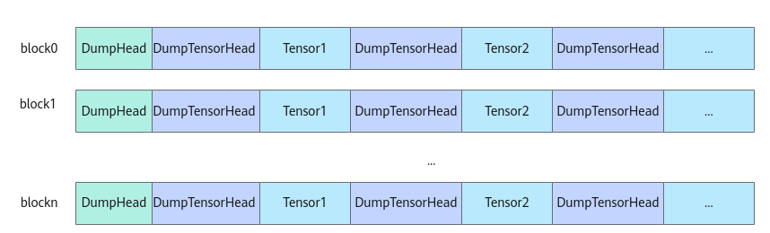

# DumpTensor

> **Section**: 6.2.3.11.1.1  
> **PDF Pages**: 1898–1902  

---

<!-- page 1898 -->

返回值说明

GM地址上做原子操作前的数据。

约束说明

原子操作涉及标量计算，如果标量计算单元和搬运单元（MTE2/MTE3）在读写GM时存在数据依赖，开发者需要根据实际情况插入同步。

调用示例

// 传入全局数据地址，初始化dstGlobal与dstLocaldstGlobal.SetGlobalBuffer(reinterpret_cast<__gm__ T *>(dstGm), dataSize);

LocalTensor<T> dstLocal = inQueueX.AllocTensor<T>();uint32_t value = 2;uint32_t a = AscendC::AtomicExch(reinterpret_cast<__gm__ uint32_t *>(dstGm), values);// 先执行完原子操作之后才能进行搬运操作，有数据依赖event_t eventIdSToMte2 = static_cast<event_t>(GetTPipePtr()->AllocEventID<HardEvent::S_MTE2>());// 手动插入MTE2等待Scalar的同步SetFlag<HardEvent::S_MTE2>(eventIdSToMte2);WaitFlag<HardEvent::S_MTE2>(eventIdSToMte2);DataCopy(dstLocal, dstGlobal, dataSize);// ...

假设上述函数在3个核上执行，核1、核2、核3依次调度，结果示例如下：

原GM数据dst: [1,1,1,1,1,...,1] 核1：原子计算后GM数据dst: [2,1,1,1,1,...,1] 返回值 a: 1核2：原子计算后GM数据dst: [2,1,1,1,1,...,1] 返回值 a: 2核3：原子计算后GM数据dst: [2,1,1,1,1,...,1] 返回值 a: 2

## 6.2.3.11 调试接口

## 6.2.3.11.1 上板打印

## 6.2.3.11.1.1 DumpTensor

产品支持情况

产品是否支持

Atlas 350 加速卡√

Atlas A3 训练系列产品/Atlas A3 推理系列产品√

Atlas A2 训练系列产品/Atlas A2 推理系列产品√

Atlas 200I/500 A2 推理产品√

Atlas 推理系列产品AI Core√

Atlas 推理系列产品Vector Corex

<!-- page 1899 -->

产品是否支持

Atlas 训练系列产品x

功能说明

基于算子工程开发的算子，可以使用该接口Dump指定Tensor的内容。同时支持打印自定义的附加信息（仅支持uint32_t数据类型的信息），比如打印当前行号等。

在算子kernel侧实现代码中需要打印Tensor数据的地方调用DumpTensor接口打印相关内容。样例如下：AscendC::DumpTensor(srcLocal, 5, dataLen);

注意

DumpTensor接口打印功能会对算子实际运行的性能带来一定影响，通常在调测阶段使用。开发者可以按需通过设置ASCENDC_DUMP=0来关闭打印功能。

打印示例如下：

```cpp
DumpTensor: desc=5, addr=0, data_type=float16, position=UB, dump_size=32[19.000000, 4.000000, 38.000000, 50.000000, 39.000000, 67.000000, 84.000000, 98.000000, 21.000000, 36.000000, 18.000000, 46.000000, 10.000000, 92.000000, 26.000000, 38.000000, 39.000000, 9.000000, 82.000000, 37.000000, 35.000000, 65.000000, 97.000000, 59.000000, 89.000000, 63.000000, 70.000000, 57.000000, 35.000000, 3.000000, 16.000000,42.000000]DumpTensor: desc=5, addr=100, data_type=float16, position=UB, dump_size=32[6.000000, 34.000000, 52.000000, 38.000000, 73.000000, 38.000000, 35.000000, 14.000000, 67.000000, 62.000000, 30.000000, 49.000000, 86.000000, 37.000000, 84.000000, 18.000000, 38.000000, 18.000000, 44.000000, 21.000000, 86.000000, 99.000000, 13.000000, 79.000000, 84.000000, 9.000000, 48.000000, 74.000000, 52.000000, 99.000000, 80.000000,53.000000]...DumpTensor: desc=5, addr=0, data_type=float16, position=UB, dump_size=32[35.000000, 41.000000, 41.000000, 22.000000, 84.000000, 49.000000, 60.000000, 0.000000, 90.000000, 14.000000, 67.000000, 80.000000, 16.000000, 46.000000, 16.000000, 83.000000, 6.000000, 70.000000, 97.000000, 28.000000, 97.000000, 62.000000, 80.000000, 22.000000, 53.000000, 37.000000, 23.000000, 58.000000, 65.000000, 28.000000, 4.000000,29.000000]
```

函数原型

●无Tensor shape的打印template <typename T>__aicore__ inline void DumpTensor(const LocalTensor<T> &tensor, uint32_t desc, uint32_t dumpSize)template <typename T>__aicore__ inline void DumpTensor(const GlobalTensor<T>& tensor, uint32_t desc, uint32_t dumpSize)

●带Tensor shape的打印template <typename T>__aicore__ inline void DumpTensor(const LocalTensor<T>& tensor, uint32_t desc, uint32_t dumpSize, const ShapeInfo& shapeInfo)template <typename T>__aicore__ inline void DumpTensor(const GlobalTensor<T>& tensor, uint32_t desc, uint32_t dumpSize, const ShapeInfo& shapeInfo)

<!-- page 1900 -->

参数说明

表6-775模板参数说明

参数名描述

T需要dump的Tensor的数据类型。

Atlas 350 加速卡，支持的数据类型为：bool、uint8_t、int8_t、int16_t、uint16_t、int32_t、uint32_t、int64_t、uint64_t、float、half、bfloat16_t、fp8_e4m3fn_t、fp8_e5m2_t、hifloat8_t、fp8_e8m0_t。

Atlas A3 训练系列产品/Atlas A3 推理系列产品，支持的数据类型为：bool、uint8_t、int8_t、int16_t、uint16_t、int32_t、uint32_t、int64_t、uint64_t、float、half、bfloat16_t。

Atlas A2 训练系列产品/Atlas A2 推理系列产品，支持的数据类型为：bool、uint8_t、int8_t、int16_t、uint16_t、int32_t、uint32_t、int64_t、uint64_t、float、half、bfloat16_t。

Atlas 200I/500 A2 推理产品，支持的数据类型为：bool、uint8_t、int8_t、int16_t、uint16_t、int32_t、uint32_t、int64_t、uint64_t、float、half。

Atlas 推理系列产品AI Core，支持的数据类型为：bool、uint8_t、int8_t、int16_t、uint16_t、int32_t、uint32_t、int64_t、uint64_t、float、half。

表6-776参数说明

参数名输入/输出

描述

tensor输入需要dump的Tensor。

●待dump的tensor位于Unified Buffer/L1 Buffer/L0CBuffer时使用LocalTensor类型的tensor参数输入。

●待dump的tensor位于Global Memory时使用GlobalTensor类型的tensor参数输入。

desc输入用户自定义附加信息（行号或其他自定义数字）。

在使用DumpTensor功能时，用户可通过desc参数附加自定义信息，以便在不同调用场景下区分Dump内容的来源。此功能有助于精准定位具体DumpTensor的输出，提升调试与分析效率。

dumpSize输入需要dump的元素个数。

shapeInfo输入传入Tensor的shape信息，可按照shape信息进行打印。

●当Shape尺寸大于dumpSize元素个数时，按照ShapeInfo打印元素，不足的Dump数据用"-"展示。

●当Shape尺寸小于等于dumpSize元素个数时，按照ShapeInfo打印元素，多出的Dump数据不展示。

<!-- page 1901 -->

返回值说明

无

约束说明

●该功能仅用于NPU上板调试。

●暂不支持算子入图场景的打印。

●当前仅支持打印存储位置为Unified Buffer/L1 Buffer/L0C Buffer/Global Memory的Tensor信息。针对Atlas 350 加速卡，不支持打印L1 Buffer上的Tensor信息。

●操作数地址对齐要求请参见通用地址对齐约束。

●单次调用DumpTensor打印的数据总量不可超过1MB（还包括少量框架需要的头尾信息，通常可忽略）。使用时应注意，如果超出这个限制，则数据不会被打印。

●在计算数据量时，若Dump的总长度未对齐，需要考虑padding数据的影响。当进行非对齐Dump时，如果实际Dump的元素长度不满足32字节对齐，系统会在其末尾自动补充一定数量的padding数据，以满足对齐要求。例如，Tensor1中用户需要Dump的元素长度为30字节，系统会在其后添加2字节的padding，使总长度对齐到32字节。但在实际解析时，仍只解析原始的30字节数据，padding部分不会被使用。

●使用自定义算子工程进行算子开发时，接口的打印信息和上文描述有些差异：

Dump时，每个block核的dump信息前会增加对应信息头DumpHead，用于记录核号和资源使用信息；每次Dump的Tensor数据前也会添加信息头DumpTensorHead，用于记录Tensor的相关信息。如下图所示，展示了多核打印场景下的打印信息结构。



**DumpHead的具体信息如下：**

–opType：当前运行的算子类型；

–CoreType：当前运行的核的类型；

–block dim：开发者设置的算子执行核数；

–total_block_num：参与dump的核数；

–block_remain_len：当前核剩余可用的dump的空间；

–block_initial_space：当前核初始分配的dump空间；

–rsv：保留字段；

–magic：内存校验魔术字。

DumpHead打印时，除了上述打印还会自动打印当前所运行核的类型及对应的该类型下的核索引，如：AIV-0。

**DumpTensorHead的具体信息如下：**

<!-- page 1902 -->

–desc：用户自定义附加信息；

–addr：Tensor的地址；

–data_type：Tensor的数据类型；

–position：表示Tensor所在的物理存储位置，当前仅支持Unified Buffer/L1Buffer/L0C Buffer/Global Memory；

–dump_size：表示用户需要dump的元素个数。

DumpTensor打印结果的最前面会自动打印CANN_VERSION_STR值与CANN_TIMESTAMP值。其中，CANN_VERSION_STR与CANN_TIMESTAMP为宏定义，CANN_VERSION_STR代表CANN软件包的版本号信息，形式为字符串，CANN_TIMESTAMP为CANN软件包发布时的时间戳，形式为数值（uint64_t）。开发者也可在代码中直接使用这两个宏。

打印示例如下：

```cpp
opType=AddCustom, DumpHead: AIV-0, CoreType=AIV, block dim=8, total_block_num=8, block_remain_len=1046912, block_initial_space=1048576, rsv=0, magic=5aa5bccdCANN Version: XX.XX, TimeStamp: XXXXXXDumpTensor: desc=5, addr=0, data_type=float16, position=UB, dump_size=32[19.000000, 4.000000, 38.000000, 50.000000, 39.000000, 67.000000, 84.000000, 98.000000, 21.000000, 36.000000, 18.000000, 46.000000, 10.000000, 92.000000, 26.000000, 38.000000, 39.000000, 9.000000, 82.000000, 37.000000, 35.000000, 65.000000, 97.000000, 59.000000, 89.000000, 63.000000, 70.000000, 57.000000, 35.000000, 3.000000, 16.000000,42.000000]DumpTensor: desc=5, addr=100, data_type=float16, position=UB, dump_size=32[6.000000, 34.000000, 52.000000, 38.000000, 73.000000, 38.000000, 35.000000, 14.000000, 67.000000, 62.000000, 30.000000, 49.000000, 86.000000, 37.000000, 84.000000, 18.000000, 38.000000, 18.000000, 44.000000, 21.000000, 86.000000, 99.000000, 13.000000, 79.000000, 84.000000, 9.000000, 48.000000, 74.000000, 52.000000, 99.000000, 80.000000,53.000000]...DumpTensor: desc=5, addr=0, data_type=float16, position=UB, dump_size=32[35.000000, 41.000000, 41.000000, 22.000000, 84.000000, 49.000000, 60.000000, 0.000000, 90.000000, 14.000000, 67.000000, 80.000000, 16.000000, 46.000000, 16.000000, 83.000000, 6.000000, 70.000000, 97.000000, 28.000000, 97.000000, 62.000000, 80.000000, 22.000000, 53.000000, 37.000000, 23.000000, 58.000000, 65.000000, 28.000000, 4.000000,29.000000]
```

该接口使用Dump功能，一个算子所有使用Dump功能的接口在每个核上Dump的数据总量（包括信息头）不可超过1M。请开发者自行控制待打印的内容数据量，超出则不会打印。

调用示例

●无Tensor shape的打印AscendC::DumpTensor(srcLocal, 5, dataLen);

●带Tensor shape的打印uint32_t array[] = {static_cast<uint32_t>(8), static_cast<uint32_t>(8)};AscendC::ShapeInfo shapeInfo(2, array);       // dim为2， shape为(8,8)AscendC::DumpTensor(x, 2, 64, shapeInfo);     // dump x的64个元素，且解析按照shapeInfo的(8,8)排列

uint32_t array1[] = {static_cast<uint32_t>(7), static_cast<uint32_t>(8)};AscendC::ShapeInfo shapeInfo1(2, array1); // dim为2， shape为(7,8)AscendC::DumpTensor(x1, 3, 64, shapeInfo1); // 当Shape尺寸小于等于dumpSize元素个数时，按照ShapeInfo打印元素，多出的Dump数据不展示

uint32_t array2[] = {static_cast<uint32_t>(9), static_cast<uint32_t>(8)};AscendC::ShapeInfo shapeInfo2(2, array2); // dim为2， shape为(9,8)AscendC::DumpTensor(x2, 4, 64, shapeInfo2); // 当Shape尺寸大于dumpSize元素个数时，按照ShapeInfo打印元素，不足的Dump数据用"-"展示

打印结果如下：

```cpp
DumpTensor: desc=2, addr=xxxx, data_type=float16, position=UB, dump_size=64[[150.000000,83.000000,109.000000,166.000000,129.000000,50.000000,150.000000,74.000000],
```
