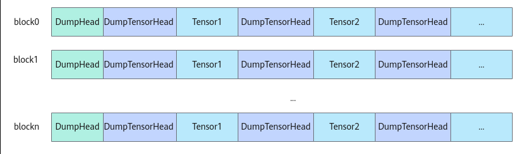

# DumpAccChkPoint

> **Section**: 6.2.3.11.1.3  
> **PDF Pages**: 1906–1908  

---

<!-- page 1906 -->

```cpp
AscendC::printf("fmt string %f\n", a);AscendC::PRINTF("fmt string %f\n", a);
```

// 指针打印：int b = 0x123;int *c = &b;AscendC::printf("TEST %p\n", c);AscendC::PRINTF("TEST %p\n", c);

NPU模式下，程序运行时打印效果如下（CANN Version和TimeStamp仅在使用自定义算子工程时才会打印）：

```cpp
CANN Version: XXX.XX, TimeStamp: 202408fmt string 291fmt string 291fmt string 3.140000fmt string 3.140000TEST 0x357f9cTEST 0x357f9c
```

## 6.2.3.11.1.3 DumpAccChkPoint

产品支持情况

产品是否支持

Atlas 350 加速卡√

Atlas A3 训练系列产品/Atlas A3 推理系列产品√

Atlas A2 训练系列产品/Atlas A2 推理系列产品√

Atlas 200I/500 A2 推理产品x

Atlas 推理系列产品AI Core√

Atlas 推理系列产品Vector Corex

Atlas 训练系列产品x

功能说明

基于算子工程开发的算子，可以使用该接口Dump指定Tensor的内容。同时支持打印自定义的附加信息（仅支持uint32_t数据类型的信息），比如打印当前行号等。区别于DumpTensor，使用该接口可以支持指定偏移位置的Tensor打印。

在算子kernel侧实现代码中需要打印偏移后Tensor数据的地方调用DumpAccChkPoint接口打印相关内容。样例如下：AscendC::DumpAccChkPoint(srcLocal, 5, 32, dataLen);

注意

DumpAccChkPoint接口打印功能会对算子实际运行的性能带来一定影响，通常在调测阶段使用。开发者可以按需通过设置ASCENDC_DUMP=0来关闭打印功能。

<!-- page 1907 -->

函数原型

```cpp
template <typename T>__aicore__ inline void DumpAccChkPoint(const LocalTensor<T> &tensor, uint32_t index, uint32_t countOff, uint32_t dumpSize)template <typename T>__aicore__ inline void DumpAccChkPoint(const GlobalTensor<T> &tensor, uint32_t index, uint32_t countOff, uint32_t dumpSize)
```

参数说明

表6-777模板参数说明

参数名描述

T需要dump的Tensor的数据类型。

Atlas 350 加速卡，支持的数据类型为：bool、uint8_t、int8_t、int16_t、uint16_t、int32_t、uint32_t、int64_t、uint64_t、float、half、bfloat16_t。

Atlas A3 训练系列产品/Atlas A3 推理系列产品，支持的数据类型为：bool、uint8_t、int8_t、int16_t、uint16_t、int32_t、uint32_t、int64_t、uint64_t、float、half、bfloat16_t。

Atlas A2 训练系列产品/Atlas A2 推理系列产品，支持的数据类型为：bool、uint8_t、int8_t、int16_t、uint16_t、int32_t、uint32_t、int64_t、uint64_t、float、half、bfloat16_t。

Atlas 推理系列产品AI Core，支持的数据类型为：bool、uint8_t、int8_t、int16_t、uint16_t、int32_t、uint32_t、int64_t、uint64_t、float、half。

表6-778参数说明

参数名输入/输出

描述

tensor输入需要dump的Tensor。

待dump的tensor位于Unified Buffer/L1 Buffer/L0C Buffer时使用LocalTensor类型的tensor参数输入。

待dump的tensor位于Global Memory时使用GlobalTensor类型的tensor参数输入。

index输入用户自定义附加信息（行号或其他自定义数字）。

countOff输入偏移元素个数。偏移后的Tensor地址需要满足所在物理位置的对齐约束，具体参考6.2.1 通用说明和约束。

dumpSize输入需要dump的元素个数。

返回值说明

无

<!-- page 1908 -->

约束说明

●该功能仅用于NPU上板调试。

●暂不支持算子入图场景的打印。

●当前仅支持打印存储位置为Unified Buffer/L1 Buffer/L0C Buffer/Global Memory的Tensor信息。针对Atlas 350 加速卡，不支持打印L1 Buffer上的Tensor信息。

●操作数地址对齐要求请参见通用地址对齐约束。

●单次调用DumpTensor打印的数据总量不可超过1MB（还包括少量框架需要的头尾信息，通常可忽略）。使用时应注意，如果超出这个限制，则数据不会被打印。

●在计算数据量时，若Dump的总长度未对齐，需要考虑padding数据的影响。当进行非对齐Dump时，如果实际Dump的元素长度不满足32字节对齐，系统会在其末尾自动补充一定数量的padding数据，以满足对齐要求。例如，Tensor1中用户需要Dump的元素长度为30字节，系统会在其后添加2字节的padding，使总长度对齐到32字节。但在实际解析时，仍只解析原始的30字节数据，padding部分不会被使用。

●使用自定义算子工程进行算子开发时，接口的打印信息和上文描述有些差异：

Dump时，每个block核的dump信息前会增加对应信息头DumpHead，用于记录核号和资源使用信息；每次Dump的Tensor数据前也会添加信息头DumpTensorHead，用于记录Tensor的相关信息。如下图所示，展示了多核打印场景下的打印信息结构。



**DumpHead的具体信息如下：**

–opType：当前运行的算子类型；

–CoreType：当前运行的核的类型；

–block dim：开发者设置的算子执行核数；

–total_block_num：参与dump的核数；

–block_remain_len：当前核剩余可用的dump的空间；

–block_initial_space：当前核初始分配的dump空间；

–rsv：保留字段；

–magic：内存校验魔术字。

DumpHead打印时，除了上述打印还会自动打印当前所运行核的类型及对应的该类型下的核索引，如：AIV-0。

**DumpTensorHead的具体信息如下：**

–desc：用户自定义附加信息；

–addr：Tensor的地址；

–data_type：Tensor的数据类型；
