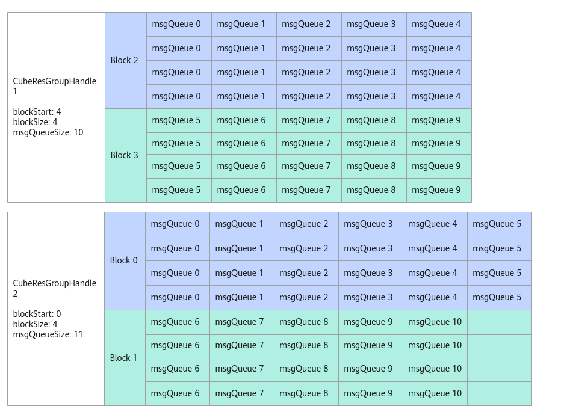

# CubeResGroupHandle构造函数

> **Section**: 6.2.3.12.1.2  
> **PDF Pages**: 1935–1937  

---

<!-- page 1935 -->

```cpp
auto offset = 0;if (GetBlockIdx() == 0){    auto msgPtr = handle.template AllocMessage(); // alloc for queue space    offset = handle.template PostMessage(msgPtr, bCubeMsgBody); // post true msgPtr    bool waitState = handle.template Wait<true> (offset); // wait until the msgPtr is processed}else if (GetBlockIdx() < 4){    auto msgPtr = handle.AllocMessage();
    offset = handle.PostFakeMsg(msgPtr); // post fake msgPtr    bool waitState = handle.template Wait<true> (offset); // wait until the msgPtr is processed}else{    auto msgPtr = handle.template AllocMessage();
    offset = handle.template PostMessage(msgPtr, aCubeMsgBody);
    bool waitState = handle.template Wait<true> (offset); // wait until the msgPtr is processed}
```

步骤8AIV退出消息队列。

调用AllocMessage获取消息结构体指针后，通过SendQuitMsg发送当前消息队列退出。auto msgPtr = handle.AllocMessage();        // 获取消息空间指针msgPtrhandle.SetQuit(msgPtr);              // 发送退出消息

**----结束**

## 6.2.3.12.1.2 CubeResGroupHandle 构造函数

产品支持情况

产品是否支持

Atlas 350 加速卡√

Atlas A3 训练系列产品/Atlas A3 推理系列产品x

Atlas A2 训练系列产品/Atlas A2 推理系列产品√

Atlas 200I/500 A2 推理产品x

Atlas 推理系列产品AI Corex

Atlas 推理系列产品Vector Corex

Atlas 训练系列产品x

功能说明

构造CubeResGroupHandle对象，完成组内的AIC和消息队列分配。构造CubeResGroupHandle对象时需要传入模板参数CubeMsgType，CubeMsgType是由用户定义的消息结构体，请参考表6-781。使用此接口需要用户自主管理地址、同步事件等，因此更推荐使用CreateCubeResGroup接口快速创建CubeResGroupHandle对象。

函数原型

```cpp
template <typename CubeMsgType>class CubeResGroupHandle;
```

<!-- page 1936 -->

```cpp
__aicore__ inline CubeResGroupHandle() = default__aicore__ inline CubeResGroupHandle(GM_ADDR workspace, uint8_t blockStart, uint8_t blockSize, uint8_t msgQueueSize, uint8_t evtIDIn)
```

参数说明

表6-786 CubeResGroupHandle 参数说明

参数输入/输出说明

workspace输入该CubeResGroupHandle的消息通讯区在GM上的起始地址。

blockStart输入该CubeResGroupHandle在AIV视角下起始AIC对应的序号，即AIC的起始序号*2。例如，如果AIC起始序号为0，则填入0*2；如果为1，则填入1*2。

blockSize输入该CubeResGroupHandle在AIV视角下分配的Block个数，即实际的AIC个数*2。

msgQueueSize

输入该CubeResGroupHandle分配的消息队列总数。

evtIDIn输入通信框架内用于AIV侧消息的同步事件。

如下图所示，CubeResGroupHandle1的blockStart为4，blockSize为4，表示起始的AIC序号为2，即blockStart / 2；AIC数量为2，即blockSize / 2。msgQueueSize为10，表示消息队列个数为10，每个Block分配的消息队列个数为Ceil(msgQueueSize，blockSize/2)，Block2和Block3分配到的消息队列个数均为5。CubeResGroupHandle2的msgQueueSize数量为11，最后一个Block只能分配5个消息队列。

<!-- page 1937 -->

图6-60 Block 和消息队列映射示意图



约束说明

●假设芯片的AIV核数为x，那么blockStart + blockSize <= x - 1, msgQueueSize <=x。

●每个AIC至少被分配1个消息队列msgQueue。

●blockStart和blockSize必须为偶数。

●使用该接口，UB空间末尾的1600B + sizeof(CubeMsgType)将被占用。

●1个AIC只能属于1个CubeGroupHandle，即多个CubeGroupHandle的[blockStart / 2, blockStart / 2+blockSize / 2]区间不能重叠。

●不能和 REGIST_MATMUL_OBJ接口同时使用。使用资源管理API时，用户自主管理AIC和AIV的核间通信，REGIST_MATMUL_OBJ内部是由框架管理AIC和AIV的核间通信，同时使用可能会导致通信消息错误等异常。

调用示例

uint8_t blockStart = 4;uint8_t blockSize = 4;uint8_t msgQueueSize = 10;uint8_t evtIDIn = 0; //用户自行管理事件IDAscendC::KfcWorkspace desc(workspace); // 用户自行管理的workspace指针。AscendC::CubeResGroupHandle<CubeMsgBody> handle;handle = AscendC::CubeResGroupHandle<MatmulApiType, MyCallbackFunc, CubeMsgBody>(desc.GetMsgStart(), blockStart, blockSize, msgQueueSize, evtIDIn);
