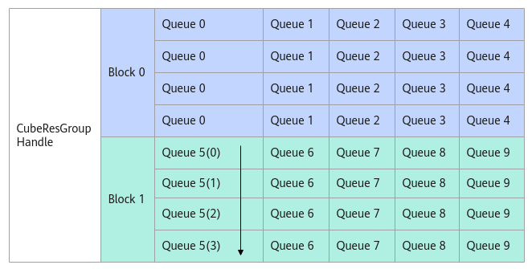

# AllocMessage

> **Section**: 6.2.3.12.1.5  
> **PDF Pages**: 1941–1941  

---

<!-- page 1941 -->

## 6.2.3.12.1.5 AllocMessage

产品支持情况

产品是否支持

Atlas 350 加速卡√

Atlas A3 训练系列产品/Atlas A3 推理系列产品x

Atlas A2 训练系列产品/Atlas A2 推理系列产品√

Atlas 200I/500 A2 推理产品x

Atlas 推理系列产品AI Corex

Atlas 推理系列产品Vector Corex

Atlas 训练系列产品x

功能说明

AIV从消息队列里申请消息空间，用于存放消息结构体，返回当前申请的消息空间的地址。消息队列的深度固定为4，申请消息空间的顺序为自上而下，然后循环。当消息队列指针指向的消息空间为FREE状态时，AllocMessage返回空间的地址，否则循环等待，直到当前空间的状态为FREE。

图6-61 AllocMessage 示意图



函数原型

```cpp
template <PipeMode pipeMode = PipeMode::SCALAR_MODE>             __aicore__ inline __gm__ CubeMsgType *AllocMessage()
```
