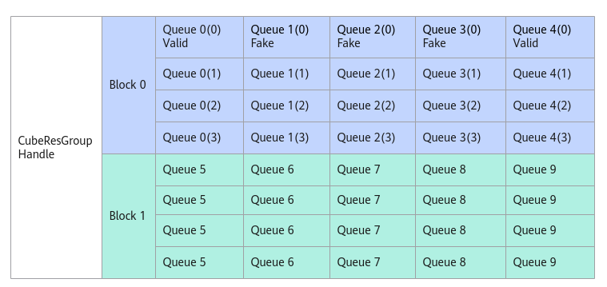

# PostFakeMsg

> **Section**: 6.2.3.12.1.7  
> **PDF Pages**: 1944–1944  

---

<!-- page 1944 -->

## 6.2.3.12.1.7 PostFakeMsg

产品支持情况

产品是否支持

Atlas 350 加速卡√

Atlas A3 训练系列产品/Atlas A3 推理系列产品x

Atlas A2 训练系列产品/Atlas A2 推理系列产品√

Atlas 200I/500 A2 推理产品x

Atlas 推理系列产品AI Corex

Atlas 推理系列产品Vector Corex

Atlas 训练系列产品x

功能说明

通过AllocMessage接口获取到消息空间地址后，AIV发送假消息，刷新消息状态msgState为FAKE。

当多个AIV的消息内容一致时，AIC仅需要读取一次位置靠前的第一个消息，通过将消息结构体中自定义的参数skipCnt设置为n，通知AIC后续n条消息无需处理，直接跳过，被跳过的AIV需要使用本接口发送假消息，这被称之为消息合并机制或消息合并场景。

如下图所示，假设Queue1、2、3的第0条消息与Queue0的第0条消息相同，在消息合并场景中，从AIC视角来看，Queue0(0)，Queue4(0)的消息会被处理，并根据用户自定义的消息内容完成相应的AIC上的计算。Queue1(0), Queue2(0), Queue3(0)由于发了假消息，AIC将不会读取消息内容进行计算，直接释放消息。

图6-62 PostFakeMessage 示意图



函数原型

```cpp
__aicore__ inline uint16_t PostFakeMsg(__gm__ CubeMsgType* msg)
```
