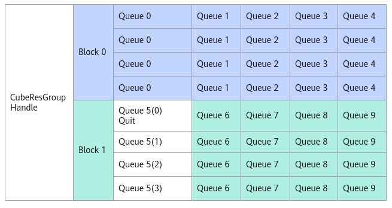

# SetQuit

> **Section**: 6.2.3.12.1.8  
> **PDF Pages**: 1945–1946  

---

<!-- page 1945 -->

参数说明

表6-793接口参数说明

参数输入/输出

说明

msg输入

该CubeResGroupHandle中某个任务的消息空间地址。

返回值说明

当前消息空间与该消息队列队首空间的地址偏移。

约束说明

无

调用示例

hanndle.AssignQueue(queIdx);  auto msgPtr = handle.AllocMessage();        // 获取消息空间指针msgPtrauto offset = handle.PostFakeMsg(msgPtr);           // 在msgPtr指针位置，发送假消息

## 6.2.3.12.1.8 SetQuit

产品支持情况

产品是否支持

Atlas 350 加速卡√

Atlas A3 训练系列产品/Atlas A3 推理系列产品x

Atlas A2 训练系列产品/Atlas A2 推理系列产品√

Atlas 200I/500 A2 推理产品x

Atlas 推理系列产品AI Corex

Atlas 推理系列产品Vector Corex

Atlas 训练系列产品x

功能说明

通过AllocMessage接口获取到消息空间地址后，发送退出消息，告知该消息队列对应的AIC无需处理该队列的消息。如下图，Queue5对应的AIV发了退出消息后，Block1将不再处理Queue5的任何消息。

<!-- page 1946 -->

图6-63消息队列退出示意图



函数原型

```cpp
__aicore__ inline void SetQuit(__gm__ CubeMsgType* msg)
```

参数说明

表6-794接口参数说明

参数输入/输出

说明

msg输入该CubeResGroupHandle中的消息空间地址。

返回值说明

无。

约束说明

无

调用示例

handle.AssignQueue(queIdx);  auto msgPtr = a.AllocMessage();        // 获取消息空间指针msgPtrhandle.SetQuit(msgPtr);              // 发送退出消息
