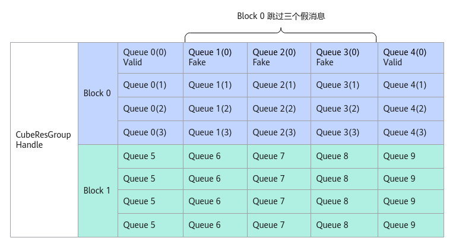

# SetSkipMsg

> **Section**: 6.2.3.12.1.11  
> **PDF Pages**: 1949–1950  

---

<!-- page 1949 -->

参数说明

表6-797接口参数说明

参数输入/输出

说明

msg输入该CubeResGroupHandle中的消息空间地址。

waitState

输入需要等待的msgState。

返回值说明

当前消息空间与该消息队列队首空间的地址偏移。

约束说明

指定的消息状态waitState不能为QUIT和FREE。

调用示例

template <int32_t funcId>__aicore__ inline static typename IsEqual<funcId, 1>::Type CubeGroupCallBack(    MatmulApiCfg &mm, __gm__ CubeMsgBody *rcvMsg, CubeResGroupHandle<CubeMsgBody> &handle){       // Cube核上计算逻辑，此处用户自行实现，在一切计算完毕后需要调用FreeMessage，代表rcvMsg已处理完。       auto tmpId = handle.FreeMessage(rcvMsg);};

## 6.2.3.12.1.11 SetSkipMsg

产品支持情况

产品是否支持

Atlas 350 加速卡√

Atlas A3 训练系列产品/Atlas A3 推理系列产品x

Atlas A2 训练系列产品/Atlas A2 推理系列产品√

Atlas 200I/500 A2 推理产品x

Atlas 推理系列产品AI Corex

Atlas 推理系列产品Vector Corex

Atlas 训练系列产品x

<!-- page 1950 -->

功能说明

AIC跳过指定个数假消息的处理，仅在回调函数中调用。下图中Block0通过调用SetSkipMsg跳过三个假消息。

图6-64 SetSkipMsg 示意图



函数原型

```cpp
__aicore__ inline void SetSkipMsg(uint8_t skipCnt)
```

参数说明

表6-798接口参数说明

参数输入/输出

说明

skipCnt

AIC需要跳过的消息数。

输入

返回值说明

无。

约束说明

该任务的消息空间后skipCnt个消息队列需要发送FAKE消息。

调用示例

```cpp
__aicore__ inline static void Call(    MatmulApiCfg &mm, __gm__ CubeMsgBody *rcvMsg, CubeResGroupHandle<CubeMsgBody> &handle)
```
