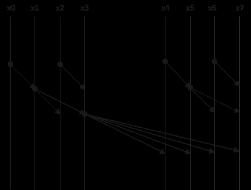
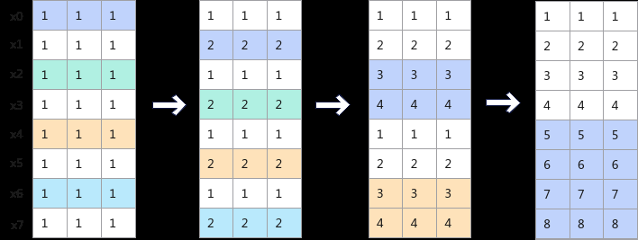

# CumSum

> **Section**: 6.2.4.1.29.1  
> **PDF Pages**: 2152–2156  

---

<!-- page 2152 -->

参数说明

表6-934参数列表

参数名输入/输出

功能

typeSize输入输入的数据类型大小，单位为字节。比如输入的数据类型为half，此处应传入2。

maxLiveNodeCount

输出最大存活节点数，表示临时空间是单次计算数据量所占空间的多少倍。

extraBuffer输出使用的额外临时空间大小，单位为字节。

返回值说明

无

约束说明

当利用maxLiveNodeCount，extraBuffer反推出的currentShapeSize * typeSize <256B时，currentShapeSize按照256B / typeSize的值向上取整。

调用示例

完整的调用样例请参考6.2.4.1.49 更多样例。uint32_t maxLiveNodeCount = 0;uint32_t extraBuf = 0;AscendC::GetXorTmpBufferFactorSize(typeSize, maxLiveNodeCount, extraBuf);

## 6.2.4.1.29 CumSum 接口

## 6.2.4.1.29.1 CumSum

产品支持情况

产品是否支持

Atlas 350 加速卡√

Atlas A3 训练系列产品/Atlas A3 推理系列产品√

Atlas A2 训练系列产品/Atlas A2 推理系列产品√

Atlas 200I/500 A2 推理产品x

Atlas 推理系列产品AI Core√

Atlas 推理系列产品Vector Corex

Atlas 训练系列产品x

<!-- page 2153 -->

功能说明

用于对输入张量按行或列进行累加和操作，输出结果中每个元素都是输入张量中对应位置及之前所有行或列的元素累加和。

计算公式如下：


●逐行累加算法

–First轴处理，按行累加和操作，即第一行不变，后面的行依次累加，输出结果的第i行第j列计算公式如下：


以tensor([[0, 1, 2], [3, 4, 5]])为例，输出结果是tensor([[0, 1, 2], [3, 5, 7]])

–Last轴处理，按列累加和操作，即第一列不变，后面的列依次累加，输出结果的第i行第j列计算公式如下：


以tensor([[0, 1, 2], [3, 4, 5]])为例，输出结果是tensor([[0, 1, 3], [3, 7,12]])

●Sklansky二分累加算法

仅支持Atlas 350 加速卡。

Sklansky二分累加算法是基于Sklansky Adder的并行前缀和逻辑实现的。图6-65为一维二进制的并行前缀和算法示意图。将该算法扩展至二维张量的累加和算法，以按行累加为例，图6-66为该算法的执行步骤示意图，通过并行计算多行的加和，实现Sklansky二分累加算法下的按行累加和。

<!-- page 2154 -->

图6-65 Sklansky Adder 算法示意图



图6-66基于Sklansky 的二分累加示意图



函数原型

●通过sharedTmpBuffer入参传入临时空间template <typename T, const CumSumConfig& config = defaultCumSumConfig>__aicore__ inline void CumSum(LocalTensor<T>& dstTensor, LocalTensor<T>& lastRowTensor, const LocalTensor<T>& srcTensor, LocalTensor<uint8_t>& sharedTmpBuffer, const CumSumInfo& cumSumInfo)

●接口框架申请临时空间template <typename T, const CumSumConfig& config = defaultCumSumConfig>__aicore__ inline void CumSum(LocalTensor<T>& dstTensor, LocalTensor<T>& lastRowTensor, const LocalTensor<T>& srcTensor, const CumSumInfo& cumSumInfo)

由于该接口的内部实现中涉及精度转换。需要额外的临时空间来存储计算过程中的中间变量。临时空间支持接口框架申请和开发者通过sharedTmpBuffer入参传入两种方式。

●接口框架申请临时空间，开发者无需申请，但是需要预留临时空间的大小。

●通过sharedTmpBuffer入参传入，使用该tensor作为临时空间进行处理，接口框架不再申请。该方式开发者可以自行管理sharedTmpBuffer内存空间，并在接口调用

<!-- page 2155 -->

完成后，复用该部分内存，内存不会反复申请释放，灵活性较高，内存利用率也较高。

接口框架申请的方式，开发者需要预留临时空间；通过sharedTmpBuffer传入的情况，开发者需要为tensor申请空间。临时空间大小BufferSize的获取方式如下：通过GetCumSumMaxMinTmpSize中提供的接口获取需要预留空间的大小。

参数说明

表6-935模板参数说明

参数名描述

T操作数的数据类型。

Atlas 350 加速卡，支持的数据类型为：half、float。

Atlas A3 训练系列产品/Atlas A3 推理系列产品，支持的数据类型为：half、float。

Atlas A2 训练系列产品/Atlas A2 推理系列产品，支持的数据类型为：half、float。

Atlas 推理系列产品AI Core，支持的数据类型为：half、float。

config定义CumSum接口编译时config参数。CumSumConfig类型，具体定义如下方代码所示，其中参数的含义为：

isLastAxis：取值为true表示计算按last轴处理，取值为false表示计算按first轴处理；

isReuseSource：是否可以复用srcTensor的内存空间；该参数预留，传入默认值false即可。

outputLastRow：是否输出最后一行数据。

algorithm：CumSum内部实现使用的累加和算法，该参数仅支持Atlas 350 加速卡。该参数支持的取值如下：

●CumSumAlgorithm::CUMSUM_ALGORITHM_LINEBYLINE：逐行累加算法。

●CumSumAlgorithm::CUMSUM_ALGORITHM_SKLANSKY：Sklansky二分累加算法。

```cpp
struct CumSumConfig {    bool isLastAxis{true};
    bool isReuseSource{false};
    bool outputLastRow{false};
    CumSumAlgorithm algorithm{CumSumAlgorithm::CUMSUM_ALGORITHM_LINEBYLINE};};enum class CumSumAlgorithm {        CUMSUM_ALGORITHM_LINEBYLINE = 0,        CUMSUM_ALGORITHM_SKLANSKY = 1};
```

<!-- page 2156 -->

表6-936接口参数说明

参数名输入/输出

描述

dstTensor输出目的操作数。按first轴或last轴处理，输入元素的累加和。

类型为LocalTensor，支持的TPosition为VECIN/VECCALC/VECOUT。

lastRowTensor

输出目的操作数。模板参数config中的outputLastRow参数取值为true时，输出的最后一行数据。

类型为LocalTensor，支持的TPosition为VECIN/VECCALC/VECOUT。

srcTensor输入源操作数。

类型为LocalTensor，支持的TPosition为VECIN/VECCALC/VECOUT。

sharedTmpBuffer

输入临时缓存。

类型为LocalTensor，支持的TPosition为VECIN/VECCALC/VECOUT。

用于CumSum内部复杂计算时存储中间变量，由开发者提供。

临时空间大小BufferSize的获取方式请参考GetCumSumMaxMinTmpSize。

cumSumInfo

输入srcTensor的shape信息。CumSumInfo类型，具体定义如下方代码所示，其中参数的含义为：

outter：表示输入数据的外轴长度。

inner：表示输入数据的内轴长度。

请注意：

cumSumInfo.outter和cumSumInfo.inner都应大于0。

cumSumInfo.outter * cumSumInfo.inner不能大于dstTensor或srcTensor的大小。

cumSumInfo.inner * sizeof(T)必须是32字节的整数倍。

当模板参数config中的outputLastRow取值为true时，cumSumInfo.inner不能大于lastRowTensor输出的最后一行数据的大小。

```cpp
struct CumSumInfo{    uint32_t outter{0};
    uint32_t inner{0};};
```

返回值说明

无
