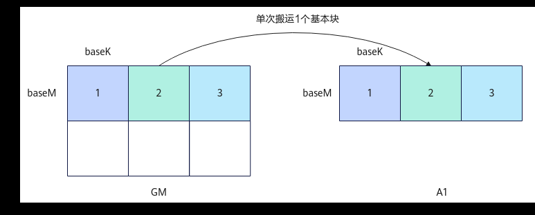

# MatmulCallBackFunc

> **Section**: 6.2.4.2.1.4  
> **PDF Pages**: 2297–2298  

---

<!-- page 2297 -->

## 6.2.4.2.1.4 MatmulCallBackFunc

产品支持情况

产品是否支持

Atlas 350 加速卡√

Atlas A3 训练系列产品/Atlas A3 推理系列产品√

Atlas A2 训练系列产品/Atlas A2 推理系列产品√

Atlas 200I/500 A2 推理产品x

Atlas 推理系列产品AI Corex

Atlas 推理系列产品Vector Corex

Atlas 训练系列产品x

功能说明

模板参数MatmulCallBackFunc支持用户定制化Matmul的A矩阵、B矩阵及C矩阵的搬入搬出功能，如非连续搬入或针对搬出设置不同的数据片段间隔等。具体方式为：用户根据实际需要，实现一个或多个自定义的搬运函数，定义Matmul对象时，通过模板参数MatmulCallBackFunc，传入实现的搬运函数的函数指针，传入的函数指针会替换Matmul流程中默认的搬运函数。

MatmulCallBackFunc中包含3个可由用户自定义的回调函数接口，即用户可配置3个函数指针。3个函数指针分别为C矩阵从CO1拷贝到GM、A矩阵从GM拷贝到A1、B矩阵从GM拷贝到B1的回调函数指针。3个函数指针的位置固定，不使用自定义搬运函数的函数指针位置需要设为空指针。各个功能回调函数接口定义及参数释义见表1MatmulCallBackFunc回调函数接口及参数说明。每个回调函数实现矩阵搬运中单个基本块（A矩阵基本块baseM * baseK、B矩阵基本块baseK * baseN、C矩阵基本块baseM * baseN）的搬运策略，无法对整块内存空间进行管理。Matmul默认的搬运函数实现单核上单个基本块的搬运，搬运的基本块大小是固定的，在完整的Matmul计算过程中，多次调用搬运函数，对连续排布的基本块按顺序逐个搬运，以搬入A矩阵的过程为例，示意图如下。

图6-69 Matmul 默认搬入A 矩阵示意图

<!-- page 2298 -->

表6-1021 MatmulCallBackFunc 回调函数接口及参数说明

回调函数功能

回调函数接口参数说明

void DataCopyOut(const__gm__ void *gm, constLocalTensor<int8_t>&co1Local, const void*dataCopyOutParams,const uint64_t tilingPtr,const uint64_t dataPtr)

gm：输出的GM地址。

可自定义设置不同的搬出数据片段数目等参数，实现将Matmul计算结果从CO1搬出到GM的功能

co1Local: CO1上的计算结果。

dataCopyOutParams：Matmul定义的DataCopyOutParams结构体指针，具体定义如下方代码所示，供用户参考使用。

tilingPtr: 用户使用SetUserDefInfo设置的tiling参数地址。

dataPtr: 用户使用SetSelfDefineData设置的计算数据地址。

void CopyA1(constLocalTensor<int8_t>&aMatrix, const __gm__void *gm, int row, int col,int useM, int useK, constuint64_t tilingPtr, constuint64_t dataPtr)

aMatrix: 目标L1Buffer地址。

可自定义左矩阵搬入首地址、搬运块位置、搬运块大小，实现左矩阵从GM搬入L1的功能

gm：左矩阵GM首地址。

row、col：搬运块在M、K方向的索引，即在M、K方向上搬运块的序号，序号从0开始。

useM、useK：搬运块M、K方向大小，单位为元素个数。通过row、col和useM、useK计算出该搬运块左上角在左矩阵中的地址偏移。

tilingPtr: 用户使用SetUserDefInfo设置的tiling参数地址。

dataPtr: 用户使用SetSelfDefineData设置的计算数据地址。

void CopyB1(constLocalTensor<int8_t>&bMatrix, const __gm__void *gm, int row, int col,int useK, int useN, constuint64_t tilingPtr, constuint64_t dataPtr)

bMatrix: 目标L1Buffer地址。

可自定义右矩阵搬入首地址、搬运块位置、搬运块大小，实现右矩阵从GM搬入L1的功能

gm：右矩阵GM首地址。

row、col：搬运块在K、N方向的索引，即在K、N方向上搬运块的序号，序号从0开始。

useK、useN：搬运块K、N方向大小，单位为元素个数。通过row、col和useK、useN计算出该搬运块左上角在右矩阵中的地址偏移。

tilingPtr: 用户使用SetUserDefInfo设置的tiling参数地址。

dataPtr: 用户使用SetSelfDefineData设置的计算数据地址。

struct DataCopyOutParams {    uint16_t cBurstNum; //传输数据片段数目    uint16_t burstLen; //连续传输数据片段长度    uint16_t srcStride;//源tensor相邻连续数据片段间隔    uint32_t dstStride; // 目的tensor相邻连续数据片段间隔
