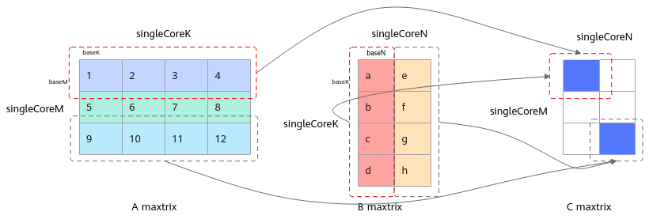
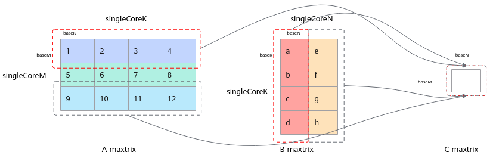

# GetTensorC

> **Section**: 6.2.4.2.1.23  
> **PDF Pages**: 2359–2363  

---

<!-- page 2359 -->

调用示例

同步模式及异步模式的简单调用示例如下，更多完整算子样例请参考Iterate异步场景样例、自主管理CO1的算子样例。

// 同步模式样例while (mm.Iterate()) {       mm.GetTensorC(ubCmatrix); }

// 异步模式样例mm.template Iterate<false>();// …………其它计算for (int i = 0; i < singleM/baseM*singleN/baseN; ++i) {       mm.template GetTensorC<false>(ubCmatrix); }

## 6.2.4.2.1.23 GetTensorC

产品支持情况

产品是否支持

Atlas 350 加速卡√

Atlas A3 训练系列产品/Atlas A3 推理系列产品√

Atlas A2 训练系列产品/Atlas A2 推理系列产品√

Atlas 200I/500 A2 推理产品√

Atlas 推理系列产品AI Core√

Atlas 推理系列产品Vector Corex

Atlas 训练系列产品x

功能说明

Iterate后，获取一块或者两块C矩阵片，可以直接输出到GM tensor中，也可以输出到VECIN tensor中。当MatmulConfig参数中的ScheduleType取值为ScheduleType::INNER_PRODUCT时，获取一块C矩阵片；当MatmulConfig参数中的ScheduleType取值为ScheduleType::OUTER_PRODUCT时，获取两块C矩阵片。

该接口和 Iterate接口配合使用，用于在调用Iterate完成迭代计算后，根据MatmulConfig参数中的ScheduleType取值获取一块或两块baseM * baseN大小的矩阵分片。

迭代获取C矩阵分片的过程分为同步和异步两种模式：

●同步：执行完一次Iterate后执行一次GetTensorC，需要同步等待C矩阵分片获取完成。

●异步：调用Iterate后，无需立即调用GetTensorC同步等待，可以先执行其他逻辑，待需要获取结果时再调用GetTensorC。异步方式可以减少同步等待，提高并行度，开发者对计算性能要求较高时，可以选用该方式。

<!-- page 2360 -->

函数原型

●获取C矩阵，输出至VECINtemplate <bool sync = true>__aicore__ inline void GetTensorC(const LocalTensor<DstT>& co2Local, uint8_t enAtomic = 0, bool enSequentialWrite = false)

–支持同步模式

–支持异步模式

●获取C矩阵，输出至GMtemplate <bool sync = true>__aicore__ inline void GetTensorC(const GlobalTensor<DstT>& gm, uint8_t enAtomic = 0, bool enSequentialWrite = false)

–支持同步模式

–支持异步模式

●获取C矩阵，同时输出至GM和VECINtemplate <bool sync = true>__aicore__ inline void GetTensorC(const GlobalTensor<DstT> &gm, const LocalTensor<DstT> &co2Local, uint8_t enAtomic = 0, bool enSequentialWrite = false)

–支持同步模式

–支持异步模式

–纯Cube模式（只有矩阵计算）模式暂不支持该接口

–Atlas 200I/500 A2 推理产品暂不支持同时输出至GM和VECIN

●获取异步场景用于缓存结果的Workspace上的C矩阵，后续使用过程由开发者自行控制

C矩阵输出到VECIN时，分配给VECIN的Unified Buffer的大小会影响Matmul计算的力度，分配给VECIN的大小过小时，无法充分利用硬件算力。提供该接口支持返回缓存在Workspace上的C矩阵，由开发者自行控制后续使用过程。

注意，在初始化时，C矩阵的逻辑位置应设置为TPosition::VECIN，调用该接口获取缓存的C矩阵后，自行拷贝到Unified Buffer。

```cpp
template <bool sync = true>__aicore__ inline GlobalTensor<DstT> GetTensorC(uint8_t enAtomic = 0, bool enSequentialWrite = false)
```

–支持异步模式

以下接口中的doPad、height、width、srcGap、dstGap参数待废弃，使用过程中无需传入，保持默认值即可；上文介绍的输出至VECIN的原型实际为不传入默认值的函数原型。

```cpp
template <bool sync = true, bool doPad = false>__aicore__ inline void GetTensorC(const LocalTensor<DstT>& c, uint8_t enAtomic = 0, bool enSequentialWrite = false, uint32_t height = 0, uint32_t width = 0, uint32_t srcGap = 0, uint32_t dstGap = 0)
```

<!-- page 2361 -->

参数说明

表6-1050模板参数说明

参数名描述

sync设置同步或者异步模式：同步模式设置为true；异步模式设置为false。

Atlas 350 加速卡支持异步模式。

Atlas A3 训练系列产品/Atlas A3 推理系列产品支持异步模式。

Atlas A2 训练系列产品/Atlas A2 推理系列产品支持异步模式。

Atlas 推理系列产品AI Core不支持异步模式。

Atlas 200I/500 A2 推理产品不支持异步模式。

表6-1051接口参数说明

参数名输入/输出

描述

c/co2Local输出取出C矩阵到VECIN。

Atlas 350 加速卡支持的数据类型为half、float、bfloat16_t、int32_t、int8_t、fp8_e4m3fn_t、hifloat8_t。数据格式支持ND、NZ。

针对Atlas A3 训练系列产品/Atlas A3 推理系列产品支持的数据类型为half、float、bfloat16_t、int32_t、int8_t。数据格式支持ND、NZ。

针对Atlas A2 训练系列产品/Atlas A2 推理系列产品支持的数据类型为half、float、bfloat16_t、int32_t、int8_t。数据格式支持ND、NZ。

针对Atlas 推理系列产品AI Core支持的数据类型为half、float、int8_t、int32_t。数据格式支持NZ。

Atlas 200I/500 A2 推理产品支持的数据类型为half、float、bfloat16_t、int32_t。数据格式支持ND、NZ。

gm输出取出C矩阵到GM，数据格式可以为ND或NZ。

Atlas 350 加速卡支持的数据类型为half、float、bfloat16_t、int32_t、int8_t、fp8_e4m3fn_t、hifloat8_t

针对Atlas A3 训练系列产品/Atlas A3 推理系列产品支持的数据类型为half、float、bfloat16_t、int32_t、int8_t

针对Atlas A2 训练系列产品/Atlas A2 推理系列产品支持的数据类型为half、float、bfloat16_t、int32_t、int8_t

针对Atlas 推理系列产品AI Core支持的数据类型为half、float、int8_t、int32_t

Atlas 200I/500 A2 推理产品支持的数据类型为half、float、bfloat16_t、int32_t

<!-- page 2362 -->

参数名输入/输出

描述

enAtomic输入是否开启Atomic操作，默认值为0。

参数取值：

0：不开启Atomic操作

1：开启AtomicAdd累加操作

2：开启AtomicMax求最大值操作

3：开启AtomicMin求最小值操作

对于Atlas 推理系列产品AI Core，只有输出位置是GM才支持开启Atomic操作。

对于Atlas 200I/500 A2 推理产品，只有输出位置是GM才支持开启Atomic操作。

enSequentialWrite

输入是否开启连续写模式（连续写，写入[baseM, baseN]；非连续写，写入[singleCoreM, singleCoreN]中对应的位置），默认值false（非连续写模式）。

注意：非连续写模式，内部会按照迭代顺序算好偏移，开发者不需要关注；如果开发者需要决定排布顺序，可以选择连续写模式，自行按照设定的偏移进行搬运操作。

对于Atlas 200I/500 A2 推理产品，只支持非连续写模式。

图6-75非连续写模式示意图



图6-76连续写模式示意图



<!-- page 2363 -->

返回值说明

无

约束说明

●传入的C矩阵地址空间大小需要保证不小于baseM * baseN。

●异步场景时，需要使用一块临时空间来缓存Iterate计算结果，调用GetTensorC时会在该临时空间中获取C的矩阵分片。临时空间通过SetWorkspace接口进行设置。SetWorkspace接口需要在Iterate接口之前调用。

●当使能MixDualMaster（双主模式）场景时，即模板参数enableMixDualMaster设置为true，不支持使用该接口。

调用示例

●获取C矩阵，输出至VECIN// 同步模式样例while (mm.Iterate()) {       mm.GetTensorC(ubCmatrix); }

// 异步模式样例mm.template Iterate<false>();// 其他操作for (int i = 0; i < singleM / baseM * singleN / baseN; ++i) {       mm.template GetTensorC<false>(ubCmatrix);     // 其他操作}

●获取C矩阵，输出至GM，同步模式样例while (mm.Iterate()) {       mm.GetTensorC(gm); }

●获取C矩阵，同时输出至GM和VECIN，同步模式样例while (mm.Iterate()) {       mm.GetTensorC(gm, ubCmatrix); }

●获取API接口返回的GM上的C矩阵，手动拷贝至UB，异步模式样例// BaseM * BaseN = 128 *256mm.SetTensorA(gmA);mm.SetTensorB(gmB);mm.SetTail(singleM, singleN, singleK);mm.template Iterate<false>(); // 其他操作for (int i = 0; i < singleM / baseM * singleN / baseN; ++i) {      // 获取每次计算的BaseM*BaseN的数据128*256     GlobalTensor<T> global = mm.template GetTensorC<false>();    for(int j = 0; j < 4; ++j) {        LocalTensor local = que.AllocTensor<half>(); // 分配64*128大小的UB空间        DataCopy(local, global[64 * 128 * i], 64 * 128); // 将GM的数据拷贝进UB中，进行后续的Vector操作        // 其他Vector 操作    }}

更多异步场景的算子样例请参考异步场景样例、Iterate异步场景样例。
