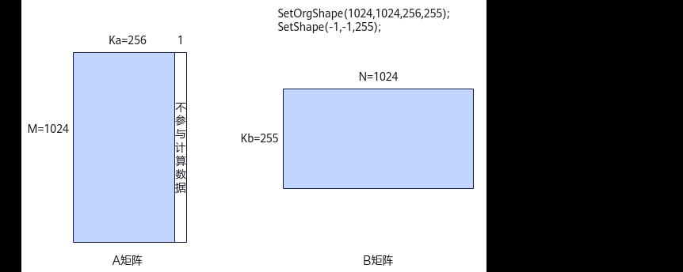

# SetOrgShape

> **Section**: 12  
> **PDF Pages**: 2427–2427  

---

<!-- page 2427 -->

图6-77参数传入-1 的场景示意图



函数原型

```cpp
int32_t SetShape(int32_t m, int32_t n, int32_t k)
```

参数说明

表6-1082参数说明

参数名输入/输出

描述

m输入设置Matmul计算的M方向大小，单位为元素。

n输入设置Matmul计算的N方向大小，单位为元素。

k输入设置Matmul计算的K方向大小，单位为元素。

返回值说明

-1表示设置失败；0表示设置成功。

约束说明

无

调用示例

auto ascendcPlatform = platform_ascendc::PlatformAscendC(context->GetPlatformInfo());matmul_tiling::MatmulApiTiling tiling(ascendcPlatform); tiling.SetShape(1024, 1024, 1024);  // 设置Matmul计算的形状tiling.SetOrgShape(1024, 1024, 1024);

## ?.12. SetOrgShape

功能说明

设置Matmul计算时的原始完整的形状M、N、K或Ka/Kb，单位均为元素个数。
