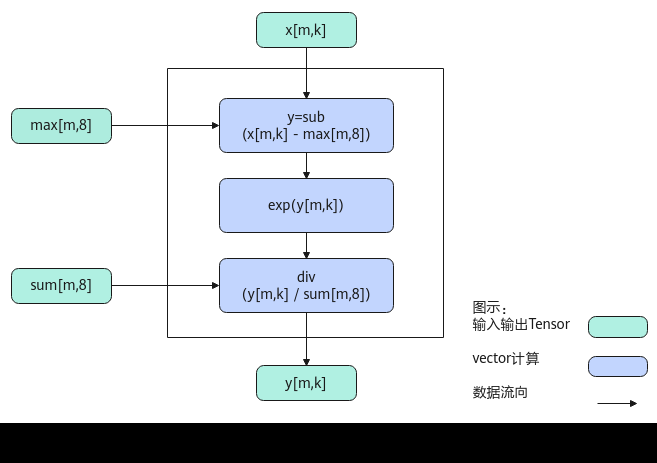

# SimpleSoftMax

> **Section**: 6.2.4.3.1.2  
> **PDF Pages**: 2474–2479  

---

<!-- page 2474 -->

```cpp
[[0.         0.         0.         0.         0.         0.00004509 0.00669255 0.99326235] [0.00057661 0.0015674  0.00426062 0.01158158 0.03148199 0.08557693 0.23262219 0.63233274] [0.05302124 0.08741724 0.10677165 0.13041118 0.14412664 0.1515162  0.15928458 0.16745128] [0.10516749 0.11055954 0.11622806 0.12218719 0.12845187 0.13503774 0.1405487  0.14181937] [0.11318932 0.11330257 0.1143269  0.11899266 0.12509353 0.13150725 0.13824977 0.14533797] [0.09476865 0.09962755 0.10473556 0.11010546 0.1157507  0.12792432 0.15624711 0.19084065] [0.00095032 0.00156681 0.00425903 0.01157725 0.03147022 0.08554492 0.2325352  0.63209623] [0.         0.         0.         0.         0.         0.         0.         1.        ]]
```

## 6.2.4.3.1.2 SimpleSoftMax

产品支持情况

产品是否支持

Atlas 350 加速卡√

Atlas A3 训练系列产品/Atlas A3 推理系列产品√

Atlas A2 训练系列产品/Atlas A2 推理系列产品√

Atlas 200I/500 A2 推理产品√

Atlas 推理系列产品AI Core√

Atlas 推理系列产品Vector Corex

Atlas 训练系列产品x

功能说明

将输入tensor[m0, m1, ...mt, n]（t大于等于0）的非尾轴长度相乘的结果看作m，则输入tensor的shape看作[m, n]。对输入tensor[m,n]按行做如下计算，与 SoftMax接口不同，该接口内部没有reduce过程计算sum和max数据，而是使用计算好的sum和max数据对输入tensor做Softmax计算。计算公式如下：


为方便理解，通过Python脚本实现的方式，表达其计算公式如下，其中src、max、sum是源操作数（输入），dst为目的操作数（输出）。

```cpp
def simple_softmax(src, max, sum):    dst = np.exp(src - max)/sum    return dst
```

实现原理

以float类型，ND格式，shape为[m, k]的输入Tensor为例，描述SimpleSoftMax高阶API内部算法框图，如下图所示。

<!-- page 2475 -->

图6-81 SimpleSoftMax 算法框图



计算过程分为如下几步，均在Vector上进行：

1.sub步骤：对输入x的所有数据按行减去输入的max；

2.exp步骤：对sub之后的所有数据求exp；

3.div步骤：对exp结果的所有数据按行除以输入的sum，得到结果；

函数原型

●接口框架申请临时空间

–LocalTensor的数据类型相同template <typename T, bool isReuseSource = false, bool isBasicBlock = false, bool isDataFormatNZ = false, const SoftmaxConfig& config = SOFTMAX_DEFAULT_CFG> __aicore__ inline void SimpleSoftMax(const LocalTensor<T>& dstTensor, const LocalTensor<T>& inSumTensor, const LocalTensor<T>& inMaxTensor, const LocalTensor<T>& srcTensor, const SoftMaxTiling& tiling, const SoftMaxShapeInfo& softmaxShapeInfo = {})

–LocalTensor的数据类型不同template <typename T, bool isReuseSource = false, bool isBasicBlock = false, bool isDataFormatNZ = false, const SoftmaxConfig& config = SOFTMAX_DEFAULT_CFG>__aicore__ inline void SimpleSoftMax(const LocalTensor<half>& dstTensor, const LocalTensor<float>& inSumTensor, const LocalTensor<float>& inMaxTensor, const LocalTensor<half>& srcTensor, const SoftMaxTiling& tiling, const SoftMaxShapeInfo& softmaxShapeInfo = {})

●通过sharedTmpBuffer入参传入临时空间

–LocalTensor的数据类型相同template <typename T, bool isReuseSource = false, bool isBasicBlock = false, bool isDataFormatNZ = false, const SoftmaxConfig& config = SOFTMAX_DEFAULT_CFG> __aicore__ inline void SimpleSoftMax(const LocalTensor<T>& dstTensor, const LocalTensor<T>& inSumTensor, const LocalTensor<T>& inMaxTensor, const LocalTensor<T>& srcTensor, const LocalTensor<uint8_t>& sharedTmpBuffer, const SoftMaxTiling& tiling, const SoftMaxShapeInfo& softmaxShapeInfo = {})

<!-- page 2476 -->

–LocalTensor的数据类型不同template <typename T, bool isReuseSource = false, bool isBasicBlock = false, bool isDataFormatNZ = false, const SoftmaxConfig& config = SOFTMAX_DEFAULT_CFG>__aicore__ inline void SimpleSoftMax(const LocalTensor<half>& dstTensor, const LocalTensor<float>& inSumTensor, const LocalTensor<float>& inMaxTensor, const LocalTensor<half>& srcTensor, const LocalTensor<uint8_t>& sharedTmpBuffer, const SoftMaxTiling& tiling, const SoftMaxShapeInfo& softmaxShapeInfo = {})

由于该接口的内部实现中涉及复杂的计算，需要额外的临时空间来存储计算过程中的中间变量。临时空间支持接口框架申请和开发者通过sharedTmpBuffer入参传入两种方式。

●接口框架申请临时空间，开发者无需申请，但是需要预留临时空间的大小。

●通过sharedTmpBuffer入参传入，使用该tensor作为临时空间进行处理，接口框架不再申请。该方式开发者可以自行管理sharedTmpBuffer内存空间，并在接口调用完成后，复用该部分内存，内存不会反复申请释放，灵活性较高，内存利用率也较高。

接口框架申请的方式，开发者需要预留临时空间；通过sharedTmpBuffer传入的情况，开发者需要为tensor申请空间。临时空间大小BufferSize的获取方式如下：通过SoftMax/SimpleSoftMax Tiling中提供的GetSoftMaxMaxTmpSize/GetSoftMaxMinTmpSize接口获取所需最大和最小临时空间大小，最小空间可以保证功能正确，最大空间用于提升性能。

参数说明

表6-1117模板参数说明

参数名描述

T操作数的数据类型。

Atlas 350 加速卡，支持的数据类型为：half、float。

Atlas A3 训练系列产品/Atlas A3 推理系列产品，支持的数据类型为：half、float。

Atlas A2 训练系列产品/Atlas A2 推理系列产品，支持的数据类型为：half、float。

Atlas 推理系列产品AI Core，支持的数据类型为：half、float。

Atlas 200I/500 A2 推理产品，支持的数据类型为：half、float。

isReuseSource该参数预留，传入默认值false即可。

isBasicBlocksrcTensor和dstTensor的shape信息和Tiling切分策略满足基本块要求的情况下，可以使能该参数用于提升性能，默认不使能。是否满足基本块的要求，可以采用如下两种方式之一判断：

●srcTensor和dstTensor的shape信息[m,n]需要满足如下条件：

–尾轴长度n小于2048并且大于等于256/sizeof(T)（即half场景下n最小为128，float场景下n最小为64），同时n是64的倍数；

–非尾轴长度的乘积m为8的倍数。

●在Tiling实现中，通过调用IsBasicBlockInSoftMax判断Tiling切分策略是否满足基本块的切分要求。

针对Atlas 200/500 A2推理产品，该参数为预留参数，暂未启用，为后续的功能扩展做保留，保持默认值即可。

<!-- page 2477 -->

参数名描述

isDataFormatNZ当前输入输出的数据格式是否为NZ格式，默认数据格式为ND，即默认取值为false。

针对Atlas 200/500 A2推理产品，不支持配置为NZ格式。

config结构体模板参数，此参数可选配，SoftmaxConfig类型，具体定义如下。struct SoftmaxConfig{    bool isCheckTiling = true; // 是否需要检查shape和tiling的一致性；若不一致，API内会根据shape重新计算所需tiling。默认取值true：API内部会检查一致性    uint32_t oriSrcM = 0; // 原始非尾轴长度的乘积。设置该参数后，将shape常量化，编译过程中使用常量化的shape    uint32_t oriSrcK = 0; // 原始尾轴长度。设置该参数后，将shape常量化，编译过程中使用常量化的shape};

配置示例如下。constexpr SoftmaxConfig SOFTMAX_DEFAULT_CFG = {true, 0, 0};

此参数一般用于配合kernel侧tiling计算的接口使用。

注意：config参数生效的优先级低于模板参数isBasicBlock，即使能isBasicBlock参数时，接口内部做基本块的切分优化，config参数的shape常量化不生效。

Atlas 350 加速卡，该参数为预留参数，暂未启用，保持默认值即可。

Atlas A3 训练系列产品/Atlas A3 推理系列产品，支持该参数。

Atlas A2 训练系列产品/Atlas A2 推理系列产品，支持该参数。

Atlas 推理系列产品AI Core，支持该参数。

针对Atlas 200I/500 A2 推理产品，该参数为预留参数，暂未启用，保持默认值即可。

表6-1118接口参数说明

参数名输入/输出

描述

dstTensor输出目的操作数。

类型为LocalTensor，支持的TPosition为VECIN/VECCALC/VECOUT。

dstTensor的shape和源操作数srcTensor一致。

inSumTensor

输入源操作数。

类型为LocalTensor，支持的TPosition为VECIN/VECCALC/VECOUT。

softmax计算所需要的sum值。

●inSumTensor的last轴长度固定为32Byte，即一个datablock长度。该datablock中的所有数据为同一个值，比如half数据类型下，该datablock中的16个数均为相同的值。

●非last轴的长度需要与dstTensor保持一致。

<!-- page 2478 -->

描述

参数名输入/输出

inMaxTensor

输入源操作数。

类型为LocalTensor，支持的TPosition为VECIN/VECCALC/VECOUT。

softmax计算所需要的max值。

●inMaxTensor的last轴长度固定为32Byte，即一个datablock长度。该datablock中的所有数据为同一个值，比如half数据类型下，该datablock里的16个数均为相同的值。

●非last轴的长度需要与dstTensor保持一致。

srcTensor输入源操作数。

类型为LocalTensor，支持的TPosition为VECIN/VECCALC/VECOUT。

last轴长度需要32B对齐。

sharedTmpBuffer

输入临时空间。

类型为LocalTensor，支持的TPosition为VECIN/VECCALC/VECOUT。

该操作数的数据类型固定uint8_t。

接口内部复杂计算时用于存储中间变量，由开发者提供。

临时空间大小BufferSize的获取方式请参考 SoftMax/SimpleSoftMax Tiling。

tiling输入softmax计算所需tiling信息，Tiling信息的获取请参考SoftMax/SimpleSoftMax Tiling。

softmaxShapeInfo

输入srcTensor的shape信息。SoftMaxShapeInfo类型，具体定义如下：struct SoftMaxShapeInfo {uint32_t srcM; // 非尾轴长度的乘积uint32_t srcK; // 尾轴长度，必须32Byte对齐uint32_t oriSrcM; // 原始非尾轴长度的乘积uint32_t oriSrcK;  // 原始尾轴长度};

需要注意，当输入输出的数据格式为NZ格式时，尾轴长度为reduce轴长度即图6-79中的W0*W1，非尾轴为H0*H1。

返回值说明

无

约束说明

●srcTensor和dstTensor的Tensor空间可以复用。

●inSumTensor和inMaxTensor为输入，并且last轴长度必须固定32Byte。

<!-- page 2479 -->

●inSumTensor和inMaxTensor的数据类型需要保持一致。

●操作数地址对齐要求请参见通用地址对齐约束。

●不支持sharedTmpBuffer与源操作数和目的操作数地址重叠。

●当参数softmaxShapeInfo中srcM != oriSrcM 或者 srcK != oriSrcK时，开发者需要对GM上的原始输入(oriSrcM, oriSrcK)在M或K方向补齐数据到(srcM, srcK)，补齐的数据会参与部分运算，在输入输出复用的场景下，API的计算结果会覆盖srcTensor中补齐的原始数据，在输入输出不复用的场景下，API的计算结果会覆盖dstTensor中对应srcTensor补齐位置的数据。

调用示例

完整算子样例请参考simplesoftmax算子样例。// dstLocal: 存放SimpleSoftMax计算结果的Tensor// sumTempLocal：存放SimpleSoftMax计算所需sum值的Tensor// maxTempLocal：存放SimpleSoftMax计算所需max值的Tensor// srcLocal：存放SimpleSoftMax计算的输入Tensor// sharedTmpBuffer: 存放SoftMax计算过程中临时缓存的Tensor// softmaxTiling：存放SoftMax计算所需Tiling信息，可通过SoftMaxTilingFunc接口获取

AscendC::SoftMaxShapeInfo softmaxInfo(    /* 非尾轴长度的乘积          */ srcM,     /* 尾轴长度，必须32Bytes对齐 */ srcK,     /* 原始非尾轴长度的乘积      */ oriSrcM,     /* 原始尾轴长度              */ oriSrcK);

// 通过sharedTmpBuffer入参传入临时空间，传入模板参数将shape常量化AscendC::SimpleSoftMax<T, false, false, false, static_config>(dstLocal, sumTempLocal, maxTempLocal, srcLocal, sharedTmpBuffer, softmaxTiling, softmaxInfo);// 通过sharedTmpBuffer入参传入临时空间AscendC::SimpleSoftMax<T>(dstLocal, sumTempLocal, maxTempLocal, srcLocal, sharedTmpBuffer, softmaxTiling, softmaxInfo);// 接口框架申请临时空间AscendC::SimpleSoftMax<T>(dstLocal, sumTempLocal, maxTempLocal, srcLocal, softmaxTiling, softmaxInfo);

结果示例如下：

输入数据(srcLocal)：[[-100.     -80.     -60.     -50.     -30.     -20.     -15.     -10.   ] [  -9.      -8.      -7.      -6.      -5.      -4.      -3.      -2.   ] [  -1.5     -1.      -0.8     -0.6     -0.5     -0.45    -0.4     -0.35 ] [  -0.3     -0.25    -0.2     -0.15    -0.1     -0.05    -0.01    -0.001] [   0.       0.001    0.01     0.05     0.1      0.15     0.2      0.25 ] [   0.3      0.35     0.4      0.45     0.5      0.6      0.8      1.   ] [   1.5      2.       3.       4.       5.       6.       7.       8.   ] [   9.      10.      15.      20.      30.      50.      60.      80.   ]]输入数据(sumTempLocal)：[[1.0067834 1.0067834 1.0067834 1.0067834 1.0067834 1.0067834 1.0067834 1.0067834] [1.5814459 1.5814459 1.5814459 1.5814459 1.5814459 1.5814459 1.5814459 1.5814459] [5.971886  5.971886  5.971886  5.971886  5.971886  5.971886  5.971886  5.971886 ] [7.051223  7.051223  7.051223  7.051223  7.051223  7.051223  7.051223  7.051223 ] [6.880514  6.880514  6.880514  6.880514  6.880514  6.880514  6.880514  6.880514 ] [5.239974  5.239974  5.239974  5.239974  5.239974  5.239974  5.239974  5.239974 ] [1.5820376 1.5820376 1.5820376 1.5820376 1.5820376 1.5820376 1.5820376 1.5820376] [1.        1.        1.        1.        1.        1.        1.        1.       ]]输入数据(maxTempLocal)：[[-10.    -10.    -10.    -10.    -10.    -10.    -10.    -10.   ] [ -2.     -2.     -2.     -2.     -2.     -2.     -2.     -2.   ] [ -0.35   -0.35   -0.35   -0.35   -0.35   -0.35   -0.35   -0.35 ] [ -0.001  -0.001  -0.001  -0.001  -0.001  -0.001  -0.001  -0.001] [  0.25    0.25    0.25    0.25    0.25    0.25    0.25    0.25 ] [  1.      1.      1.      1.      1.      1.      1.      1.   ] [  8.      8.      8.      8.      8.      8.      8.      8.   ] [ 80.     80.     80.     80.     80.     80.     80.     80.   ]]输出数据(dstLocal)：
