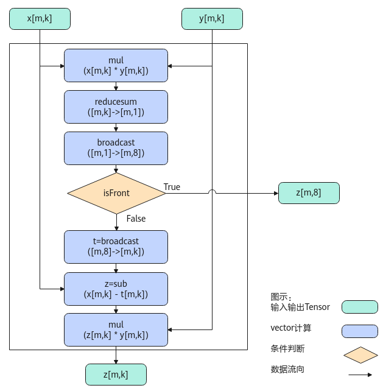

# SoftmaxGrad

> **Section**: 6.2.4.3.1.4  
> **PDF Pages**: 2486–2490  

---

<!-- page 2486 -->

```cpp
AscendC::TPipe pipe;
    AscendC::TQue<AscendC::TPosition::VECIN, 1> inQueueSrc;
    AscendC::TQue<AscendC::TPosition::VECOUT, 1> outQueueDst;
    AscendC::TQue<AscendC::TPosition::VECIN, 1> inMaxQueue;
    AscendC::TQue<AscendC::TPosition::VECIN, 1> inSumQueue;
    AscendC::TQue<AscendC::TPosition::VECIN, 1> expMaxQueue;
AscendC::GlobalTensor<T> srcGlobal, dstGlobal;
    AscendC::GlobalTensor<T> maxGlobal, sumGlobal;
    uint32_t elementNumPerBlk = 0;
    uint32_t width = 144;
    uint32_t height = 80;
    SoftMaxTiling tiling;};
extern "C" __global__ __aicore__ void softmax_flash_kernel_half(GM_ADDR srcGm, GM_ADDR inMaxGm, GM_ADDR inSumGm, GM_ADDR dstGm, GM_ADDR tiling){    GET_TILING_DATA(tilingData, tiling);
    KernelSoftmaxFlash<half> op;
    op.Init(srcGm, inMaxGm, inSumGm, dstGm, tilingData.softmaxTilingData);
    op.Process();}
```

## 6.2.4.3.1.4 SoftmaxGrad

产品支持情况

产品是否支持

Atlas 350 加速卡√

Atlas A3 训练系列产品/Atlas A3 推理系列产品√

Atlas A2 训练系列产品/Atlas A2 推理系列产品√

Atlas 200I/500 A2 推理产品√

Atlas 推理系列产品AI Core√

Atlas 推理系列产品Vector Corex

Atlas 训练系列产品x

功能说明

将输入tensor[m0, m1, ...mt, n]（t大于等于0）的非尾轴长度相乘的结果看作m，则输入tensor的shape看作[m, n]。对输入tensor[m,n]按行做grad反向计算，计算公式如下：


当输入shape为ND格式时，内部的reduce过程按last轴进行；当输入shape为NZ格式时，内部的reduce过程按照last轴和first轴进行，reduce过程可以参考 SoftMax中的图示说明。

<!-- page 2487 -->

为方便理解，通过Python脚本实现的方式，表达其计算公式如下，其中src、grad、isFront是源操作数（输入），dst为目的操作数（输出）。

```cpp
def softmax_grad(grad, src, isFront = None):    dst = grad * src    dst = np.sum(dst, axis=-1, keepdims=True)    if isFront :         return dst    dst = (grad - dst) * src    return dst
```

实现原理

以float类型，ND格式，shape为[m,k]的输入Tensor为例，描述SoftmaxGrad高阶API内部算法框图，如下图所示。

图6-82 SoftmaxGrad 算法框图



计算过程分为如下几步，均在Vector上进行：

1.mul步骤：对输入x和y所有数据相乘，计算结果会保存到一个临时空间temp中；

2.reducesum步骤：对temp数据([m, k])每一行求和得到[m, 1]，计算结果会保存到临时空间中；

<!-- page 2488 -->

3.broadcast步骤：对reducesum结果[m, 1]的数据做一个按datablock为单位的填充，比如float类型下，把[m, 1]扩展成[m, 8]；

4.判断是否isFront模式，如果是，则输出broadcast后的结果，计算结束；如果不是，则继续执行后续步骤；

5.broadcast步骤：对[m, 8]做一个扩维，扩展成[m, k]，计算结果会保存到临时空间中；

6.sub步骤：输入x的所有数据减去上一步broadcast后的结果；

7.mul步骤：sub后的所有数据和输入y相乘，输出结果z。

函数原型

●接口框架申请临时空间template <typename T, bool isReuseSource = false, bool isDataFormatNZ = false>__aicore__ inline void SoftmaxGrad(const LocalTensor<T>& dstTensor, const LocalTensor<T>& gradTensor, const LocalTensor<T>& srcTensor, const SoftMaxTiling& tiling, bool isFront = false, const SoftMaxShapeInfo& softmaxShapeInfo = {})

●通过sharedTmpBuffer入参传入临时空间template <typename T, bool isReuseSource = false, bool isDataFormatNZ = false>__aicore__ inline void SoftmaxGrad(const LocalTensor<T>& dstTensor, const LocalTensor<T>& gradTensor, const LocalTensor<T>& srcTensor, const LocalTensor<uint8_t>& sharedTmpBuffer, const SoftMaxTiling& tiling, bool isFront = false, const SoftMaxShapeInfo& softmaxShapeInfo = {})

由于该接口的内部实现中涉及复杂的计算，需要额外的临时空间来存储计算过程中的中间变量。临时空间支持接口框架申请和开发者通过sharedTmpBuffer入参传入两种方式。

●接口框架申请临时空间，开发者无需申请，但是需要预留临时空间的大小。

●通过sharedTmpBuffer入参传入，使用该tensor作为临时空间进行处理，接口框架不再申请。该方式开发者可以自行管理sharedTmpBuffer内存空间，并在接口调用完成后，复用该部分内存，内存不会反复申请释放，灵活性较高，内存利用率也较高。

接口框架申请的方式，开发者需要预留临时空间；通过sharedTmpBuffer传入的情况，开发者需要为tensor申请空间。临时空间大小BufferSize的获取方式如下：通过SoftmaxGrad Tiling接口中提供的GetSoftMaxGradMaxTmpSize/GetSoftMaxGradMinTmpSize接口获取所需最大和最小临时空间大小，最小空间可以保证功能正确，最大空间用于提升性能。

参数说明

表6-1121模板参数说明

参数名描述

T操作数的数据类型。

Atlas 350 加速卡，支持的数据类型为：half、float。

Atlas A3 训练系列产品/Atlas A3 推理系列产品，支持的数据类型为：half、float。

Atlas A2 训练系列产品/Atlas A2 推理系列产品，支持的数据类型为：half、float。

Atlas 200I/500 A2 推理产品，支持的数据类型为：half、float。

Atlas 推理系列产品AI Core，支持的数据类型为：half、float。

<!-- page 2489 -->

参数名描述

isReuseSource该参数预留，传入默认值false即可。

isDataFormatNZ当前输入输出的数据格式是否为NZ格式，默认数据格式为ND，即默认取值为false。

针对Atlas 200I/500 A2 推理产品，不支持配置为NZ格式。

表6-1122接口参数说明

描述

参数名输入/输出

dstTensor输出目的操作数。

类型为LocalTensor，支持的TPosition为VECIN/VECCALC/VECOUT。

last轴长度需要32Byte对齐，dstTensor的shape与gradTensor，srcTensor的shape一致。

gradTensor输入源操作数。

类型为LocalTensor，支持的TPosition为VECIN/VECCALC/VECOUT。

last轴长度需要32Byte对齐，gradTensor的shape与dstTensor，srcTensor的shape一致。

srcTensor输入源操作数。

类型为LocalTensor，支持的TPosition为VECIN/VECCALC/VECOUT。

last轴长度需要32Byte对齐，srcTensor的shape与dstTensor，gradTensor的shape一致。

sharedTmpBuffer

输入临时空间。

类型为LocalTensor，支持的TPosition为VECIN/VECCALC/VECOUT。

该操作数的数据类型固定uint8_t。

接口内部复杂计算时用于存储中间变量，由开发者提供。

临时空间大小BufferSize的获取方式请参考 SoftmaxGradTiling接口。

softmaxShapeInfo

输入srcTensor的shape信息。SoftMaxShapeInfo类型，具体定义如下：struct SoftMaxShapeInfo {    uint32_t srcM; // 非尾轴长度的乘积    uint32_t srcK; // 尾轴长度，必须32Byte对齐    uint32_t oriSrcM; // 原始非尾轴长度的乘积    uint32_t oriSrcK;  // 原始尾轴长度};

需要注意，当输入输出的数据格式为NZ格式时，尾轴长度为reduce轴长度即图6-79中的W0*W1，非尾轴为H0*H1。

<!-- page 2490 -->

描述

参数名输入/输出

tiling输入softmaxgrad计算所需tiling信息，Tiling信息的获取请参考SoftmaxGrad Tiling接口。

isFront输入是否使能isFront计算，若为True，dstTensor的last轴长度必须固定32Byte。

返回值说明

无

约束说明

●srcTensor和dstTensor的Tensor空间可以复用。

●操作数地址对齐要求请参见通用地址对齐约束。

●不支持sharedTmpBuffer与源操作数和目的操作数地址重叠。

●当参数softmaxShapeInfo中srcM != oriSrcM 或者 srcK != oriSrcK时，开发者需要对GM上的原始输入(oriSrcM, oriSrcK)在M或K方向补齐数据到(srcM, srcK)，补齐的数据会参与部分运算，在输入输出复用的场景下，API的计算结果会覆盖srcTensor中补齐的原始数据，在输入输出不复用的场景下，API的计算结果会覆盖dstTensor中对应srcTensor补齐位置的数据。

调用示例

完整算子样例请参考softmaxgrad算子样例。// dstLocal: 存放SoftmaxGrad计算结果的Tensor// gradLocal：存放SoftmaxGrad计算的输入Tensor// srcLocal：存放SoftmaxGrad计算的输入Tensor// sharedTmpBuffer: 存放SoftmaxGrad计算过程中临时缓存的Tensor// softmaxTiling：存放SoftmaxGrad计算所需Tiling信息，可通过SoftMaxGradTilingFunc接口获取

AscendC::SoftMaxShapeInfo softmaxInfo(    /* 非尾轴长度的乘积          */ srcM,     /* 尾轴长度，必须32Bytes对齐 */ srcK,     /* 原始非尾轴长度的乘积      */ oriSrcM,     /* 原始尾轴长度              */ oriSrcK);bool isFront = false;  // 不使能isFront计算

// 通过sharedTmpBuffer入参传入临时空间AscendC::SoftmaxGrad<T>(dstLocal, gradLocal, srcLocal, sharedTmpBuffer, softmaxTiling, isFront, softmaxInfo);// 接口框架申请临时空间AscendC::SoftmaxGrad<T>(dstLocal, gradLocal, srcLocal, softmaxTiling, isFront, softmaxInfo);

结果示例如下：

输入数据(gradLocal)：[[-100.     -80.     -60.     -50.     -30.     -20.     -15.     -10.   ] [  -9.      -8.      -7.      -6.      -5.      -4.      -3.      -2.   ] [  -1.5     -1.      -0.8     -0.6     -0.5     -0.45    -0.4     -0.35 ] [  -0.3     -0.25    -0.2     -0.15    -0.1     -0.05    -0.01    -0.001] [   0.       0.001    0.01     0.05     0.1      0.15     0.2      0.25 ] [   0.3      0.35     0.4      0.45     0.5      0.6      0.8      1.   ] [   1.5      2.       3.       4.       5.       6.       7.       8.   ]
