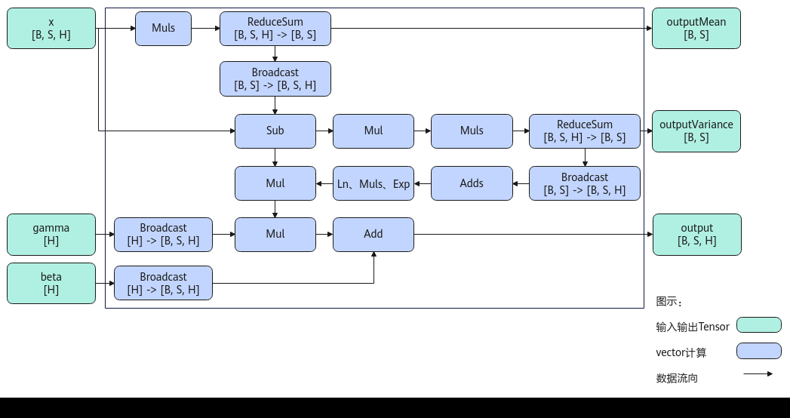
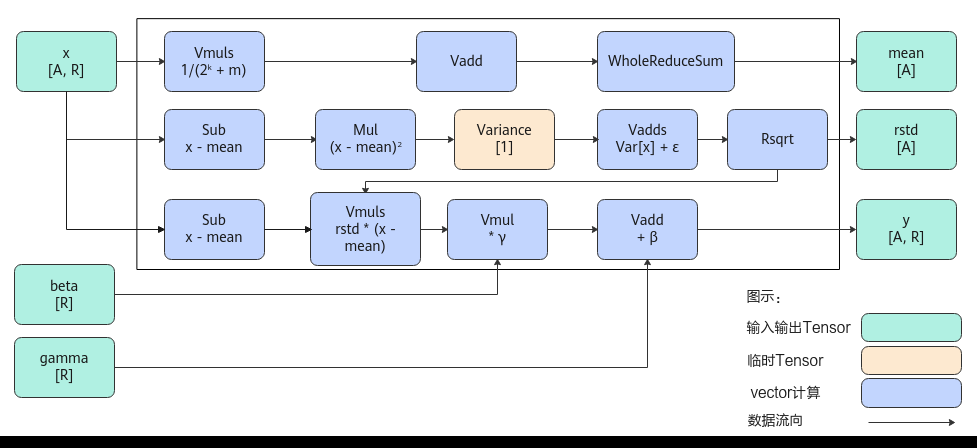

# LayerNorm

> **Section**: 6.2.4.4.1  
> **PDF Pages**: 2573–2581  

---

<!-- page 2573 -->

约束说明

无

调用示例

完整的调用样例请参考6.2.4.1.49 更多样例。// 输入shape信息为1024;算子输入的数据类型为half;不允许修改源操作数std::vector<int64_t> shape_vec = {1024};ge::Shape shape(shape_vec);uint32_t maxValue = 0;uint32_t minValue = 0;AscendC::GetSigmoidMaxMinTmpSize(shape, 2, false, maxValue, minValue);

## 6.2.4.4 归一化操作

## 6.2.4.4.1 LayerNorm

产品支持情况

产品是否支持

Atlas 350 加速卡√

Atlas A3 训练系列产品/Atlas A3 推理系列产品√

Atlas A2 训练系列产品/Atlas A2 推理系列产品√

Atlas 200I/500 A2 推理产品x

Atlas 推理系列产品AI Core√

Atlas 推理系列产品Vector Corex

Atlas 训练系列产品x

功能说明

根据接口输出的不同，本节介绍如下两种LayerNorm接口。

●对shape为[B，S，H]的输入数据，输出归一化结果、均值和方差

在深层神经网络训练过程中，前面层训练参数的更新，会引起后面层输入数据分布的变化，导致权重更新不均衡及学习效率变慢。通过采用归一化策略，将网络层输入数据收敛到[0, 1]之间，可以规范网络层输入输出数据分布，加速训练参数收敛过程，使学习效率提升更加稳定。LayerNorm是许多归一化方法中的一种。

本接口实现了对shape大小为[B，S，H]输入数据的LayerNorm归一化，其计算公式如下，其中γ为缩放系数，β为平移系数，ε为防除零的权重系数：

<!-- page 2574 -->

其中，如下两个参数分别代表输入在H轴的均值和方差。

●对shape为[A，R]的输入数据，输出归一化结果、均值、标准差的倒数或方差

本接口实现了对shape为[A，R]输入数据的LayerNorm归一化，其计算公式如下，其中γ为缩放系数，β为平移系数，ε为防除零的权重系数：

其中，如下三个参数分别代表输入在R轴的均值，方差和标准差的倒数。

实现原理

●对shape为[B，S，H]的输入数据，输出归一化结果、均值和方差

以float类型，ND格式，输入为inputX[B, S, H]，gamma[H]和beta[H]为例，描述LayerNorm高阶API内部算法框图，如下图所示。

<!-- page 2575 -->

图6-86 LayerNorm 算法框图

计算过程分为如下几步，均在Vector上进行（下文中m指尾轴H的长度）：

a.计算均值：Muls计算x*1/m的值，再计算累加值ReduceSum，得到均值outputMean；

b.计算方差：Sub计算出输入x与均值的差值，再用Mul进行平方计算，最后用Muls乘上1/m并计算累加值，得到方差outputVariance；

c.处理gamma和beta：通过broadcast得到BSH维度的gamma和beta；

d.计算输出：方差通过broadcast（或Duplicate）得到BSH维度的tensor，再依次经过Adds(outputVariance, eps)、Ln, Muls, Exp（或Sqrt），最后与（x-均值）相乘，得到的结果乘上gamma，加上beta，得到输出结果。

●对shape为[A，R]的输入数据，输出归一化结果、均值、标准差的倒数或方差

以float类型，ND格式，输入为inputX[A, R]，gamma[R] 和beta[R]为例，描述LayerNorm高阶API内部算法框架，如下图所示。

图6-87 LayerNorm-Rstd 版本算法框图

计算过程分为如下几步，均在Vector上进行，整体按照以A轴为最外层循环进行计算：

<!-- page 2576 -->

a.计算均值：首先对x的每个元素乘以1/(2^k+m)，防止后续累加溢出。然后使用二分累加方式对数据进行求和：将数据拆分成一个整块和一个尾块，其中整块为2^k个元素，尾块为m个元素，将尾块数据叠加到整块数据。为方便描述，定义Vnum为参与单次计算的元素个数。对整块中，以Vnum长度为单位，奇偶位数据进行Vadd，得到一个Vnum长度的结果，对该结果做WholeReduceSum计算，得到输出均值mean；

b.计算rstd：用Sub计算出输入x与均值的差值，再用Mul计算，计算该差值的平方，为防止溢出，按照同样的二分累加方式，计算出该平方结果的方差Variance；方差与防除零系数ε相加，通过Rsqrt计算，得到输出rstd；

c.计算输出：用Sub计算出输入x与均值的差值，再与rstd相乘，得到的结果与gamma相乘，与beta相加，得到输出结果。

函数原型

由于该接口的内部实现中涉及复杂的计算，需要额外的临时空间来存储计算过程中的中间变量。临时空间大小BufferSize的获取方法：通过6.2.4.4.2 LayerNorm Tiling中提供的GetLayerNormMaxMinTmpSize接口获取所需最大和最小临时空间大小，最小空间可以保证功能正确，最大空间用于提升性能。

临时空间支持接口框架申请和开发者通过sharedTmpBuffer入参传入两种方式，因此LayerNorm接口的函数原型有两种：

●对shape为[B，S，H]的输入数据，输出归一化结果、均值和方差

–通过sharedTmpBuffer入参传入临时空间template <typename T, bool isReuseSource = false>__aicore__ inline void LayerNorm(const LocalTensor<T>& output, const LocalTensor<T>& outputMean, const LocalTensor<T>& outputVariance, const LocalTensor<T>& inputX, const LocalTensor<T>& gamma, const LocalTensor<T>& beta, const LocalTensor<uint8_t>& sharedTmpBuffer, const T epsilon, LayerNormTiling& tiling)该方式下开发者需自行申请并管理临时内存空间，并在接口调用完成后，复用该部分内存，内存不会反复申请释放，灵活性较高，内存利用率也较高。

–接口框架申请临时空间template <typename T, bool isReuseSource = false>__aicore__ inline void LayerNorm(const LocalTensor<T>& output, const LocalTensor<T>& outputMean, const LocalTensor<T>& outputVariance, const LocalTensor<T>& inputX, const LocalTensor<T>& gamma, const LocalTensor<T>& beta, const T epsilon, LayerNormTiling& tiling)该方式下开发者无需申请，但是需要预留临时空间的大小。

●对shape为[A，R]的输入数据，输出归一化结果、均值、标准差的倒数或方差

–通过sharedTmpBuffer入参传入临时空间template <typename U, typename T, bool isReuseSource = false, const LayerNormConfig& config = LNCFG_NORM>__aicore__ inline void LayerNorm(const LocalTensor<T>& output, const LocalTensor<float>& outputMean, const LocalTensor<float>& outputRstd, const LocalTensor<T>& inputX, const LocalTensor<U>& gamma, const LocalTensor<U>& beta, const float epsilon, const LocalTensor<uint8_t>& sharedTmpBuffer, const LayerNormPara& para, const LayerNormSeparateTiling& tiling)该方式下开发者需自行申请并管理临时内存空间，并在接口调用完成后，复用该部分内存，内存不会反复申请释放，灵活性较高，内存利用率也较高。

–接口框架申请临时空间template <typename U, typename T, bool isReuseSource = false, const LayerNormConfig& config = LNCFG_NORM>__aicore__ inline void LayerNorm(const LocalTensor<T>& output, const LocalTensor<float>& outputMean, const LocalTensor<float>& outputRstd, const LocalTensor<T>& inputX, const LocalTensor<U>& gamma, const LocalTensor<U>& beta, const float epsilon, const LayerNormPara& para, const LayerNormSeparateTiling& tiling)该方式下开发者无需申请，但是需要预留临时空间的大小。

<!-- page 2577 -->

参数说明

●对shape为[B，S，H]的输入数据，输出归一化结果、均值和方差的接口

表6-1173模板参数说明

参数名描述

T操作数的数据类型。

Atlas 350 加速卡，支持的数据类型为：half、float。

Atlas A3 训练系列产品/Atlas A3 推理系列产品，支持的数据类型为：half、float。

Atlas A2 训练系列产品/Atlas A2 推理系列产品，支持的数据类型为：half、float。

Atlas 推理系列产品AI Core，支持的数据类型为：half、float。

isReuseSource是否允许修改源操作数，默认值为false。如果开发者允许源操作数被改写，可以使能该参数，使能后能够节省部分内存空间。

设置为true，则本接口内部计算时复用inputX的内存空间，节省内存空间；设置为false，则本接口内部计算时不复用inputX的内存空间。

对于float数据类型输入支持开启该参数，half数据类型输入不支持开启该参数。

isReuseSource的使用样例请参考更多样例。

表6-1174接口参数说明

参数名称输入/输出

含义

output输出目的操作数，shape为[B, S, H]，LocalTensor数据结构的定义请参考6.2.2.1 LocalTensor。

类型为LocalTensor，支持的TPosition为VECIN/VECCALC/VECOUT。

outputMean输出均值，shape为[B, S]，LocalTensor数据结构的定义请参考6.2.2.1 LocalTensor。

类型为LocalTensor，支持的TPosition为VECIN/VECCALC/VECOUT。

outputVariance

输出方差，shape为[B, S]，LocalTensor数据结构的定义请参考6.2.2.1 LocalTensor。

类型为LocalTensor，支持的TPosition为VECIN/VECCALC/VECOUT。

inputX输入源操作数，shape为[B, S, H]，LocalTensor数据结构的定义请参考6.2.2.1 LocalTensor。inputX的数据类型需要与目的操作数保持一致，尾轴长度需要32B对齐。

类型为LocalTensor，支持的TPosition为VECIN/VECCALC/VECOUT。

<!-- page 2578 -->

参数名称输入/输出

含义

gamma输入缩放系数，shape为[H]，LocalTensor数据结构的定义请参考6.2.2.1 LocalTensor。gamma的数据类型需要与目的操作数保持一致，尾轴长度需要32B对齐。

类型为LocalTensor，支持的TPosition为VECIN/VECCALC/VECOUT。

beta输入平移系数，shape为[H]，LocalTensor数据结构的定义请参考6.2.2.1 LocalTensor。beta的数据类型需要与目的操作数保持一致，尾轴长度需要32B对齐。

类型为LocalTensor，支持的TPosition为VECIN/VECCALC/VECOUT。

sharedTmpBuffer

输入共享缓冲区，用于存放API内部计算产生的临时数据。该方式开发者可以自行管理sharedTmpBuffer内存空间，并在接口调用完成后，复用该部分内存，内存不会反复申请释放，灵活性较高，内存利用率也较高。共享缓冲区大小的获取方式请参考6.2.4.4.2LayerNorm Tiling。

类型为LocalTensor，支持的TPosition为VECIN/VECCALC/VECOUT。

epsilon输入防除零的权重系数。

tiling输入LayerNorm计算所需Tiling信息，Tiling信息的获取请参考6.2.4.4.2 LayerNorm Tiling。

●对shape为[A，R]的输入数据，输出归一化结果、均值、标准差的倒数或方差的接口

表6-1175模板参数说明

参数名描述

Ubeta，gamma操作数的数据类型。

Atlas 350 加速卡，支持的数据类型为：half、bfloat16_t、float。

Atlas A3 训练系列产品/Atlas A3 推理系列产品，支持的数据类型为：half、float。

Atlas A2 训练系列产品/Atlas A2 推理系列产品，支持的数据类型为：half、float。

Atlas 推理系列产品AI Core，支持的数据类型为：half、float。

Toutput，inputX操作数的数据类型。

Atlas 350 加速卡，支持的数据类型为：half、bfloat16_t、float。

Atlas A3 训练系列产品/Atlas A3 推理系列产品，支持的数据类型为：half、float。

Atlas A2 训练系列产品/Atlas A2 推理系列产品，支持的数据类型为:half、float。

Atlas 推理系列产品AI Core，支持的数据类型为：half、float。

<!-- page 2579 -->

参数名描述

isReuseSource该参数预留，传入默认值false即可。

config配置LayerNorm接口中输入输出相关信息。LayerNormConfig类型，定义如下。struct LayerNormConfig {    bool isNoBeta = false;    bool isNoGamma = false;    bool isOnlyOutput = false;    bool isOutputRstd = true;};

●isNoBeta：计算时，输入beta是否使用。

–false：默认值，LayerNorm计算中使用输入beta。

–true：LayerNorm计算中不使用输入beta。此时，公式中与beta相关的计算被省略。

●isNoGamma：可选输入gamma是否使用。

–false：默认值，LayerNorm计算中使用可选输入gamma。

–true：LayerNorm计算中不使用输入gamma。此时，公式中与gamma相关的计算被省略。

●isOnlyOutput：是否只输出y，不输出均值mean与标准差的倒数rstd。当前该参数仅支持取值为false，表示y、mean和rstd的结果全部输出。

●isOutputRstd：选择输出标准差的倒数rstd还是方差。该参数仅支持Atlas 350加速卡。

–true：默认值，输出标准差的倒数。

–false：输出方差。

表6-1176接口参数说明

参数名称输入/输出

含义

output输出目的操作数，shape为[A, R]，LocalTensor数据结构的定义请参考6.2.2.1 LocalTensor。

类型为LocalTensor，支持的TPosition为VECIN/VECCALC/VECOUT。

outputMean输出均值，shape为[A]，LocalTensor数据结构的定义请参考6.2.2.1 LocalTensor。

类型为LocalTensor，支持的TPosition为VECIN/VECCALC/VECOUT。

<!-- page 2580 -->

参数名称输入/输出

含义

outputRstd输出当模板参数config中的isOutputRstd为true，outputRstd为标准差的倒数，否则isOutputRstd为false时，outputRstd为方差，shape为[A]，LocalTensor数据结构的定义请参考6.2.2.1LocalTensor。

请注意，该接口仅在Atlas 350 加速卡上支持输出方差。

类型为LocalTensor，支持的TPosition为VECIN/VECCALC/VECOUT。

inputX输入源操作数，shape为[A, R]，LocalTensor数据结构的定义请参考6.2.2.1 LocalTensor。inputX的数据类型需要与目的操作数保持一致，尾轴长度需要32B对齐。

类型为LocalTensor，支持的TPosition为VECIN/VECCALC/VECOUT。

gamma输入缩放系数，shape为[R]，LocalTensor数据结构的定义请参考6.2.2.1 LocalTensor。gamma的数据类型精度不低于源操作数的数据类型精度。

类型为LocalTensor，支持的TPosition为VECIN/VECCALC/VECOUT。

beta输入平移系数，shape为[R]，LocalTensor数据结构的定义请参考6.2.2.1 LocalTensor。beta的数据类型精度不低于源操作数的数据类型精度。

类型为LocalTensor，支持的TPosition为VECIN/VECCALC/VECOUT。

epsilon输入防除零的权重系数。

sharedTmpBuffer

输入共享缓冲区，用于存放API内部计算产生的临时数据。该方式开发者可以自行管理sharedTmpBuffer内存空间，并在接口调用完成后，复用该部分内存，内存不会反复申请释放，灵活性较高，内存利用率也较高。共享缓冲区大小的获取方式请参考6.2.4.4.2LayerNorm Tiling。

类型为LocalTensor，支持的TPosition为VECIN/VECCALC/VECOUT。

<!-- page 2581 -->

参数名称输入/输出

含义

para输入LayerNorm计算所需的参数信息。LayerNormPara类型，定义如下。struct LayerNormPara {    uint32_t aLength;    uint32_t rLength;    uint32_t rLengthWithPadding;};

●aLength：指定输入inputX的A轴长度。

●rLength：指定输入inputX的R轴实际需要处理的数据长度。

●rLengthWithPadding：指定输入inputX的R轴对齐后的长度，该值是32B对齐的。

tiling输入LayerNorm计算所需的Tiling信息，Tiling信息的获取请参考6.2.4.4.2 LayerNorm Tiling。

返回值说明

无

约束说明

●操作数地址对齐要求请参见通用地址对齐约束。

●对shape为[B，S，H]的输入数据，输出归一化结果、均值和方差的接口：

–output和inputX的空间可以复用。其他输出与输入的空间不可复用。

–输入数据中尾轴H不满足对齐要求时，开发者需要进行补齐，补齐的数据应设置为0，防止出现异常值从而影响网络计算。

–不支持对尾轴H轴的切分。

–inputX、output、gamma、beta的H轴长度相同。

–inputX、output、outputMean、outputVariance的B轴长度相同、S轴长度相同。

●对shape为[A，R]的输入数据，输出归一化结果、均值、标准差的倒数或方差的接口：

–参数gamma和beta的数据类型精度不低于源操作数的数据类型精度。比如，对于Atlas 350 加速卡，inputX的数据类型是bfloat16_t，gamma、beta的数据类型可以是bfloat16_t、float，精度不低于inputX。

–src和dst的Tensor空间不可以复用。

–不支持对R轴进行切分。

调用示例

●输入数据的shape为[B，S，H]，输出归一化结果、均值和方差的接口调用示例

完整的调用样例请参考LayerNorm样例。AscendC::LayerNorm<float, false>(    output,           // [输出] 归一化后的结果 y，shape [B, S, H]    mean,             // [输出] 每个 (B, S) 位置上 H 维度的均值，shape [B, S]    variance,         // [输出] 每个 (B, S) 位置上 H 维度的方差，shape [B, S]
