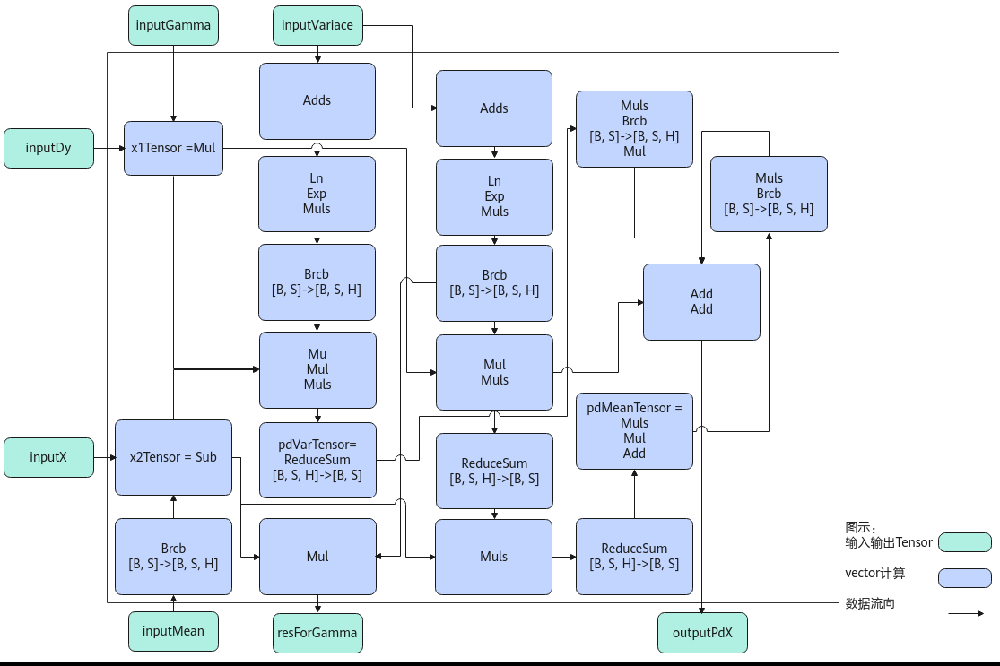

# LayerNormGrad

> **Section**: 6.2.4.4.3  
> **PDF Pages**: 2589–2593  

---

<!-- page 2589 -->

## 6.2.4.4.3 LayerNormGrad

产品支持情况

产品是否支持

Atlas 350 加速卡√

Atlas A3 训练系列产品/Atlas A3 推理系列产品√

Atlas A2 训练系列产品/Atlas A2 推理系列产品√

Atlas 200I/500 A2 推理产品x

Atlas 推理系列产品AI Core√

Atlas 推理系列产品Vector Corex

Atlas 训练系列产品x

功能说明

LayerNormGrad是一个函数，用于计算LayerNorm的反向传播梯度。该接口单独使用会输出x、resForGamma；也可以和LayerNormGradBeta配合使用，输出的resForGamma传递给LayerNormGradBeta， LayerNormGradBeta接口会输出gamma和beta，配合使用时就可以同时得到x、Gamma、beta。

算法公式为:

```cpp
pd_xl(BSH) = data_dy * data_gammapd_var(H) = np.sum(((-0.5) * pd_xl * (data_x - data_mean) * np.power((data_variance + EPSILON), (-1.5))), reduce_axis, keepdims=True)pd_mean(BS1) = np.sum(((-1.0) * pd_xl * np.power((data_variance + EPSILON), (-0.5))), reduce_axis, keepdims=True) + pd_var * (1.0 / H) * np.sum(((-2.0) * (data_x - data_mean)), reduce_axis, keepdims=True)pd_x(BSH) = pd_xl * np.power((data_variance + EPSILON), (-0.5)) + pd_var * (2.0 / H) * (data_x - data_mean) + pd_mean * (1.0 / H)res_for_gamma(BSH) = (data_x - data_mean) * np.power((data_variance + EPSILON), (-0.5))
```

实现原理

以float类型，ND格式，输入为inputDy[B, S, H], inputX[B, S, H], inputVariance[B,S], inputMean[B, S], inputGamma[H]为例，描述LayerNormGrad高阶API内部算法框图，如下图所示。

<!-- page 2590 -->

图6-88 LayerNormGrad 算法框图



计算过程分为如下几步，均在Vector上进行：

1.ComputePdX1步骤：计算inputDy*inputGamma，结果存储至x1Tensor；

2.ComputePdX2步骤：inputMean先通过Brcb将shape扩充到[B, S, H]，再计算inputX-inputMean，结果存储至x2Tensor；

3.ComputePdVar步骤：实现公式np.sum(((-0.5) * x1Tensor * x2Tensor *np.power((inputVariance + EPSILON), (-1.5))))的计算，power方法的实现通过Sqrt, Div, Mul三条基础API组合实现，结果存储至pdVarTensor；

4.ComputePdMean：实现公式np.sum(((-1.0) * x1Tensor *np.power((inputVariance + EPSILON), (-0.5)))) + pd_var * (1.0 / H) *np.sum(((-2.0) * (x2Tensor)))的计算，power方法通过Sqrt, Div两条基础API组合实现，结果存储至pdMeanTensor。同时，利用中间计算结果，根据公式x2Tensor* np.power((inputVariance + EPSILON), (-0.5))，计算出resForGamma的结果；

5.ComputePdX步骤：实现公式x1Tensor * np.power((inputVariance + EPSILON),(-0.5)) + pd_var*(2.0 / H)*(x2Tensor) + pd_mean*(1.0 / H)的计算，结果存入outputPdX。

函数原型

由于该接口的内部实现中涉及复杂的计算，需要额外的临时空间来存储计算过程中的中间变量。临时空间大小BufferSize的获取方法：通过6.2.4.4.4 LayerNormGradTiling中提供的GetLayerNormGradMaxMinTmpSize接口获取所需最大和最小临时空间大小，最小空间可以保证功能正确，最大空间用于提升性能。

临时空间支持接口框架申请和开发者通过sharedTmpBuffer入参传入两种方式，因此LayerNormGrad接口的函数原型有两种：

●通过sharedTmpBuffer入参传入临时空间template <typename T, bool isReuseSource = false>__aicore__ inline void LayerNormGrad(const LocalTensor<T>& outputPdX, const LocalTensor<T>&

<!-- page 2591 -->

```cpp
resForGamma, const LocalTensor<T>& inputDy, const LocalTensor<T>& inputX, const LocalTensor<T>& inputVariance, const LocalTensor<T>& inputMean, const LocalTensor<T>& inputGamma, LocalTensor<uint8_t>& sharedTmpBuffer, T epsilon, LayerNormGradTiling &tiling, const LayerNormGradShapeInfo& shapeInfo = {})
```

该方式下开发者需自行申请并管理临时内存空间，并在接口调用完成后，复用该部分内存，内存不会反复申请释放，灵活性较高，内存利用率也较高。

●接口框架申请临时空间template <typename T, bool isReuseSource = false>__aicore__ inline void LayerNormGrad(const LocalTensor<T>& outputPdX, const LocalTensor<T>& resForGamma, const LocalTensor<T>& inputDy, const LocalTensor<T>& inputX, const LocalTensor<T>& inputVariance, const LocalTensor<T>& inputMean, const LocalTensor<T>& inputGamma, T epsilon, LayerNormGradTiling& tiling, const LayerNormGradShapeInfo& shapeInfo = {})

该方式下开发者无需申请，但是需要预留临时空间的大小。

参数说明

表6-1179模板参数说明

参数名描述

T操作数的数据类型。

Atlas 350 加速卡，支持的数据类型为：half、float。

Atlas A3 训练系列产品/Atlas A3 推理系列产品，支持的数据类型为：half、float。

Atlas A2 训练系列产品/Atlas A2 推理系列产品，支持的数据类型为：half、float。

Atlas 推理系列产品AI Core，支持的数据类型为：half、float。

isReuseSource是否允许修改源操作数，默认值为false。如果开发者允许源操作数被改写，可以使能该参数，使能后能够节省部分内存空间。

设置为true，则本接口内部计算时复用inputX的内存空间，节省内存空间；设置为false，则本接口内部计算时不复用inputX的内存空间。

对于float数据类型输入支持开启该参数，half数据类型输入不支持开启该参数。

isReuseSource的使用样例请参考更多样例。

表6-1180接口参数说明

参数名称输入/输出含义

outputPdX输出目的操作数，shape为[B, S, H]，LocalTensor数据结构的定义请参考6.2.2.1 LocalTensor。尾轴长度需要32B对齐。

类型为LocalTensor，支持的TPosition为VECIN/VECCALC/VECOUT。

<!-- page 2592 -->

参数名称输入/输出含义

resForGamma

输出目的操作数，shape为[B, S, H]，LocalTensor数据结构的定义请参考6.2.2.1 LocalTensor。尾轴长度需要32B对齐。

类型为LocalTensor，支持的TPosition为VECIN/VECCALC/VECOUT。

inputDy输入源操作数，shape为[B, S, H]，LocalTensor数据结构的定义请参考6.2.2.1 LocalTensor。inputDy的数据类型需要与目的操作数保持一致，尾轴长度需要32B对齐。

类型为LocalTensor，支持的TPosition为VECIN/VECCALC/VECOUT。

inputX输入源操作数，shape为[B, S, H]，LocalTensor数据结构的定义请参考6.2.2.1 LocalTensor。inputX的数据类型需要与目的操作数保持一致，尾轴长度需要32B对齐。

类型为LocalTensor，支持的TPosition为VECIN/VECCALC/VECOUT。

inputVariance输入方差，shape为[B, S]，LocalTensor数据结构的定义请参考6.2.2.1 LocalTensor。inputVariance的数据类型需要与目的操作数保持一致，尾轴长度需要32B对齐。需提前调用LayerNorm接口获取方差。

类型为LocalTensor，支持的TPosition为VECIN/VECCALC/VECOUT。

inputMean输入均值，shape为[B, S]，LocalTensor数据结构的定义请参考6.2.2.1 LocalTensor。inputMean的数据类型需要与目的操作数保持一致，尾轴长度需要32B对齐。需提前调用LayerNorm接口获取均值。

类型为LocalTensor，支持的TPosition为VECIN/VECCALC/VECOUT。

inputGamma输入源操作数，shape为[H]，LocalTensor数据结构的定义请参考6.2.2.1 LocalTensor。inputGamma的数据类型需要与目的操作数保持一致，尾轴长度需要32B对齐。

类型为LocalTensor，支持的TPosition为VECIN/VECCALC/VECOUT。

sharedTmpBuffer

输入共享缓冲区，用于存放API内部计算产生的临时数据。该方式开发者可以自行管理sharedTmpBuffer内存空间，并在接口调用完成后，复用该部分内存，内存不会反复申请释放，灵活性较高，内存利用率也较高。共享缓冲区大小的获取方式请参考6.2.4.4.4 LayerNormGrad Tiling。

类型为LocalTensor，支持的TPosition为VECIN/VECCALC/VECOUT。

<!-- page 2593 -->

参数名称输入/输出含义

epsilon输入防除零的权重系数。

tiling输入LayerNormGrad计算所需Tiling信息。

shapeInfo输入表示LayerNormGrad各个输入的数据排布格式Format。默认值表示输入的Format为ND。支持的取值为DataFormat::ND。LayerNormGradShapeInfo类型，具体定义如下。struct LayerNormGradShapeInfo {    DataFormat dataFormat = DataFormat::ND;};

返回值说明

无

约束说明

●操作数地址对齐要求请参见通用地址对齐约束。

●源操作数和目的操作数的Tensor空间可以复用。

●仅支持输入shape为ND格式。

●输入数据不满足对齐要求时，开发者需要进行补齐，补齐的数据应设置为0，防止出现异常值从而影响网络计算。

●不支持对尾轴H轴的切分。

调用示例

本样例中，输入inputX和inputDy的shape为[2, 32, 16]，inputVariance和inputMean的shape为[2, 32]，inputGamma的shape为[16]。输出outputPdX和resForGamma的shape为[2, 32, 16]。数据排布均为ND格式，数据类型均为float，不复用源操作数的内存空间。

完整的调用样例可参考LayerNormGrad样例。

// outputPdX: 输出对输入 X 的梯度，即 dX，shape 为 [B, S, H]// resForGamma: 输出用于计算 gamma 和 beta 梯度的中间结果（如 dy * normalized_x），shape 为 [B, S, H]// inputDy: 输入的上层梯度 dy，shape 为 [B, S, H]// inputX: 前向传播时的输入 X，shape 为 [B, S, H]// inputVariance: 前向 LayerNorm 计算得到的方差 variance，shape 为 [B, S]// inputMean: 前向 LayerNorm 计算得到的均值 mean，shape 为 [B, S]// inputGamma: LayerNorm 中的缩放参数 gamma，shape 为 [H]// sharedTmpBuffer: 开发者管理的临时缓冲区，用于存放内部计算中的中间变量// epsilon: 防除零小量，例如 1e-5// tiling: 包含计算所需 Tiling 信息的结构体（如 block、thread 等划分）// shapeInfo: 可选参数，描述输入张量的数据排布格式，当前仅支持 ND 格式

// 使用 LayerNormGrad 接口执行 Layer Normalization 的反向传播计算：AscendC::LayerNormGrad<float, isReuseSource>(    outputPdX,        // 输出：输入梯度 dX，shape [B, S, H]    resForGamma,      // 输出：中间结果，用于计算 dgamma/dbeta    inputDy,          // 输入：上层梯度 dy，shape [B, S, H]    inputX,           // 输入：原始输入 X，shape [B, S, H]    inputVariance,    // 输入：前向计算的方差 variance，shape [B, S]    inputMean,        // 输入：前向计算的均值 mean，shape [B, S]    inputGamma,       // 输入：缩放参数 gamma，shape [H]
