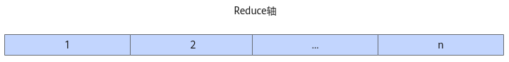
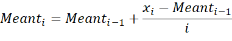
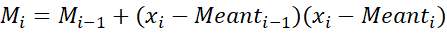
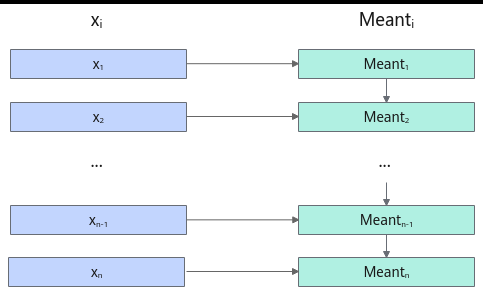

# WelfordUpdate

> **Section**: 6.2.4.4.15  
> **PDF Pages**: 2633–2637  

---

<!-- page 2633 -->

```cpp
extern "C" __global__ __aicore__ void normalize_custom(GM_ADDR x, GM_ADDR mean, GM_ADDR variance, GM_ADDR gamma, GM_ADDR beta, GM_ADDR rstd, GM_ADDR y, GM_ADDR workspace, GM_ADDR tiling) {    GET_TILING_DATA(tilingData, tiling);
    float epsilon = tilingData.epsilon;
    NormalizePara para(tilingData.aLength, tilingData.rLength, tilingData.rLengthWithPadding);
    if (TILING_KEY_IS(1)) {      if (!tilingData.isNoBeta && !tilingData.isNoGamma) {          KernelNormalize<NLCFG_NORM> op;
          op.Init(x, mean, variance, gamma, beta, rstd, y, epsilon, para);
          op.Process();      } else if (!tilingData.isNoBeta && tilingData.isNoGamma) {          KernelNormalize<NLCFG_NOGAMMA> op;
          op.Init(x, mean, variance, gamma, beta, rstd, y, epsilon, para);
          op.Process();      } else if (tilingData.isNoBeta && !tilingData.isNoGamma) {          KernelNormalize<NLCFG_NOBETA> op;
          op.Init(x, mean, variance, gamma, beta, rstd, y, epsilon, para);
          op.Process();      } else if (tilingData.isNoBeta && tilingData.isNoGamma) {          KernelNormalize<NLCFG_NOOPT> op;
          op.Init(x, mean, variance, gamma, beta, rstd, y, epsilon, para);
          op.Process();      }    }  }
```

**----结束**

## 6.2.4.4.15 WelfordUpdate

产品支持情况

产品是否支持

Atlas 350 加速卡√

Atlas A3 训练系列产品/Atlas A3 推理系列产品√

Atlas A2 训练系列产品/Atlas A2 推理系列产品√

Atlas 200I/500 A2 推理产品x

Atlas 推理系列产品AI Core√

Atlas 推理系列产品Vector Corex

Atlas 训练系列产品x

功能说明

Welford是一种在线计算均值和方差的方法。一方面，它可以在不存储所有样本的情况下，逐步计算所有样本的均值和方差，更适合处理海量数据；另一方面，它只需要对数据进行一次遍历，能减少访存次数，提高计算性能。本接口为Welford算法的前处理。

LayerNorm算法中Reduce轴较大的场景，可以通过切分Reduce轴，联合使用本接口与WelfordFinalize，实现等效计算LayerNorm。

如下图所示，切分数据的Reduce轴，假设切分后每块数据的形状为[1, k]，每块数据标号为1，2，3，…，n。

<!-- page 2634 -->

图6-89 Reduce 轴切分示意图



本接口的计算公式如下。进行上述的数据切分后，分n次调用本接口，切分后的每块数据均完成如下公式的计算。





上式中，xi、Meanti、Mi的形状均为[1, k]，xi表示切分后的第i块数据，Meanti表示第i次调用本接口得到的前i块数据的均值，Mi表示第i次调用本接口得到的前i块数据的方差中间结果（即为求方差而保存的中间计算结果，本节后续内容中写作方差中间结果）。其中，第一次调用本接口，即i=1时，公式中的Meant0和M0由用户定义为形状[1, k]、取值全0的数据。

Meantn的计算过程示意如下图，调用n次本接口后，得到形状为[1, k]的Meantn和Mn，Meantn和Mn用于后续WelfordFinalize接口的计算。

图6-90均值Meantn 计算过程示意图



函数原型

●通过sharedTmpBuffer入参传入临时空间template <typename T, typename U,bool isReuseSource = false, const WelfordUpdateConfig& config = WFUPDATE_DEFAULT_CFG>__aicore__ inline void WelfordUpdate(const LocalTensor<U>& outputMean, const LocalTensor<U>& outputVariance, const LocalTensor<U>& inputMean, const LocalTensor<U>& inputVariance, const LocalTensor<T>& inputX, const LocalTensor<uint8_t>& sharedTmpBuffer, const WelfordUpdateParam& para)

<!-- page 2635 -->

●接口框架申请临时空间template <typename T, typename U,bool isReuseSource = false, const WelfordUpdateConfig& config = WFUPDATE_DEFAULT_CFG>__aicore__ inline void WelfordUpdate(const LocalTensor<U>& outputMean, const LocalTensor<U>& outputVariance, const LocalTensor<U>& inputMean, const LocalTensor<U>& inputVariance, const LocalTensor<T>& inputX, const WelfordUpdateParam& para)

由于该接口的内部实现中涉及复杂的计算，需要额外的临时空间来存储计算过程中的中间变量。临时空间支持接口框架申请和开发者通过sharedTmpBuffer入参传入两种方式。

●接口框架申请临时空间，开发者无需申请，但是需要预留临时空间的大小。

●通过sharedTmpBuffer入参传入，使用该tensor作为临时空间进行处理，接口框架不再申请。该方式开发者可以自行管理sharedTmpBuffer内存空间，并在接口调用完成后，复用该部分内存，内存不会反复申请释放，灵活性较高，内存利用率也较高。

接口框架申请的方式，开发者需要预留临时空间；通过sharedTmpBuffer传入的情况，开发者需要为tensor申请空间。临时空间大小BufferSize的获取方式如下：通过6.2.4.4.16 WelfordUpdate Tiling中提供的GetWelfordUpdateMaxMinTmpSize接口获取所需最大和最小临时空间大小，最小空间可以保证功能正确，最大空间用于提升性能。

参数说明

表6-1200模板参数说明

参数名描述

TinputX操作数的数据类型。

Atlas 350 加速卡，支持的数据类型为：half、bfloat16_t、float

Atlas A3 训练系列产品/Atlas A3 推理系列产品，支持的数据类型为：half、float。

Atlas A2 训练系列产品/Atlas A2 推理系列产品，支持的数据类型为：half、float。

Atlas 推理系列产品AI Core，支持的数据类型为：half、float。

UoutputMean、outputVariance、inputMean、inputVariance操作数的数据类型。

Atlas 350 加速卡，支持的数据类型为：float

Atlas A3 训练系列产品/Atlas A3 推理系列产品，支持的数据类型为：float

Atlas A2 训练系列产品/Atlas A2 推理系列产品，支持的数据类型为：float

Atlas 推理系列产品AI Core，支持的数据类型为：float

isReuseSource是否允许修改源操作数，默认值为false。如果开发者允许源操作数被改写，可以使能该参数，使能后能够节省部分内存空间。

设置为true，则本接口内部计算时复用inputX的内存空间，节省内存空间；设置为false，则本接口内部计算时不复用inputX的内存空间。

在Atlas 推理系列产品AI Core中，该参数预留，传入默认值false即可。

isReuseSource的使用样例请参考更多样例。

<!-- page 2636 -->

参数名描述

config配置非指定计算范围内的目的操作数与源操作数的复用关系。WelfordUpdateConfig类型，定义如下：struct WelfordUpdateConfig {    bool isInplace = false; // 目的操作数是否复用源操作数。};

●isInplace：接口参数para中的abComputeLength参数指定了输入数据内层轴的计算长度，在该指定计算长度之外的输出数据具体为何值，通过本参数设置。本参数表示，在指定计算长度之外的目的操作数是否复用源操作数；若复用，对于指定计算长度之外的输出，直接使用对应位置的源操作数代替输出目的操作数；若不复用，则本接口不会输出计算范围外的目的操作数。

–false：默认值。表示目的操作数不复用源操作数。

–true：表示目的操作数复用源操作数。outputMean复用inputMean，outputVariance复用inputVariance。

配置示例如下：constexpr WelfordUpdateConfig WFUPDATE_DEFAULT_CFG = {false};

此参数一般用于配合kernel侧tiling计算的接口使用。

表6-1201接口参数说明

参数名输入/输出

描述

outputMean输出均值目的操作数，对应接口公式中的Meanti。

类型为LocalTensor，支持的TPosition为VECIN/VECCALC/VECOUT。

shape和源操作数inputMean需要保持一致。

outputVariance

输出方差中间结果目的操作数，对应接口公式中的Mi。

类型为LocalTensor，支持的TPosition为VECIN/VECCALC/VECOUT。

shape和源操作数inputVariance需要保持一致。

inputMean输入均值源操作数，对应接口公式中的Meanti-1。

类型为LocalTensor，支持的TPosition为VECIN/VECCALC/VECOUT。

inputVariance

输入方差中间结果源操作数，对应接口公式中的Mi-1。

类型为LocalTensor，支持的TPosition为VECIN/VECCALC/VECOUT。

inputX输入源操作数，对应接口公式中的xi。

类型为LocalTensor，支持的TPosition为VECIN/VECCALC/VECOUT。

<!-- page 2637 -->

参数名输入/输出

描述

sharedTmpBuffer

输入临时空间。

类型为LocalTensor，支持的TPosition为VECIN/VECCALC/VECOUT。

接口内部复杂计算时用于存储中间变量，由开发者提供。

临时空间大小BufferSize的获取方式请参考6.2.4.4.16WelfordUpdate Tiling。

para输入计算所需的参数信息。WelfordUpdateParam类型，定义如下。struct WelfordUpdateParam {    uint32_t rnLength;     uint32_t abLength;     uint32_t abComputeLength;     float nRec;};

●rnLength：预留参数，固定设置为1。

●abLength：Reduce轴拆分的大小。

●abComputeLength：从输入的起始地址开始的Reduce轴实际计算长度。

●nRec：取值为1/i，i为当前调用本接口的累积次数。i的取值范围为[1, n]，n为对输入数据inputX的Reduce轴切分的块数。

各目的操作数和源操作数的shape均为[rnLength,abLength]。

返回值说明

无

约束说明

●接口参数para.rnLength当前只支持取值为1；

●接口参数para.abLength的取值必须为32/sizeof(T)的整数倍；

●接口参数para.abComputeLength的取值必须大于0。

●不支持源操作数与目的操作数地址重叠。

●不支持sharedTmpBuffer与源操作数和目的操作数地址重叠。

调用示例

完整的调用样例可参考WelfordUpdate样例。

// outputMean: 输出更新后的均值 Meant，shape 为 [1, abLength]// outputVariance: 输出更新后的方差中间结果 Mi，shape 为 [1, abLength]// inputMean: 上一时刻的均值 Meant-1，作为输入// inputVariance: 上一时刻的方差中间结果 Mi-1，作为输入// inputX: 当前时间步的输入数据 xi，shape 为 [1, abLength]// sharedTmpBuffer: 开发者管理的临时空间，用于内部复杂计算// para: 包含 Reduce 轴分块信息和归一化系数的参数结构
