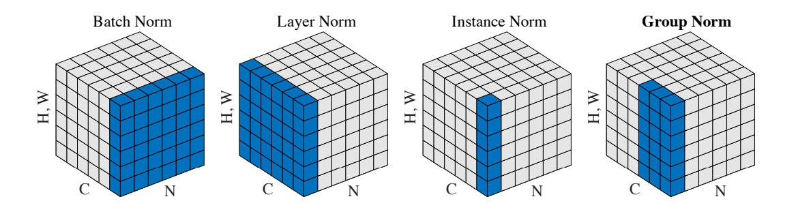

# GroupNorm

> **Section**: 6.2.4.4.19  
> **PDF Pages**: 2649–2652  

---

<!-- page 2649 -->

```cpp
GET_TILING_DATA(tilingData, tiling);
    if (TILING_KEY_IS(1))    {        if (tilingData.isCounts)        {            KernelWelfordFinalize<int32_t, true> op;
            op.Init(inputX_gm, mean_gm, var_gm, outputMean_gm, outputVariance_gm, tilingData.rnLength, tilingData.abLength, tilingData.rLength, tilingData.head, tilingData.headLength, tilingData.tail, tilingData.tailLength);
            op.Process();        }        else        {            KernelWelfordFinalize<int32_t, false> op;
            op.Init(inputX_gm, mean_gm, var_gm, outputMean_gm, outputVariance_gm, tilingData.rnLength, tilingData.abLength, tilingData.rLength, tilingData.head, tilingData.headLength, tilingData.tail, tilingData.tailLength);
            op.Process();        }    }}
```

**----结束**

## 6.2.4.4.19 GroupNorm

产品支持情况

产品是否支持

Atlas 350 加速卡√

Atlas A3 训练系列产品/Atlas A3 推理系列产品√

Atlas A2 训练系列产品/Atlas A2 推理系列产品√

Atlas 200I/500 A2 推理产品x

Atlas 推理系列产品AI Corex

Atlas 推理系列产品Vector Corex

Atlas 训练系列产品x

功能说明

对一个特征进行标准化的一般公式如下所示：


其中，i表示特征中的索引，

和

表示特征中每个值标准化前后的值，μ和σ表示特征的均值和标准差，计算公式如下所示：

<!-- page 2650 -->


其中，ε是一个很小的常数，S表示参与计算的数据的集合，m表示集合的大小。不同类型的特征标准化方法（BatchNorm、LayerNorm、InstanceNorm、GroupNorm等）的主要区别在于参与计算的数据集合的选取上。不同Norm类算子参与计算的数据集合的选取方式如下：



对于一个shape为[N, C, H, W]的输入，GroupNorm将每个[C, H, W]在C维度上分为groupNum组，然后对每一组进行标准化。最后对标准化后的特征进行缩放和平移。其中缩放参数γ和平移参数β是可训练的。


函数原型

●接口框架申请临时空间template <typename T, bool isReuseSource = false>__aicore__ inline void GroupNorm(const LocalTensor<T>& output, const LocalTensor<T>& outputMean, const LocalTensor<T>& outputVariance, const LocalTensor<T>& inputX, const LocalTensor<T>& gamma, const LocalTensor<T>& beta, const T epsilon, GroupNormTiling& tiling)

●通过sharedTmpBuffer入参传入临时空间template <typename T, bool isReuseSource = false>__aicore__ inline void GroupNorm(const LocalTensor<T>& output, const LocalTensor<T>& outputMean, const LocalTensor<T>& outputVariance, const LocalTensor<T>& inputX, const LocalTensor<T>& gamma, const LocalTensor<T>& beta, const LocalTensor<uint8_t>& sharedTmpBuffer, const T epsilon, GroupNormTiling& tiling)

<!-- page 2651 -->

参数说明

表6-1206模板参数说明

参数名描述

T操作数的数据类型。

Atlas 350 加速卡，支持的数据类型为：half、float。

Atlas A3 训练系列产品/Atlas A3 推理系列产品，支持的数据类型为：half、float。

Atlas A2 训练系列产品/Atlas A2 推理系列产品，支持的数据类型为：half、float。

isReuseSource是否允许修改源操作数，默认值为false。如果开发者允许源操作数被改写，可以使能该参数，使能后能够节省部分内存空间。

设置为true，则本接口内部计算时复用inputX的内存空间，节省内存空间；设置为false，则本接口内部计算时不复用inputX的内存空间。

对于float数据类型的输入支持开启该参数，half数据类型的输入不支持开启该参数。

isReuseSource的使用样例请参考更多样例。

表6-1207接口参数说明

参数名输入/输出

描述

output输出目的操作数，对标准化后的输入进行缩放和平移计算的结果。shape为[N, C, H, W]。

类型为LocalTensor，支持的TPosition为VECIN/VECCALC/VECOUT。

outputMean输出目的操作数，均值。shape为[N, groupNum]。

类型为LocalTensor，支持的TPosition为VECIN/VECCALC/VECOUT。

outputVariance

输出目的操作数，方差。shape为[N, groupNum]。

类型为LocalTensor，支持的TPosition为VECIN/VECCALC/VECOUT。

inputX输入源操作数。shape为[N, C, H, W]。

类型为LocalTensor，支持的TPosition为VECIN/VECCALC/VECOUT。

gamma输入源操作数，缩放参数。该参数支持的取值范围为[-100,100]。shape为[C]。

类型为LocalTensor，支持的TPosition为VECIN/VECCALC/VECOUT。

<!-- page 2652 -->

参数名输入/输出

描述

beta输入源操作数，平移参数。该参数支持的取值范围为[-100,100]。shape为[C]。

类型为LocalTensor，支持的TPosition为VECIN/VECCALC/VECOUT。

sharedTmpBuffer

输入接口内部复杂计算时用于存储中间变量，由开发者提供。

类型为LocalTensor，支持的TPosition为VECIN/VECCALC/VECOUT。

临时空间大小BufferSize的获取方式请参考6.2.4.4.20GroupNorm Tiling。

epsilon输入防除0的权重系数。数据类型需要与inputX/output保持一致。

tiling输入输入数据的切分信息，Tiling信息的获取请参考6.2.4.4.20GroupNorm Tiling。

返回值说明

无

约束说明

●操作数地址对齐要求请参见通用地址对齐约束。

●当前仅支持ND格式的输入，不支持其他格式。

调用示例

完整的调用样例可参考GroupNorm样例。

// output: 存放 GroupNorm 计算结果的 Tensor// outputMean: 输出每个 group 的均值// outputVariance: 输出每个 group 的方差// inputX: 输入数据X，shape 为 [N, C, H, W]// gamma: LayerNorm 的缩放参数 γ，shape 为 [C]// beta: LayerNorm 的偏置参数 β，shape 为 [C]// epsilon: 防除零系数ε// tiling: 预计算的 Tiling 信息，包含分组数、维度等参数

// 使用 GroupNorm 接口实现 Group Normalization// 若数据类型T为float且允许修改inputX，可设置isReuseSource = true复用inputX内存空间以节省内存AscendC::GroupNorm<T, isReuseSource>(    output,           // 输出：归一化并缩放平移后的结果    outputMean,       // 输出：每组的均值    outputVariance,   // 输出：每组的方差    inputX,           // 输入：原始特征图    gamma,            // 输入：缩放参数 γ    beta,             // 输入：偏置参数 β    epsilon,          // 输入：防止除零的系数 ε    tiling            // 输入：Tiling 调度信息);

示例结果如下：输入数据(inputXLocal, shape:[2, 8, 4, 2]): [  0  1  2  3  4  5  6  7  8  9 10 11 12 13 14 15 16 17 18 19 20 21 22 23 24 25 26 27 28 29 30 31
