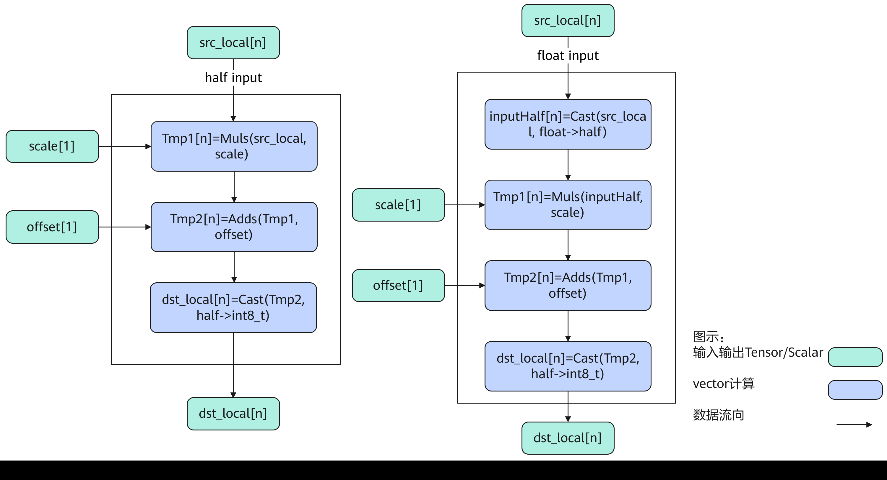
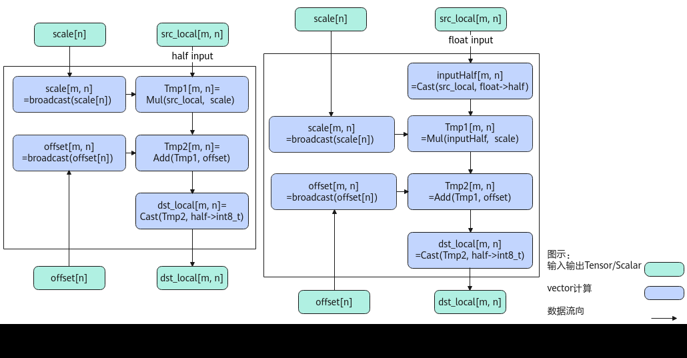
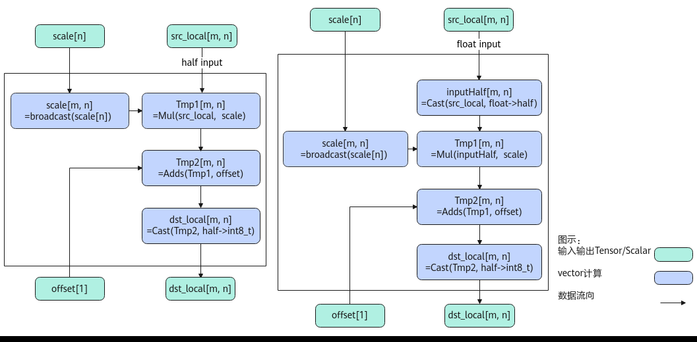
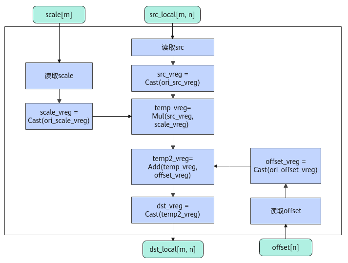
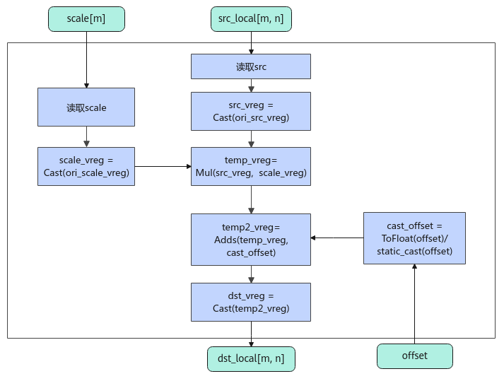

# AscendQuant

> **Section**: 6.2.4.5.1  
> **PDF Pages**: 2657–2670  

---

<!-- page 2657 -->

```cpp
op.Process();    }}
```

**----结束**

## 6.2.4.5 量化操作

## 6.2.4.5.1 AscendQuant

产品支持情况

产品是否支持

Atlas 350 加速卡√

Atlas A3 训练系列产品/Atlas A3 推理系列产品√

Atlas A2 训练系列产品/Atlas A2 推理系列产品√

Atlas 200I/500 A2 推理产品x

Atlas 推理系列产品AI Core√

Atlas 推理系列产品Vector Corex

Atlas 训练系列产品√

功能说明

按元素做量化计算，比如将half/float数据类型量化为int8_t数据类型。计算公式如下，round表示四舍六入五成双取整，cast表示舍入模式：

●PER_TENSOR量化：整个srcTensor对应一个量化参数，量化参数的shape为[1]。


●PER_CHANNEL量化：srcTensor的shape为[m, n], 每个channel维度对应一个量化参数，量化参数的shape为[n]。


●PER_TOKEN量化：srcTensor的每组token（token为n方向，共有m组token）中的元素共享一组scale和offset参数，srcTensor的shape为[m, n]时，scale和offset的shape为[m, 1]。offset是可选输入。


●

●PER_GROUP量化：这里定义group的计算方向为k方向，srcTensor在k方向上每groupSize个元素共享一组scale和offset。srcTensor的shape为[m, n]时，如果kDim=0，表示k是m方向，scale和offset的shape为[(m + groupSize - 1) /groupSize, n]；如果kDim=1，表示k是n方向，scale和offset的shape为[m，(n +groupSize - 1) / groupSize]。offset是可选输入。

<!-- page 2658 -->

根据输出数据类型的不同，当前PER_GROUP分为两种场景：fp4x2_e2m1_t/fp4x2_e1m2_t场景（后续内容中简称为float4场景）和int8_t/hifloat8_t/fp8_e5m2_t/fp8_e4m3fn_t场景（后续内容中简称为b8场景）。

–fp4x2_e2m1_t/float4_e1m2场景（float4场景）▪kDim = 0:


▪kDim = 1:


–int8_t/hifloat8_t/fp8_e5m2_t/fp8_e4m3fn_t场景（b8场景）▪kDim=0：


▪kDim=1：


实现原理

图6-91 AscendQuant 算法框图scale 和offset 都是scalar



<!-- page 2659 -->

图6-92 AscendQuant 算法框图scale 和offset 都是Tensor



图6-93 AscendQuant 算法框图scale 是Tensor&offset 是Scalar



如上图所示是AscendQuant内部算法框图，计算过程大致描述为如下几步，均在Vector上进行：

1.精度转换：当输入的src，scale或者offset是float类型时，将其转换为half类型；

2.broadcast：当输入的scale或者offset是向量时，将其broadcast成和src相同维度；

3.计算scale：当src和scale为向量时做Mul计算，当scale是scalar时做Muls计算，得到Tmp1；

4.计算offset：当Tmp1和offset为向量时做Add计算，当offset是scalar时做Adds计算，得到Tmp2；

5.精度转换：将Tmp2从half转换成int8_t类型，得到output。

<!-- page 2660 -->

图6-94 AscendQuant 算法框图PER_TOKEN/PER_GROUP 场景scale 和offset 都是tensor



图6-95 AscendQuant 算法框图PER_TOKEN/PER_GROUP 场景scale 是tensor&offset 是scalar



<!-- page 2661 -->

PER_TOKEN/PER_GROUP场景的计算逻辑如下：

1.读取数据：连续读取输入src；根据不同的场景，对输入scale和offset，采用不同的读取方式；例如，PER_TOKEN场景做Broadcast处理，PER_GROUP场景做Gather处理；

2.精度转换：根据不同输入的数据类型组合，对src/scale/offset进行相应的数据类型转换；

3.计算：对类型转换后的数据做乘加操作；

4.精度转换：将上述乘加操作得到的计算结果转换成dstT类型，得到最终输出。

函数原型

●dstTensor为int8_t数据类型

–PER_TENSOR量化：▪通过sharedTmpBuffer入参传入临时空间

○源操作数Tensor全部/部分参与计算template <typename T, bool isReuseSource = false, const AscendQuantConfig& config = ASCEND_QUANT_DEFAULT_CFG>__aicore__ inline void AscendQuant(const LocalTensor<int8_t>& dstTensor, const LocalTensor<T>& srcTensor, const LocalTensor<uint8_t>& sharedTmpBuffer, const float scale, const float offset, const uint32_t calCount)

○源操作数Tensor全部参与计算template <typename T, bool isReuseSource = false, const AscendQuantConfig& config = ASCEND_QUANT_DEFAULT_CFG>__aicore__ inline void AscendQuant(const LocalTensor<int8_t>& dstTensor, const LocalTensor<T>& srcTensor, const LocalTensor<uint8_t>& sharedTmpBuffer, const float scale, const float offset)▪接口框架申请临时空间

○源操作数Tensor全部/部分参与计算template <typename T, bool isReuseSource = false, const AscendQuantConfig& config = ASCEND_QUANT_DEFAULT_CFG>__aicore__ inline void AscendQuant(const LocalTensor<int8_t>& dstTensor, const LocalTensor<T>& srcTensor, const float scale, const float offset, const uint32_t calCount)

○源操作数Tensor全部参与计算template <typename T, bool isReuseSource = false, const AscendQuantConfig& config = ASCEND_QUANT_DEFAULT_CFG>__aicore__ inline void AscendQuant(const LocalTensor<int8_t>& dstTensor, const LocalTensor<T>& srcTensor, const float scale, const float offset)–PER_CHANNEL量化：▪通过sharedTmpBuffer入参传入临时空间

○源操作数Tensor全部/部分参与计算template <typename T, bool isReuseSource = false, const AscendQuantConfig& config = ASCEND_QUANT_DEFAULT_CFG>__aicore__ inline void AscendQuant(const LocalTensor<int8_t>& dstTensor, const LocalTensor<T>& srcTensor, const LocalTensor<uint8_t>& sharedTmpBuffer, const LocalTensor<T>& scaleTensor, const T offset, const uint32_t scaleCount, const uint32_t calCount)template <typename T, bool isReuseSource = false, const AscendQuantConfig& config = ASCEND_QUANT_DEFAULT_CFG>__aicore__ inline void AscendQuant(const LocalTensor<int8_t>& dstTensor, const LocalTensor<T>& srcTensor, const LocalTensor<uint8_t>& sharedTmpBuffer, const LocalTensor<T>& scaleTensor, const LocalTensor<T>& offsetTensor, const uint32_t scaleCount, const uint32_t offsetCount, const uint32_t calCount)

○源操作数Tensor全部参与计算

<!-- page 2662 -->

template <typename T, bool isReuseSource = false, const AscendQuantConfig& config = ASCEND_QUANT_DEFAULT_CFG>__aicore__ inline void AscendQuant(const LocalTensor<int8_t>& dstTensor, const LocalTensor<T>& srcTensor, const LocalTensor<uint8_t>& sharedTmpBuffer, const LocalTensor<T>& scaleTensor, const T offset)template <typename T, bool isReuseSource = false, const AscendQuantConfig& config = ASCEND_QUANT_DEFAULT_CFG>__aicore__ inline void AscendQuant(const LocalTensor<int8_t>& dstTensor, const LocalTensor<T>& srcTensor, const LocalTensor<uint8_t>& sharedTmpBuffer, const LocalTensor<T>& scaleTensor, const LocalTensor<T>& offsetTensor)▪接口框架申请临时空间

○源操作数Tensor全部/部分参与计算template <typename T, bool isReuseSource = false, const AscendQuantConfig& config = ASCEND_QUANT_DEFAULT_CFG>__aicore__ inline void AscendQuant(const LocalTensor<int8_t>& dstTensor, const LocalTensor<T>& srcTensor, const LocalTensor<T>& scaleTensor, const T offset, const uint32_t scaleCount, const uint32_t calCount)template <typename T, bool isReuseSource = false, const AscendQuantConfig& config = ASCEND_QUANT_DEFAULT_CFG>__aicore__ inline void AscendQuant(const LocalTensor<int8_t>& dstTensor, const LocalTensor<T>& srcTensor, const LocalTensor<T>& scaleTensor, const LocalTensor<T>& offsetTensor, const uint32_t scaleCount, const uint32_t offsetCount, const uint32_t calCount)

○源操作数Tensor全部参与计算template <typename T, bool isReuseSource = false, const AscendQuantConfig& config = ASCEND_QUANT_DEFAULT_CFG>__aicore__ inline void AscendQuant(const LocalTensor<int8_t>& dstTensor, const LocalTensor<T>& srcTensor, const LocalTensor<T>& scaleTensor, const T offset)template <typename T, bool isReuseSource = false, const AscendQuantConfig& config = ASCEND_QUANT_DEFAULT_CFG>__aicore__ inline void AscendQuant(const LocalTensor<int8_t>& dstTensor, const LocalTensor<T>& srcTensor, const LocalTensor<T>& scaleTensor, const LocalTensor<T>& offsetTensor)

●dstTensor非固定数据类型

仅支持Atlas 350 加速卡。

–PER_TENSOR量化：▪通过sharedTmpBuffer入参传入临时空间

○源操作数Tensor全部/部分参与计算template <typename dstT, typename srcT, bool isReuseSource = false>__aicore__ inline void AscendQuant(const LocalTensor<dstT>& dstTensor, const LocalTensor<srcT>& srcTensor, const LocalTensor<uint8_t>& sharedTmpBuffer, const float scale, const float offset, const uint32_t calCount)

○源操作数Tensor全部参与计算template <typename dstT, typename srcT, bool isReuseSource = false>__aicore__ inline void AscendQuant(const LocalTensor<dstT>& dstTensor, const LocalTensor<srcT>& srcTensor, const LocalTensor<uint8_t>& sharedTmpBuffer, const float scale, const float offset)▪接口框架申请临时空间

○源操作数Tensor全部/部分参与计算template <typename dstT, typename srcT, bool isReuseSource = false>__aicore__ inline void AscendQuant(const LocalTensor<dstT>& dstTensor, const LocalTensor<srcT>& srcTensor, const float scale, const float offset, const uint32_t calCount)

○源操作数Tensor全部参与计算template <typename dstT, typename srcT, bool isReuseSource = false>__aicore__ inline void AscendQuant(const LocalTensor<dstT>& dstTensor, const LocalTensor<srcT>& srcTensor, const float scale, const float offset)

<!-- page 2663 -->

–PER_CHANNEL量化：▪通过sharedTmpBuffer入参传入临时空间

○源操作数Tensor全部/部分参与计算template <typename dstT, typename srcT, bool isReuseSource = false>__aicore__ inline void AscendQuant(const LocalTensor<dstT>& dstTensor, const LocalTensor<srcT>& srcTensor, const LocalTensor<uint8_t>& sharedTmpBuffer, const LocalTensor<srcT>& scaleTensor, const srcT offset, const uint32_t scaleCount, const uint32_t calCount)template <typename dstT, typename srcT, bool isReuseSource = false>__aicore__ inline void AscendQuant(const LocalTensor<dstT>& dstTensor, const LocalTensor<srcT>& srcTensor, const LocalTensor<uint8_t>& sharedTmpBuffer, const LocalTensor<srcT>& scaleTensor, const LocalTensor<srcT>& offsetTensor, const uint32_t scaleCount, const uint32_t offsetCount, const uint32_t calCount)

○源操作数Tensor全部参与计算template <typename dstT, typename srcT, bool isReuseSource = false>__aicore__ inline void AscendQuant(const LocalTensor<dstT>& dstTensor, const LocalTensor<srcT>& srcTensor, const LocalTensor<uint8_t>& sharedTmpBuffer, const LocalTensor<srcT>& scaleTensor, const srcT offset)template <typename dstT, typename srcT, bool isReuseSource = false>__aicore__ inline void AscendQuant(const LocalTensor<dstT>& dstTensor, const LocalTensor<srcT>& srcTensor, const LocalTensor<uint8_t>& sharedTmpBuffer, const LocalTensor<srcT>& scaleTensor, const LocalTensor<srcT>& offsetTensor)▪接口框架申请临时空间

○源操作数Tensor全部/部分参与计算template <typename dstT, typename srcT, bool isReuseSource = false>__aicore__ inline void AscendQuant(const LocalTensor<dstT>& dstTensor, const LocalTensor<srcT>& srcTensor, const LocalTensor<srcT>& scaleTensor, const srcT offset, const uint32_t scaleCount, const uint32_t calCount)template <typename dstT, typename srcT, bool isReuseSource = false>__aicore__ inline void AscendQuant(const LocalTensor<dstT>& dstTensor, const LocalTensor<srcT>& srcTensor, const LocalTensor<srcT>& scaleTensor, const LocalTensor<srcT>& offsetTensor, const uint32_t scaleCount, const uint32_t offsetCount, const uint32_t calCount)

○源操作数Tensor全部参与计算template <typename dstT, typename srcT, bool isReuseSource = false>__aicore__ inline void AscendQuant(const LocalTensor<dstT>& dstTensor, const LocalTensor<srcT>& srcTensor, const LocalTensor<srcT>& scaleTensor, const srcT offset)template <typename dstT, typename srcT, bool isReuseSource = false>__aicore__ inline void AscendQuant(const LocalTensor<dstT>& dstTensor, const LocalTensor<srcT>& srcTensor, const LocalTensor<srcT>& scaleTensor, const LocalTensor<srcT>& offsetTensor)

–PER_TOKEN/PER_GROUP量化：▪通过sharedTmpBuffer入参传入临时空间

○offset操作数类型为Tensortemplate <typename dstT, typename srcT, typename scaleT, bool isReuseSource = false, const AscendQuantConfig& config, const AscendQuantPolicy& policy>__aicore__ inline void AscendQuant(const LocalTensor<dstT>& dstTensor, const LocalTensor<srcT>& srcTensor, const LocalTensor<uint8_t>& sharedTmpBuffer, const LocalTensor<scaleT>& scaleTensor, const LocalTensor<scaleT>& offsetTensor, const AscendQuantParam& para)

○offset操作数类型为scalartemplate <typename dstT, typename srcT, typename scaleT, bool isReuseSource = false, const AscendQuantConfig& config, const AscendQuantPolicy& policy>__aicore__ inline void AscendQuant(const LocalTensor<dstT>& dstTensor, const LocalTensor<srcT>& srcTensor, const LocalTensor<uint8_t>& sharedTmpBuffer, const LocalTensor<scaleT>& scaleTensor,const scaleT offset, const AscendQuantParam& para)

<!-- page 2664 -->

▪接口框架申请临时空间

○offset操作数类型为Tensortemplate <typename dstT, typename srcT, typename scaleT, bool isReuseSource = false, const AscendQuantConfig& config, const AscendQuantPolicy& policy>__aicore__ inline void AscendQuant(const LocalTensor<dstT>& dstTensor, const LocalTensor<srcT>& srcTensor, const LocalTensor<scaleT>& scaleTensor, const LocalTensor<scaleT>& offsetTensor, const AscendQuantParam& para)

○offset操作数类型为scalartemplate <typename dstT, typename srcT, typename scaleT, bool isReuseSource = false, const AscendQuantConfig& config, const AscendQuantPolicy& policy>__aicore__ inline void AscendQuant(const LocalTensor<dstT>& dstTensor, const LocalTensor<srcT>& srcTensor, const LocalTensor<scaleT>& scaleTensor, const scaleT offset, const AscendQuantParam& para)

由于该接口的内部实现中涉及复杂的数学计算，需要额外的临时空间来存储计算过程中的中间变量。临时空间支持接口框架申请和开发者通过sharedTmpBuffer入参传入两种方式。

●接口框架申请临时空间，开发者无需申请，但是需要预留临时空间的大小。

●通过sharedTmpBuffer入参传入，使用该tensor作为临时空间进行处理，接口框架不再申请。该方式开发者可以自行管理sharedTmpBuffer内存空间，并在接口调用完成后，复用该部分内存，内存不会反复申请释放，灵活性较高，内存利用率也较高。

接口框架申请的方式，开发者需要预留临时空间；通过sharedTmpBuffer传入的情况，开发者需要为sharedTmpBuffer申请空间。临时空间大小BufferSize的获取方式如下：通过6.2.4.5.2 GetAscendQuantMaxMinTmpSize中提供的GetAscendQuantMaxMinTmpSize接口获取需要预留空间的范围大小。

需要注意的是，在PER_TOKEN/PER_GROUP量化场景，内部实现不需要临时空间Buffer，对应的接口中sharedTmpBuffer为预留参数。

参数说明

表6-1210 dstTensor 为int8_t 数据类型模板参数说明

参数名描述

T操作数的数据类型。

Atlas 训练系列产品，支持的数据类型为：half、float。

Atlas A3 训练系列产品/Atlas A3 推理系列产品，支持的数据类型为：half、float。

Atlas A2 训练系列产品/Atlas A2 推理系列产品，支持的数据类型为：half、float。

Atlas 推理系列产品AI Core，支持的数据类型为：half、float。

isReuseSource是否允许修改源操作数。该参数预留，传入默认值false即可。

<!-- page 2665 -->

参数名描述

config结构体模板参数，此参数可选配，AscendQuantConfig类型，具体定义如下。struct AscendQuantConfig{uint32_t calcCount = 0;uint32_t offsetCount = 0;uint32_t scaleCount = 0;uint32_t workLocalSize = 0;};

●calcCount：实际计算数据元素个数。calcCount∈[0, srcTensor.GetSize()]，在调用带有scaleCount入参的接口时，calcCount若取非零值则必须是scaleCount的整数倍。

●offsetCount：实际量化参数元素个数。offsetCount∈[0,offsetTensor.GetSize()]，offsetCount与scaleCount的取值必须相等，要求是32的整数倍。若调用的接口不含offsetCount入参，取值为0即可。

●scaleCount：实际量化参数元素个数。scaleCount∈[0,scaleTensor.GetSize()]，要求是32的整数倍。若调用的接口不含scaleCount入参，取值为0即可。

●workLocalSize：临时缓存sharedTmpBuffer的大小，sharedTmpBuffer的大小/workLocalSize的获取方式请参考6.2.4.5.2GetAscendQuantMaxMinTmpSize。该参数取值不能大于sharedTmpBuffer的大小。若调用的接口不含sharedTmpBuffer入参，取值为0即可。

当上述参数的取值满足如下任一种场景，将使能参数常量化，即编译过程中使用常量化的相关参数，从而减少Scalar计算。

●若调用的接口不含scaleCount入参，calcCount和workLocalSize取值为非0时，使能参数常量化。

●若调用的接口带有scaleCount入参，scaleCount、calcCount和workLocalSize取值为非0时，使能参数常量化。

默认参数的配置示例如下。constexpr AscendQuantConfig ASCEND_QUANT_DEFAULT_CFG = {0, 0, 0, 0};

表6-1211 dstTensor 非固定数据类型的模板参数说明

参数名描述

dstT目的操作数的数据类型。

Atlas 350 加速卡，支持的数据类型为：int8_t、fp8_e4m3fn_t、fp8_e5m2_t、hifloat8_t、fp4x2_e1m2_t、fp4x2_e2m1_t。注意，对于fp4x2_e1m2_t、fp4x2_e2m1_t数据类型，仅在PER_GROUP场景下支持。

srcT源操作数的数据类型。

Atlas 350 加速卡，支持的数据类型为：half、bfloat16_t、float。

isReuseSource是否允许修改源操作数。该参数预留，传入默认值false即可。

<!-- page 2666 -->

表6-1212 PER_TOKEN/PER_GROUP 场景特有模板参数说明

参数名描述

scaleT量化参数scale和offset的数据类型。

Atlas 350 加速卡，支持的数据类型为：half、bfloat16_t、float。

config量化接口配置参数，AscendQuantConfig类型，具体定义如下：struct AscendQuantConfig {        bool hasOffset;        int32_t kDim = 1;        RoundMode roundMode = RoundMode::CAST_RINT;}

●hasOffset：量化参数offset是否参与计算。

–True：表示offset参数参与计算。

–False：表示offset参数不参与计算。

●kDim：group的计算方向，即k方向。仅在PER_GROUP场景有效，支持的取值如下：

–0：k轴是第0轴，即m方向为group的计算方向；

–1：k轴是第1轴，即n方向为group的计算方向。

●roundMode：量化过程中，数据由高精度数据类型转换为低精度数据类型的舍入模式，支持的取值有：CAST_NONE、CAST_RINT、CAST_ROUND、CAST_FLOOR、CAST_CEIL、CAST_TRUNC、CAST_HYBRID，各个舍入模式的详细介绍请参考精度转换规则。不同数据类型的量化支持不同的舍入模式，当量化过程中使用了不支持的舍入模式时，将回退到默认的舍入模式；例如，bfloat16_t数据类型量化为hifloat8_t数据类型时，如果配置的roundMode为不支持的CAST_RINT，实际执行量化时将回退到默认的roundMode（CAST_ROUND）。不同数据类型支持的舍入模式请见表6-1213。

policy量化策略配置参数，枚举类型，可取值如下：enum class AscendQuantPolicy : int32_t {        PER_TENSOR, // 预留参数，暂不支持        PER_CHANNEL, // 预留参数，暂不支持        PER_TOKEN, // 配置为PER_TOKEN场景        PER_GROUP,  // 配置为PER_GROUP场景        PER_CHANNEL_PER_GROUP, // 预留参数，暂不支持        PER_TOKEN_PER_GROUP // 预留参数，暂不支持}

表6-1213 PER_TOKEN/PER_GROUP 场景支持的数据类型组合

**srcDtypescaleDtype/offsetDtype**

**dstDtyperoundMode**

halfhalffp8_e5m2_t/fp8_e4m3fn_t

●CAST_RINT（默认）bfloat16_tbfloat16_t

floatfloat

halffloat

<!-- page 2667 -->

**srcDtypescaleDtype/offsetDtype**

**dstDtyperoundMode**

bfloat16_tfloat

halfhalfhifloat8_t●CAST_ROUND（默认）CAST_HYBRID

bfloat16_tbfloat16_t

floatfloat

halffloat

bfloat16_tfloat

halfhalfint8_t●CAST_RINT（默认）

bfloat16_tbfloat16_t

floatfloat

●CAST_ROUND

halffloat

●CAST_FLOOR

bfloat16_tfloat

●CAST_CEIL

halfhalffp4x2_e1m2_t/fp4x2_e2m1_t

halffloat

●CAST_TRUNC

（当前均只支持PER_GROUP场景）

bfloat16_tbfloat16_t

bfloat16_tfloat

表6-1214 PER_TENSOR 接口参数说明

参数名输入/输出

描述

dstTensor输出目的操作数。

类型为LocalTensor，支持的TPosition为VECIN/VECCALC/VECOUT。

srcTensor输入源操作数。

类型为LocalTensor，支持的TPosition为VECIN/VECCALC/VECOUT。

sharedTmpBuffer

输入临时缓存。

类型为LocalTensor，支持的TPosition为VECIN/VECCALC/VECOUT。

临时空间大小BufferSize的获取方式请参考6.2.4.5.2GetAscendQuantMaxMinTmpSize。

scale输入量化参数。

类型为Scalar，支持的数据类型为float。

offset输入量化参数。

类型为Scalar，支持的数据类型为float。

<!-- page 2668 -->

参数名输入/输出

描述

calCount输入参与计算的元素个数。

表6-1215 PER_CHANNEL 接口参数说明

参数名输入/输出

描述

dstTensor输出目的操作数。

类型为LocalTensor，支持的TPosition为VECIN/VECCALC/VECOUT。

srcTensor输入源操作数。

类型为LocalTensor，支持的TPosition为VECIN/VECCALC/VECOUT。

sharedTmpBuffer

输入临时缓存。

类型为LocalTensor，支持的TPosition为VECIN/VECCALC/VECOUT。

临时空间大小BufferSize的获取方式请参考6.2.4.5.2GetAscendQuantMaxMinTmpSize。

scaleTensor输入量化参数。

类型为LocalTensor，支持的TPosition为VECIN/VECCALC/VECOUT。

offsetTensor输入量化参数。

类型为LocalTensor，支持的TPosition为VECIN/VECCALC/VECOUT。

scaleCount输入实际量化参数元素个数，且scaleCount∈[0,min(scaleTensor.GetSize(),dstTensor.GetSize())]，要求是32的整数倍。

offsetCount输入实际量化参数元素个数，且offsetCount∈[0,min(offsetTensor.GetSize(),dstTensor.GetSize())]，并且和scaleCount必须相等，要求是32的整数倍。

calCount输入参与计算的元素个数。calCount必须是scaleCount的整数倍。

表6-1216 PER_TOKEN/PER_GROUP 接口参数说明

参数名输入/输出

描述

dstTensor输出目的操作数。

类型为LocalTensor，支持的TPosition为VECIN/VECCALC/VECOUT。

srcTensor输入源操作数。

类型为LocalTensor，支持的TPosition为VECIN/VECCALC/VECOUT。

<!-- page 2669 -->

参数名输入/输出

描述

sharedTmpBuffer

输入临时缓存。

类型为LocalTensor，支持的TPosition为VECIN/VECCALC/VECOUT。

临时空间大小BufferSize的获取方式请参考6.2.4.5.2GetAscendQuantMaxMinTmpSize。

scaleTensor输入量化参数scale。

类型为LocalTensor，支持的TPosition为VECIN/VECCALC/VECOUT。

offsetTensor/offset

输入量化参数offset。

●offsetTensor：类型为LocalTensor，支持的TPosition为VECIN/VECCALC/VECOUT。

●offset：类型为Scalar。

Atlas 350 加速卡，数据类型和scaleTensor保持一致。对于float4场景，offsetTensor/offset不生效。

para输入量化接口的参数，AscendQuantParam类型，具体定义如下：struct AscendQuantParam {        uint32_t m;        uint32_t n;         uint32_t calCount;          uint32_t groupSize = 0;}

●m：m方向元素个数。

●n：n方向元素个数。n值对应的数据大小需满足32B对齐的要求，即shape最后一维为n的输入输出均需要满足该维度上32B对齐的要求。

●calCount:参与计算的元素个数。calCount必须是n的整数倍。

●groupSize：PER_GROUP场景有效，表示groupSize行/列数据共用一个scale/offset。groupSize的取值必须大于0且是32的整倍数。

返回值说明

无

约束说明

●源操作数与目的操作数可以复用。

●操作数地址对齐要求请参见通用地址对齐约束。

●输入输出操作数参与计算的数据长度要求32B对齐。

<!-- page 2670 -->

●当Scale为float类型时，其取值范围仍为half类型的取值范围。

●Atlas 训练系列产品仅支持PER_TENSOR量化，不支持PER_CHANNEL量化。

●PER_TOKEN/PER_GROUP场景仅在Atlas 350 加速卡上支持。

●PER_TOKEN/PER_GROUP场景，连续计算方向（即n方向）的数据量要求32B对齐。

调用示例

完整的算子样例请参考quant算子样例。

●PER_TENSOR量化场景调用示例如下：// dstLocal: 存放量化计算的结果Tensor，shape为1024// srcLocal: 存放量化计算的输入Tensor，shape为1024，类型为float/half// sharedTmpBuffer: 存放量化计算过程中临时缓存的Tensor

const float scale = 0.02;  // 量化参数const float offset = 0.9; // 量化参数，dstLocal[i] = srcLocal[i] * scale + offsetuint32_t calCount = 1022;  // srcTensor的前calCount个于元素参与计算

// dstTensor为int8_t数据类型，通过sharedTmpBuffer入参传入临时空间AscendC::AscendQuant<srcType>(dstLocal, srcLocal, sharedTmpBuffer, scale, offset, calCount);

// dstTensor非固定数据类型AscendC::AscendQuant<dstType, srcType>(dstLocal, srcLocal, scale, offset, calCount);结果示例如下：

输入数据（srcLocal）: [-512. -511. -510. ...  509.  510.  511.]输入量化参数（scale）: 0.02输入量化参数（offset）: 0.9输出数据（dstLocal）: [-9 -9 -9 ... 11 51.   51.1]

●PER_CHANNEL量化场景调用示例如下：// dstLocal: 存放量化计算的结果Tensor，shape为1024// srcLocal: 存放量化计算的输入Tensor，shape为1024，类型为float/half// scaleLocal：存放量化参数的输入Tensor// offsetLocal：存放量化参数的输入Tensor// sharedTmpBuffer: 存放量化计算过程中临时缓存的Tensor

uint32_t scaleCount = 64;  // 量化参数，要求是32的整数倍uint32_t offsetCount = 64;  // 量化参数，要求与scaleCount相等uint32_t calCount = 1022;  // srcTensor的前calCount个于元素参与计算

// dstTensor为int8_t数据类型，通过sharedTmpBuffer入参传入临时空间AscendC::AscendQuant<srcType>(dstLocal, srcLocal, sharedTmpBuffer, scaleLocal, offsetLocal, scaleCount, offsetCount, calCount);

// dstTensor非固定数据类型AscendC::AscendQuant<dstType, srcType>(dstLocal, srcLocal, scaleLocal, offsetLocal, scaleCount, offsetCount, calCount);结果示例如下：

输入数据（srcLocal）: [-512. -511. -510. ...  509.  510.  511.]输入量化参数（scale）: [0.02 0.02 0.02 ... 0.02]输入量化参数（offset）: [1.01 1.02 1.03 ... 1.32]输出数据（dstLocal）: [-9 -9 -9 ... 11 510.  511.]

PER_TOKEN/PER_GROUP场景调用示例如下。

●未配置参数AscendQuantConfig的舍入模式roundMode，使用默认配置RoundMode::CAST_RINT。// 注意m,n需从外部传入constexpr static bool isReuseSource = false;constexpr static AscendQuantConfig config = {has_offset, 1};constexpr static AscendQuantPolicy policy = AscendQuantPolicy::PER_TOKEN; // 可修改枚举值以使能PER_GROUP
