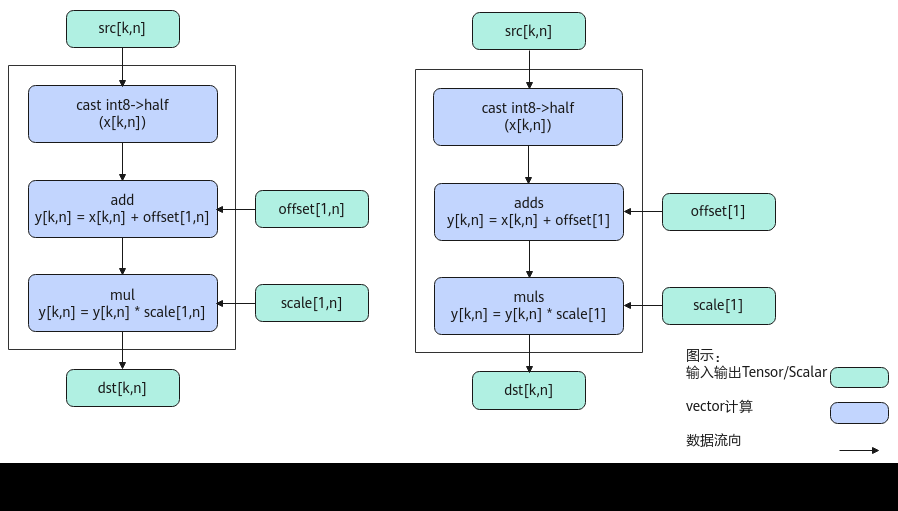
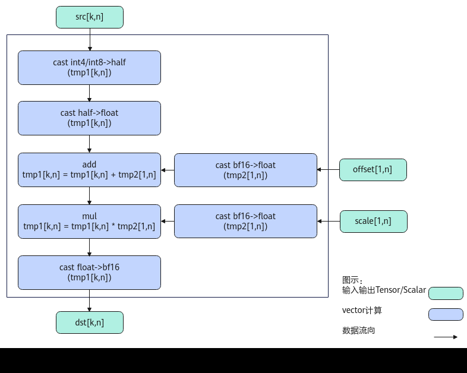
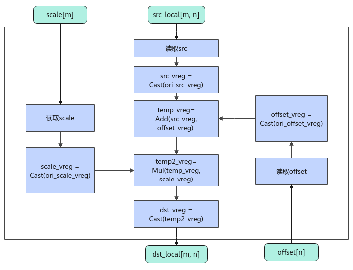

# AscendAntiQuant

> **Section**: 6.2.4.5.7  
> **PDF Pages**: 2688–2698  

---

<!-- page 2688 -->

参数说明

表6-1227参数列表

参数名输入/输出

功能

srcShape输入输入srcTensor的shape信息。

maxLiveNodeCount

输出最大存活节点数，表示临时空间是单次计算数据量所占空间的多少倍。

extraBuf输出使用的额外临时空间大小，单位为字节。

返回值说明

无

约束说明

当利用maxLiveNodeCount，extraBuf反推出的currentShapeSize * typeSize < 256B时，currentShapeSize按照256B/typeSize的值向上取整。

调用示例

std::vector<int64_t> shape_vec = {2, 1024};ge::Shape srcShape(shape_vec);uint32_t maxLiveNodeCount = 0;uint32_t extraBuf = 0;AscendC::GetAscendDequantTmpBufferFactorSize(maxLiveNodeCount, extraBuf);

## 6.2.4.5.7 AscendAntiQuant

产品支持情况

产品是否支持

Atlas 350 加速卡√

Atlas A3 训练系列产品/Atlas A3 推理系列产品√

Atlas A2 训练系列产品/Atlas A2 推理系列产品√

Atlas 200I/500 A2 推理产品x

Atlas 推理系列产品AI Core√

Atlas 推理系列产品Vector Corex

Atlas 训练系列产品x

功能说明

按元素做伪量化计算，比如将int8_t数据类型伪量化为half数据类型，计算公式如下：

<!-- page 2689 -->

●PER_CHANNEL场景（按通道量化）

–不使能输入转置

groupSize = src.shape[0] / offset.shape[0]

**dst[i][j] = scale[i / groupSize][j] * (src[i][j] + offset[i / groupSize][j])**

–使能输入转置

groupSize = src.shape[1] / offset.shape[1]

**dst[i][j] = scale[i][j / groupSize] * (src[i][j] + offset[i][j / groupSize])**

●PER_TENSOR场景（按张量量化）

**dst[i][j] = scale * (src[i][j] + offset)**

●PER_TOKEN场景（按token量化）


●PER_GROUP场景（按组量化）

根据输入数据类型的不同，当前PER_GROUP分为两种场景：fp4x2_e2m1_t/fp4x2_e1m2_t场景（后续内容中简称为float4场景）和int8_t/hifloat8_t/fp8_e5m2_t/fp8_e4m3fn_t场景（后续内容中简称为b8场景）。

–fp4x2_e2m1_t/fp4x2_e1m2_t场景（float4场景）▪groupSize可配置接口

定义group的计算方向为k方向，src在k方向上每groupSize个元素共享一组scale。src的shape为[m, n]时，如果kDim=0，表示k是m方向，scale的shape为[(m + groupSize - 1) / groupSize, n]；如果kDim=1，表示k是n方向，scale的shape为[m，(n + groupSize - 1) / groupSize]。isTranspose为True表示src，scale，dst都是转置的矩阵。

○k为m方向，即公式中i轴为group的计算方向：（kDim=0同时isTranspose=False）或者（kDim=1同时isTranspose=True）

**dst[i][j] = scale[i / groupSize][j] * src[i][j]**

○k为n方向，即公式中j轴为group的计算方向：（kDim=0同时isTranspose=True）或者（kDim=1同时isTranspose=False）

**dst[i][j] = scale[i][j / groupSize] * src[i][j]▪groupSize固定为32**

isTranspose为True表示src，scale，dst都是转置的矩阵。

○不使能输入转置（isTranspose=False）

**dst[i][j] = scale[i / groupSize][j] * src[i][j]**

○使能输入转置（isTranspose=True）

**dst[i][j] = scale[i][j / groupSize] * src[i][j]**

–int8_t/hifloat8_t/fp8_e5m2_t/fp8_e4m3fn_t场景（b8场景）

定义group的计算方向为k方向，src在k方向上每groupSize个元素共享一组scale和offset。src的shape为[m, n]时，如果kDim=0，表示k是m方向，scale和offset的shape为[(m + groupSize - 1) / groupSize, n]；如果kDim=1，表示k是n方向，scale和offset的shape为[m，(n + groupSize -1) / groupSize]。offset是可选输入。isTranspose为True表示src，scale，dst都是转置的矩阵。

<!-- page 2690 -->

▪k为m方向，即公式中i轴为group的计算方向：（kDim=0同时isTranspose=False）或者（kDim=1同时isTranspose= True）


▪k为n方向，即公式中j轴为group的计算方向：（kDim=0同时isTranspose=True）或者（kDim=1同时isTranspose =False）


实现原理

图6-98 AscendAntiQuant 算法框图



如上图所示，为AscendAntiQuant的典型场景算法框图，计算过程分为如下几步，均在Vector上进行：

1.精度转换：将输入src转换为half类型；

2.计算offset：当offset为向量时做Add计算，当offset为scalar时做Adds计算；

3.计算scale：当scale为向量时做Mul计算，当scale为scalar时做Muls计算。

<!-- page 2691 -->

图6-99 isTranspose 为False 且输出为bfloat16 的AscendAntiQuant 算法框图



在Atlas A2 训练系列产品/Atlas A2 推理系列产品上，当输出为bfloat16时，计算过程分为如下几步：

1.src精度转换：将输入的src转换为half类型，再转换为float类型，存放到tmp1；

2.offset精度转换：当输入的offset为向量时转换为float类型，存放到tmp2，为scalar时做Cast转换为float类型；

3.计算offset：当输入的offset为向量时与tmp2做Add计算，为scalar时做Adds计算；

4.scale精度转换：当输入的scale为向量时转换为float类型，存放到tmp2，为scalar时做Cast转换为float类型；

5.计算scale：当输入的scale为向量时用tmp2做Mul计算，为scalar时做Muls计算；

6.dst精度转换：将tmp1转换为bf16类型。

<!-- page 2692 -->

图6-100 AscendAntiQuant PER_TOKEN/PER_GROUP 算法框图



PER_TOKEN/PER_GROUP b8/float4场景的计算逻辑如下：

1.读取数据：连续读取输入src；根据不同的场景，对输入scale和offset，采用不同的读取方式；例如，PER_TOKEN场景做Broadcast处理，PER_GROUP场景做Gather处理；

2.精度转换：根据不同输入的数据类型组合，对src/scale/offset进行相应的数据类型转换；

3.计算：对类型转换后的数据做加乘操作；

4.精度转换：将上述加乘操作得到的计算结果转换成dstT类型，得到最终输出。

函数原型

●通过sharedTmpBuffer入参传入临时空间

–PER_CHANNEL场景（按通道量化）template <typename InputDataType, typename OutputDataType, bool isTranspose>__aicore__ inline void AscendAntiQuant(const LocalTensor<OutputDataType>& dst, const LocalTensor<InputDataType>& src, const LocalTensor<OutputDataType>& offset, const LocalTensor<OutputDataType>& scale, const LocalTensor<uint8_t>& sharedTmpBuffer, const uint32_t k, const AntiQuantShapeInfo& shapeInfo = {})–PER_CHANNEL场景（按通道量化，不带offset）template <typename InputDataType, typename OutputDataType, bool isTranspose>__aicore__ inline void AscendAntiQuant(const LocalTensor<OutputDataType>& dst, const LocalTensor<InputDataType>& src, const LocalTensor<OutputDataType>& scale, const LocalTensor<uint8_t>& sharedTmpBuffer, const uint32_t k, const AntiQuantShapeInfo& shapeInfo = {})–PER_TENSOR场景（按张量量化）template <typename InputDataType, typename OutputDataType, bool isTranspose>__aicore__ inline void AscendAntiQuant(const LocalTensor<OutputDataType>& dst, const LocalTensor<InputDataType>& src, const OutputDataType offset, const OutputDataType scale,

<!-- page 2693 -->

```cpp
const LocalTensor<uint8_t>& sharedTmpBuffer, const uint32_t k, const AntiQuantShapeInfo& shapeInfo = {})
```

–PER_TENSOR场景（按张量量化，不带offset）template <typename InputDataType, typename OutputDataType, bool isTranspose>__aicore__ inline void AscendAntiQuant(const LocalTensor<OutputDataType> &dst, const LocalTensor<InputDataType> &src, const OutputDataType scale, const LocalTensor<uint8_t> &sharedTmpBuffer, const uint32_t k, const AntiQuantShapeInfo& shapeInfo = {})

–PER_GROUP float4场景（按组量化）

仅支持Atlas 350 加速卡。template <typename InputDataType, typename OutputDataType, bool isTranspose>__aicore__ inline void AscendAntiQuant(const LocalTensor<OutputDataType>& dst, const LocalTensor<InputDataType>& src, const LocalTensor<fp8_e8m0_t>& scale, const LocalTensor<uint8_t>& sharedTmpBuffer, const uint32_t k, const AntiQuantShapeInfo& shapeInfo = {})

–PER_TOKEN/PER_GROUP b8/float4场景（按token量化）/（按组量化）

仅支持Atlas 350 加速卡。template <typename dstT, typename srcT, typename scaleT, const AscendAntiQuantConfig& config, const AscendAntiQuantPolicy& policy>__aicore__ inline void AscendAntiQuant(const LocalTensor<dstT>& dstTensor, const LocalTensor<srcT>& srcTensor, const LocalTensor<scaleT>& scaleTensor, const LocalTensor<scaleT>& offsetTensor,const LocalTensor<uint8_t>& sharedTmpBuffer, const AscendAntiQuantParam& para)

●接口框架申请临时空间

–PER_CHANNEL场景template <typename InputDataType, typename OutputDataType, bool isTranspose>__aicore__ inline void AscendAntiQuant(const LocalTensor<OutputDataType>& dst, const LocalTensor<InputDataType>& src, const LocalTensor<OutputDataType>& offset, const LocalTensor<OutputDataType>& scale, const uint32_t k, const AntiQuantShapeInfo& shapeInfo = {})

–PER_TENSOR场景template <typename InputDataType, typename OutputDataType, bool isTranspose>__aicore__ inline void AscendAntiQuant(const LocalTensor<OutputDataType>& dst, const LocalTensor<InputDataType>& src, const OutputDataType offset, const OutputDataType scale, const uint32_t k, const AntiQuantShapeInfo& shapeInfo = {})

–PER_GROUP float4场景（groupSize固定为32）

仅支持Atlas 350 加速卡。template <typename InputDataType, typename OutputDataType, bool isTranspose>__aicore__ inline void AscendAntiQuant(const LocalTensor<OutputDataType>& dst, const LocalTensor<InputDataType>& src, const LocalTensor<fp8_e8m0_t>& scale, const uint32_t k, const AntiQuantShapeInfo& shapeInfo = {})

–PER_TOKEN/PER_GROUP b8/float4场景（groupSize可配置）

仅支持Atlas 350 加速卡。template <typename dstT, typename srcT, typename scaleT, const AscendAntiQuantConfig& config, const AscendAntiQuantPolicy& policy>__aicore__ inline void AscendAntiQuant(const LocalTensor<dstT>& dstTensor, const LocalTensor<srcT>& srcTensor, const LocalTensor<scaleT>& scaleTensor, const LocalTensor<scaleT>& offsetTensor,const AscendAntiQuantParam& para)

由于该接口的内部实现中涉及复杂的数学计算，需要额外的临时空间来存储计算过程中的中间变量。临时空间支持接口框架申请和开发者通过sharedTmpBuffer入参传入两种方式。

●接口框架申请临时空间，开发者无需申请，但是需要预留临时空间的大小。

●通过sharedTmpBuffer入参传入，使用该tensor作为临时空间进行处理，接口框架不再申请。该方式开发者可以自行管理sharedTmpBuffer内存空间，并在接口调用完成后，复用该部分内存，内存不会反复申请释放，灵活性较高，内存利用率也较高。

<!-- page 2694 -->

接口框架申请的方式，开发者需要预留临时空间；通过sharedTmpBuffer传入的情况，开发者需要为sharedTmpBuffer申请空间。临时空间大小BufferSize的获取方式如下：通过6.2.4.5.8 GetAscendAntiQuantMaxMinTmpSize中提供的接口获取需要预留空间的范围大小。

参数说明

表6-1228模板参数说明

参数名描述

InputDataType输入的数据类型。

OutputDataType输出的数据类型。

isTranspose是否使能输入数据转置。

表6-1229 PER_TOKEN/PER_GROUP b8/float4 场景模板参数说明

参数名描述

dstT目的操作数的数据类型。

srcT源操作数的数据类型。

scaleT缩放因子scale参数的数据类型。

config量化接口配置参数，定义为：struct AscendAntiQuantConfig {        bool hasOffset;        bool isTranspose;        int32_t kDim = 1; };

●hasOffset：量化参数offset是否参与计算。

–True：表示offset参数参与计算。

–False：表示offset参数不参与计算。

●isTranspose：表示是否使能输入src转置。

–True：表示输入src转置。

–False：表示输入src不转置。

●kDim：group的计算方向，即k方向。仅在PER_GROUP场景有效，支持的取值如下。

–0：k轴是第0轴，即m方向为group的计算方向；

–1：k轴是第1轴，即n方向为group的计算方向。

policy量化策略配置参数，枚举类型，可取值如下：enum class AscendQuantPolicy : int32_t {        PER_TENSOR, // 预留参数，暂不支持        PER_CHANNEL, // 预留参数，暂不支持        PER_TOKEN, // 配置为PER_TOKEN场景        PER_GROUP,  // 配置为PER_GROUP场景        PER_CHANNEL_PER_GROUP, // 预留参数，暂不支持        PER_TOKEN_PER_GROUP // 预留参数，暂不支持}

<!-- page 2695 -->

表6-1230 PER_TOKEN/PER_GROUP b8/float4 场景支持的数据类型组合

**srcDtypescaleDtype/offsetDtypedstDtype**

int8_thalfhalf

bfloat16_tbfloat16_t

floatfloat

floathalf

floatbfloat16_t

hifloat8_thalfhalf

bfloat16_tbfloat16_t

floatfloat

floathalf

floatbfloat16_t

fp8_e5m2_t/fp8_e4m3fn_t

halfhalf

bfloat16_tbfloat16_t

floatfloat

floathalf

floatbfloat16_t

fp8_e8m0_thalf

fp4x2_e1m2_t/fp4x2_e2m1_t

bfloat16_t

（当前均只支持PER_GROUP场景）

表6-1231接口参数说明

参数名输入/输出

描述

dst输出目的操作数。

类型为LocalTensor，支持的TPosition为VECIN/VECCALC/VECOUT。

Atlas 350 加速卡，支持的数据类型为：half、bfloat16_t。

Atlas A3 训练系列产品/Atlas A3 推理系列产品，支持的数据类型为：half、bfloat16_t。

Atlas A2 训练系列产品/Atlas A2 推理系列产品，支持的数据类型为：half、bfloat16_t。

Atlas 推理系列产品AI Core，支持的数据类型为：half。

<!-- page 2696 -->

参数名输入/输出

描述

src输入源操作数。

类型为LocalTensor，支持的TPosition为VECIN/VECCALC/VECOUT。

Atlas 350 加速卡，PER_CHANNEL和PER_TENSOR场景下支持的数据类型为：int8_t、fp8_e4m3fn_t、fp8_e5m2_t、hifloat8_t，PER_GROUPfloat4场景下支持的数据类型为：fp4x2_e2m1_t、fp4x2_e1m2_t。

Atlas A3 训练系列产品/Atlas A3 推理系列产品，支持的数据类型为：int8_t、int4b_t。

Atlas A2 训练系列产品/Atlas A2 推理系列产品，支持的数据类型为：int8_t、int4b_t。

Atlas 推理系列产品AI Core，支持的数据类型为：int8_t。

offset输入输入数据反量化时的偏移量。

类型为LocalTensor，支持的TPosition为VECIN/VECCALC/VECOUT。

Atlas 350 加速卡，支持的数据类型为：half、bfloat16_t。

Atlas A3 训练系列产品/Atlas A3 推理系列产品，支持的数据类型为：half、bfloat16_t。

Atlas A2 训练系列产品/Atlas A2 推理系列产品，支持的数据类型为：half、bfloat16_t。

Atlas 推理系列产品AI Core，支持的数据类型为：half。

scale输入输入数据反量化时的缩放因子。

类型为LocalTensor，支持的TPosition为VECIN/VECCALC/VECOUT。

Atlas 350 加速卡，PER_CHANNEL和PER_TENSOR场景下支持的数据类型为：half、bfloat16_t。PER_GROUP float4场景下支持的数据类型为：fp8_e8m0_t。

Atlas A3 训练系列产品/Atlas A3 推理系列产品，支持的数据类型为：half、bfloat16_t。

Atlas A2 训练系列产品/Atlas A2 推理系列产品，支持的数据类型为：half、bfloat16_t。

Atlas 推理系列产品AI Core，支持的数据类型为：half。

sharedTmpBuffer

输入临时缓存。

类型为LocalTensor，支持的TPosition为VECIN/VECCALC/VECOUT。

临时空间大小BufferSize的获取方式请参考6.2.4.5.8GetAscendAntiQuantMaxMinTmpSize。

k输入isTranspose为true时，src的shape为[N,K]；isTranspose为false时，src的shape为[K,N]。

参数k对应其中的K值。

<!-- page 2697 -->

参数名输入/输出

描述

shapeInfo输入设置参数offset和scale的shape信息，仅PER_CHANNEL场景（按通道量化）需要配置。

可选参数。在PER_CHANNEL场景，如果未传入该参数或者结构体中数据设置为0，将从offset和scale的ShapeInfo中获取offset和scale的shape信息。

AntiQuantShapeInfo类型，定义如下：struct AntiQuantShapeInfo {    uint32_t offsetHeight{0};  // offset 的高    uint32_t offsetWidth{0};  // offset 的宽    uint32_t scaleHeight{0};  // scale 的高    uint32_t scaleWidth{0};  // scale 的宽};

表6-1232 PER_TOKEN/PER_GROUP b8/float4 场景接口参数说明

参数名输入/输出

描述

dstTensor输出目的操作数。

类型为LocalTensor，支持的TPosition为VECIN/VECCALC/VECOUT。

Atlas 350 加速卡，支持的数据类型为：half、bfloat16_t、float。

srcTensor输入源操作数。

类型为LocalTensor，支持的TPosition为VECIN/VECCALC/VECOUT。

Atlas 350 加速卡，支持的数据类型为：int8_t、fp8_e4m3fn_t、fp8_e5m2_t、hifloat8_t、fp4x2_e1m2_t、fp4x2_e2m1_t。注意，对于fp4x2_e1m2_t、fp4x2_e2m1_t数据类型，仅在PER_GROUP场景下支持。

sharedTmpBuffer

输入临时缓存。

类型为LocalTensor，支持的TPosition为VECIN/VECCALC/VECOUT。

临时空间大小BufferSize的获取方式请参考6.2.4.5.2GetAscendQuantMaxMinTmpSize。

Atlas 350 加速卡，支持的数据类型为：uint8_t。

scaleTensor输入量化参数scale。

类型为LocalTensor，支持的TPosition为VECIN/VECCALC/VECOUT。

Atlas 350 加速卡，支持的数据类型为：half、float、bfloat16_t、fp8_e8m0_t。

<!-- page 2698 -->

参数名输入/输出

描述

offsetTensor

输入量化参数offset。

类型为LocalTensor，支持的TPosition为VECIN/VECCALC/VECOUT。

Atlas 350 加速卡，支持的数据类型和scaleTensor保持一致。对于float4场景，offsetTensor不生效。

para输入量化接口的参数，AscendAntiQuantParam类型，具体定义如下：struct AscendAntiQuantParam {        uint32_t m;        uint32_t n;        uint32_t calCount;        uint32_t groupSize = 0;}

●m：m方向元素个数。

●n：n方向元素个数。n值对应的数据大小需满足32B对齐的要求，即shape最后一维为n的输入输出均需要满足该维度上32B对齐的要求。

●calCount:参与计算的元素个数。calCount必须是n的整数倍。

●groupSize：PER_GROUP场景有效，表示groupSize行/列数据共用一个scale/offset。groupSize的取值必须大于0且是32的整倍数。

返回值说明

无

约束说明

●不支持源操作数与目的操作数地址重叠。

●操作数地址对齐要求请参见通用地址对齐约束。

●输入输出操作数参与计算的数据长度要求32B对齐。

●输入带转置场景，k需要32B对齐。

●调用接口前，确保输入数据的size正确，offset和scale的size和shape正确。

●PER_TOKEN/PER_GROUP场景，当前仅在Atlas 350 加速卡上支持。

●PER_TOKEN/PER_GROUP b8/float4场景，连续计算方向（即n方向）的数据量要求32B对齐。

调用示例

完整的调用样例可参考AscendAntiQuant样例。

// dstLocal：结果张量// srcLocal：量化输入// offsetLocal：偏移参数// scaleLocal：缩放参数
