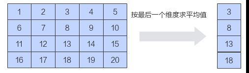
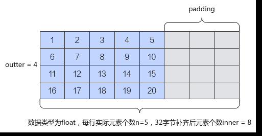

# Mean

> **Section**: 6.2.4.6.2.1  
> **PDF Pages**: 2732–2735  

---

<!-- page 2732 -->

接口输入/输出

功能

maxValue输出Sum接口能完成计算所需的最大临时空间大小，超出该值的空间不会被该接口使用。

说明

maxValue仅作为参考值，有可能大于Unified Buffer剩余空间的大小，该场景下，开发者需要根据Unified Buffer剩余空间的大小来选取合适的临时空间大小。

minValue输出Sum接口能完成计算所需最小临时空间大小。为保证功能正确，接口计算时预留/申请的临时空间不能小于该数值。

返回值说明

无

约束说明

无

调用示例

// 输入shape为2*3的矩阵，则n = 3;算子输入的数据类型为half;isReuseSource传入默认值falseuint32_t n = 3;uint32_t maxValue = 0;uint32_t minValue = 0;AscendC::GetSumMaxMinTmpSize(n, 2, false, maxValue, minValue);

## 6.2.4.6.2 Mean 接口

## 6.2.4.6.2.1 Mean

产品支持情况

产品是否支持

Atlas 350 加速卡√

Atlas A3 训练系列产品/Atlas A3 推理系列产品√

Atlas A2 训练系列产品/Atlas A2 推理系列产品√

Atlas 200I/500 A2 推理产品x

Atlas 推理系列产品AI Core√

Atlas 推理系列产品Vector Corex

Atlas 训练系列产品x

<!-- page 2733 -->

功能说明

根据最后一轴的方向对各元素求平均值。

如果输入是向量，则在向量中对各元素相加求平均；如果输入是矩阵，则沿最后一个维度对元素求平均。本接口最多支持输入为二维数据，不支持更高维度的输入。

如下图所示，对shape为(4, 5)的二维矩阵进行求平均操作，输出结果为[3， 8， 13，18]。



在了解接口具体功能之前，需要了解一些必备概念：数据的行数称之为外轴长度（outter），每行实际的元素个数称之为内轴的实际元素个数（n），内轴实际元素个数n向上32字节对齐后的元素个数称之为补齐后的内轴元素个数(inner)。本接口要求输入的内轴长度满足32字节对齐，所以当n占据的字节长度不是32字节的整数倍时，需要开发者将其向上补齐到32字节的整数倍。如下样例中，元素类型为float，每行的实际元素个数n为5，占据字节长度为20字节，不是32字节的整数倍，向上补齐后得到32字节，对应的元素个数为8。图中的padding代表补齐操作。n和inner的关系如下：inner = (n *sizeof(T) + 32 - 1) / 32 * 32 / sizeof(T)。



函数原型

●通过sharedTmpBuffer入参传入临时空间template <typename T, typename accType = T, bool isReuseSource = false, bool isBasicBlock = false, int32_t reduceDim = -1>__aicore__ inline void Mean(const LocalTensor<T>& dstTensor, const LocalTensor<T>& srcTensor, const LocalTensor<uint8_t>& sharedTmpBuffer, const MeanParams& meanParams)

●接口框架申请临时空间template <typename T, typename accType = T, bool isReuseSource = false, bool isBasicBlock = false, int32_t reduceDim = -1>

<!-- page 2734 -->

```cpp
__aicore__ inline void Mean(const LocalTensor<T>& dstTensor, const LocalTensor<T>& srcTensor, const MeanParams& meanParams)
```

由于该接口的内部实现中涉及复杂的数学计算，需要额外的临时空间来存储计算过程中的中间变量。临时空间支持开发者通过sharedTmpBuffer入参传入和接口框架申请两种方式。

●通过sharedTmpBuffer入参传入，使用该tensor作为临时空间进行处理，接口框架不再申请。该方式开发者可以自行管理sharedTmpBuffer内存空间，并在接口调用完成后，复用该部分内存，内存不会反复申请释放，灵活性较高，内存利用率也较高。

●接口框架申请临时空间，开发者无需申请，但是需要预留临时空间的大小。

通过sharedTmpBuffer传入的情况，开发者需要为tensor申请空间；接口框架申请的方式，开发者需要预留临时空间。临时空间大小BufferSize的获取方式如下：通过GetMeanMaxMinTmpSize中提供的接口获取需要预留空间范围的大小。

参数说明

表6-1253模板参数说明

参数名描述

T操作数的数据类型。

Atlas 350 加速卡，支持的数据类型为：half、float。

Atlas A3 训练系列产品/Atlas A3 推理系列产品，支持的数据类型为：half、float。

Atlas A2 训练系列产品/Atlas A2 推理系列产品，支持的数据类型为：half、float。

Atlas 推理系列产品AI Core，支持的数据类型为：half、float。

accType实际参与计算的数据类型，设置的accType精度高于输入T的情况下，在计算之前会将输入转换为accType，使用accType类型计算，计算完成后再转换为原来的数据类型。设置accType值升精度可以防止数据类型溢出。T为half时，您可以将accType设置为float，表示为输入half类型升精度至float进行计算。不支持accType精度低于输入T的情况。

isReuseSource是否允许修改源操作数。该参数预留，传入默认值false即可。

isBasicBlock预留参数，暂不支持。

reduceDim用于指定按数据的哪一维度进行求和。本接口按最后一个维度实现，不支持reduceDim参数，传入默认值-1即可。

<!-- page 2735 -->

表6-1254接口参数说明

参数名输入/输出

描述

dstTensor输出目的操作数。

类型为LocalTensor，支持的TPosition为VECIN/VECCALC/VECOUT。

输出值需要outter * sizeof(T)大小的空间进行保存。开发者要根据该大小和框架的对齐要求来为dstTensor分配实际内存空间。

srcTensor输入源操作数。

类型为LocalTensor，支持的TPosition为VECIN/VECCALC/VECOUT。

源操作数的数据类型需要与目的操作数保持一致。

输入数据shape为outter * inner。开发者需要为其开辟大小为outter *inner * sizeof(T)的空间。

sharedTmpBuffer

输入临时缓存。

类型为LocalTensor，支持的TPosition为VECIN/VECCALC/VECOUT。

用于Mean内部复杂计算时存储中间变量，由开发者提供。

临时空间大小BufferSize的获取方式请参考 GetMeanMaxMinTmpSize。

MeanParams输入srcTensor的shape信息。MeanParams类型，具体定义如下：struct MeanParams{    uint32_t outter = 1;    // 表示输入数据的外轴长度    uint32_t inner;         // 表示输入数据内轴实际元素个数32字节补齐后的元素个数，inner*sizeof(T)必须是32字节的整数倍    uint32_t n;             // 表示输入数据内轴的实际元素个数};

●MeanParams.inner*sizeof(T)必须是32字节的整数倍。

●MeanParams.inner是MeanParams.n向上32字节对齐后的值，inner =(n *sizeof(T) + 32 - 1) / 32 * 32 / sizeof(T)，因此MeanParams.n的大小应该满足：1 <= MeanParams.n <= MeanParams.inner。

返回值说明

无

约束说明

●操作数地址对齐要求请参见通用地址对齐约束。

●不支持源操作数与目的操作数地址重叠。

●不支持sharedTmpBuffer与源操作数和目的操作数地址重叠。

●当前仅支持ND格式的输入，不支持其他格式。

●对于mean，采用的方式为先求和再做除法，其求和时内部使用的底层相加方式与Sum、ReduceSum以及WholeReduceSum的内部的相加方式一致，采用二叉树方式，两两相加，可参考Sum。

调用示例

完整的算子样例请参考mean算子样例。
