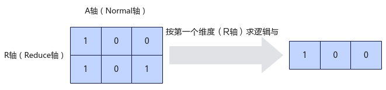
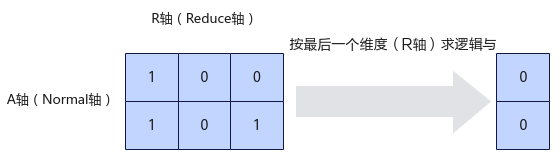

# ReduceAll

> **Section**: 6.2.4.6.9.1  
> **PDF Pages**: 2768–2771  

---

<!-- page 2768 -->

接口输入/输出

功能

maxValue输出ReduceAny接口能完成计算所需的最大临时空间大小，超出该值的空间不会被该接口使用。

说明

maxValue仅作为参考值，有可能大于Unified Buffer剩余空间的大小，该场景下，开发者需要根据Unified Buffer剩余空间的大小来选取合适的临时空间大小。

minValue输出ReduceAny接口能完成计算所需最小临时空间大小。为保证功能正确，接口计算时预留/申请的临时空间不能小于该数值。

返回值说明

无

约束说明

无

调用示例

完整的调用样例请参考6.2.4.1.49 更多样例。

// 输入shape为16*32的矩阵;算子输入的数据类型为float;不允许修改源操作数auto shape = ge::Shape({ 16, 32 });uint32_t maxValue = 0;uint32_t minValue = 0;bool isSrcInnerPad = true;bool isReuseSource = false;AscendC::GetReduceAnyMaxMinTmpSize(shape, ge::DataType::DT_FLOAT, AscendC::ReducePattern::AR, isSrcInnerPad, isReuseSource, maxValue, minValue);

## 6.2.4.6.9 ReduceAll 接口

## 6.2.4.6.9.1 ReduceAll

产品支持情况

产品是否支持

Atlas 350 加速卡√

Atlas A3 训练系列产品/Atlas A3 推理系列产品√

Atlas A2 训练系列产品/Atlas A2 推理系列产品√

Atlas 200I/500 A2 推理产品x

Atlas 推理系列产品AI Corex

Atlas 推理系列产品Vector Corex

<!-- page 2769 -->

产品是否支持

Atlas 训练系列产品x

功能说明

对一个多维向量在指定的维度求逻辑与。

定义指定计算的维度（Reduce轴）为R轴，非指定维度（Normal轴）为A轴。如下图所示，对shape为(2, 3)的二维矩阵进行运算，指定在第一维求逻辑与，输出结果为[1,0, 0]；指定在第二维求逻辑与，输出结果为[0, 0]。

图6-111 ReduceAll 按第一个维度计算示例

图6-112 ReduceAll 按最后一个维度计算示例

函数原型

●通过sharedTmpBuffer入参传入临时空间template <class T, class pattern, bool isReuseSource = false>__aicore__ inline void ReduceAll(const LocalTensor<T>& dstTensor, const LocalTensor<T>& srcTensor, const LocalTensor<uint8_t> &sharedTmpBuffer, const uint32_t srcShape[], bool srcInnerPad)

●接口框架申请临时空间template <class T, class pattern, bool isReuseSource = false>__aicore__ inline void ReduceAll(const LocalTensor<T>& dstTensor, const LocalTensor<T>& srcTensor, const uint32_t srcShape[], bool srcInnerPad)

由于该接口的内部实现中涉及复杂的数学计算，需要额外的临时空间来存储计算过程中的中间变量。临时空间支持开发者通过sharedTmpBuffer入参传入和接口框架申请两种方式。

●通过sharedTmpBuffer入参传入，使用该tensor作为临时空间进行处理，接口框架不再申请。该方式开发者可以自行管理sharedTmpBuffer内存空间，并在接口调用完成后，复用该部分内存，内存不会反复申请释放，灵活性较高，内存利用率也较高。

<!-- page 2770 -->

●接口框架申请临时空间，开发者无需申请，但是需要预留临时空间的大小。

通过sharedTmpBuffer传入的情况，开发者需要为tensor申请空间；接口框架申请的方式，开发者需要预留临时空间。临时空间大小BufferSize的获取方式如下：通过GetReduceAllMaxMinTmpSize中提供的接口获取需要预留空间范围的大小。

参数说明

表6-1275模板参数说明

参数名描述

T操作数的数据类型。

Atlas 350 加速卡，支持的数据类型为：uint8_t、float。

Atlas A3 训练系列产品/Atlas A3 推理系列产品，支持的数据类型为：uint8_t、float。

Atlas A2 训练系列产品/Atlas A2 推理系列产品，支持的数据类型为：uint8_t、float。

pattern用于指定ReduceAll计算轴，包括Reduce轴和Normal轴。pattern由与向量维度数量相同的A、R字母组合形成，字母A表示Normal轴，R表示Reduce轴。例如，AR表示对二维向量进行ReduceAll计算：第一维是Normal轴，第二维是Reduce轴，即对第二维数据求逻辑与。

pattern是定义在AscendC::Pattern::Reduce命名空间下的结构体，其成员变量用户无需关注。

pattern当前只支持取值为AR和RA，当前用户需要显式指定pattern为AscendC::Pattern::Reduce::AR或者AscendC::Pattern::Reduce::RA。

isReuseSource是否允许修改源操作数，默认值为false。如果开发者允许源操作数被改写，可以使能该参数，使能后能够节省部分内存空间。

设置为true，则本接口内部计算时复用src的内存空间，节省内存空间；设置为false，则本接口内部计算时不复用src的内存空间。

isReuseSource的使用样例请参考更多样例。

表6-1276接口参数说明

参数名输入/输出

描述

dstTensor输出目的操作数。

类型为LocalTensor，支持的TPosition为VECIN/VECCALC/VECOUT。

srcTensor输入源操作数。

类型为LocalTensor，支持的TPosition为VECIN/VECCALC/VECOUT。

源操作数的数据类型需要与目的操作数保持一致。

<!-- page 2771 -->

参数名输入/输出

描述

sharedTmpBuffer

输入临时缓存。

类型为LocalTensor，支持的TPosition为VECIN/VECCALC/VECOUT。

用于ReduceAll内部复杂计算时存储中间变量，由开发者提供。

临时空间大小BufferSize的获取方式请参考GetReduceAllMaxMinTmpSize。

srcShape输入uint32_t类型的数组，表示源操作数的shape信息。该shape的维度必须和模板参数pattern的维度一致，例如，pattern为AR，该shape维度只能是二维。

Atlas 350 加速卡，当前只支持二维shape。

Atlas A3 训练系列产品/Atlas A3 推理系列产品，当前只支持二维shape。

Atlas A2 训练系列产品/Atlas A2 推理系列产品，当前只支持二维shape。

srcInnerPad输入表示实际需要计算的最内层轴数据是否32Bytes对齐。

Atlas 350 加速卡，当前只支持true。

Atlas A3 训练系列产品/Atlas A3 推理系列产品，当前只支持true。

Atlas A2 训练系列产品/Atlas A2 推理系列产品，当前只支持true。

返回值说明

无

约束说明

●操作数地址对齐要求请参见通用地址对齐约束。

●源操作数srcTensor的输入数据只能为0或1。

●不支持源操作数与目的操作数地址重叠。

●不支持sharedTmpBuffer与源操作数和目的操作数地址重叠。

调用示例

// dstLocal：输出结果// srcLocal：输入数据// tmp：存储中间结果的临时空间// shape：输入数据的shape信息，当前仅支持2维uint32_t shape[] = { 2, 8 };// isReuse：是否允许修改源操作数srcLocal，true-允许，false-不允许constexpr bool isReuse = true;// 按尾轴求逻辑与AscendC::ReduceAll<float, AscendC::Pattern::Reduce::AR, isReuse>(dstLocal, srcLocal, tmp, shape, true);

结果示例如下：输入输出的数据类型为float输入数据(src): [[ 0.0 1.0 1.0 0.0 1.0 0.0 1.0 1.0], [ 0.0 1.0 0.0 1.0 0.0 1.0 1.0 0.0]]输入pattern：AR
