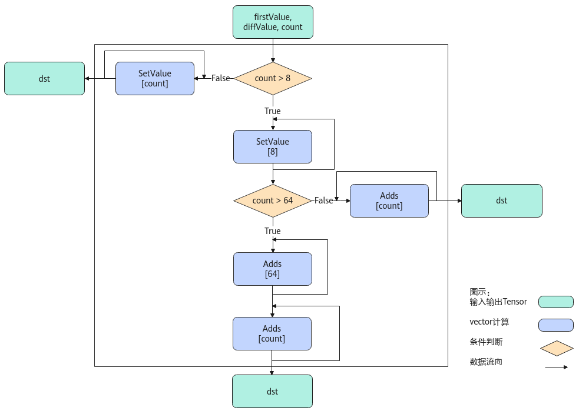

# Arange

> **Section**: 6.2.4.8.1  
> **PDF Pages**: 2827–2829  

---

<!-- page 2827 -->

[15 14 13 ... 2 1 0 31 30 29 ... 18 17 16 47 46 45 ... 34 33 32 63 62 61 ... 50 49 48]输入数据(srcIndexGm):[15 14 13 ... 2 1 0 31 30 29 ... 18 17 16 47 46 45 ... 34 33 32 63 62 61 ... 50 49 48]输出数据(dstValueGm):[63 62 61 ... 2 1 0]输出数据(dstIndexGm):[63 62 61 ... 2 1 0]

## 6.2.4.8 索引计算

## 6.2.4.8.1 Arange

产品支持情况

产品是否支持

Atlas 350 加速卡√

Atlas A3 训练系列产品/Atlas A3 推理系列产品√

Atlas A2 训练系列产品/Atlas A2 推理系列产品√

Atlas 200I/500 A2 推理产品x

Atlas 推理系列产品AI Core√

Atlas 推理系列产品Vector Corex

Atlas 训练系列产品x

功能说明

给定起始值，等差值和长度，返回一个等差数列。

实现原理

以float类型，ND格式，firstValue和diffValue输入Scalar为例，描述Arange高阶API内部算法框图，如下图所示。

<!-- page 2828 -->

图6-120 Arange 算法框图



计算过程分为如下几步，均在Vector上进行：

1.等差数列长度8以内步骤：按照firstValue和diffValue的值，使用SetValue实现等差数列扩充，扩充长度最大为8，如果等差数列长度小于8，算法结束；

2.等差数列长度8至64的步骤：对第一步中的等差数列结果使用Adds进行扩充，最大循环7次扩充至64，如果等差数列长度小于64，算法结束；

3.等差数列长度64以上的步骤：对第二步中的等差数列结果使用Adds进行扩充，不断循环直至达到等差数列长度为止。

函数原型

```cpp
template <typename T>__aicore__ inline void Arange(const LocalTensor<T>& dst, const T firstValue, const T diffValue, const int32_t count)
```

<!-- page 2829 -->

参数说明

表6-1305模板参数说明

参数名描述

T操作数的数据类型。

Atlas 350 加速卡，支持的数据类型为：int16_t、half、int32_t、float、int64_t。

Atlas A3 训练系列产品/Atlas A3 推理系列产品，支持的数据类型为：int16_t、half、int32_t、float。

Atlas A2 训练系列产品/Atlas A2 推理系列产品，支持的数据类型为：int16_t、half、int32_t、float。

Atlas 推理系列产品AI Core，支持的数据类型为：int16_t、half、int32_t、float。

表6-1306接口参数说明

参数名输入/输出

描述

dst输出目的操作数。dst的大小应大于等于count * sizeof(T)。

类型为LocalTensor，支持的TPosition为VECIN/VECCALC/VECOUT。

firstValue输入等差数列的首个元素值。

diffValue输入等差数列元素之间的差值，应大于等于0。

count输入等差数列的长度。count>0。

返回值说明

无

约束说明

当前仅支持ND格式的输入，不支持其他格式。

调用示例

完整样例请参考Arange样例。

// dst：输出Tensor// firstValue_：等差数列首个元素值// diffValue_：等差数列的公差// count_：等差数列的长度AscendC::Arange<T>(dst, static_cast<T>(firstValue_), static_cast<T>(diffValue_), count_);
