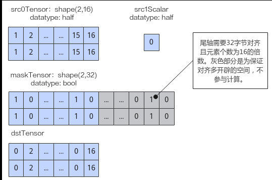
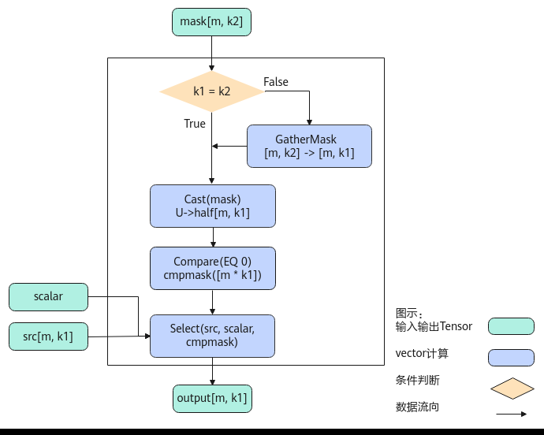
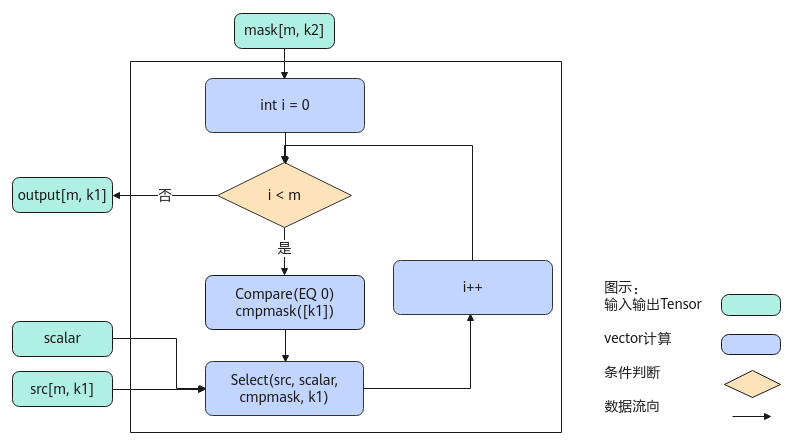

# Select

> **Section**: 6.2.4.9.1  
> **PDF Pages**: 2831–2836  

---

<!-- page 2831 -->

## 6.2.4.9.1 Select

产品支持情况

产品是否支持

Atlas 350 加速卡√

Atlas A3 训练系列产品/Atlas A3 推理系列产品√

Atlas A2 训练系列产品/Atlas A2 推理系列产品√

Atlas 200I/500 A2 推理产品x

Atlas 推理系列产品AI Core√

Atlas 推理系列产品Vector Corex

Atlas 训练系列产品x

功能说明

给定两个源操作数src0和src1，根据maskTensor相应位置的值（非bit位）选取元素，得到目的操作数dst。选择的规则为：当Mask的值为0时，从src0中选取，否则从src1选取。

该接口支持多维Shape，需满足maskTensor和源操作数Tensor的前轴（非尾轴）元素个数相同，且maskTensor尾轴元素个数大于等于源操作数尾轴元素个数，maskTensor多余部分丢弃不参与计算。

●maskTensor尾轴需32字节对齐且元素个数为16的倍数。

●源操作数Tensor尾轴需32字节对齐。

如下图样例，源操作数src0为Tensor，shape为(2,16)，数据类型为half，尾轴长度满足32字节对齐；源操作数src1为scalar，数据类型为half；maskTensor的数据类型为bool，为满足对齐要求shape为(2,32)，仅有图中蓝色部分的mask掩码生效，灰色部分不参与计算。输出目的操作数dstTensor如下图所示。

<!-- page 2832 -->

实现原理

以float类型，ND格式，shape为[m, k1]的source输入Tensor，shape为[m, k2]的mask Tensor为例，描述Select高阶API内部算法框图，如下图所示。

<!-- page 2833 -->

图6-121 Select 算法框图

计算过程分为如下几步，均在Vector上进行：

1.GatherMask步骤：如果k1, k2不相等，则根据src的shape[m, k1]，对输入mask[m, k2]通过GatherMask进行reduce计算，使得mask的k轴多余部分被舍去，shape转换为[m, k1]；

2.Cast步骤：将上一步的mask结果cast成half类型；

3.Compare步骤：使用Compare接口将上一步的mask结果与0进行比较，得到cmpmask结果；

4.Select步骤：根据cmpmask的结果，选择srcTensor相应位置的值或者scalar值，输出Output。

<!-- page 2834 -->

图6-122 Select 算法框图

对于Atlas 350 加速卡，计算过程在Vector上进行，循环m次，每次对k1个元素进行如下操作：

1.Compare步骤：使用Compare接口将mask值与0进行比较，得到cmpmask结果；

2.Select步骤：根据cmpmask的结果，选择srcTensor相应位置的值或者scalar值，输出Output。

函数原型

●src0为srcTensor（tensor类型），src1为srcScalar（scalar类型）template <typename T, typename U, bool isReuseMask = true>__aicore__ inline void Select(const LocalTensor<T>& dst, const LocalTensor<T>& src0, T src1, const LocalTensor<U>& mask, const LocalTensor<uint8_t>& sharedTmpBuffer, const SelectWithBytesMaskShapeInfo& info)

●src0为srcScalar（scalar类型），src1为srcTensor（tensor类型）template <typename T, typename U, bool isReuseMask = true>__aicore__ inline void Select(const LocalTensor<T>& dst, T src0, const LocalTensor<T>& src1, const LocalTensor<U>& mask, const LocalTensor<uint8_t>& sharedTmpBuffer, const SelectWithBytesMaskShapeInfo& info)

该接口需要额外的临时空间来存储计算过程中的中间变量。临时空间需要开发者申请并通过sharedTmpBuffer入参传入。临时空间大小BufferSize的获取方式如下：通过6.2.4.9.2 GetSelectMaxMinTmpSize中提供的接口获取需要预留空间范围的大小。

<!-- page 2835 -->

参数说明

表6-1308模板参数说明

参数名描述

T操作数的数据类型。

Atlas 350 加速卡，支持的数据类型为：half、float。

Atlas A3 训练系列产品/Atlas A3 推理系列产品，支持的数据类型为：half、float。

Atlas A2 训练系列产品/Atlas A2 推理系列产品，支持的数据类型为：half、float。

Atlas 推理系列产品AI Core，支持的数据类型为：half、float。

U掩码Tensor mask的数据类型。

Atlas 350 加速卡，支持的数据类型为：bool、int8_t、uint8_t、int16_t、uint16_t、int32_t、uint32_t。

Atlas A3 训练系列产品/Atlas A3 推理系列产品，支持的数据类型为：bool、int8_t、uint8_t、int16_t、uint16_t、int32_t、uint32_t。

Atlas A2 训练系列产品/Atlas A2 推理系列产品，支持的数据类型为：bool、int8_t、uint8_t、int16_t、uint16_t、int32_t、uint32_t。

Atlas 推理系列产品AI Core，支持的数据类型为：bool、int8_t、uint8_t、int16_t、uint16_t、int32_t、uint32_t。

isReuseMask是否允许修改maskTensor。默认为true。

取值为true时，仅在maskTensor尾轴元素个数和srcTensor尾轴元素个数不同的情况下，maskTensor可能会被修改；其余场景，maskTensor不会修改。

取值为false时，任意场景下，maskTensor均不会修改，但可能会需要更多的临时空间。

表6-1309接口参数说明

参数名称输入/输出

含义

dst输出目的操作数。

类型为LocalTensor，支持的TPosition为VECIN/VECCALC/VECOUT。

src0(srcTensor)

输入源操作数。源操作数Tensor尾轴需32字节对齐。

类型为LocalTensor，支持的TPosition为VECIN/VECCALC/VECOUT。

src1(srcTensor)

src1(srcScalar)

输入源操作数。类型为scalar。

src0(srcScalar)

<!-- page 2836 -->

参数名称输入/输出

含义

mask输入掩码Tensor。用于描述如何选择srcTensor和srcScalar之间的值。maskTensor尾轴需32字节对齐且元素个数为16的倍数。

●src0为srcTensor（tensor类型），src1为srcScalar（scalar类型）若mask的值为0，选择srcTensor相应的值放入dstLocal，否则选择srcScalar的值放入dstLocal。

●src0为srcScalar（scalar类型），src1为srcTensor（tensor类型）若mask的值为0，选择srcScalar的值放入dstLocal，否则选择srcTensor相应的值放入dstLocal。

sharedTmpBuffer

输入该API用于计算的临时空间，所需空间大小根据6.2.4.9.2GetSelectMaxMinTmpSize获取。

info输入描述SrcTensor和maskTensor的shape信息。SelectWithBytesMaskShapeInfo类型，定义如下：struct SelectWithBytesMaskShapeInfo {__aicore__ SelectShapeInfo(){};uint32_t firstAxis = 0;    uint32_t srcLastAxis = 0; uint32_t maskLastAxis = 0;};

●firstAxis：srcLocal/maskTensor的前轴元素个数。

●srcLastAxis：srcLocal的尾轴元素个数。

●maskLastAxis：maskTensor的尾轴元素个数。

注意：

●需要满足srcTensor和maskTensor的前轴元素个数相同，均为firstAxis。

●需要满足firstAxis * srcLastAxis = srcTensor.GetSize() ；firstAxis * maskLastAxis = maskTensor.GetSize()。

●maskTensor尾轴的元素个数大于等于srcTensor尾轴的元素个数，计算时会丢弃maskTensor多余部分，不参与计算。

返回值说明

无

约束说明

●源操作数与目的操作数可以复用。

●操作数地址对齐要求请参见通用地址对齐约束。

●maskTensor尾轴元素个数和源操作数尾轴元素个数不同的情况下， maskTensor的数据有可能被接口改写。
