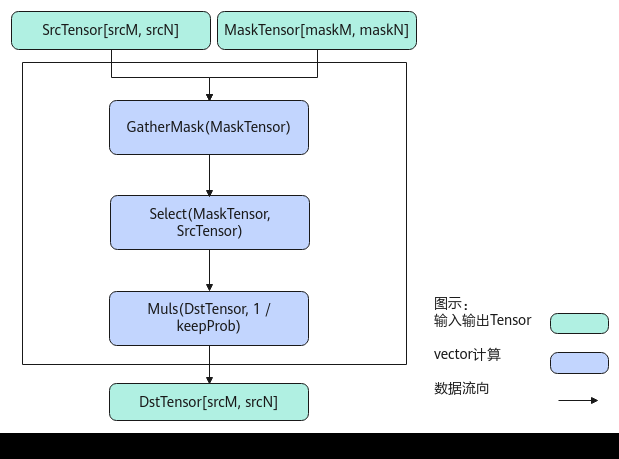
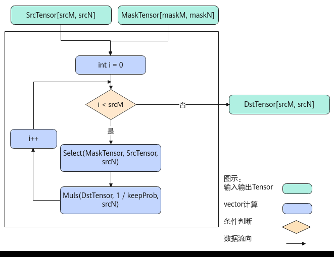

# DropOut

> **Section**: 6.2.4.9.3  
> **PDF Pages**: 2839–2844  

---

<!-- page 2839 -->

返回值说明

GetSelectMinTmpSize返回Select接口能完成计算所需最小临时空间大小。

GetSelectMaxTmpSize返回Select接口能完成计算所需最大临时空间大小。

GetSelectMaxMinTmpSize无返回值。

约束说明

无

调用示例

std::vector<int64_t> shape0Vec = {64, 128};std::vector<int64_t> shape1Vec = {1};std::vector<int64_t> mask1Vec = {64, 128};ge::Shape src0Shape(shape0Vec);ge::Shape src1Shape(shape1Vec);ge::Shape maskShape(mask1Vec);uint32_t maxValue = 0;uint32_t minValue = 0;AscendC::GetSelectMaxMinTmpSize(src0Shape, src1Shape, 2, maskShape, 1, false, maxValue, minValue);

## 6.2.4.9.3 DropOut

产品支持情况

产品是否支持

Atlas 350 加速卡√

Atlas A3 训练系列产品/Atlas A3 推理系列产品√

Atlas A2 训练系列产品/Atlas A2 推理系列产品√

Atlas 200I/500 A2 推理产品x

Atlas 推理系列产品AI Core√

Atlas 推理系列产品Vector Corex

Atlas 训练系列产品x

功能说明

提供根据MaskTensor对SrcTensor（源操作数，输入Tensor）进行过滤的功能，得到DstTensor（目的操作数、输出Tensor）。仅支持输入shape为ND格式。

该过滤功能包括两种模式，字节模式和比特模式。

●字节模式

MaskTensor中存储的数值为布尔类型，每个布尔数值代表是否取用SrcTensor对应位置的数值：如果是，则选取SrcTensor中的数值存入DstTensor；否则，对DstTensor中的对应位置赋值为零。DstTensor，SrcTensor和MaskTensor的shape相同。示例如下：

**SrcTensor=[1，2，3，4，5，6，7，8，9，10]**

<!-- page 2840 -->

**MaskTensor=[1，0，1，0，1，0，0，1，1，0]（每个数的数据类型为uint8_t）**

**DstTensor=[1，0，3，0，5，0，0，8，9，0]**

●比特模式

MaskTensor的每个bit数值，代表是否取用SrcTensor对应位置的数值：如果是，则选取SrcTensor中的数值存入DstTensor；否则，对DstTensor中的对应位置赋值为零。SrcTensor和DstTensor的shape相同，假设均为[height ， width]，MaskTensor的shape为[height ， (width / 8)]。示例如下：

**SrcTensor=[1，2，3，4，5，6，7，8]**

**MaskTensor=[169]（转换为二进制表示为1010 1001）**

**DstTensor=[1，0，3，0，5，0，0，8]**

–特殊情况1：当MaskTensor有效数据非连续存放时，MaskTensor的width轴，为了满足32B对齐，需要填充无效数值，SrcTensor的width轴，需满足32Byte对齐。示例如下：

SrcTensor=[1，2，3，4，5，6，7，8，11，12，13，14，15，16，17，18]

MaskTensor=[1，0，1，0，1，0，0，1，X，X，1，0，1，0，1，0，0，1，X，X]（X为无效数值，假设数据已满足对齐要求，示例数值为二进制形式表示）

DstTensor=[1，0，3，0，5，0，0，8，11，0， 13， 0， 15， 0， 0，18]

–特殊情况2：当MaskTensor有效数据连续存放，maskTensor_size不满足32B对齐时，需要在MaskTensor的尾部补齐32B对齐时，对应SrcTensor的尾部也需要补充无效数据，使得srcTensor_size满足32B对齐。示例如下：

SrcTensor=[1，2，3，4，5，6，7，8，11，12，13，14，15，16，17，18]

MaskTensor=[1，0，1，0，1，0，0，1， 1， 0， 1， 0， 1， 0， 0，1，X，X，X，X]（X为无效数值，假设数据已满足对齐要求，示例数值为二进制形式表示）

DstTensor= [1，0，3，0，5，0，0，8， 11， 0， 13， 0， 15， 0， 0，18]

实现原理

以float类型，ND格式，shape为[srcM, srcN]的SrcTensor，shape为[maskM, maskN]的MaskTensor，比特模式场景为例，描述Dropout高阶API内部算法框图，如下图所示。

<!-- page 2841 -->

图6-123 Dropout 算法框图



计算过程分为如下几步，均在Vector上进行：

1.GatherMask步骤：对输入的MaskTensor做脏数据清理，使得MaskTensor中只保留有效数据；

2.Select步骤：根据输入的MaskTensor对SrcTensor做数据选择，被选中的数据位置，保留原始数据，对舍弃的数据位置，设置为0；

3.Muls步骤：将输出数据每个元素除以keepProb。

<!-- page 2842 -->

图6-124 Dropout 算法框图



对于Atlas 350 加速卡，计算过程在Vector上进行，循环srcM次，每次对srcN个元素进行如下操作：

1.Select步骤：根据输入的MaskTensor对SrcTensor做数据选择，被选中的数据位置，保留原始数据，对舍弃的数据位置，设置为0；

2.Muls步骤：将输出数据每个元素除以keepProb。

函数原型

```cpp
template <typename T, bool isInitBitMode = false, uint32_t dropOutMode = 0>__aicore__ inline void DropOut(const LocalTensor<T>& dstLocal, const LocalTensor<T>& srcLocal, const LocalTensor<uint8_t>& maskLocal, const float keepProb, const DropOutShapeInfo& info)template <typename T, bool isInitBitMode = false, uint32_t dropOutMode = 0>__aicore__ inline void DropOut(const LocalTensor<T>& dstLocal, const LocalTensor<T>& srcLocal, const LocalTensor<uint8_t>& maskLocal, const LocalTensor<uint8_t>& sharedTmpBuffer, const float keepProb, const DropOutShapeInfo& info)
```

<!-- page 2843 -->

参数说明

表6-1311模板参数说明

参数名描述

T操作数的数据类型。

Atlas 350 加速卡，支持的数据类型为：half、bfloat16_t、float。

Atlas A3 训练系列产品/Atlas A3 推理系列产品，支持的数据类型为：half、float。

Atlas A2 训练系列产品/Atlas A2 推理系列产品，支持的数据类型为：half、float。

Atlas 推理系列产品AI Core，支持的数据类型为：half、float。

isInitBitMode在比特模式下，是否需要在接口内部初始化（默认false）。

dropOutMode选择执行何种输入场景：

0：默认值，由接口根据输入shape推断运行模式，注意，推断不符合预期的场景，需设置对应模式

1：执行字节模式，且maskLocal含有脏数据

2：执行字节模式，且maskLocal不含有脏数据

3：执行比特模式，且maskLocal不含有脏数据

4：执行比特模式，且maskLocal含有脏数据

表6-1312接口参数说明

参数名称输入/输出

含义

dstLocal输出目的操作数。

类型为LocalTensor，支持的TPosition为VECIN/VECCALC/VECOUT。

srcLocal输入源操作数。

类型为LocalTensor，支持的TPosition为VECIN/VECCALC/VECOUT。

srcLocal的数据类型需要与目的操作数保持一致。

maskLocal

输入存放mask的Tensor，数据类型为uint8_t。

类型为LocalTensor，支持的TPosition为VECIN/VECCALC/VECOUT。

<!-- page 2844 -->

参数名称输入/输出

含义

sharedTmpBuffer

输入共享缓冲区，用于存放API内部计算产生的临时数据。该方式开发者可以自行管理sharedTmpBuffer内存空间，并在接口调用完成后，复用该部分内存。Tensor的大小应符合对应tiling的要求，配合tiling一起使用。共享缓冲区大小BufferSize的获取方式请参考GetDropOutMaxMinTmpSize。

类型为LocalTensor，支持的TPosition为VECIN/VECCALC/VECOUT。

keepProb

输入权重系数，数据类型为float，srcLocal中数据被保留的概率，过滤后的结果会除以权重系数，存放至dstLocal中。

keepProb∈(0，1)

info输入DropOutShapeInfo类型，DropOutShapeInfo结构定义如下：struct DropOutShapeInfo {__aicore__ DropOutShapeInfo(){};uint32_t firstAxis = 0;   // srcLocal/maskTensor的height轴元素个数uint32_t srcLastAxis = 0; // srcLocal的width轴元素个数uint32_t maskLastAxis = 0;// maskTensor的width轴元素个数（如有数据补齐场景，则为带有脏数据的长度，注意，所有模式的元素个数均为对应Tensor类型下的个数，取值需要大于0，如uint8类型Tensor对应Uint8类型元素个数）};

返回值说明

无

约束说明

●srcTensor和dstTensor的Tensor空间可以复用。

●srcLocal和dstLocal地址对齐要求请见：6.2.1 通用说明和约束。

●仅支持输入shape为ND格式。

●maskLocal含有脏数据的场景，要求info.maskLastAxis中有效数值的个数，应为2的整数倍。

●maskLocal含有脏数据的场景，maskLocal中的数据可能会被修改，脏数据可能会被舍弃。

调用示例

完整的算子样例请参考DropOut样例。

// yLocal：DropOut结果// xLocal：输入数据// maskLocal：过滤掩码// sharedTmpBuffer：临时空间// probValue：srcLocal中数据被保留的概率，过滤后的结果会除以权重系数，存放至dstLocal中// info：DropOutShapeInfo类型AscendC::DropOutShapeInfo info;float probValue = 0.5;info.firstAxis = tilingData.firstAxis / tilingData.tileNum;info.srcLastAxis = tileLength;
