# Transpose

> **Section**: 6.2.4.10.1  
> **PDF Pages**: 2847–2863  

---

<!-- page 2847 -->

```cpp
return ge::GRAPH_SUCCESS;}} // namespace optiling
```

## 6.2.4.10 张量变换

## 6.2.4.10.1 Transpose

产品支持情况

产品是否支持

Atlas 350 加速卡√

Atlas A3 训练系列产品/Atlas A3 推理系列产品√

Atlas A2 训练系列产品/Atlas A2 推理系列产品√

Atlas 200I/500 A2 推理产品x

Atlas 推理系列产品AI Core√

Atlas 推理系列产品Vector Corex

Atlas 训练系列产品x

功能说明

对输入数据进行数据排布及Reshape操作，具体功能如下：

【场景1：NZ2ND，1、2轴互换】

输入Tensor { shape:[B, N, H/N/16, S/16, 16, 16], origin_shape:[B, N, S, H/N],format:"NZ", origin_format:"ND"}

输出Tensor { shape:[B, S, N, H/N], origin_shape:[B, S, N, H/N], format:"ND",origin_format:"ND"}

<!-- page 2848 -->

图6-125场景1 数据排布变换

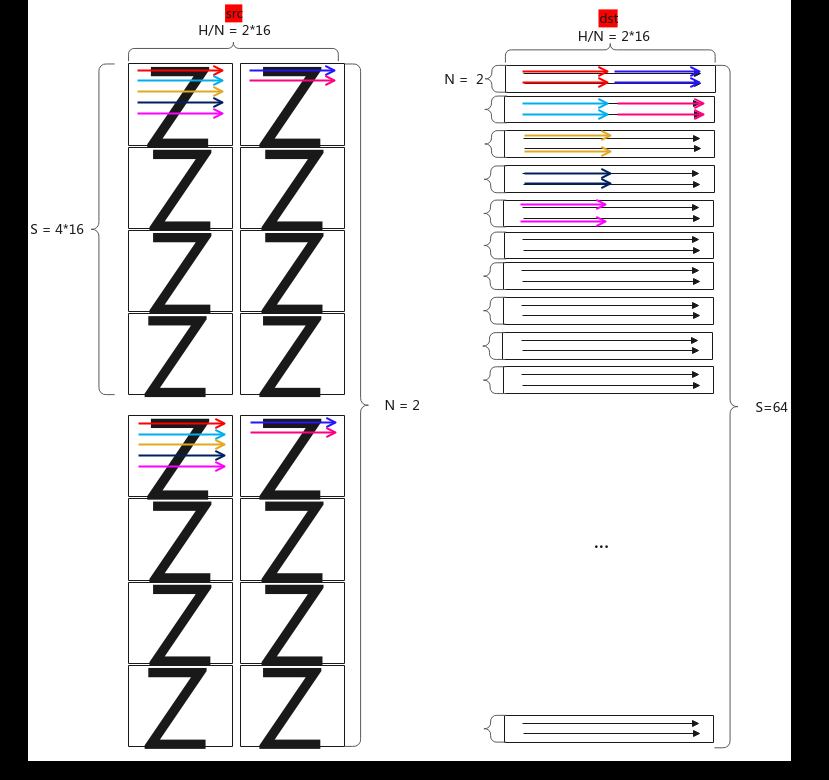

【场景2：NZ2NZ，1、2轴互换】

输入Tensor { shape:[B, N, H/N/16, S/16, 16, 16], origin_shape:[B, N, S, H/N],format:"NZ", origin_format:"ND"}

输出Tensor { shape:[B, S, H/N/16, N/16, 16, 16], origin_shape:[B, S, N, H/N],format:"NZ", origin_format:"ND"}

<!-- page 2849 -->

图6-126场景2 数据排布变换

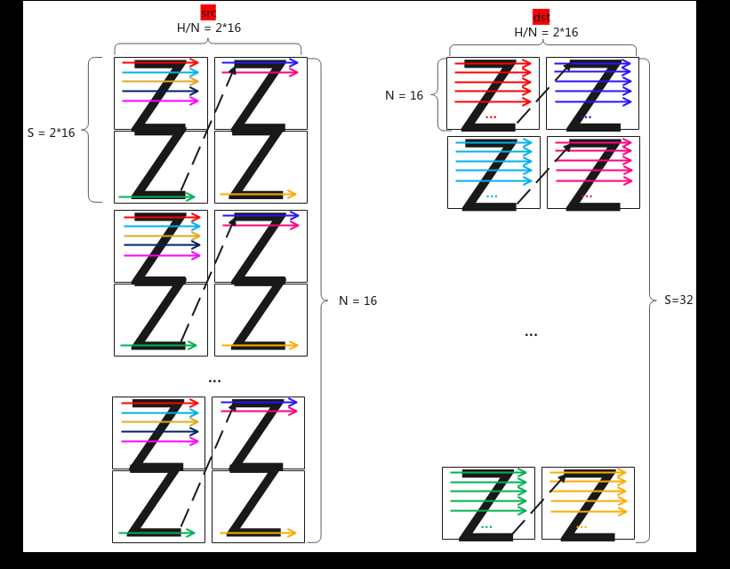

【场景3：NZ2NZ，尾轴切分】

输入Tensor { shape:[B, H / 16, S / 16, 16, 16], origin_shape:[B, S, H], format:"NZ",origin_format:"ND"}

输出Tensor { shape:[B, N, H/N/16, S / 16, 16, 16], origin_shape:[B, N, S, H/N],format:"NZ", origin_format:"ND"}

图6-127场景3 数据排布变换

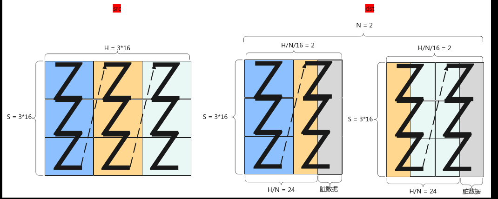

【场景4：NZ2ND，尾轴切分】

输入Tensor { shape:[B, H / 16, S / 16, 16, 16], origin_shape:[B, S, H], format:"NZ",origin_format:"ND"}

<!-- page 2850 -->

输出Tensor { shape:[B, N, S, H/N], origin_shape:[B, N, S, H/N], format:"ND",origin_format:"ND"}

图6-128场景4 数据排布变换

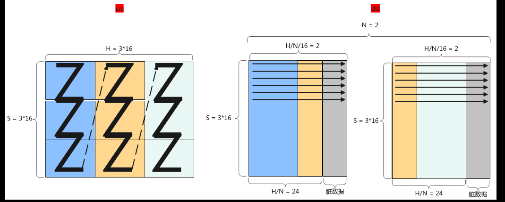

【场景5：NZ2ND，尾轴合并】

输入Tensor { shape:[B, N, H/N/16, S/16, 16, 16], origin_shape:[B, N, S, H/N],format:"NZ", origin_format:"ND"}

输出Tensor { shape:[B, S, H], origin_shape:[B, S, H], format:"ND",origin_format:"ND"}

图6-129场景5 数据排布变换

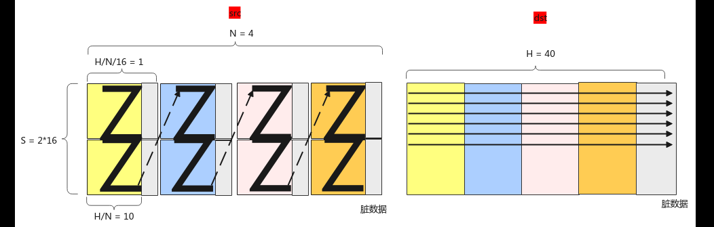

【场景6：NZ2NZ，尾轴合并】

输入Tensor { shape:[B, N, H/N/16, S/16, 16, 16], origin_shape:[B, N, S, H/N],format:"NZ", origin_format:"ND"}

输出Tensor { shape:[B, H/16, S/16, 16, 16], origin_shape:[B, S, H], format:"NZ",origin_format:"ND"}

<!-- page 2851 -->

图6-130场景6 数据排布变换

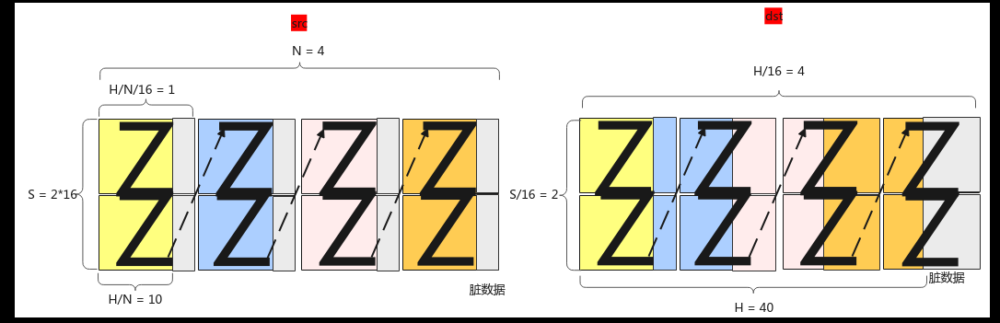

【场景7：二维转置】

支持在UB上对二维Tensor进行转置，其中srcShape中的H、W均是16的整倍。

图6-131场景7 数据排布变换

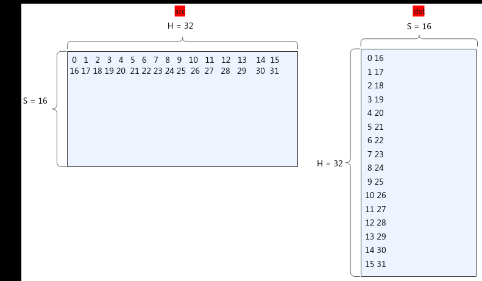

【场景13：二维转置或者三维的后两维转置】

支持在UB上对二维Tensor进行转置或者对三维Tensor的最后两维进行转置，二维Tensor转置同场景7的数据排布变换。

<!-- page 2852 -->

图6-132场景13 三维Tensor 数据排布变换

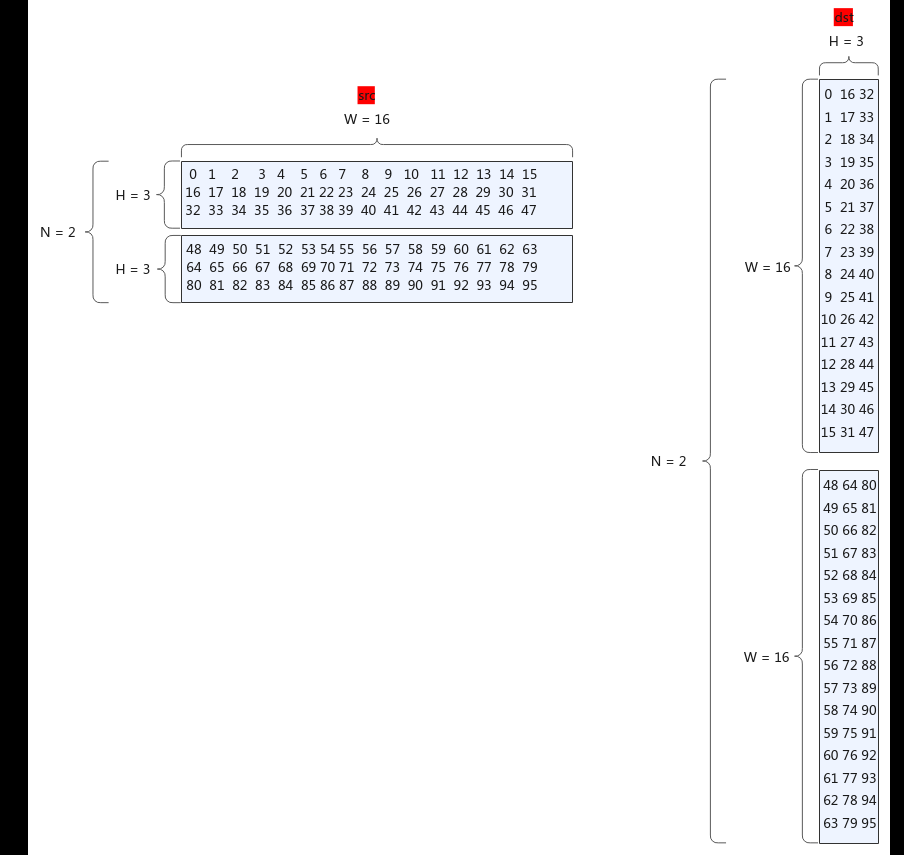

【场景14：三维中的第一维和第二维互换】

支持在UB上对三维Tensor中的第一维和第二维互换。

图6-133场景14 三维Tensor 的数据排布变换

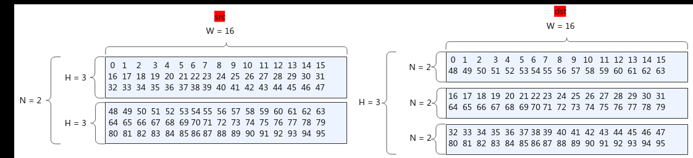

【场景15：三维中的第一维和第三维互换】

支持在UB上对三维Tensor中的第一维和第三维互换。

<!-- page 2853 -->

图6-134场景15 三维Tensor 的数据排布变换

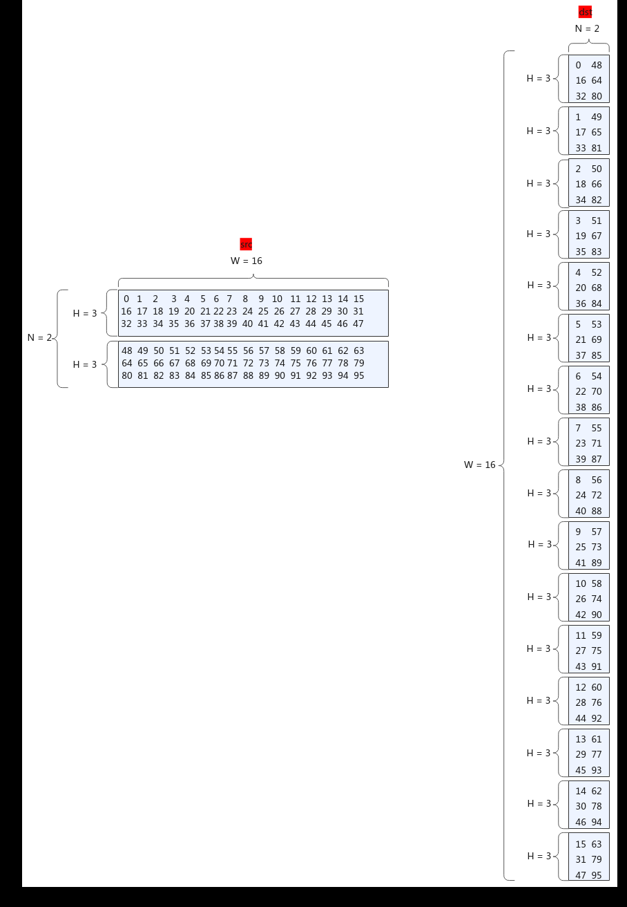

【场景16：使用交织指令进行两维ND2NZ转置】

支持在UB上使用交织指令对二维ND Tensor转置为NZ。

<!-- page 2854 -->

图6-135场景16 使用交织指令的ND2NZ 转置

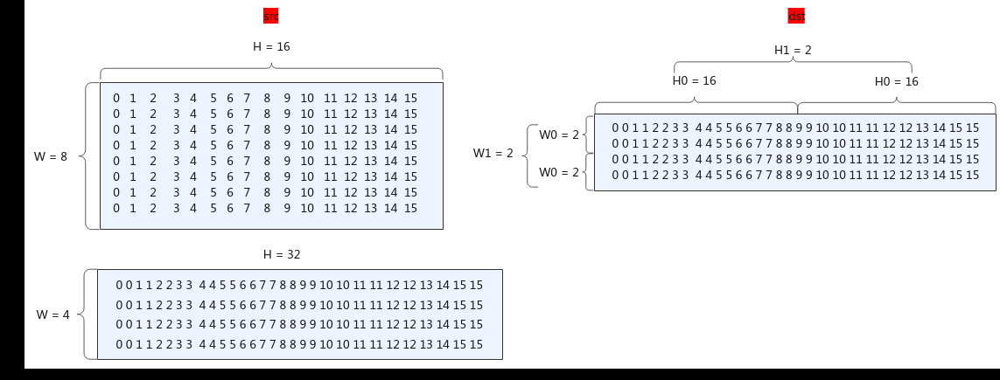

实现原理

对应Transpose的11种功能场景，每种功能场景的算法框图如图所示。

图6-136场景1：NZ2ND，1、2 轴互换

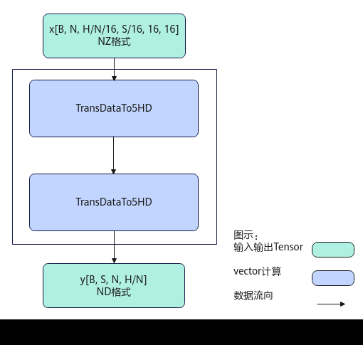

计算过程分为如下几步：

先后沿H/N方向，N方向，B方向循环处理：

<!-- page 2855 -->

1.第1次TransDataTo5HD步骤：沿S方向转置S/16个连续的16*16的方形到temp中，在temp中每个方形与方形之间连续存储；

2.第2次TransDataTo5HD步骤：将temp中S/16个16*16的方形转置到dst中，在dst中是ND格式，来自同一个方形的连续2行数据在目的操作数上的地址偏移(H/N)*N个元素，沿H方向的每2个方形的同一行数据在目的操作数上的地址偏移16个元素。

图6-137场景2：NZ2NZ，1、2 轴互换

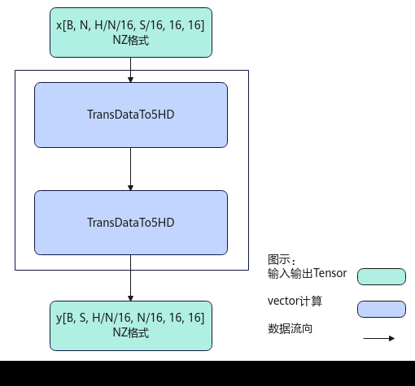

计算过程分为如下几步：

先后沿H/N方向，N方向，B方向循环处理：

1.第1次TransDataTo5HD步骤：沿S方向分别取S/16个连续的16*16的方形到temp中，在temp中每个方形与方形之间连续存储；

2.第2次TransDataTo5HD步骤：将temp中S/16个16*16的方形转置到dst中，在dst中是NZ格式，来自同一个方形的连续2行数据在目的操作数上的地址偏移(H/N)*N个元素，沿H方向的每2个方形的同一行数据在目的操作数上的地址偏移N*16个元素。

<!-- page 2856 -->

图6-138场景3：NZ2NZ，尾轴切分

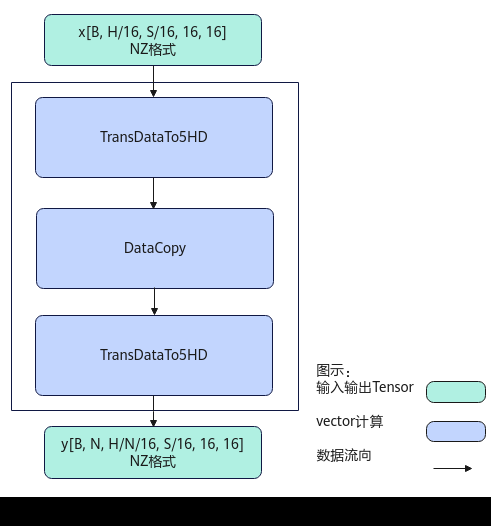

计算过程分为如下几步：

先后沿H方向，B方向循环处理：

1.第1次TransDataTo5HD步骤：每次转置S/16个连续的16*16的方形到temp1中；

2.DataCopy步骤：当H/N<=16时，每次搬运H/N*S个元素到temp2中；当H/N>16时，前H/N/16次搬运16*S个元素到temp2中，最后一次搬运H/N%16*S个元素到temp2中；

3.第2次TransDataTo5HD步骤：将temp2中的16*S的方形转置到dst中，在dst中是NZ格式，来自同一个方形的连续2行数据在目的操作数上的地址偏移16个元素，沿H方向的每2个方形的同一行数据在目的操作数上的地址偏移S*16个元素。

<!-- page 2857 -->

图6-139场景4：NZ2ND，尾轴切分


计算过程分为如下几步：

先后沿H方向，B方向循环处理：

1.第1次TransDataTo5HD步骤：每次转置S/16个连续的16*16的方形到temp1中；

2.DataCopy步骤：当H/N<=16时，每次搬运H/N*S个元素到temp2中；当H/N>16时，前H/N/16次搬运16*S个元素到temp2中，最后一次搬运H/N%16*S个元素到tmp2中；

3.第2次TransDataTo5HD步骤：将temp2中的数据转置到dst中，在dst中是ND格式，来自同一个方形的连续2行数据在目的操作数上的地址偏移(H/N+16-1)/16*16个元素，沿H方向的每2个方形的同一行数据在目的操作数上的地址偏移(H/N+16-1)/16*16*S个元素。

<!-- page 2858 -->

图6-140场景5：NZ2ND，尾轴合并

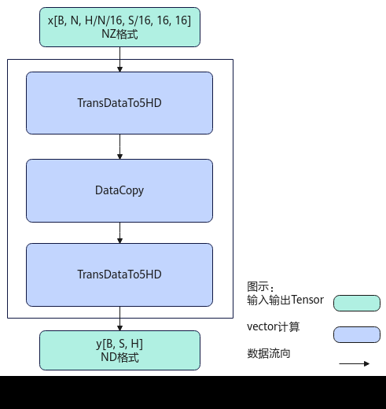

计算过程分为如下几步：

先后沿H方向，B方向循环处理：

1.第1次TransDataTo5HD步骤：每次转置一个S*16的方形到temp1中；

2.DataCopy步骤：当H/N<=16时，每次搬运H/N*S个元素到temp2中；当H/N>16时，前H/N/16次搬运16*S个元素到temp2中，最后一次搬运H/N%16*S个元素到tmp2中；

3.第2次TransDataTo5HD步骤：将temp2中的16*S的方形转置到dst中，在dst中是ND格式，来自同一个方形的连续2行数据在目的操作数上的地址偏移(H+16-1)/16*16个元素，沿H方向的每2个方形的同一行数据在目的操作数上的地址偏移H/N*S个元素。

<!-- page 2859 -->

图6-141场景6：NZ2NZ，尾轴合并

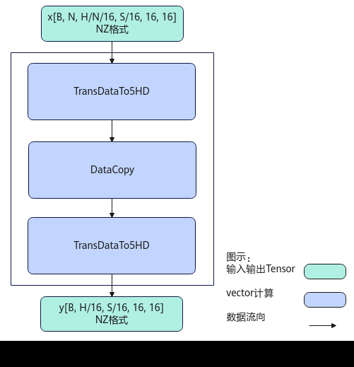

计算过程分为如下几步：

先后沿H方向，B方向循环处理：

1.第1次TransDataTo5HD步骤：每次转置一个S*16的方形到temp1中；

2.DataCopy步骤：当H/N<=16时，每次搬运H/N*S个元素到temp2中；当H/N>16时，前H/N/16次搬运16*S个元素到temp2中，最后一次搬运H/N%16*S个元素到tmp2中；

3.第2次TransDataTo5HD步骤：将temp2中的16*S的方形转置到dst中，在dst中是NZ格式，来自同一个方形的连续2行数据在目的操作数上的地址偏移16个元素，沿H方向的每2个方形的同一行数据在目的操作数上的地址偏移S*16个元素。

<!-- page 2860 -->

图6-142场景7：二维转置

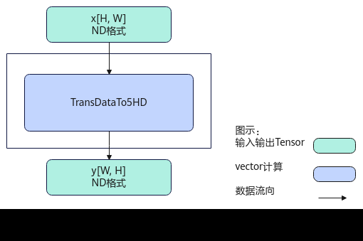

计算过程如下：

1.调用TransDataTo5HD，通过设置不同的源操作数地址序列和目的操作数地址序列，将[H, W]转置为[W, H]，src和dst均是ND格式。

图6-143场景13 : 二维转置或者三维的后两维转置

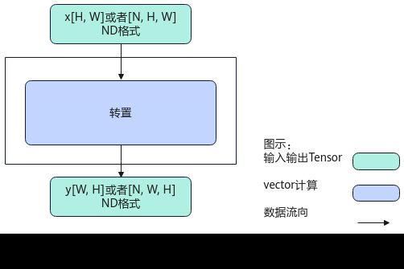

计算过程如下：

<!-- page 2861 -->

1.调用内部计算逻辑，通过设置不同的源操作数地址序列，连续写入目的操作数地址中，将[H, W]转置为[W, H]，或者将[N, H, W]转置为[N, W, H]，src和dst均是ND格式。

场景14、场景15的转换过程和上述场景13中三维转置的转换过程基本一致，只是指定转置的维度不同。

图6-144场景16 ：使用交织指令进行两维ND2NZ 转置

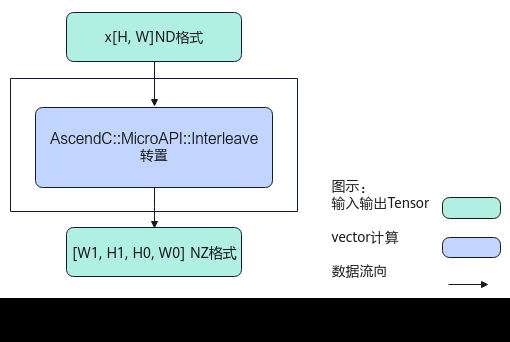

计算过程如下：

1.调用内部计算逻辑，通过设置不同的源操作数地址序列，连续写入目的操作数地址中，将[H, W] ND格式转置为[W1,H1,H0,W0] NZ格式，H = H1 * H0，W =W1 * W0，H0=16，W0=2，src是ND格式，dst是NZ格式。

函数原型

由于该接口的内部实现中涉及复杂的计算，需要额外的临时空间来存储计算过程中的中间变量。临时空间大小BufferSize的获取方法：通过6.2.4.10.2 Transpose Tiling中提供的GetTransposeMaxMinTmpSize接口获取所需最大和最小临时空间大小，最小空间可以保证功能正确，最大空间用于提升性能。

临时空间支持接口框架申请和开发者通过sharedTmpBuffer入参传入两种方式，因此Transpose接口的函数原型有两种：

●通过sharedTmpBuffer入参传入临时空间template <typename T>__aicore__ inline void Transpose(const LocalTensor<T>& dst, const LocalTensor<T>& src, const LocalTensor<uint8_t> &sharedTmpBuffer, TransposeType transposeType, ConfusionTransposeTiling& tiling)

该方式下开发者需自行申请并管理临时内存空间，并在接口调用完成后，复用该部分内存，内存不会反复申请释放，灵活性较高，内存利用率也较高。

●接口框架申请临时空间

<!-- page 2862 -->

```cpp
template <typename T>__aicore__ inline void Transpose(const LocalTensor<T>& dst, const LocalTensor<T>& src, TransposeType transposeType, ConfusionTransposeTiling& tiling)
```

该方式下开发者无需申请，但是需要预留临时空间的大小。

参数说明

表6-1314模板参数说明

参数名描述

T操作数的数据类型。

Atlas 350 加速卡，场景1到场景7支持的数据类型为：int16_t、uint16_t、half、int32_t、uint32_t、float；场景13到场景15支持的数据类型为：int8_t、uint8_t、int16_t、uint16_t、half、bfloat16_t、int32_t、uint32_t、float；场景16支持的数据类型为：int8_t、uint8_t。

Atlas A3 训练系列产品/Atlas A3 推理系列产品，支持的数据类型为：int16_t、uint16_t、half、int32_t、uint32_t、float。

Atlas A2 训练系列产品/Atlas A2 推理系列产品，支持的数据类型为：int16_t、uint16_t、half、int32_t、uint32_t、float。

Atlas 推理系列产品AI Core，支持的数据类型为：int16_t、uint16_t、half、int32_t、uint32_t、float。

表6-1315接口参数说明

参数名输入/输出

描述

dst输出目的操作数，LocalTensor数据结构的定义请参考6.2.2.1LocalTensor。

类型为LocalTensor，支持的TPosition为VECIN/VECCALC/VECOUT。

src输入源操作数，LocalTensor数据结构的定义请参考6.2.2.1LocalTensor。

类型为LocalTensor，支持的TPosition为VECIN/VECCALC/VECOUT。

sharedTmpBuffer

输入共享缓冲区，用于存放API内部计算产生的临时数据。该方式开发者可以自行管理sharedTmpBuffer内存空间，并在接口调用完成后，复用该部分内存，内存不会反复申请释放，灵活性较高，内存利用率也较高。共享缓冲区大小的获取方式请参考6.2.4.10.2 Transpose Tiling。

类型为LocalTensor，支持的TPosition为VECIN/VECCALC/VECOUT。

<!-- page 2863 -->

描述

参数名输入/输出

transposeType

输入数据排布及reshape的类型，类型为TransposeType枚举类。enum class TransposeType : uint8_t {    TRANSPOSE_TYPE_NONE,            // default value    TRANSPOSE_NZ2ND_0213,           // 场景1：NZ2ND，1、2轴互换    TRANSPOSE_NZ2NZ_0213,           // 场景2：NZ2NZ，1、2轴互换    TRANSPOSE_NZ2NZ_012_WITH_N,     // 场景3：NZ2NZ，尾轴切分    TRANSPOSE_NZ2ND_012_WITH_N,     // 场景4：NZ2ND，尾轴切分    TRANSPOSE_NZ2ND_012_WITHOUT_N,  // 场景5：NZ2ND，尾轴合并    TRANSPOSE_NZ2NZ_012_WITHOUT_N,  // 场景6：NZ2NZ，尾轴合并    TRANSPOSE_ND2ND_ONLY,           // 场景7：二维转置    TRANSPOSE_ND_UB_GM,             // 当前不支持    TRANSPOSE_GRAD_ND_UB_GM,        // 当前不支持    TRANSPOSE_ND2ND_B16,            // 当前不支持    TRANSPOSE_NCHW2NHWC,            // 当前不支持    TRANSPOSE_NHWC2NCHW,            // 当前不支持    TRANSPOSE_ND2ND_021,            // 场景13：二维转置或者三维中后两维转置，该参数仅支持Atlas 350 加速卡    TRANSPOSE_ND2ND_102,            // 场景14：三维中第一维和第二维互换，该参数仅支持Atlas 350 加速卡    TRANSPOSE_ND2ND_210,            // 场景15：三维中第一维和第三维互换，该参数仅支持Atlas 350 加速卡    TRANSPOSE_ND2NZ_WITH_INTLV      // 场景16：使用交织指令进行两维ND2NZ转置，该参数仅支持Atlas 350 加速卡    };

tiling输入计算所需tiling信息，Tiling信息的获取请参考6.2.4.10.2Transpose Tiling。

返回值说明

无

约束说明

●操作数地址对齐要求请参见通用地址对齐约束。

●场景13到场景16仅在Atlas 350 加速卡上支持。

●Atlas 350 加速卡，场景13到场景16不支持dst和src空间复用。

调用示例

本示例为场景1（NZ2ND，1、2轴互换）示例：

输入Tensor { shape:[B, N, H/N/16, S/16, 16, 16], origin_shape：[B, N, S, H/N],format:"NZ", origin_format:"ND"}

输出Tensor { shape:[B, S, N, H/N], origin_shape:[B, S, N, H/N], format:"ND",origin_format:"ND"}

B=1，N=2, S=64, H/N=32，输入数据类型均为half。更多完整样例请参考Transpose样例。

// dst：输入Tensor// src：输出Tensor// NZ2ND，1、2轴互换AscendC::Transpose(dst, src, AscendC::TransposeType::TRANSPOSE_NZ2ND_0213, this->tiling);
