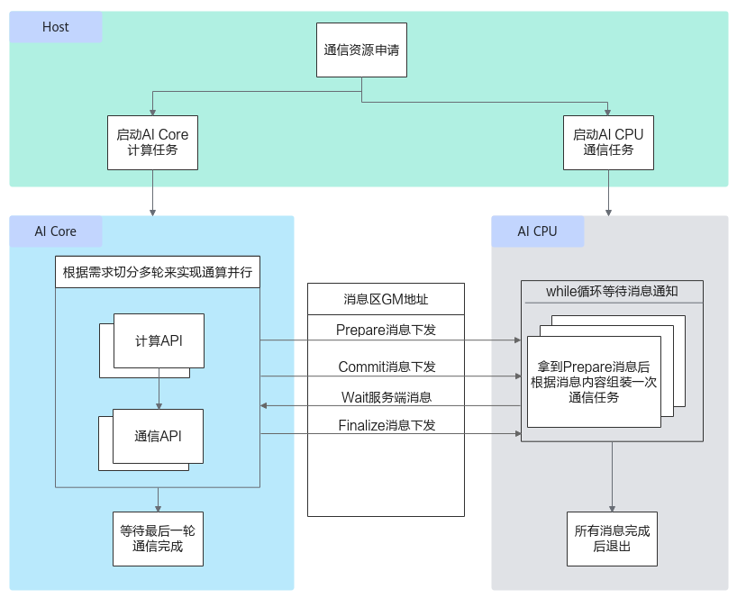
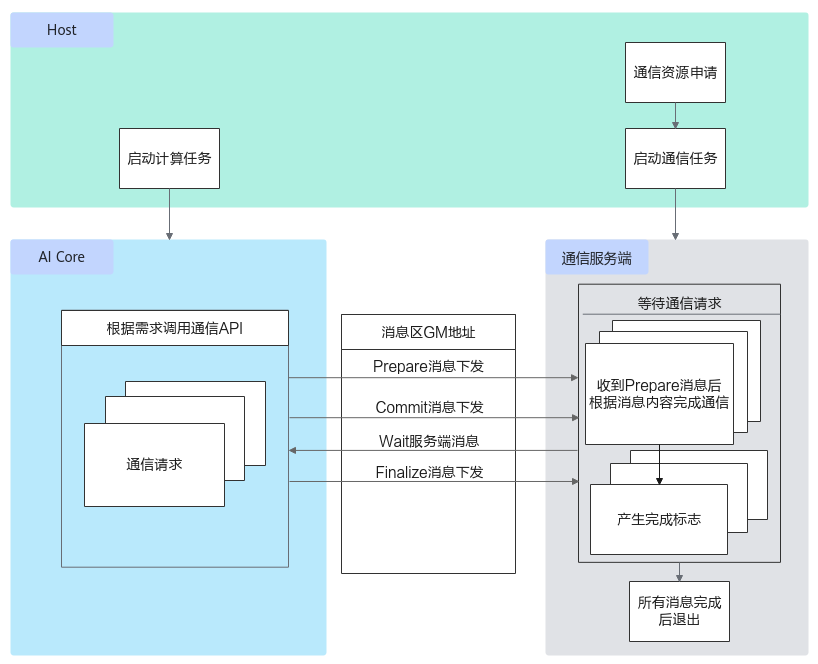

# HCCL使用说明

> **Section**: 6.2.4.11.1.1  
> **PDF Pages**: 2899–2904  

---

<!-- page 2899 -->

调用示例

本调用示例使用8个核，每个核用当前blockIdx的值初始化zGm上的65536个数。完整的算子样例请参考fill算子样例。// 带初始化的元素个数constexpr int32_t INIT_SIZE = 65536;

// 设置源操作数在Global Memory上的起始地址为z+INIT_SIZE*blockIdx，所占外部存储的大小为INIT_SIZE个floatzGm.SetGlobalBuffer((__gm__ float*)z + INIT_SIZE * AscendC::GetBlockIdx(), INIT_SIZE);// 将起始地址为z+INIT_SIZE*blockIdx和大小为INIT_SIZE个float源操作数zGm的值，初始化为每个核用当前blockIdxAscendC::Fill(zGm, INIT_SIZE, (float)(AscendC::GetBlockIdx()));

结果示例如下：

初始化后zGm数据：[0. 0. 0. ... 0. 0. 0. 1. 1. 1. ... 1. 1. 1. 2. 2. 2. ... 2. 2. 2. ... 5. 5. 5. ... 5. 5. 5. 6. 6. 6. ... 6. 6. 6. 7. 7. 7. ... 7. 7. 7.]

## 6.2.4.11 HCCL 通信类

## 6.2.4.11.1 HCCL Kernel 侧接口

## 6.2.4.11.1.1 HCCL 使用说明

Ascend C提供一组HCCL通信类高阶API，方便算子Kernel开发用户在AI Core侧灵活管理通算融合算子中计算与通信任务的执行顺序。使用HCCL通信类高阶API进行算子开发前，请参考通算融合章节了解必要的背景知识。

HCCL为集合通信任务客户端，主要对外提供了集合通信原语接口（以下统称为Prepare接口），对标集合通信C++接口，详细可参见《HCCL集合通信库》>接口参考，当前支持AllReduce、AllGather、ReduceScatter、AlltoAll接口等。本章的所有接口运行在AI Core上，且不执行通信任务，而是由用户调用Prepare接口将对应类型的通信任务信息发送给AI CPU或CCU服务端，并在合适的时机通过Commit接口通知AI CPU或CCU上的服务端执行对应的通信任务。注意，当前Atlas 350 加速卡上仅支持CCU服务端。

所谓合适的时机，取决于用户编排的是先通信后计算的任务，还是先计算后通信的任务。对于这两种场景，简述如下：

●先通信后计算的任务：典型的如AllGather通信+Matmul计算任务编排。此场景下，用户在调用AllGather接口下发通信任务之后，通过AllGather接口返回的该通信任务标识handleId，可立即调用Commit接口通知服务端执行该handleId对应的任务，同时用户调用Wait阻塞接口等待服务端通知handleId对应的通信任务执行结束，待该通信任务结束后，再执行计算任务。

●先计算后通信的任务：典型的如Matmul计算+AllReduce通信任务编排。此场景下，用户可以先调用AllReduce接口通知服务端先下发通信任务，再调用Matmul计算接口进行计算，这样AllReduce任务的组装和任务下发及执行过程可以被Matmul的计算流水所掩盖，待计算任务完成后，调用Commit接口通知服务端执行AllReduce任务，无须调用Wait接口等待通信任务执行结束。

<!-- page 2900 -->

当后续无通信任务时，调用Finalize接口，通知服务端后续无通信任务，执行结束后退出，客户端检测并等待最后一个通信任务执行结束。以上介绍的AI Core下发HCCL通信任务的机制如下图所示。

图6-150 AI Core 下发HCCL 通信任务机制



<!-- page 2901 -->

图6-151 Atlas 350 加速卡AI Core 下发HCCL 通信任务机制



注意

对于Atlas A3 训练系列产品/Atlas A3 推理系列产品，在AI CPU作为服务端的场景中，HCCL通信API的功能依赖开放AI CPU用户态下发调度任务，存在一定的安全风险，用户需要自行确保AI Core自定义算子的安全可靠，防止恶意攻击行为。

实现AI Core下发一个通信任务的具体步骤如下：

步骤1创建HCCL对象，并调用初始化接口InitV2。

// 传initTiling地址的调用方式，推荐使用该方式GET_TILING_DATA_WITH_STRUCT(AllGatherCustomTilingData, tilingData, tilingGM); // AllGatherCustomTilingData为对应算子头文件定义的结构体

Hccl hccl;Hccl<HcclServerType::HCCL_SERVER_TYPE_CCU> hccl; // 通过模板入参的方式选择硬件类型，默认AICPU，可以指定CCUGM_ADDR contextGM = GetHcclContext<0>();  // AscendC自定义算子kernel中，通过此方式获取HCCL context

```cpp
hccl.InitV2(contextGM, &tilingData);
```

当调用InitV2接口时，必须使用标准C++语法定义TilingData结构体的开发方式，具体请参考2.10.2.5.4 使用标准C++语法定义Tiling结构体。如上示例代码中的tilingGM为host侧传入的、作为核函数入参的算子TilingData的GM地址，通过GET_TILING_DATA_WITH_STRUCT获取TilingData。调用InitV2初始化接口时，需要传入通信上下文信息，可以通过框架提供的获取通信上下文的接口GetHcclContext获取。

<!-- page 2902 -->

步骤2设置对应通信算法的Tiling地址。

通过SetCcTilingV2接口设置对应通信算法的Tiling地址，调用Commit接口后，该地址被发送到服务端由服务端解析。SetCcTilingV2接口必须与InitV2接口配合使用。示例如下。// 传initTiling地址的调用方式GET_TILING_DATA_WITH_STRUCT(AllGatherCustomTilingData, tilingData, tilingGM);

Hccl hccl;GM_ADDR contextGM = GetHcclContext<0>();  // AscendC自定义算子kernel中，通过此方式获取HCCL context

hccl.InitV2(contextGM, &tilingData);if (SetCcTilingV2(offsetof(AllGatherCustomTilingData, mc2CcTiling)) != HCCL_SUCCESS) {  return;}

步骤3用户通过对应的Prepare接口异步下发对应类型的通信任务，并获取到该任务的标识handleId，服务端接收到后开始通信任务的展开和下发，示例如下。

auto handleId = hccl.ReduceScatter<false>(aGM, cGM, recvCount,                                           AscendC::HCCL_DATA_TYPE_FP16,                                          HCCL_REDUCE_SUM, strideCount, 1);// 对于Prepare接口，在调试时可增加异常值校验和PRINTF打印// if (handleId == INVALID_HANDLE_ID) {//     PRINTF("[ERROR] call ReduceScatter failed, handleId is -1.");//    return;// }

示例的Prepare接口为 ReduceScatter，其他接口可参考后续章节的内容。其中的参数AscendC::HCCL_DATA_TYPE_FP16是HCCL任务的数据类型，其数据结构为HcclDataType，对应的参数说明参考表6-1337；参数HCCL_REDUCE_SUM是一种Reduce操作，AllReduce和ReduceScatter归约操作支持的Reduce操作类型参见表6-1338。

表6-1337 HcclDataType 参数说明

数据类型说明

HcclDataType

HCCL任务的数据类型。enum HcclDataType {HCCL_DATA_TYPE_INT8 = 0,   /* int8 */HCCL_DATA_TYPE_INT16 = 1,  /* int16 */HCCL_DATA_TYPE_INT32 = 2,  /* int32 */HCCL_DATA_TYPE_FP16 = 3,   /* half或float16 */HCCL_DATA_TYPE_FP32 = 4,   /* float */HCCL_DATA_TYPE_INT64 = 5,  /* int64 */HCCL_DATA_TYPE_UINT64 = 6, /* uint64 */HCCL_DATA_TYPE_UINT8 = 7,  /* uint8 */HCCL_DATA_TYPE_UINT16 = 8, /* uint16 */HCCL_DATA_TYPE_UINT32 = 9, /* uint32 */HCCL_DATA_TYPE_FP64 = 10,  /* float64 */HCCL_DATA_TYPE_BFP16 = 11, /* bfloat16 */HCCL_DATA_TYPE_INT128 = 12, /* int128 预留类型，暂不支持 */HCCL_DATA_TYPE_HIF8 = 14,  /* hif8 */HCCL_DATA_TYPE_FP8E4M3 = 15,  /* fp8e4m3 */HCCL_DATA_TYPE_FP8E5M2 = 16,  /* fp8e5m2 */HCCL_DATA_TYPE_FP8E8M0 = 17,  /* fp8e8m0 */HCCL_DATA_TYPE_RESERVED    /* reserved */}

<!-- page 2903 -->

表6-1338 HcclReduceOp 参数说明

数据类型说明

HcclReduceOp

Reduce操作类型。enum HcclReduceOp {HCCL_REDUCE_SUM = 0,  /* sum */HCCL_REDUCE_PROD = 1, /* prod */HCCL_REDUCE_MAX = 2,  /* max */HCCL_REDUCE_MIN = 3,  /* min */HCCL_REDUCE_RESERVED  /* reserved */}

步骤4用户调用Commit接口通知服务端执行handleId对应的通信任务。

// 等待通信任务执行时机成熟，调用Commit接口通知服务端执行hccl.Commit(handleId);

步骤5用户调用Wait阻塞接口，等待服务端执行完对应的通信任务。

auto ret = hccl.Wait(handleId);// 对于Wait和Query接口，在调试时可增加异常值校验和PRINTF打印// if (ret == HCCL_FAILED) {//    PRINTF("[ERROR] call Wait for handleId[%d] failed.", handleId);//    return;// }

// 调用核间同步接口，防止部分核执行较快退出，触发Hccl析构，影响执行较慢的核// 开发者可根据实际的业务场景，选择调用 SyncAll、 CrossCoreSetFlag(ISASI)、 CrossCoreWaitFlag(ISASI)接口，保证全部核的任务完成后再退出执行

步骤6用户调用Finalize接口，通知服务端后续无通信任务，执行结束后退出；客户端检测并等待最后一个通信任务执行结束。

```cpp
hccl.Finalize();
```

**----结束**

注意：若HCCL对象的模板参数未指定下发通信任务的核，则Prepare接口仅能在AIC或AIV之一上运行，调用步骤2到步骤5的接口前，必须指定接口代码运行在AIC或AIV核上，实现时如下代码所示。

// 通过内置常量g_coreType来判断AIC核或者AIV核if (g_coreType == AIV) {// if (g_coreType == AIC) {调用HCCL接口}

基于以上对单个通信任务下发的了解，介绍Prepare接口中repeat参数的灵活使用方式。一次Prepare接口的调用对应一个handleId，Prepare接口中的参数repeat代表这次Prepare的通信任务次数，该值必须和针对该handleId调用Commit接口的次数、Wait接口的次数一致。以图2 ReduceScatter通信示例进行说明，假设共4张卡，每张卡上源数据首先按照rankId均匀分成4份，每份数据被切分成3份，最终被切分后的每份数据的个数为TileLen，每次ReduceScatter通信仅通信一组切分数据（如图中数据0-0、1-0、2-0、3-0为一组切分数据），因此需要做3次ReduceScatter操作，全部数据才能通信完。

这种场景下，可以调用3次repeat参数为1的ReduceScatter接口，下发3个通信任务，同时更新每个ReduceScatter任务的收发地址，得到3个任务的handleId，每个handleId任务调用1次Commit和Wait接口，对应代码片段如下。extern "C" __global__ __aicore__ void reduce_scatter_custom(GM_ADDR xGM, GM_ADDR yGM, GM_ADDR workspaceGM, GM_ADDR tilingGM) {    auto sendBuf = xGM;  // xGM为ReduceScatter的输入GM地址    auto recvBuf = yGM;  // yGM为ReduceScatter的输出GM地址

<!-- page 2904 -->

constexpr size_t rankSize = 4U; // 4张卡    constexpr size_t tileCnt = 3U;  // 卡上的数据均匀分成rankSize份，且每份又被切分成3份    constexpr size_t tileLen = 100U;  // 被切分后的每份数据个数    uint64_t strideCount = tileLen*tileCnt;  // 表示sendBuf上相邻数据块间的起始地址的偏移量

REGISTER_TILING_DEFAULT(ReduceScatterCustomTilingData); //ReduceScatterCustomTilingData为对应算子头文件定义的结构体    GET_TILING_DATA_WITH_STRUCT(ReduceScatterCustomTilingData, tilingData, tilingGM);

Hccl hccl;    GM_ADDR contextGM = AscendC::GetHcclContext<0>();  // AscendC自定义算子kernel中，通过此方式获取HCCL context    if (AscendC::g_coreType == AIV) {  // 指定AIV核通信        hccl.InitV2(contextGM, &tilingData);        auto ret = hccl.SetCcTilingV2(offsetof(ReduceScatterCustomTilingData, reduceScatterCcTiling));        if (ret != HCCL_SUCCESS) {          return;        }    // for循环中生成了3个handleId，每个handleId只调用了repeat=1次Commit和Wait接口        for (int i = 0; i < tileCnt; ++i) {        auto handleId = hccl.ReduceScatter(sendBuf, recvBuf, tileLen, HcclDataType::HCCL_DATA_TYPE_FP32, HcclReduceOp::HCCL_REDUCE_SUM, strideCount, 1); //具体参数参见ReduceScatter接口说明        hccl.Commit(handleId);        auto ret = hccl.Wait(handleId);        // 执行其他计算逻辑 ....        // 更新ReduceScatter的收发地址        sendBuf += tileLen * sizeOf(float32);        recvBuf += tileLen * sizeOf(float32);    }        AscendC::SyncAll<true>();  // 全AIV核同步，防止0核执行过快，提前调用hccl.Finalize()接口，导致其他核Wait卡死        hccl.Finalize();    }}

由于每张卡上3份数据的源地址SendBuf是连续的，且每张卡中目的地址recvBuf用来存储3份通信结果数据的内存也是连续的，因此以上代码可以优化，将ReduceScatter接口中的repeat参数设置为3，从而调用1次ReduceScatter接口，达到下发3个通信任务的效果。此时，只有1个handleId的任务，但是需要调用3次Commit和Wait接口，对应代码片段如下。

extern "C" __global__ __aicore__ void reduce_scatter_custom(GM_ADDR xGM, GM_ADDR yGM, GM_ADDR workspaceGM, GM_ADDR tilingGM) {    auto sendBuf = xGM;  // xGM为ReduceScatter的输入GM地址    auto recvBuf = yGM;  // yGM为ReduceScatter的输出GM地址    constexpr size_t rankSize = 4U; // 4张卡    constexpr size_t tileCnt = 3U;  // 卡上的数据均匀分成rankSize份，且每份又被切分成3份    constexpr size_t tileLen = 100U;  // 被切分后的每份数据个数    uint64_t strideCount = tileLen*tileCnt;  // 表示sendBuf上相邻数据块间的起始地址的偏移量

REGISTER_TILING_DEFAULT(ReduceScatterCustomTilingData); //ReduceScatterCustomTilingData为对应算子头文件定义的结构体    GET_TILING_DATA_WITH_STRUCT(ReduceScatterCustomTilingData, tilingData, tilingGM);

Hccl hccl;    GM_ADDR contextGM = AscendC::GetHcclContext<0>();  // AscendC自定义算子kernel中，通过此方式获取HCCL context    if (AscendC::g_coreType == AIV) {  // 指定AIV核通信        hccl.InitV2(contextGM, &tilingData);        auto ret = hccl.SetCcTilingV2(offsetof(ReduceScatterCustomTilingData, reduceScatterCcTiling));        if (ret != HCCL_SUCCESS) {          return;        }    auto handleId = hccl.ReduceScatter(sendBuf, recvBuf, tileLen, HcclDataType::HCCL_DATA_TYPE_FP32, HcclReduceOp::HCCL_REDUCE_SUM, strideCount, tileCnt); //具体参数参见ReduceScatter接口说明    for (int i = 0; i < tileCnt; ++i) {        hccl.Commit(handleId);
