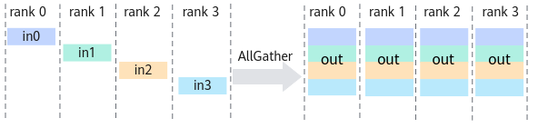
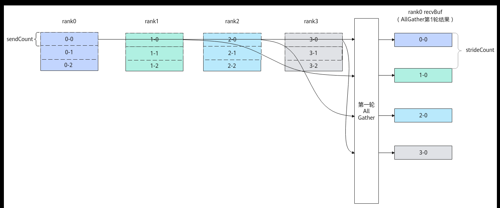
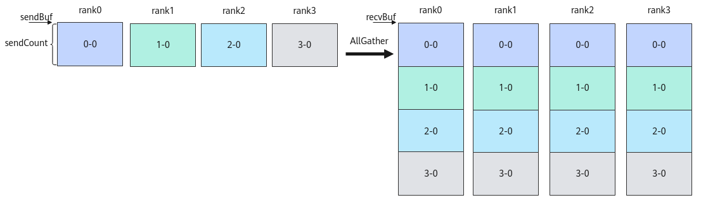
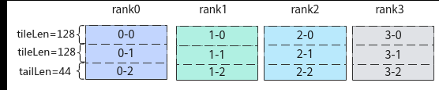
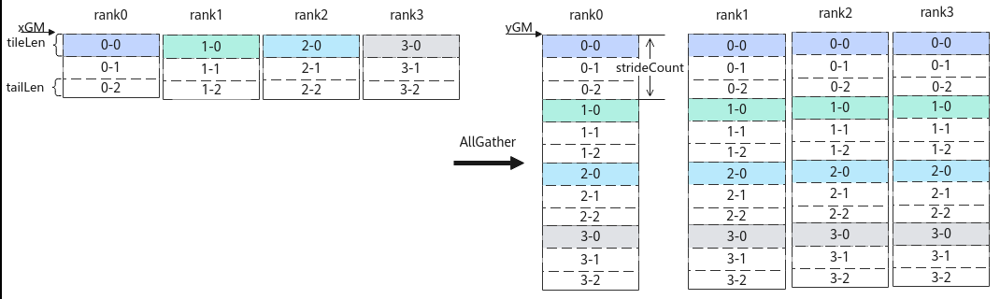

# AllGather

> **Section**: 6.2.4.11.1.6  
> **PDF Pages**: 2916–2920  

---

<!-- page 2916 -->

GM_ADDR contextGM = AscendC::GetHcclContext<0>();  // AscendC自定义算子kernel中，通过此方式获取HCCL context    if (AscendC::g_coreType == AIV) {  // 指定AIV核通信        hccl.InitV2(contextGM, &tilingData);        auto ret = hccl.SetCcTilingV2(offsetof(AllReduceCustomTilingData, mc2CcTiling));        if (ret != HCCL_SUCCESS) {            return;        }        // 2个首块处理        constexpr uint32_t tileRepeat = tileNum;         // 除了sendBuf和recvBuf入参不同，对2个首块处理的其余参数相同。故使用repeat=2，第2个首块AllReduce任务的sendBuf、recvBuf将由API内部自行更新        HcclHandle handleId1 = hccl.AllReduce<true>(sendBuf, recvBuf, tileLen, HcclDataType::HCCL_DATA_TYPE_FP16, reduceOp, tileRepeat);         // 1个尾块处理        constexpr uint32_t kSizeOfFloat16 = 2U;        sendBuf += tileLen * tileNum * kSizeOfFloat16;        recvBuf += tileLen * tileNum * kSizeOfFloat16;        constexpr uint32_t tailRepeat = tailNum;         HcclHandle handleId2 = hccl.AllReduce<true>(sendBuf, recvBuf, tailLen, HcclDataType::HCCL_DATA_TYPE_FP16, reduceOp, tailRepeat);

for (uint8_t i=0; i<tileRepeat; i++) {            hccl.Wait(handleId1);        }        hccl.Wait(handleId2);          AscendC::SyncAll<true>();  // 全AIV核同步，防止0核执行过快，提前调用hccl.Finalize()接口，导致其他核Wait卡死        hccl.Finalize();    }}

## 6.2.4.11.1.6 AllGather

产品支持情况

产品是否支持

Atlas 350 加速卡√

Atlas A3 训练系列产品/Atlas A3 推理系列产品√

Atlas A2 训练系列产品/Atlas A2 推理系列产品√

Atlas 200I/500 A2 推理产品x

Atlas 推理系列产品AI Corex

Atlas 推理系列产品Vector Corex

Atlas 训练系列产品x

功能说明

集合通信算子AllGather的任务下发接口，返回该任务的标识handleId给用户。AllGather的功能为：将通信域内所有节点的输入按照rank id重新排序，然后拼接起来，再将结果发送到所有节点的输出。

<!-- page 2917 -->



函数原型

```cpp
template <bool commit = false>__aicore__ inline HcclHandle AllGather(GM_ADDR sendBuf, GM_ADDR recvBuf, uint64_t sendCount, HcclDataType dataType, uint64_t strideCount, uint8_t repeat = 1)
```

参数说明

表6-1345模板参数说明

参数名输入/输出

描述

commit输入bool类型。参数取值如下：

●true：在调用Prepare接口时，Commit同步通知服务端可以执行该通信任务。

●false：在调用Prepare接口时，不通知服务端执行该通信任务。

表6-1346接口参数说明

参数名输入/输出

描述

sendBuf输入源数据buffer地址。

recvBuf输出目的数据buffer地址，集合通信结果输出到此buffer中。

sendCount输入参与AllGather操作的sendBuf的数据个数；recvBuf的数据个数等于sendCount * rank size，即sendCount * 卡数。

dataType输入AllGather操作的数据类型，目前支持HcclDataType包含的全部数据类型，HcclDataType详细可参考表6-1337。

<!-- page 2918 -->

参数名输入/输出

描述

strideCount输入●strideCount=0，表示多张卡的数据拼接到一张卡的recvBuf时，相邻数据块保持地址连续。卡rank[i]的数据块将被放在recvBuf中，且偏移数据量为i*sendCount。非多轮切分场景下，推荐用户设置该参数为0。

●strideCount>0，表示多张卡的数据拼接到一张卡的recvBuf时，相邻数据块在recvBuf中起始地址的偏移数据量为strideCount。卡rank[i]的数据块将被放在recvBuf中，且偏移数据量为i*strideCount。

注意：上述的偏移数据量为数据个数，单位为sizeof(dataType)。

repeat输入一次下发的AllGather通信任务个数。repeat取值≥1，默认值为1。当repeat>1时，每个AllGather任务的sendBuf和recvBuf地址由服务端自动算出，计算公式如下：

sendBuf[i] = sendBuf + sendCount* sizeof(datatype) * i,i∈[0, repeat)

recvBuf[i] = recvBuf + sendCount* sizeof(datatype) * i, i∈[0, repeat)

注意：当设置repeat>1时，须与strideCount参数配合使用，规划通信数据地址。

图6-157 AllGather 通信示例



返回值说明

返回该任务的标识handleId，handleId大于等于0。调用失败时，返回 -1。

约束说明

●调用本接口前确保已调用过InitV2和SetCcTilingV2接口。

●若HCCL对象的config模板参数未指定下发通信任务的核，该接口只能在AIC核或者AIV核两者之一上调用。若HCCL对象的config模板参数中指定了下发通信任务

<!-- page 2919 -->

的核，则该接口可以在AIC核和AIV核上同时调用，接口内部会根据指定的核的类型，只在AIC核、AIV核二者之一下发该通信任务。

●对于Atlas A2 训练系列产品/Atlas A2 推理系列产品，一个通信域内，所有Prepare接口的总调用次数不能超过63。

●对于Atlas A3 训练系列产品/Atlas A3 推理系列产品，一个通信域内，所有Prepare接口和InterHcclGroupSync接口的总调用次数不能超过63。

●对于Atlas 350 加速卡，一个通信域内，所有Prepare接口的总调用次数不能超过63。

●对于Atlas 350 加速卡，通信服务端为CCU时，单次最大通信数据量不能超过256M。

调用示例

●非多轮切分场景

如下图所示，4张卡上均有sendCount=300个float16数据，每张卡从xGM内存中获取到本卡数据，gather处理各卡的数据后，将结果输出到各卡的yGM。

图6-158非多轮切分场景下4 卡AllGather 通信



extern "C" __global__ __aicore__ void all_gather_custom(GM_ADDR xGM, GM_ADDR yGM, GM_ADDR workspaceGM, GM_ADDR tilingGM) {    auto sendBuf = xGM;  // xGM为AllGather的输入GM地址    auto recvBuf = yGM;  // yGM为AllGather的输出GM地址    uint64_t sendCount = 300;  // 每张卡均有300个float16的数据    uint64_t strideCount = 0;  // 非切分场景strideCount可设置为0    REGISTER_TILING_DEFAULT(AllGatherCustomTilingData); //AllGatherCustomTilingData为对应算子头文件定义的结构体    GET_TILING_DATA_WITH_STRUCT(AllGatherCustomTilingData, tilingData, tilingGM);

Hccl hccl;    GM_ADDR contextGM = AscendC::GetHcclContext<0>();  // AscendC自定义算子kernel中，通过此方式获取HCCL context

if (AscendC::g_coreType == AIV) {  // 指定AIV核通信        hccl.InitV2(contextGM, &tilingData);        auto ret = hccl.SetCcTilingV2(offsetof(AllGatherCustomTilingData, allGatherCcTiling));        if (ret != HCCL_SUCCESS) {          return;        }        HcclHandle handleId1 = hccl.AllGather<true>(sendBuf, recvBuf, sendCount, HcclDataType::HCCL_DATA_TYPE_FP16, strideCount);        hccl.Wait(handleId1);            AscendC::SyncAll<true>();  // 全AIV核同步，防止0核执行过快，提前调用hccl.Finalize()接口，导致其他核Wait卡死        hccl.Finalize();    }}

●多轮切分场景

<!-- page 2920 -->

使能多轮切分，等效处理上述非多轮切分示例的通信。如下图所示，每张卡的300个float16数据，被切分为2个首块数据，1个尾块数据。每个首块的数据量tileLen为128个float16数据，尾块的数据量tailLen为44个float16数据。在算子内部实现时，需要对切分后的数据分3轮进行AllGather通信任务，将等效上述非多轮切分的通信结果。

图6-159各卡数据切分示意图



具体实现为，第1轮通信，每个rank上0-0\1-0\2-0\3-0数据块进行AllGather处理。第2轮通信，每个rank上0-1\1-1\2-1\3-1数据块进行AllGather处理。第3轮通信，每个rank上0-2\1-2\2-2\3-2数据块进行AllGather处理。每一轮通信结果中，各卡上相邻数据块的起始地址间隔的数据个数为strideCount，以第一轮通信结果为例，rank0的0-0数据块和1-0数据块起始地址间隔的数据量strideCount =2*tileLen+1*tailLen=300。

图6-160第一轮4 卡AllGather 示意图



extern "C" __global__ __aicore__ void all_gather_custom(GM_ADDR xGM, GM_ADDR yGM, GM_ADDR workspaceGM, GM_ADDR tilingGM) {    constexpr uint32_t tileNum = 2U;   // 首块数量    constexpr uint64_t tileLen = 128U; // 首块数据个数    constexpr uint32_t tailNum = 1U;   // 尾块数量    constexpr uint64_t tailLen = 44U;  // 尾块数据个数    auto sendBuf = xGM;  // xGM为AllGather的输入GM地址    auto recvBuf = yGM;  // yGM为AllGather的输出GM地址    REGISTER_TILING_DEFAULT(AllGatherCustomTilingData); //AllGatherCustomTilingData为对应算子头文件定义的结构体    GET_TILING_DATA_WITH_STRUCT(AllGatherCustomTilingData, tilingData, tilingGM);

Hccl hccl;    GM_ADDR contextGM = AscendC::GetHcclContext<0>();  // AscendC自定义算子kernel中，通过此方式获取HCCL context    if (AscendC::g_coreType == AIV) {  // 指定AIV核通信        hccl.InitV2(contextGM, &tilingData);        auto ret = hccl.SetCcTilingV2(offsetof(AllGatherCustomTilingData, allGatherCcTiling));        if (ret != HCCL_SUCCESS) {          return;        }        uint64_t strideCount = tileLen * tileNum + tailLen * tailNum;        // 2个首块处理        constexpr uint32_t tileRepeat = tileNum;         // 除了sendBuf和recvBuf入参不同，处理2个首块的其余参数相同。故使用repeat=2，第2个首块AllGather任务的sendBuf、recvBuf将由API内部自行更新
