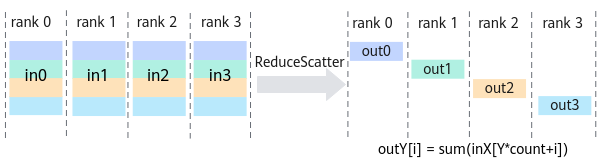
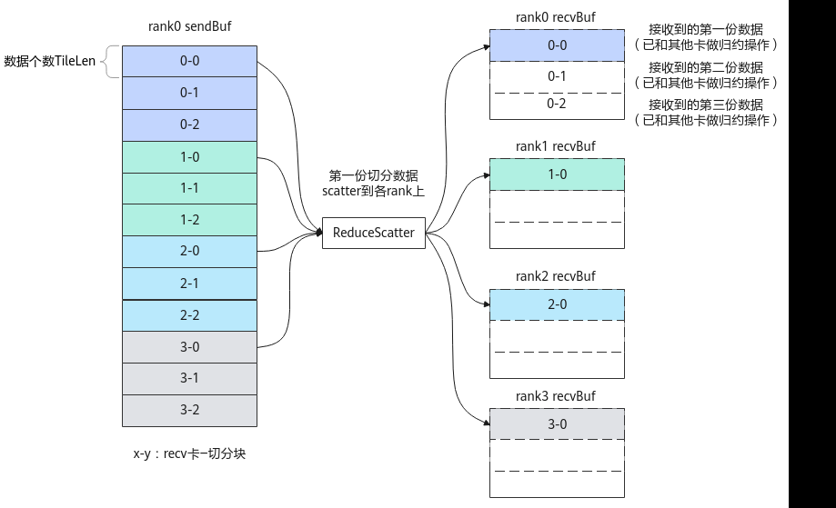
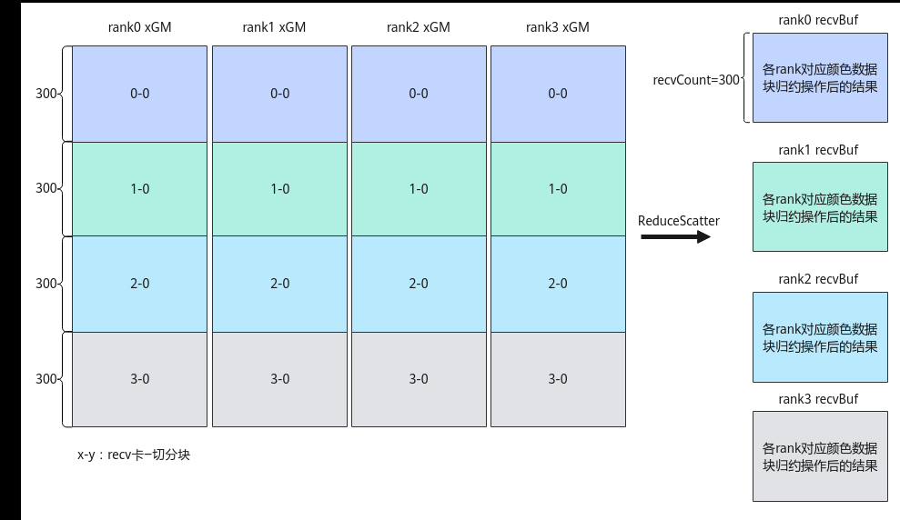
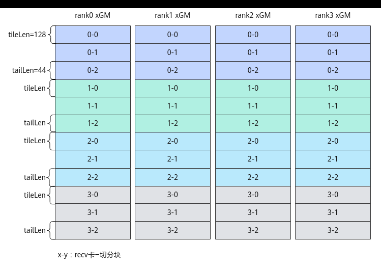
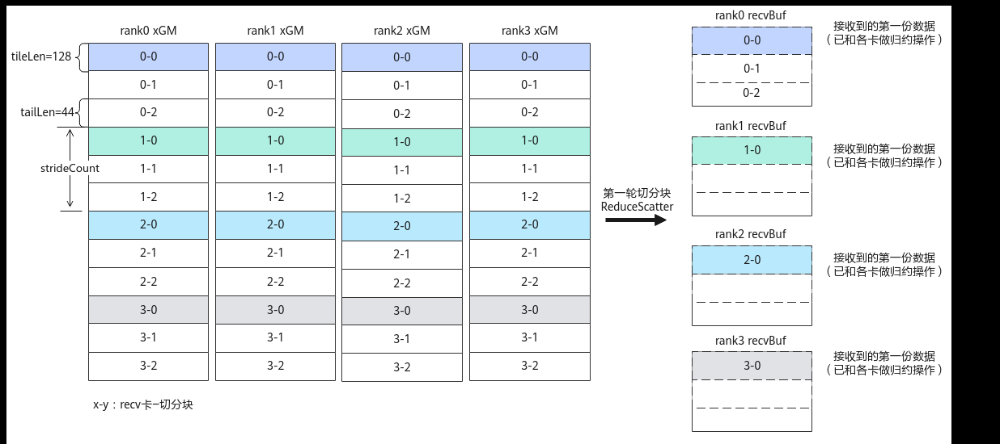

# ReduceScatter

> **Section**: 6.2.4.11.1.7  
> **PDF Pages**: 2921–2926  

---

<!-- page 2921 -->

HcclHandle handleId1 = hccl.AllGather<true>(sendBuf, recvBuf, tileLen, HcclDataType::HCCL_DATA_TYPE_FP16, strideCount, tileRepeat);         // 1个尾块处理        constexpr uint32_t kSizeOfFloat16 = 2U;        sendBuf += tileLen * tileNum * kSizeOfFloat16;        recvBuf += tileLen * tileNum * kSizeOfFloat16;        constexpr uint32_t tailRepeat = tailNum;         HcclHandle handleId2 = hccl.AllGather<true>(sendBuf, recvBuf, tailLen, HcclDataType::HCCL_DATA_TYPE_FP16, strideCount, tailRepeat);        for (uint8_t i=0; i<tileRepeat; i++) {            hccl.Wait(handleId1);        }        hccl.Wait(handleId2);          AscendC::SyncAll<true>();  // 全AIV核同步，防止0核执行过快，提前调用hccl.Finalize()接口，导致其他核Wait卡死        hccl.Finalize();    }}

## 6.2.4.11.1.7 ReduceScatter

产品支持情况

产品是否支持

Atlas 350 加速卡√

Atlas A3 训练系列产品/Atlas A3 推理系列产品√

Atlas A2 训练系列产品/Atlas A2 推理系列产品√

Atlas 200I/500 A2 推理产品x

Atlas 推理系列产品AI Corex

Atlas 推理系列产品Vector Corex

Atlas 训练系列产品x

功能说明

集合通信算子ReduceScatter的任务下发接口，返回该任务的标识handleId给用户。ReduceScatter的功能为：将所有rank的输入相加（或其他归约操作）后，再把结果按照rank编号均匀分散到各个rank的输出buffer，每个进程拿到其他进程1/ranksize份的数据进行归约操作。



<!-- page 2922 -->

函数原型

```cpp
template <bool commit = false>__aicore__ inline HcclHandle ReduceScatter(GM_ADDR sendBuf, GM_ADDR recvBuf, uint64_t recvCount, HcclDataType dataType, HcclReduceOp op, uint64_t strideCount, uint8_t repeat = 1)
```

参数说明

表6-1347模板参数说明

参数名输入/输出

描述

commit输入bool类型。参数取值如下：

●true：在调用Prepare接口时，Commit同步通知服务端可以执行该通信任务。

●false：在调用Prepare接口时，不通知服务端执行该通信任务。

表6-1348接口参数说明

参数名输入/输出

描述

sendBuf输入源数据buffer地址。

recvBuf输出目的数据buffer地址，集合通信结果输出到此buffer中。

recvCount输入参与ReduceScatter操作的recvBuf的数据个数；sendBuf的数据个数等于recvCount * rank size。

dataType输入ReduceScatter操作的数据类型，目前支持float、half、int8_t、int16_t、int32_t、bfloat16_t数据类型，即支持取值为HCCL_DATA_TYPE_FP32、HCCL_DATA_TYPE_FP16、HCCL_DATA_TYPE_INT8、HCCL_DATA_TYPE_INT16、HCCL_DATA_TYPE_INT32、HCCL_DATA_TYPE_BFP16。HcclDataType数据类型的介绍请参考表6-1337。

op输入ReduceScatter的操作类型，目前支持sum、max、min操作类型，即支持取值为HCCL_REDUCE_SUM、HCCL_REDUCE_MAX、HCCL_REDUCE_MIN。HcclReduceOp数据类型的介绍请参考表6-1338。

<!-- page 2923 -->

参数名输入/输出

描述

strideCount输入当将一张卡上sendBuf中的数据scatter到多张卡的recvBuf时，需要用strideCount参数表示sendBuf上相邻数据块间的起始地址的偏移量。

●strideCount=0，表示从当前卡发送数据给其它卡时，相邻数据块保持地址连续。本卡发送数据到卡rank[i]，且本卡数据块在sendBuf中的偏移为i*recvCount。非多轮切分场景下，推荐用户设置该参数为0。

●strideCount>0，表示从当前卡发送数据给其它卡时，相邻数据块在sendBuf中起始地址的偏移数据量为strideCount。本卡发送数据到卡rank[i]，且本卡数据块在SendBuf中的偏移为i*strideCount。

注意：上述的偏移数据量为数据个数，单位为sizeof(dataType)。

repeat输入一次下发的ReduceScatter通信任务个数。repeat取值≥1，默认值为1。当repeat>1时，每个ReduceScatter任务的sendBuf和recvBuf地址由服务端自动算出，计算公式如下：

sendBuf[i] = sendBuf + recvCount * sizeof(datatype) * i,i∈[0, repeat)

recvBuf[i] = recvBuf + recvCount * sizeof(datatype) * i, i∈[0, repeat)

注意：当设置repeat>1时，须与strideCount参数配合使用，规划通信数据地址。

图6-161 ReduceScatter 通信示例



<!-- page 2924 -->

以上图为例，假设4张卡的场景，每份数据被切分为3块（TileCnt为3），每张卡上的0-0、0-1、0-2数据最终reduce+scatter到卡rank0的recvBuf上，其余的每块1-y、2-y、3-y数据类似，最终分别reduce+scatter到卡rank1、rank2和rank3的recvBuf上。因此，对一张卡上的数据需要调用3次ReduceScatter接口，完成每份数据的3块切分数据的通信。对于每一份数据，本接口中参数recvCount为TileLen，strideCount为TileLen*TileCnt（即数据块0-0和1-0间隔的数据个数）。由于本例为内存连续场景，因此也可以只调用1次ReduceScatter接口，并将repeat参数设置为3。

返回值说明

返回该任务的标识handleId，handleId大于等于0。调用失败时，返回 -1。

约束说明

●调用本接口前确保已调用过InitV2和SetCcTilingV2接口。

●若HCCL对象的config模板参数未指定下发通信任务的核，该接口只能在AIC核或者AIV核两者之一上调用。若HCCL对象的config模板参数中指定了下发通信任务的核，则该接口可以在AIC核和AIV核上同时调用，接口内部会根据指定的核的类型，只在AIC核、AIV核二者之一下发该通信任务。

●对于Atlas A2 训练系列产品/Atlas A2 推理系列产品，一个通信域内，所有Prepare接口的总调用次数不能超过63。

●对于Atlas A3 训练系列产品/Atlas A3 推理系列产品，一个通信域内，所有Prepare接口和InterHcclGroupSync接口的总调用次数不能超过63。

●对于Atlas 350 加速卡，一个通信域内，所有Prepare接口的总调用次数不能超过63。

●对于Atlas 350 加速卡，通信服务端为CCU时，单次最大通信数据量不能超过256M。

调用示例

●非多轮切分场景

如下图所示，4张卡上均有300 * 4=1200个float16数据，每张卡从xGM内存中获取到本卡数据，对各卡数据完成reduce sum计算后的结果数据，进行scatter处理，最终每张卡都得到300个reduce sum后的float16数据。

<!-- page 2925 -->

图6-162非多轮切分场景下4 卡ReduceScatter 通信



extern "C" __global__ __aicore__ void reduce_scatter_custom(GM_ADDR xGM, GM_ADDR yGM, GM_ADDR workspaceGM, GM_ADDR tilingGM) {    auto sendBuf = xGM;  // xGM为ReduceScatter的输入GM地址    auto recvBuf = yGM;  // yGM为ReduceScatter的输出GM地址    uint64_t recvCount = 300;  // 每张卡的通信结果数据个数    uint64_t strideCount = 0;  // 非切分场景strideCount可设置为0    HcclReduceOp reduceOp = HcclReduceOp::HCCL_REDUCE_SUM;    REGISTER_TILING_DEFAULT(ReduceScatterCustomTilingData); //ReduceScatterCustomTilingData为对应算子头文件定义的结构体    GET_TILING_DATA_WITH_STRUCT(ReduceScatterCustomTilingData, tilingData, tilingGM);

Hccl hccl;    GM_ADDR contextGM = AscendC::GetHcclContext<0>();  // AscendC自定义算子kernel中，通过此方式获取HCCL context    if (AscendC::g_coreType == AIV) {  // 指定AIV核通信        hccl.InitV2(contextGM, &tilingData);        auto ret = hccl.SetCcTilingV2(offsetof(ReduceScatterCustomTilingData, reduceScatterCcTiling));        if (ret != HCCL_SUCCESS) {          return;        }        HcclHandle handleId1 = hccl.ReduceScatter<true>(sendBuf, recvBuf, recvCount, HcclDataType::HCCL_DATA_TYPE_FP16, reduceOp, strideCount);        hccl.Wait(handleId1);            AscendC::SyncAll<true>();  // 全AIV核同步，防止0核执行过快，提前调用hccl.Finalize()接口，导致其他核Wait卡死        hccl.Finalize();    }}

●多轮切分场景

使能多轮切分，等效处理上述非多轮切分示例的通信。如下图所示，每张卡的每份300个float16数据，被切分为2个首块，1个尾块。每个首块的数据量tileLen为128个float16数据，尾块的数据量tailLen为44个float16数据。在算子内部实现时，需要对切分后的数据分3轮进行ReduceScatter通信任务，将等效上述非多轮切分的通信结果。

<!-- page 2926 -->

图6-163各卡数据切分示意图



具体实现为，第1轮通信，每个rank上的0-0\1-0\2-0\3-0数据块进行ReduceScatter处理。第2轮通信，每个rank上0-1\1-1\2-1\3-1数据块进行ReduceScatter处理。第3轮通信，每个rank上0-2\1-2\2-2\3-2数据块进行ReduceScatter处理。每一轮通信的输入数据中，各卡上相邻数据块的起始地址间隔的数据个数为strideCount，以第一轮通信结果为例，rank0的0-0数据块和1-0数据块，或者1-0数据块和2-0数据块，两个相邻数据块起始地址间隔的数据量strideCount = 2*tileLen+1*tailLen=300。

图6-164第一轮4 卡ReduceScatter 示意图



extern "C" __global__ __aicore__ void reduce_scatter_custom(GM_ADDR xGM, GM_ADDR yGM, GM_ADDR workspaceGM, GM_ADDR tilingGM) {    constexpr uint32_t tileNum = 2U;   // 首块数量    constexpr uint64_t tileLen = 128U; // 首块数据个数    constexpr uint32_t tailNum = 1U;   // 尾块数量    constexpr uint64_t tailLen = 44U;  // 尾块数据个数    auto sendBuf = xGM;  // xGM为ReduceScatter的输入GM地址
