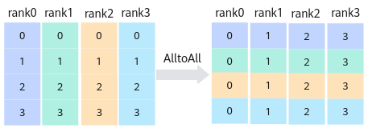
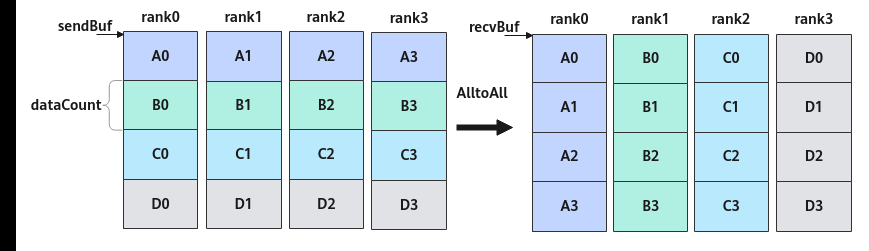
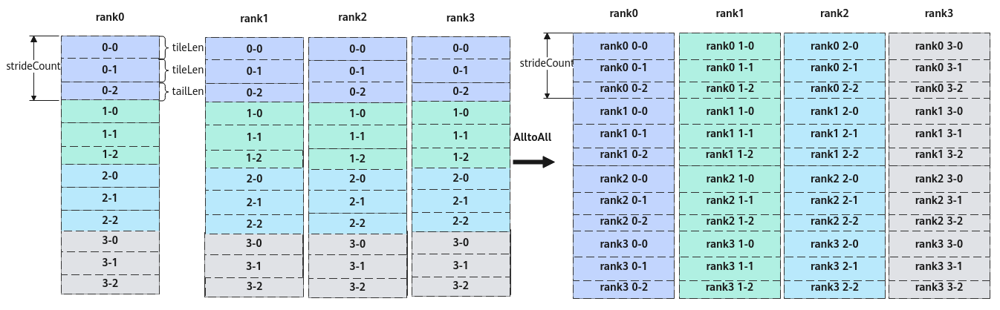
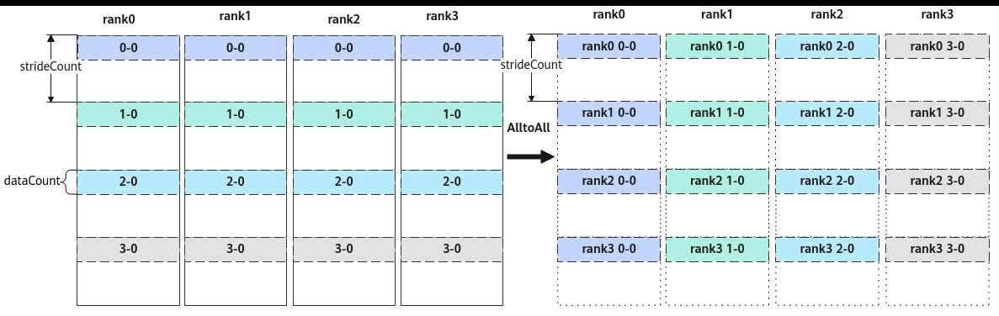

# AlltoAll

> **Section**: 6.2.4.11.1.8  
> **PDF Pages**: 2927–2931  

---

<!-- page 2927 -->

auto recvBuf = yGM;  // yGM为ReduceScatter的输出GM地址    HcclReduceOp reduceOp = HcclReduceOp::HCCL_REDUCE_SUM;    uint64_t strideCount = tileLen * tileNum + tailLen * tailNum;    REGISTER_TILING_DEFAULT(ReduceScatterCustomTilingData); //ReduceScatterCustomTilingData为对应算子头文件定义的结构体    GET_TILING_DATA_WITH_STRUCT(ReduceScatterCustomTilingData, tilingData, tilingGM);

Hccl hccl;    GM_ADDR contextGM = AscendC::GetHcclContext<0>();  // AscendC自定义算子kernel中，通过此方式获取HCCL context    if (AscendC::g_coreType == AIV) {  // 指定AIV核通信        hccl.InitV2(contextGM, &tilingData);        auto ret = hccl.SetCcTilingV2(offsetof(ReduceScatterCustomTilingData, reduceScatterCcTiling));        if (ret != HCCL_SUCCESS) {          return;        }        // 2个首块处理        constexpr uint32_t tileRepeat = tileNum;         // 除了sendBuf和recvBuf入参不同，处理2个首块的其余参数相同。故使用repeat=2，第2个首块ReduceScatter任务的sendBuf、recvBuf将由API内部自行更新        HcclHandle handleId1 = hccl.ReduceScatter<true>(sendBuf, recvBuf, tileLen, HcclDataType::HCCL_DATA_TYPE_FP16, reduceOp, strideCount, tileRepeat);         // 1个尾块处理        constexpr uint32_t kSizeOfFloat16 = 2U;        sendBuf += tileLen * tileNum * kSizeOfFloat16;        recvBuf += tileLen * tileNum * kSizeOfFloat16;        constexpr uint32_t tailRepeat = tailNum;         HcclHandle handleId2 = hccl.ReduceScatter<true>(sendBuf, recvBuf, tailLen, HcclDataType::HCCL_DATA_TYPE_FP16, reduceOp, strideCount, tailRepeat);        for (uint8_t i=0; i<tileRepeat; i++) {            hccl.Wait(handleId1);        }        hccl.Wait(handleId2);          AscendC::SyncAll<true>();  // 全AIV核同步，防止0核执行过快，提前调用hccl.Finalize()接口，导致其他核Wait卡死        hccl.Finalize();    }}

## 6.2.4.11.1.8 AlltoAll

产品支持情况

产品是否支持

Atlas 350 加速卡√

Atlas A3 训练系列产品/Atlas A3 推理系列产品√

Atlas A2 训练系列产品/Atlas A2 推理系列产品√

Atlas 200I/500 A2 推理产品x

Atlas 推理系列产品AI Corex

Atlas 推理系列产品Vector Corex

Atlas 训练系列产品x

功能说明

集合通信AlltoAll的任务下发接口，返回该任务的标识handleId给用户。AlltoAll的功能为：每张卡向通信域内所有卡发送相同数据量的数据，并从所有卡接收相同数据量的

<!-- page 2928 -->

数据。结合原型中的参数，描述接口功能，具体为，第j张卡接收到来自第i张卡的sendBuf中第j块数据，并将该数据存放到本卡recvBuf中第i块的位置。



函数原型

```cpp
template <bool commit = false>__aicore__ inline HcclHandle AlltoAll(GM_ADDR sendBuf, GM_ADDR recvBuf, uint64_t dataCount, HcclDataType dataType, uint64_t strideCount = 0, uint8_t repeat = 1)
```

参数说明

表6-1349模板参数说明

参数名输入/输出

描述

commit输入bool类型。参数取值如下：

●true：在调用Prepare接口时，Commit同步通知服务端可以执行该通信任务。

●false：在调用Prepare接口时，不通知服务端执行该通信任务。

表6-1350接口参数说明

参数名输入/输出

描述

sendBuf输入源数据buffer地址。

recvBuf输出目的数据buffer地址，集合通信结果输出到此buffer中。

dataCount输入本卡向通信域内其它每张卡收发的数据量，单位为sizeof(dataType)。

例如，通信域内共4张卡，每张卡的sendBuf中均有4个fp16的数据，那么dataCount=1。

dataType输入AlltoAll操作的数据类型，目前支持HcclDataType包含的全部数据类型，HcclDataType详细可参考表6-1337。

<!-- page 2929 -->

参数名输入/输出

描述

strideCount输入多轮切分场景下，一次AlltoAll任务中，每张卡内参与通信的数据块间的间隔。默认值为0，表示数据块内存连续。

●strideCount=0，每张卡内参与通信的数据块内存连续。卡rank_j收到来自卡rank_i的sendBuf中第j块数据，且数据块间的偏移数据量为j*dataCount，并将该数据存放于本卡recvBuf中第i块的位置，且偏移数据量为i*dataCount。

●strideCount>0，每张卡内参与通信的相邻数据块的起始地址偏移数据量为strideCount。卡rank_j收到来自卡rank_i的sendBuf中第j块数据，且数据块间的偏移数据量为j*strideCount，并将该数据存放于本卡recvBuf中第i块的位置，且偏移数据量为i*strideCount。

注意：上述的偏移数据量为数据个数，单位为sizeof(dataType)。

repeat输入一次下发的AlltoAll通信任务个数。repeat取值≥1，默认值为1。当repeat>1时，每轮AlltoAll任务的sendBuf和recvBuf地址由服务端更新，每一轮任务i的更新公式如下：

sendBuf[i] = sendBuf + dataCount * sizeof(datatype) * i,i∈[0, repeat)

recvBuf[i] = recvBuf + dataCount * sizeof(datatype) * i, i∈[0, repeat)

注意：当设置repeat>1时，须与strideCount参数配合使用，规划通信数据地址。

返回值说明

返回该任务的标识handleId，handleId大于等于0。调用失败时，返回 -1。

约束说明

●调用本接口前确保已调用过InitV2和SetCcTilingV2接口。

●若HCCL对象的config模板参数未指定下发通信任务的核，该接口只能在AIC核或者AIV核两者之一上调用。若HCCL对象的config模板参数中指定了下发通信任务的核，则该接口可以在AIC核和AIV核上同时调用，接口内部会根据指定的核的类型，只在AIC核、AIV核二者之一下发该通信任务。

●对于Atlas 350 加速卡，一个通信域内，所有Prepare接口的总调用次数不能超过63。

●对于Atlas A2 训练系列产品/Atlas A2 推理系列产品，一个通信域内，所有Prepare接口的总调用次数不能超过63。

●对于Atlas A3 训练系列产品/Atlas A3 推理系列产品，一个通信域内，所有Prepare接口和InterHcclGroupSync接口的总调用次数不能超过63。

●对于Atlas A3 训练系列产品/Atlas A3 推理系列产品，一个通信域内，最大支持128卡通信。

<!-- page 2930 -->

●对于Atlas 350 加速卡，通信服务端为CCU时，单次最大通信数据量不能超过256M。

调用示例

●非多轮切分场景

4张卡执行AlltoAll通信任务。非多轮切分场景下，每张卡上的数据块和数据量一致，如下图中每张卡的A\B\C\D数据块，数据量均为dataCount。

图6-165非多轮切分场景下4 卡AlltoAll 通信



extern "C" __global__ __aicore__ void alltoall_custom(GM_ADDR xGM, GM_ADDR yGM, GM_ADDR workspaceGM, GM_ADDR tilingGM) {    constexpr uint64_t dataCount = 128U; // 数据量    auto sendBuf = xGM;  // xGM为AlltoAll的输入GM地址    auto recvBuf = yGM;  // yGM为AlltoAll的输出GM地址    REGISTER_TILING_DEFAULT(AllToAllCustomTilingData); //AllToAllCustomTilingData为对应算子头文件定义的结构体    GET_TILING_DATA_WITH_STRUCT(AllToAllCustomTilingData, tilingData, tilingGM);

Hccl hccl;    GM_ADDR contextGM = AscendC::GetHcclContext<0>();  // AscendC自定义算子kernel中，通过此方式获取HCCL context

if (AscendC::g_coreType == AIV) {  // 指定AIV核通信        hccl.InitV2(contextGM, &tilingData);        auto ret = hccl.SetCcTilingV2(offsetof(AllToAllCustomTilingData, alltoallCcTiling));    if (ret != HCCL_SUCCESS) {        return;    }    HcclHandle handleId = hccl.AlltoAll<true>(sendBuf, recvBuf, dataCount, HcclDataType::HCCL_DATA_TYPE_FP16);       hccl.Wait(handleId);       AscendC::SyncAll<true>();  // AIV核全同步，防止0核执行过快，提前调用hccl.Finalize()接口，导致其他核Wait卡死    hccl.Finalize();    }}

●多轮切分场景使能多轮切分，等效处理上述非多轮切分示例的通信。在每张卡的数据均分成4块（A\B\C\D）的基础上，将每一块继续切分若干块。本例中继续切分3块，如下图所示，被继续切分成的3块数据包括，2个数据量为tileLen的数据块，1个数据量为tailLen的尾块。切分后，需要分3轮进行AlltoAll通信任务，将等效上述非多轮切分的通信结果。

<!-- page 2931 -->

图6-166 3 轮切分场景下4 卡AlltoAll 通信



具体实现为，第1轮通信，每个rank上0-0\1-0\2-0\3-0数据块进行AlltoAll处理；同一个卡上，参与通信的相邻数据块的间隔为参数strideCount的取值。第2轮通信，每个rank上0-1\1-1\2-1\3-1数据块进行AlltoAll处理。第3轮通信，每个rank上0-2\1-2\2-2\3-2数据块进行AlltoAll处理。第1轮通信的图示及代码示例如下。

图6-167第一轮4 卡AlltoAll 示意图



extern "C" __global__ __aicore__ void alltoall_custom(GM_ADDR xGM, GM_ADDR yGM, GM_ADDR workspaceGM, GM_ADDR tilingGM) {    constexpr uint32_t tileNum = 2U;   // 首块数量    constexpr uint64_t tileLen = 128U; // 首块数据个数    constexpr uint32_t tailNum = 1U;   // 尾块数量    constexpr uint64_t tailLen = 100U; // 尾块数据个数    auto sendBuf = xGM;  // xGM为AlltoAll的输入GM地址    auto recvBuf = yGM;  // yGM为AlltoAll的输出GM地址    REGISTER_TILING_DEFAULT(AllToAllCustomTilingData); //AllToAllCustomTilingData为对应算子头文件定义的结构体    GET_TILING_DATA_WITH_STRUCT(AllToAllCustomTilingData, tilingData, tilingGM);

Hccl hccl;    GM_ADDR contextGM = AscendC::GetHcclContext<0>();  // AscendC自定义算子kernel中，通过此方式获取HCCL context

if (AscendC::g_coreType == AIV) {  // 指定AIV核通信        hccl.InitV2(contextGM, &tilingData);        auto ret = hccl.SetCcTilingV2(offsetof(AllToAllCustomTilingData, alltoallCcTiling));        if (ret != HCCL_SUCCESS) {          return;        }        uint64_t strideCount = tileLen * tileNum + tailLen * tailNum;        // 2个首块处理        HcclHandle handleId1 = hccl.AlltoAll<true>(sendBuf, recvBuf, tileLen, HcclDataType::HCCL_DATA_TYPE_FP16, strideCount, tileNum);        // 1个尾块处理        constexpr uint32_t kSizeOfFloat16 = 2U;        sendBuf += tileLen * tileNum * kSizeOfFloat16;        recvBuf += tileLen * tileNum * kSizeOfFloat16;
