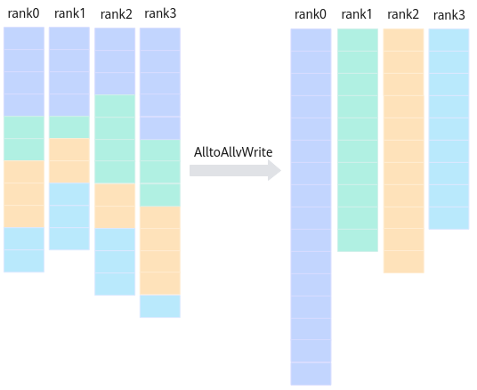

# AlltoAllvWrite

> **Section**: 6.2.4.11.1.10  
> **PDF Pages**: 2938–2940  

---

<!-- page 2938 -->

```cpp
}}
```

## 6.2.4.11.1.10 AlltoAllvWrite

产品支持情况

产品是否支持

Atlas 350 加速卡√

Atlas A3 训练系列产品/Atlas A3 推理系列产品x

Atlas A2 训练系列产品/Atlas A2 推理系列产品x

Atlas 200I/500 A2 推理产品x

Atlas 推理系列产品AI Corex

Atlas 推理系列产品Vector Corex

Atlas 训练系列产品x

功能说明

集合通信AlltoAllvWrite的任务下发接口，返回该任务的标识handleId给用户。

AlltoAllvWrite的功能为：通信域内的卡互相发送和接收数据，并且定制每张卡给其它卡发送的数据量和从其它卡接收的数据量，以及定制发送和接收的数据在内存中的偏移。结合原型中的参数，描述接口功能，具体为：本卡发送地址偏移为sendOffsets[i]字节且大小为sendSizes[i]字节的数据给第i张卡，remoteWinOffset表示对端卡发送数据的地址偏移，localDataSize表示发送给本卡的数据大小。注意：这里的偏移和数据量均为字节数。

<!-- page 2939 -->



函数原型

```cpp
template <bool commit = false>__aicore__ inline HcclHandle AlltoAllvWrite(GM_ADDR usrIn, GM_ADDR sendOffsets, GM_ADDR sendSizes, uint64_t remoteWinOffset, uint64_t localDataSize)
```

参数说明

表6-1353模板参数说明

参数名输入/输出

描述

commit输入bool类型。参数取值如下：

●true：在调用Prepare接口时，Commit同步通知服务端可以执行该通信任务。

●false：在调用Prepare接口时，不通知服务端执行该通信任务。

<!-- page 2940 -->

表6-1354接口参数说明

参数名输入/输出

描述

usrIn输入源数据buffer地址。

sendOffsets输入待发送的每个分片的偏移，以字节为单位。

sendSizes输入待发送的每个分片的数据大小，以字节为单位。

remoteWinOffset

输入对端卡发送的数据偏移，以字节为单位。

localDataSize

输入发送给本卡的数据大小，以字节为单位。

返回值说明

返回该任务的标识handleId，handleId大于等于0。调用失败时，返回 -1。

约束说明

●调用本接口前确保已调用过InitV2和SetCcTilingV2接口。

●若HCCL对象的模板参数config未指定下发通信任务的核，则该接口只能在AIC核或者AIV核两者之一上调用。若HCCL对象的模板参数config指定了下发通信任务的核，则该接口可以在AIC核和AIV核上同时调用，接口内部根据指定的核的类型，在对应的AIC核、AIV核二者之一下发该通信任务。

●一个通信域内，所有Prepare接口和InterHcclGroupSync接口的总调用次数不能超过63。

●对于Atlas 350 加速卡，通信服务端为CCU时，单次最大通信数据量不能超过256M。

调用示例

```cpp
extern "C" __global__ __aicore__ void alltoallvwrite_custom(GM_ADDR xGM, GM_ADDR yGM, GM_ADDR workspaceGM, GM_ADDR tilingGM) {
```

REGISTER_TILING_DEFAULT(AllToAllVWriteCustomTilingData); //AllToAllVWriteCustomTilingData为对应算子头文件定义的结构体    GET_TILING_DATA_WITH_STRUCT(AllToAllVWriteCustomTilingData, tilingData, tilingGM);

```cpp
auto &&cfg       = tilingData.param;
    uint32_t M = cfg.M;
    uint32_t K = cfg.K;
    uint32_t dataType = cfg.dataType;
    uint32_t dataTypeSize = cfg.dataTypeSize;
KERNEL_TASK_TYPE_DEFAULT(KERNEL_TYPE_MIX_AIC_1_2);
    Hccl<HcclServerType::HCCL_SERVER_TYPE_CCU> hccl;
    GM_ADDR context = GetHcclContext<HCCL_GROUP_ID_0>();
    hccl.InitV2(context, &tilingData);
    hccl.SetCcTilingV2(offsetof(AllToAllVCustomV3TilingData, mc2CcTiling));
    uint32_t rankDim = hccl.GetRankDim();
    uint32_t rankId = hccl.GetRankId();
uint64_t perRankDataSize_ = M * K * dataTypeSize / rankDim;
    GM_ADDR sendSizeGM_ = workspaceGM;
```
