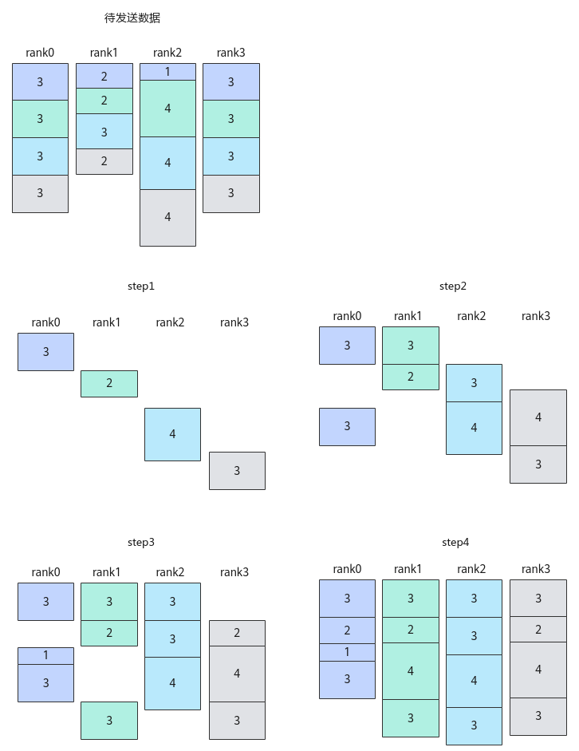

# Iterate

> **Section**: 6.2.4.11.1.14  
> **PDF Pages**: 2950–2953  

---

<!-- page 2950 -->

●本接口在AIC核或者AIV核上调用必须与对应的Prepare接口的调用核保持一致。

●非细粒度通信时，本接口的调用次数应该与Prepare的repeat次数一致，细粒度通信时，本接口的调用次数应该与通信任务的总步骤数/步长*Prepare的repeat次数一致。handleId调用Wait接口的顺序，必须和Prepare接口一致。

调用示例

REGISTER_TILING_DEFAULT(ReduceScatterCustomTilingData); //ReduceScatterCustomTilingData为对应算子头文件定义的结构体GET_TILING_DATA_WITH_STRUCT(ReduceScatterCustomTilingData, tilingData, tilingGM);Hccl hccl;GM_ADDR contextGM = AscendC::GetHcclContext<0>();  // AscendC自定义算子kernel中，通过此方式获取HCCL context__gm__ void *mc2InitTiling = (__gm__ void *)(&tiling->mc2InitTiling);__gm__ void *mc2CcTiling = (__gm__ void *)(&(tiling->mc2CcTiling));hccl.InitV2(contextGM, &tilingData);auto ret = hccl.SetCcTilingV2(offsetof(ReduceScatterCustomTilingData, mc2CcTiling));if (ret != HCCL_SUCCESS) {    return;}if (AscendC::g_coreType == AIC) {    HcclHandle handleId = hccl.ReduceScatter(sendBuf, recvBuf, 100, HcclDataType::HCCL_DATA_TYPE_INT8, HcclReduceOp::HCCL_REDUCE_SUM, 10);    for (uint8_t i=0; i<10; i++) {        hccl.Commit(handleId ); // 通知服务端可以执行上述的ReduceScatter任务    }    for (uint8_t i=0; i<10; i++) {        hccl.Wait(handleId); // 阻塞接口，需等待上述ReduceScatter任务执行完毕    }    hccl.Finalize(); // 后续无其他通信任务，通知服务端执行上述ReduceScatter任务之后即可退出}

## 6.2.4.11.1.14 Iterate

产品支持情况

产品是否支持

Atlas 350 加速卡x

Atlas A3 训练系列产品/Atlas A3 推理系列产品√

Atlas A2 训练系列产品/Atlas A2 推理系列产品√

Atlas 200I/500 A2 推理产品x

Atlas 推理系列产品AI Corex

Atlas 推理系列产品Vector Corex

Atlas 训练系列产品x

功能说明

在某些算法下，一次完整的集合通信任务可以细分为多个步骤，对每个步骤的数据完成点对点的通信任务，称为细粒度通信。以通信算法"AlltoAll=level0:fullmesh;level1:pairwise"、通信步长为1的AlltoAllV通信任务为例，这里参数level0代表配置Server（昇腾AI Server，通常是8卡或16卡的昇腾NPU设备组

<!-- page 2951 -->

成的服务器形态的统称）内通信算法，参数level1代表配置Server间通信算法，fullmesh为全连接通信算法，pairwise为逐对通信算法，详细的算法内容可参见《HCCL集合通信库》中的相关参考 > 集合通信算法介绍；如下图所示，该示例展示了AlltoAllV通信的所有待发送数据、每一步通信完成后各卡收到的数据。

图6-171使用pairwise 算法的AlltoAllV 通信步骤示意图



在通算融合算子中，通过调用本接口，结合对应的Prepare原语，获取通信算法每一步的输入或输出，让计算、通信实现更精细粒度的流水排布，从而获得更好的性能收益。

<!-- page 2952 -->

函数原型

```cpp
template <bool sync = true>__aicore__ inline int32_t Iterate(HcclHandle handleId, uint16_t *seqSlices, uint16_t seqSliceLen)
```

参数说明

表6-1359模板参数说明

参数名输入/输出

描述

sync输入bool类型。是否需要等待当前通信步骤完成再进行后续计算或通信任务，参数取值如下：

●true：默认值，表示阻塞并等待当前通信步骤完成。该参数取值为true时，无需再调用Wait接口等待通信任务完成。

●false：表示不等待当前通信步骤完成。

表6-1360接口参数说明

参数名输入/输出

描述

handleId输入对应通信任务的标识ID，只能使用Prepare原语接口的返回值。using HcclHandle = int8_t;

seqSlices输出由用户申请的栈空间，用于保存当前通信步骤的输入或输出数据块的索引下标。在先计算后通信场景，该参数返回当前通信步骤需要的输入数据块索引；在先通信后计算场景，该参数返回当前通信步骤的输出数据块索引。

seqSliceLen输入seqSlices数组的长度。根据算法的通信步长及算法逻辑，取每一步通信需要保存的数据块索引个数为该数组长度。

返回值说明

●当通信任务未结束时：

–在先计算后通信场景，返回值为当前通信步骤需要的输入数据块数量，与参数seqSliceLen数值相同。

–在先通信后计算场景，返回值为当前通信步骤产生的输出数据块数量，与参数seqSliceLen数值相同。

●当通信任务结束后，返回值为0。

约束说明

●调用本接口前确保已调用过InitV2和SetCcTilingV2接口。

●入参handleId只能使用Prepare原语对应接口的返回值。

<!-- page 2953 -->

●本接口当前支持的通信算法为"AlltoAll=level0:fullmesh;level1:pairwise"。

调用示例

extern "C" __global__ __aicore__ void alltoallv_custom(GM_ADDR sendBuf, GM_ADDR recvBuf, GM_ADDR workspaceGM, GM_ADDR tilingGM) {    // 指定AIV核通信    if (AscendC::g_coreType != AIV) {        return;    }

constexpr uint32_t RANK_NUM = 4U;    constexpr uint32_t STEP_SIZE = 1U; // 细粒度通信步长，通常使用SetStepSize接口设置，示例代码简化成1    constexpr uint64_t sendCounts[RANK_NUM][RANK_NUM] = {        {3, 3, 3, 3}, {2, 2, 3, 2},        {1, 4, 4, 4}, {3, 3, 3, 3}    };    constexpr uint64_t sDisplacements[RANK_NUM][RANK_NUM] = {        {0, 3, 6, 9}, {0, 2, 4, 7},        {0, 1, 5, 9}, {0, 3, 6, 9}    };    constexpr uint64_t recvCounts[RANK_NUM][RANK_NUM] = {        {3, 2, 1, 3}, {3, 2, 4, 3},        {3, 3, 4, 3}, {3, 2, 4, 3}    };    constexpr uint64_t rDisplacements[RANK_NUM][RANK_NUM] = {        {0, 3, 5, 6}, {0, 3, 5, 9},        {0, 3, 6, 10}, {0, 3, 5, 9}    };    HcclDataType dtype = HcclDataType::HCCL_DATA_TYPE_FP16;    REGISTER_TILING_DEFAULT(AllToAllVCustomTilingData); // AllToAllVCustomTilingData为对应算子头文件定义的结构体    GET_TILING_DATA_WITH_STRUCT(AllToAllVCustomTilingData, tilingData, tilingGM);    GM_ADDR contextGM = AscendC::GetHcclContext<0>();  // AscendC自定义算子kernel中，通过此方式获取HCCL context    Hccl hccl;    hccl.InitV2(contextGM, &tilingData);    auto ret = hccl.SetCcTilingV2(offsetof(AllToAllVCustomTilingData, alltoallvCcTiling));    if (ret != HCCL_SUCCESS) {        return;    }    const uint32_t selfRankId = hccl.GetRankId();    // 当通信任务为"AlltoAll=level0:fullmesh;level1:pairwise"时    // 1. 每步通信产生的数据块数量等于STEP_SIZE    // 2. 总的通信步数为RANK_NUM/STEP_SIZE*repeat    uint16_t sliceInfo[STEP_SIZE];

if (TILING_KEY_IS(1000UL)) {        // 通算融合中的“先通信后计算”场景，即每一步都是先通信，再将通信的输出作为计算的输入并执行计算        const auto handleId = hccl.AlltoAllV<true>(sendBuf, sendCounts[selfRankId], sDisplacements[selfRankId], dtype,                                                   recvBuf, recvCounts[selfRankId], rDisplacements[selfRankId], dtype);        // 模板参数sync = true，表示该接口会阻塞等待每一步通信结果，并将输出数据块的下标索引填入sliceInfo中        while (hccl.Iterate<true>(handleId, sliceInfo, sizeof(sliceInfo) / sizeof(sliceInfo[0]))) {            // 每一步通信的输出数据块的下标索引保存在sliceInfo中，可以插入相应的计算流程，实现细粒度的通算融合        }        // Iterate已经会阻塞等待，因此不再需要Wait        // hccl.Wait(handleId);    } else if (TILING_KEY_IS(1001UL)) {        // 通算融合中的“先计算后通信”场景，即每一步都是先计算，再将计算的结果作为通信的输入并提交通信事务        const uint8_t tileNum = 2U;        const auto handleId = hccl.AlltoAllV<false>(sendBuf, sendCounts[selfRankId], sDisplacements[selfRankId], dtype,                                                    recvBuf, recvCounts[selfRankId], rDisplacements[selfRankId], dtype,                                                    tileNum);        for (uint8_t i = 0; i < tileNum; ++i) {
