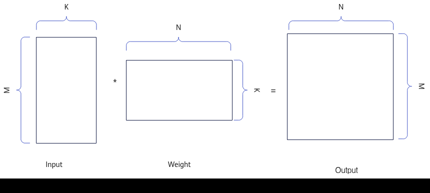
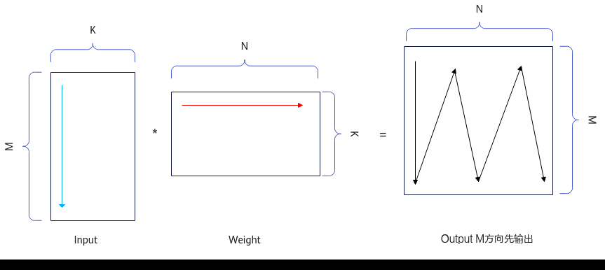
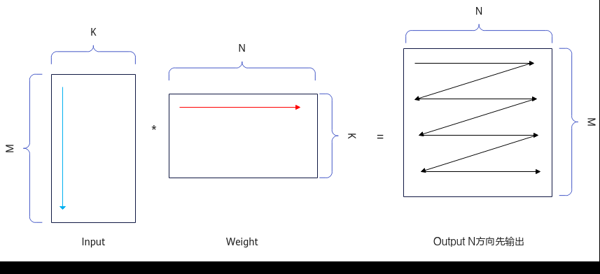

# TConv3DApiTiling结构体

> **Section**: 3  
> **PDF Pages**: 3013–3016  

---

<!-- page 3013 -->

参数说明

表6-1395参数说明

参数名输入/输出

描述

ascendcPlatform

输入传入硬件平台的信息，PlatformAscendC定义请参见6.4.2.1.2 构造及析构函数。

platform输入传入硬件版本以及AI Core中各个硬件单元提供的内存大小。PlatformInfo构造时通过6.4.2.1.2 构造及析构函数获取。

PlatformInfo结构定义如下，socVersion通过6.4.2.1.4GetSocVersion获取并透传，各类硬件存储空间大小通过6.4.2.1.11 GetCoreMemSize获取并透传。struct PlatformInfo {    platform_ascendc::SocVersion socVersion;    uint64_t l1Size = 0;    uint64_t l0CSize = 0;    uint64_t ubSize = 0;    uint64_t l0ASize = 0;    uint64_t l0BSize = 0;    uint64_t btSize = 0;    uint64_t fbSize = 0;};

约束说明

无

调用示例

// 实例化Conv3d Apiauto ascendcPlatform = platform_ascendc::PlatformAscendC(context->GetPlatformInfo());Conv3dTilingApi::Conv3dTiling conv3dApiTiling(ascendcPlatform);conv3dApiTiling.SetGroups(groups);conv3dApiTiling.SetOrgWeightShape(cout, kd, kh, kw);...conv3dApiTiling.GetTiling(conv3dCustomTilingData.conv3dApiTilingData);

## ?.3. TConv3DApiTiling 结构体

TConv3DApiTiling结构体包含Conv3D算子规格信息及Tiling切分算法的相关参数，被传递给Conv3D Kernel侧，用于数据切分、数据搬运和计算等。TConv3DApiTiling结构体的参数说明见表6-1396。

用户通过调用 GetTiling接口获取TConv3DApiTiling结构体，具体流程请参考Conv3D Tiling使用说明。当前暂不支持用户自定义配置TConv3DApiTiling结构体中的参数。

表6-1396 TConv3DApiTiling 结构说明

参数名称数据类型说明

groupsuint32_t预留参数，当前仅支持为1。

<!-- page 3014 -->

参数名称数据类型说明

singleCoreDouint64_t单核上处理的Dout大小。

singleCoreCouint32_t单核上处理的Cout大小。

singleCoreMuint64_t单核上处理的M大小。

orgDouint64_tConv3D计算中原始Dout大小。

orgCouint32_tConv3D计算中原始Cout大小。

orgHouint64_tConv3D计算中原始Hout大小。

orgWouint64_tConv3D计算中原始Wout大小。

orgCiuint32_tConv3D计算中原始Cin大小。

orgDiuint64_tConv3D计算中原始Din大小。

orgHiuint64_tConv3D计算中原始Hin大小。

orgWiuint64_tConv3D计算中原始Win大小。

kernelDuint32_tConv3D计算中卷积核原始kernel D维度大小。

kernelHuint32_tConv3D计算中卷积核原始kernel H维度大小。

kernelWuint32_tConv3D计算中卷积核原始kernel W维度大小。

strideDuint32_tConv3D计算中Stride D维度大小。

strideHuint32_tConv3D计算中Stride H维度大小。

strideWuint32_tConv3D计算中Stride W维度大小。

dilationDuint32_tConv3D计算中Dilation D维度大小。

dilationHuint32_tConv3D计算中Dilation H维度大小。

dilationWuint32_tConv3D计算中Dilation W维度大小。

padHeaduint32_tConv3D计算中Padding D维度Head方向大小。

padTailuint32_tConv3D计算中Padding D维度Tail方向大小。

padUpuint32_tConv3D计算中Padding H维度Up方向大小。

padDownuint32_tConv3D计算中Padding H维度Down方向大小。

padLeftuint32_tConv3D计算中Padding W维度Left方向大小。

<!-- page 3015 -->

参数名称数据类型说明

padRightuint32_tConv3D计算中Padding W维度Right方向大小。

mL0uint32_tL0上单次处理的M大小。

kL0uint32_tL0上单次处理的K大小。

nL0uint32_tL0上单次处理的N大小。

kAL1uint32_tL1上Input K的实际大小，等于Cin1InL1 *KH * KW * C0，Cin1InL1是KD * Cin1合轴之后Tiling切分的大小。

kBL1uint32_tL1上Weight K的实际大小，等于Cin1InL1 *KH * KW * C0，Cin1InL1是KD * Cin1合轴之后Tiling切分的大小。

nBL1uint32_tL1上Weight载入Cout维度的实际数据大小。

mAL1uint32_tL1上Input载入M的实际数据大小。

al1FullLoaduint8_tInput数据在L1 Buffer是否全载。

0：Input数据在L1 Buffer上不全载。

1：Input数据在L1 Buffer上全载。

bl1FullLoaduint8_tWeight数据在L1 Buffer是否全载。

0：Weight数据在L1 Buffer上不全载。

1：Weight数据在L1 Buffer上全载。

iterateMNOrderuint8_t输出结果矩阵Output时，M轴和N轴的输出顺序。

0：优先输出M方向。先输出M方向，再输出N方向，图6-178。

1：优先输出N方向。先输出N方向，再输出M方向，图6-179。

M由Hout和Wout组成，M方向的输出顺序为，先输出Wout方向，再输出Hout方向。

biasFullLoadFlaguint8_tBias是否全载进L1 Buffer。

0：否，单核内单次载入Bias大小等于单次矩阵乘N方向的大小nL0。

1：是，单核内的Bias一次全载。

注：上述的M轴为卷积正向操作过程中的输入Input在img2col展开后的纵轴，数值上等于Hout * Wout；K为输入Input在img2col展开后的横轴，数值上等于KD*C1*KH*KW*C0；KD/KH/KW为Weight的Depth、Height、Width，即kernelD/kernelH/kernelW的简写；N为Weight的Cout，具体请见图6-177。

<!-- page 3016 -->

图6-177卷积3D 正向MKN 示意图

图6-178卷积3D 正向MFirst 示意图

图6-179卷积3D 正向NFirst 示意图

