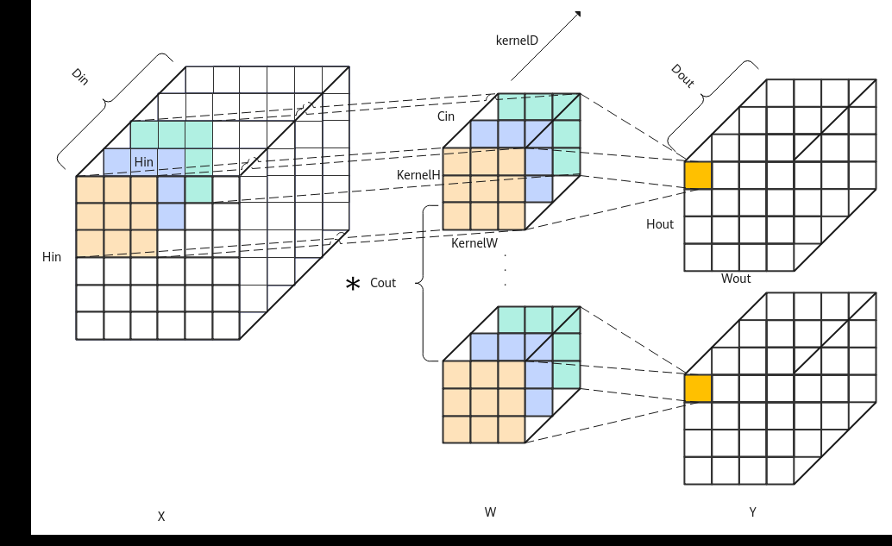
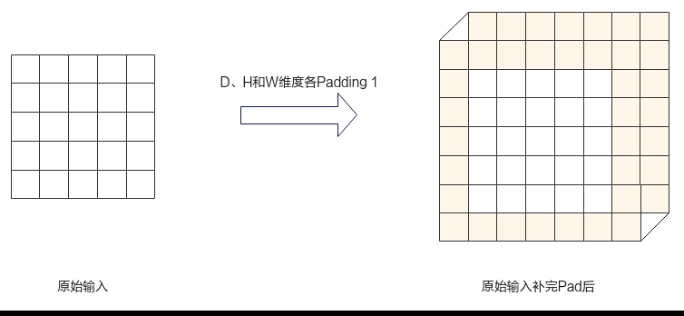
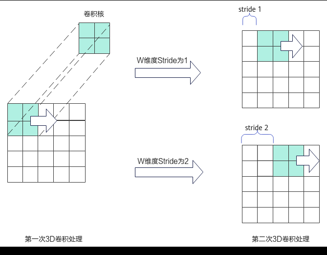
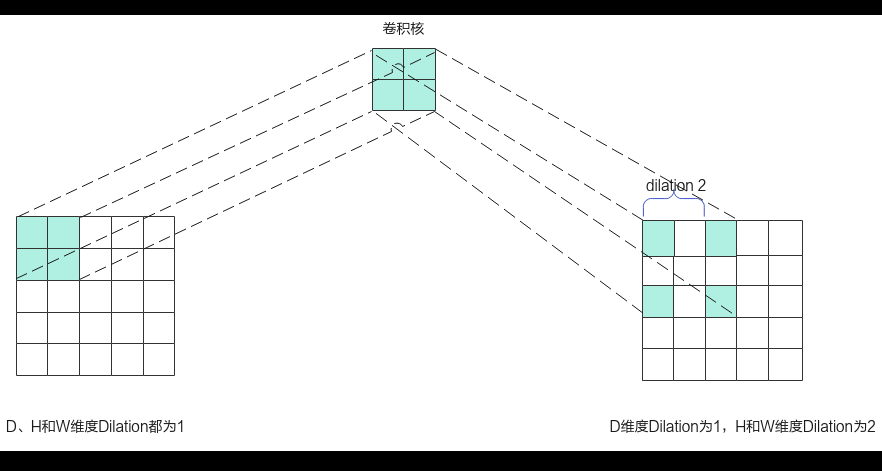

# Conv3D Kernel侧接口

> **Section**: 6.2.4.12.1.1  
> **PDF Pages**: 2996–3000  

---

<!-- page 2996 -->

功能说明

获取指定Index通信域的context（消息区）地址。

函数原型

```cpp
template <uint32_t index>__aicore__ inline __gm__ uint8_t* __gm__ GetHcclContext(void)
```

参数说明

表6-1391模板参数说明

参数名描述

index模板参数，用来表示要设置的通信域ID，当前只支持2个通信域，index只能为0/1。

返回值说明

指定通信域的context（消息区）地址。

约束说明

当前最多只支持2个通信域。

调用示例

```cpp
GM_ADDR contextGM = AscendC::GetHcclContext<0>();
```

## 6.2.4.12 卷积计算

## 6.2.4.12.1 Conv3D

## 6.2.4.12.1.1 Conv3D Kernel 侧接口

## ?.1. Conv3D 使用说明

Ascend C提供一组Conv3D高阶API，方便用户快速实现3维卷积正向矩阵运算。3维正向卷积的示意图如图6-172，其计算公式为：


●X为Conv3D卷积的特征矩阵Input。

●W为Conv3D卷积的权重矩阵Weight。

●B为Conv3D卷积的偏置矩阵Bias。

●Y为完成卷积及偏置操作之后的结果矩阵Output。

<!-- page 2997 -->

图6-172 3 维正向卷积示意图



说明

Cin为Input的输入通道大小Channel；Din为Input的Depth维度大小；Hin为Input的Height维度大小；Win为Input的Width维度大小；Cout为Weight、Output的输出通道大小；Dout为Output的Depth维度的大小；Hout为Output的Height维度大小；Wout为Output的Width维度大小；下文中提及的M维度，为卷积正向操作过程中的输入Input在img2col展开后的纵轴，数值上等于Hout * Wout。

Channel、Depth、Height、Width后续简称为C、D、H、W。

除上述基础运算外，在Conv3D计算中可以设置参数Padding、Stride和Dilation，具体含义如下。

●Padding代表在输入矩阵的三个维度上填充0，见图6-173。

●Stride代表卷积核三个维度上滑动的距离，见图6-174。

●Dilation代表卷积核三个维度上每个数据的间距，见图6-175。

图6-173卷积3D 正向Padding 示意图



<!-- page 2998 -->

图6-174卷积3D 正向Stride 示意图



图6-175卷积3D 正向Dilation 示意图



Kernel侧实现Conv3D运算的步骤概括为：

1.创建Conv3D对象。

2.初始化操作。

3.设置3D卷积输入Input、Weight、Bias和输出Output。

<!-- page 2999 -->

4.完成3D卷积操作。

5.结束3D卷积操作。

使用Conv3D高阶API实现卷积正向的具体步骤如下：

步骤1创建Conv3D对象。

```cpp
#include "lib/conv/conv3d/conv3d_api.h"
```

using inputType = ConvApi::ConvType<AscendC::TPosition::GM, ConvFormat::NDC1HWC0, bfloat16_t>;using weightType = ConvApi::ConvType<AscendC::TPosition::GM, ConvFormat::FRACTAL_Z_3D, bfloat16_t>;using outputType = ConvApi::ConvType<AscendC::TPosition::GM, ConvFormat::NDC1HWC0, bfloat16_t>;using biasType = ConvApi::ConvType<AscendC::TPosition::GM, ConvFormat::ND, float>; // 可选参数

```cpp
Conv3dApi::Conv3D<inputType, weightType, outputType, biasType> conv3dApi;
```

创建对象时需要传入Input、Weight和Output参数类型信息；Bias的参数类型为可选参数，不带Bias输入的卷积计算场景，不传入该参数。类型信息通过ConvType来定义，包括：内存逻辑位置、数据格式、数据类型。

template <TPosition POSITION, ConvFormat FORMAT, typename TYPE>struct ConvType {    constexpr static TPosition pos = POSITION;    // Conv3d输入或输出在内存上的位置    constexpr static ConvFormat format = FORMAT;  // Conv3d输入或者输出的数据格式    using T = TYPE;                               // Conv3d输入或输出的数据类型};

下面简要介绍在创建对象时使用到的相关数据结构，开发者可选择性地了解这些内容。用于创建Conv3D对象的数据结构定义如下：

```cpp
template <class INPUT_TYPE, class WEIGHT_TYPE, class OUTPUT_TYPE, class BIAS_TYPE = biasType, class CONV_CFG = Conv3dParam>using Conv3D = Conv3dIntfExt<Config<ConvApi::ConvDataType<INPUT_TYPE, WEIGHT_TYPE, OUTPUT_TYPE, BIAS_TYPE, CONV_CFG>>, Impl, Intf>
```

其中，Conv3dIntfExt和Conv3dParam数据结构定义如下：

```cpp
template <class Conv3dCfg, template <typename, class, bool> class Impl = Conv3dApiImpl,    template <class, template <typename, class, bool> class> class Intf = Conv3dIntf>struct Conv3dIntfExt : public Intf<Conv3dCfg, Impl> {    __aicore__ inline Conv3dIntfExt()    {}};struct Conv3dParam : public ConvApi::ConvParam {    __aicore__ inline Conv3dParam(){};};
```

这里的Conv3dIntf是Conv3dIntfExt的基类，Conv3dCfg是Conv3dIntf模板入参，数据结构定义如下：

```cpp
template <class Config, template <typename, class, bool> class Impl>struct Conv3dIntf {    using InputT = typename Config::SrcAT;
    using WeightT = typename Config::SrcBT;
    using OutputT = typename Config::DstT;
    using BiasT = typename Config::BiasT;
    using L0cT = typename Config::L0cT;
    using ConvParam = typename Config::ConvParam;
    __aicore__ inline Conv3dIntf()    {}}template <class ConvDataType>struct Conv3dCfg : public ConvApi::ConvConfig<ConvDataType> {public:    __aicore__ inline Conv3dCfg()    {}    using ContextData = struct _ : public ConvApi::ConvConfig<ConvDataType>::ContextData {        __aicore__ inline _()
```

<!-- page 3000 -->

```cpp
{}    };};
```

表6-1392 ConvType 说明

参数说明

TPosition内存逻辑位置。

●Input矩阵可设置为TPosition::GM

●Weight矩阵可设置为TPosition::GM

●Bias矩阵可设置为TPosition::GM

●Output矩阵可设置为TPosition::GM

ConvFormat

数据格式。

●Input矩阵可设置为ConvFormat::NDC1HWC0

●Weight矩阵可设置为ConvFormat::FRACTAL_Z_3D

●Bias矩阵可设置为ConvFormat::ND

●Output矩阵可设置为ConvFormat::NDC1HWC0

TYPE数据类型。

●Input矩阵可设置为half、bfloat16_t

●Weight矩阵可设置为half、bfloat16_t

●Bias矩阵可设置为half、float

●Output矩阵可设置为half、bfloat16_t

注意：输入输出的矩阵数据类型需要对应，具体支持的数据类型组合关系请参考表6-1393。

表6-1393 Conv3D 输入输出数据类型的组合说明

**Input矩阵Weight矩阵BiasOutput矩阵**

支持平台

halfhalfhalfhalf●Atlas A3 训练系列产品/Atlas A3 推理系列产品

●Atlas A2 训练系列产品/Atlas A2 推理系列产品

bfloat16_tbfloat16_tfloatbfloat16_t

●Atlas A3 训练系列产品/Atlas A3 推理系列产品

●Atlas A2 训练系列产品/Atlas A2 推理系列产品

步骤2初始化操作。

Conv3dApi::Conv3D<inputType, weightType, outputType, biasType> conv3dApi;TPipe pipe;                                                        // 初始化TPipeconv3dApi.Init(&tiling);                                           // 初始化conv3dApi
