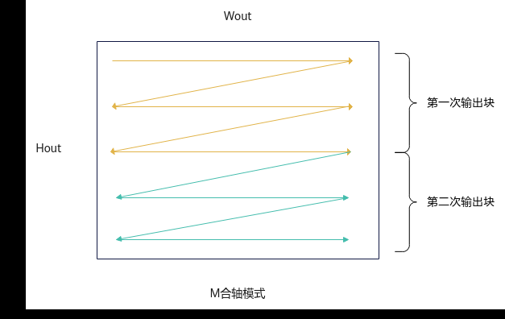

# SetSingleOutputShape

> **Section**: 7  
> **PDF Pages**: 3007–3007  

---

<!-- page 3007 -->

## ?.7. SetSingleOutputShape

产品支持情况

产品是否支持

Atlas 350 加速卡x

Atlas A3 训练系列产品/Atlas A3 推理系列产品√

Atlas A2 训练系列产品/Atlas A2 推理系列产品√

Atlas 200I/500 A2 推理产品x

Atlas 推理系列产品AI Corex

Atlas 推理系列产品Vector Corex

Atlas 训练系列产品x

功能说明

设置单核上结果矩阵Output的形状。

Conv3D高阶API目前支持M合轴模式的输出方式。在M合轴模式下，Conv3D API内部将Wout和Hout视为同一轴处理，输出时先沿Wout方向输出，完成一整行Wout输出后，再进行下一行的Wout输出。

图6-176 M 合轴模式示意图



函数原型

```cpp
__aicore__ inline void SetSingleOutputShape(uint64_t singleCo, uint64_t singleDo, uint64_t singleM)
```
