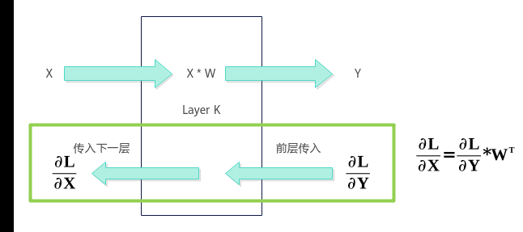
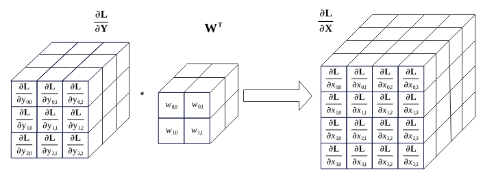

# Conv3DBackpropInput Kernel侧接口

> **Section**: 6.2.4.12.2.1  
> **PDF Pages**: 3026–3028  

---

<!-- page 3026 -->

参数说明

参数名输入/输出描述

groups输入当前仅支持取值为1，暂不支持分组卷积。

返回值说明

无

约束说明

在调用GetTiling接口前，本接口可选调用。若未调用本接口，默认groups=1，当前仅支持输入groups值配置为1，group>1的卷积能力暂不支持。

调用示例

// 实例化Conv3D Apiauto ascendcPlatform = platform_ascendc::PlatformAscendC(context->GetPlatformInfo());Conv3dTilingApi::Conv3dTiling conv3dApiTiling(ascendcPlatform);conv3dApiTiling.SetGroups(groups);

## 6.2.4.12.2 Conv3DBackpropInput

## 6.2.4.12.2.1 Conv3DBackpropInput Kernel 侧接口

## ?.1. Conv3DBackpropInput 使用说明

Ascend C提供一组Conv3DBackpropInput高阶API，便于用户快速实现卷积的反向运算，求解反向传播的误差。转置卷积Conv3DTranspose与Conv3DBackpropInput具有相同的数学过程，因此用户也可以使用Conv3DBackpropInput高阶API实现转置卷积算子。卷积的正反向传播如图1 卷积层的前后向传播示意图，反向传播误差计算如图2 反向传播误差计算示意图。

Conv3DBackpropInput的计算公式为：


●∂L/∂Y为卷积正向损失函数对输出Y的梯度GradOutput，作为求反向传播误差∂L/∂X的输入。

●W为卷积正向Weight权重，即矩阵核Kernel，也是滤波器Filter，作为求反向传播误差∂L/∂X的输入，WT表示W的转置。

●∂L/∂X为特征矩阵的反向传播误差GradInput。

<!-- page 3027 -->

图6-180卷积层的前后向传播示意图



图6-181反向传播误差计算示意图



Kernel侧实现Conv3DBackpropInput求解反向传播误差运算的步骤概括为：

1.创建Conv3DBackpropInput对象。

2.初始化操作。

3.设置卷积的输出反向GradOutput、卷积的输入Weight。

4.完成卷积反向操作。

5.结束卷积反向操作。

说明

下文中提及的M轴方向，即为GradOutput矩阵纵向；K轴方向，即为GradOutput矩阵横向或Weight矩阵纵向；N轴方向，即为Weight矩阵横向。

使用Conv3DBackpropInput高阶API求解反向传播误差运算的具体步骤如下：

步骤1创建Conv3DBackpropInput对象。

```cpp
#include "lib/conv_backprop/conv3d_bp_input_api.h"
using weightDxType = ConvBackpropApi::ConvType<ConvCommonApi::TPosition::GM, ConvCommonApi::ConvFormat::FRACTAL_Z_3D, weightType>;using inputSizeDxType =    ConvBackpropApi::ConvType<ConvCommonApi::TPosition::GM, ConvCommonApi::ConvFormat::ND, int32_t>;using gradOutputDxType = ConvBackpropApi::ConvType<ConvCommonApi::TPosition::GM, ConvCommonApi::ConvFormat::NDC1HWC0, gradOutputType>;
```

<!-- page 3028 -->

```cpp
using gradInputDxType = ConvBackpropApi::ConvType<ConvCommonApi::TPosition::GM, ConvCommonApi::ConvFormat::NCDHW, gradInputType>;ConvBackpropApi::Conv3DBackpropInput<weightDxType, inputSizeDxType, gradOutputDxType, gradInputDxType> gradInput_;
```

创建对象时需要传入权重矩阵Weight、卷积正向特征矩阵Input的shape信息InputSize、GradOutput和GradInput的参数类型信息，类型信息通过ConvType来定义，包括：内存逻辑位置、数据格式、数据类型。

template <TPosition POSITION, ConvFormat FORMAT, typename T>struct ConvType {    constexpr static TPosition pos = POSITION;    // Convolution输入或输出的逻辑位置    constexpr static ConvFormat format = FORMAT;  // Convolution输入或输出的数据格式    using Type = T;                               // Convolution输入或输出的数据类型};

下面简要介绍在创建对象时使用到的相关数据结构，开发者可选择性地了解这些内容。用于创建Conv3DBackpropInput对象的数据结构定义如下：

```cpp
using Conv3DBackpropInput = Conv3DBpInputIntf<Conv3DBpInputCfg<WEIGHT_TYPE, INPUT_TYPE, GRAD_OUTPUT_TYPE, GRAD_INPUT_TYPE, CONV3D_CFG_DEFAULT>, Conv3DBpInputImpl>;
```

其中，Conv3DBpInputIntf、Conv3DBpInputCfg数据结构定义如下：

```cpp
template <class Config_, template <typename, class> class Impl>struct Conv3DBpInputIntf {}template <class WEIGHT_TYPE, class INPUT_TYPE, class GRAD_OUTPUT_TYPE, class GRAD_INPUT_TYPE, const Conv3dConfig& CONV3D_CONFIG = CONV3D_CFG_DEFAULT>struct Conv3DBpInputCfg : public ConvBpContext<WEIGHT_TYPE, INPUT_TYPE, GRAD_OUTPUT_TYPE, GRAD_INPUT_TYPE> {}
```

表6-1397 ConvType 说明

参数说明

POSITION内存逻辑位置。

●Weight矩阵可设置为TPosition::GM

●GradOutput矩阵可设置为TPosition::GM

●InputSize可设置为TPosition::GM

●GradInput矩阵可设置为TPosition::GM

ConvFormat

数据格式。

●Weight矩阵可设置为ConvFormat::FRACTAL_Z_3D

●GradOutput矩阵可设置为ConvFormat::NDC1HWC0

●InputSize矩阵可设置为ConvFormat::ND

●GradInput矩阵可设置为ConvFormat::NDC1HWC0

TYPE数据类型。

●Weight矩阵可设置为half、bfloat16_t

●GradOutput矩阵可设置为half、bfloat16_t

●InputSize矩阵可设置为int32_t

●GradInput矩阵可设置为half、bfloat16_t

注意：GradOutput矩阵和Weight矩阵数据类型需要一致，具体数据类型组合关系请参考表6-1398。
