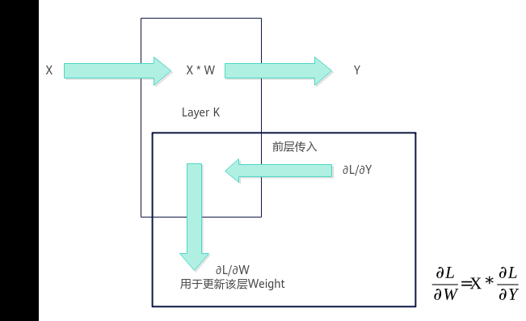
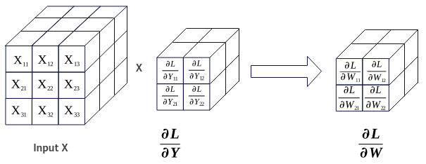

# Conv3DBackpropFilter使用说明

> **Section**: 1  
> **PDF Pages**: 3053–3055  

---

<!-- page 3053 -->

## ?.1. Conv3DBackpropFilter 使用说明

Ascend C提供一组Conv3DBackpropFilter高阶API，便于用户快速实现卷积的反向运算，求解反向传播的误差。

卷积反向的权重传播如图6-182，卷积反向权重计算如图6-183。

Conv3dBackpropFilter的计算公式为：


●X为卷积的特征矩阵Input。

●∂L/∂Y为卷积正向损失函数对输出Y的梯度GradOutput，作为求反向传播误差∂L/∂W的输入，即卷积的输出反向GradOutput。

●∂L/∂W为Weight权重的反向传播误差GradWeight。

图6-182卷积反向权重传播示意图



图6-183卷积反向权重计算过程示意图



<!-- page 3054 -->

Kernel侧实现Conv3DBackpropFilter求解反向传播误差运算的步骤概括为：

1.创建Conv3DBackpropFilter对象。

2.初始化操作。

3.设置卷积的特征矩阵Input、卷积的输出反向GradOutput。

4.完成卷积反向操作。

5.结束卷积反向操作。

使用Conv3DBackpropFilter高阶API求解反向传播误差运算的具体步骤如下：

步骤1创建Conv3DBackpropFilter对象。

```cpp
#include "lib/conv_backprop/conv3d_bp_filter_api.h"
using inputType = ConvBackpropApi::ConvType <ConvCommonApi::TPosition::GM, ConvCommonApi::ConvFormat::NDC1HWC0, inputType>;using weightSizeType = ConvBackpropApi::ConvType<ConvCommonApi::TPosition::GM, ConvCommonApi::ConvFormat::ND, int32_t>;using gradOutputType = ConvBackpropApi::ConvType<ConvCommonApi::TPosition::GM, ConvCommonApi::ConvFormat::NDC1HWC0, gradOutputType>;using gradWeightType = ConvBackpropApi::ConvType <ConvCommonApi::TPosition::GM, ConvCommonApi::ConvFormat::FRACTAL_Z_3D, gradWeightType>;ConvBackpropApi::Conv3DBackpropFilter <inputType, weightSizeType, gradOutputType, gradWeightType> gradWeight_;
```

创建对象时需要传入特征矩阵Input、权重矩阵Weight的shape信息WeightSize、GradOutput和GradWeight的参数类型信息，类型信息通过ConvType来定义，包括：内存逻辑位置、数据格式、数据类型。

template <TPosition POSITION, ConvFormat FORMAT, typename T>struct ConvType {    constexpr static TPosition pos = POSITION;    // Convolution输入或输出的逻辑位置    constexpr static ConvFormat format = FORMAT;  // Convolution输入或输出的数据格式    using Type = T;                               // Convolution输入或输出的数据类型};

下面简要介绍在创建对象时使用到的相关数据结构，开发者可选择性地了解这些内容。用于创建Conv3DBackpropFilter对象的数据结构定义如下：

```cpp
using Conv3DBackpropFilter = Conv3DBpFilterIntf<Conv3DBpFilterCfg<INPUT_TYPE, WEIGHT_TYPE, GRAD_OUTPUT_TYPE, GRAD_WEIGHT_TYPE>, Conv3DBpFilterImpl>;
```

其中，Conv3DBpFilterIntf、Conv3DBpFilterCfg数据结构定义如下：

```cpp
template <class Config_, template <typename, class> class Impl>struct Conv3DBpFilterIntf {}template <class A, class B, class C, class D>struct Conv3DBpFilterCfg : public ConvBpContext<A, B, C, D>{}
```

表6-1419 ConvType 说明

参数说明

POSITION内存逻辑位置。

●Input X矩阵可设置为TPosition::GM

●WeightSize可设置为TPosition::GM

●GradOutput矩阵可设置为TPosition::GM

●GradWeight矩阵可设置为TPosition::GM

<!-- page 3055 -->

参数说明

ConvFormat

数据格式。

●Input矩阵可设置为ConvFormat::NDC1HWC0

●WeightSize矩阵可设置为ConvFormat::ND

●GradOutput矩阵可设置为ConvFormat::NDC1HWC0

●GradWeight矩阵可设置为ConvFormat::FRACTAL_Z_3D

TYPE数据类型。

●Input矩阵可设置为half、bfloat16_t

●WeightSize可设置为int32_t

●GradOutput矩阵可设置为half、bfloat16_t

●GradWeight矩阵可设置为float

注意：Input、GradOutput数据类型需要一致，具体数据类型组合关系请参考表6-1420。

表6-1420 Conv3DBackpropFilter 输入输出数据类型的组合说明

**InputWeightSize**

**GradOutput**

**GradWeight支持平台**

halfint32_thalffloat●Atlas A3 训练系列产品/AtlasA3 推理系列产品

●Atlas A2 训练系列产品/AtlasA2 推理系列产品

bfloat16_t

int32_tbfloat16_tfloat●Atlas A3 训练系列产品/AtlasA3 推理系列产品

●Atlas A2 训练系列产品/AtlasA2 推理系列产品

步骤2初始化操作。

gradWeight_.Init(&(tilingData->dwTiling)); // 初始化gradWeight_相关参数

步骤3设置卷积的特征矩阵Input、卷积的输出反向GradOutput。

gradWeight_.SetGradOutput(gradOutputGm_[offsetA_]);    // 设置矩阵gradOutputgradWeight_.SetInput(inputGm_[offsetB_]);    // 设置矩阵InputgradWeight_.SetSingleShape(singleShapeM, singleShapeN, singleShapeK); // 设置需要计算的形状gradWeight_.SetStartPosition(hoStartIdx_); // 设置初始位置

步骤4完成卷积反向操作。

调用Iterate完成单次迭代计算，叠加while循环完成单核全量数据的计算。Iterate方式，可以自行控制迭代次数，完成所需数据量的计算。while (gradWeight_.Iterate()) {       gradWeight_.GetTensorC(gradWeightGm_[offsetC_]); }

步骤5结束卷积反向操作。
