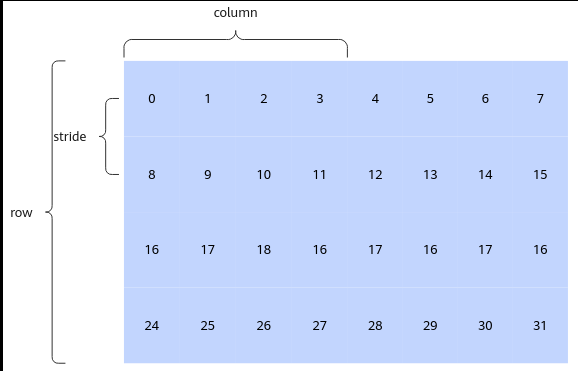

# PhiloxRandom

> **Section**: 6.2.4.13.1  
> **PDF Pages**: 3078–3080  

---

<!-- page 3078 -->

返回值说明

无

约束说明

无

调用示例

```cpp
optiling::Conv3DBackpropFilterTilingData tilingData;auto ascendcPlatform = platform_ascendc::PlatformAscendCManager::GetInstance();ConvBackpropApi::Conv3dBpFilterTiling conv3dBpDwTiling(*ascendcPlatform);conv3dBpDwTiling.SetDilation(dilationD, dilationH, dilationW);
```

## 6.2.4.13 随机函数

## 6.2.4.13.1 PhiloxRandom

产品支持情况

产品是否支持

Atlas 350 加速卡√

Atlas A3 训练系列产品/Atlas A3 推理系列产品x

Atlas A2 训练系列产品/Atlas A2 推理系列产品x

Atlas 200I/500 A2 推理产品x

Atlas 推理系列产品AI Corex

Atlas 推理系列产品Vector Corex

Atlas 训练系列产品x

功能说明

基于Philox随机数生成算法，给定随机数种子，生成若干的随机数。

Philox随机数生成的核心算法是一个基于记数的伪随机数生成算法，输入为一个128bit的记数器C，两个32bit的key（k0和k1），输出为4个32bit的整数。

函数原型

●连续模式template <uint16_t Rounds = 7, typename T>__aicore__ inline void PhiloxRandom(const LocalTensor<T>& dstLocal, const PhiloxKey& philoxKey, const PhiloxCounter& philoxCounter, uint16_t count)

●stride模式

<!-- page 3079 -->

```cpp
template <uint16_t Rounds = 7, typename T>__aicore__ inline void PhiloxRandom(const LocalTensor<T>& dstLocal, const PhiloxKey& philoxKey, const PhiloxCounter& philoxCounter, const PhiloxRandomParams& params)
```

参数说明

表6-1441模板参数说明

参数名描述

RoundsPhilox算法内部实现迭代次数，支持取值7或10。

T目的操作数数据类型，支持的数据类型为：uint32_t、int32_t、float。

其中uint32_t/int32_t为数据类型范围内的均匀分布，float为0-1范围内的均匀分布。

表6-1442参数说明

参数名输入/输出

描述

dstLocal输出目的操作数。

类型为LocalTensor，支持的TPosition为VECIN/VECCALC/VECOUT。

LocalTensor的起始地址需要32字节对齐。

philoxKey输入随机数种子。两个32bit的key，定义如下：using PhiloxKey = uint32_t[2];

philoxCounter

输入随机数种子。一个128bit的记数器C（由4个32bit组成），定义如下：using PhiloxCounter = uint32_t[4];

count输入生成目的操作数的元素个数。

params输入stride模式计算所需的参数信息。PhiloxRandomParams类型，定义如下：struct PhiloxRandomParams {   uint32_t stride;  // 两行元素之间的间隔   uint32_t row;     // 表示生成的行数   uint32_t column;  // 表示生成的每一行的元素个数}

●row * column大于0，不大于LocalTensor的大小。

●column % 4 == 0，stride % 4 == 0，stride >=column。

<!-- page 3080 -->

图6-184 PhiloxRandom 示意图



上图是一个生成随机数的示意图。

●连续模式下使用philoxCounter={0, 0, 0, 0}，count=32来生成32个随机数。

●stride模式下可按列分两次生成，调用两次接口。第一次调用参数为philoxCounter={0, 0, 0, 0}，stride=8，row=4，column=4；第二次调用参数为philoxCounter={1, 0, 0, 0}（每次记数器C自增会生成128bit的随机数），stride=8，row=4，column=4。

返回值说明

无

约束说明

无

调用示例

完整算子样例请参考philoxrandom样例。

// dstLocal：存放计算结果的Tensor// philoxKey={0,0}, philoxCounter={0,0,0,0}

// stride模式，生成32*32个元素PhiloxRandom<10>(dstLocal, philoxKey, philoxCounter, params);// 连续模式，生成1024个元素PhiloxRandom<10>(dstLocal, philoxKey, philoxCounter, 1024);

结果示例如下：

```cpp
[0.31179297 0.8263413  0.6849456 ... 0.10521233 0.29894042 0.96700084]
```
