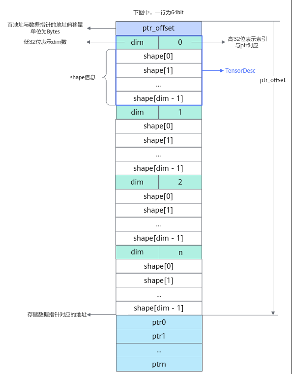
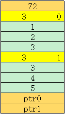

# ListTensorDesc

> **Section**: 6.2.6.2  
> **PDF Pages**: 3082–3085  

---

<!-- page 3082 -->

表6-1444 GetShapeSize 参数说明

参数名输入/输出

描述

shapeInfo输入ShapeInfo类型，LocalTensor或GlobalTensor的shape信息。

## 6.2.6.2 ListTensorDesc

产品支持情况

产品是否支持

Atlas 350 加速卡x

Atlas A3 训练系列产品/Atlas A3 推理系列产品√

Atlas A2 训练系列产品/Atlas A2 推理系列产品√

Atlas 200I/500 A2 推理产品x

Atlas 推理系列产品AI Core√

Atlas 推理系列产品Vector Corex

Atlas 训练系列产品x

功能说明

ListTensorDesc用来解析符合以下内存排布格式的数据，并在kernel侧根据索引获取储存对应数据的地址及shape信息。

<!-- page 3083 -->



需要包含的头文件

```cpp
#include "kernel_operator_list_tensor_intf.h"
```

函数原型

```cpp
class ListTensorDesc {    ListTensorDesc();
    ListTensorDesc(__gm__ void* data, uint32_t length = 0xffffffff, uint32_t shapeSize = 0xffffffff);
    void Init(__gm__ void* data, uint32_t length = 0xffffffff, uint32_t shapeSize = 0xffffffff);
    template<class T> void GetDesc(TensorDesc<T>& desc, uint32_t index);
    template<class T> T* GetDataPtr(uint32_t index);
    uint32_t GetSize();}
```

<!-- page 3084 -->

函数说明

表6-1445模板参数说明

参数名描述

TTensor中元素的数据类型。

表6-1446函数及参数说明

函数名称入参说明含义

ListTensorDesc-默认构造函数，需配合Init函数使用。

ListTensorDescdata：待解析数据的首地址

ListTensorDesc类的构造函数，用于解析对应的内存排布。

length：待解析内存的长度

shapeSize：数据指针的个数

length和shapeSize仅用于校验，不填写时不进行校验

Initdata：待解析数据的首地址

初始化函数，用于解析对应的内存排布。

length：待解析内存的长度

shapeSize：数据指针的个数

length和shapeSize仅用于校验，不填写时不进行校验

<!-- page 3085 -->

函数名称入参说明含义

根据index获得功能说明图中对应的TensorDesc信息。

GetDescdesc：出参，解析后的Tensor描述信息

使用GetDesc前需要先调用TensorDesc.SetShapeAddr为desc指定用于储存shape信息的地址，调用GetDesc后会将shape信息写入该地址。

index：索引值

Atlas 推理系列产品AI Core支持该功能

Atlas 训练系列产品不支持该功能

Atlas A2 训练系列产品/Atlas A2 推理系列产品支持该功能

Atlas A3 训练系列产品/Atlas A3 推理系列产品支持该功能

Atlas 200I/500 A2 推理产品不支持该功能

GetDataPtrindex：索引值根据index获取储存对应数据的地址。

GetSize-获取ListTensor中包含的数据指针的个数。

调用示例

示例中待解析的srcGm内存排布如下图所示：



AscendC::ListTensorDesc listTensorDesc(reinterpret_cast<__gm__ void *>(srcGm)); // srcGm为待解析的gm地址uint32_t size = listTensorDesc.GetSize();                                       // size = 2auto dataPtr0 = listTensorDesc.GetDataPtr<int32_t>(0);                          // 获取ptr0auto dataPtr1 = listTensorDesc.GetDataPtr<int32_t>(1);                          // 获取ptr1

uint64_t buf[100] = {0}; // 示例中Tensor的dim为3, 此处的100表示预留足够大的空间AscendC::TensorDesc<int32_t> desc;desc.SetShapeAddr(buf);          // 为desc指定用于储存shape信息的地址listTensorDesc.GetDesc(desc, 0); // 获取索引0的shape信息
