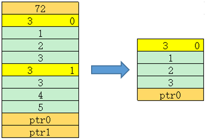

# GetDataObj

> **Section**: 6.2.6.3.8  
> **PDF Pages**: 3092–3092  

---

<!-- page 3092 -->

调用示例

示例中待解析的srcGm内存排布如下图所示：



AscendC::ListTensorDesc listTensorDesc(reinterpret_cast<__gm__ void *>(srcGm)); // srcGm为待解析的gm地址uint32_t size = listTensorDesc.GetSize();                                       // size = 2auto dataPtr0 = listTensorDesc.GetDataPtr<int32_t>(0);                          // 获取ptr0auto dataPtr1 = listTensorDesc.GetDataPtr<int32_t>(1);                          // 获取ptr1

uint64_t buf[100] = {0}; // 示例中Tensor的dim为3, 此处的100表示预留足够大的空间AscendC::TensorDesc<int32_t> desc;desc.SetShapeAddr(buf);          // 为desc指定用于储存shape信息的地址listTensorDesc.GetDesc(desc, 0); // 获取索引0的shape信息

```cpp
uint64_t dim = desc.GetDim();   // dim = 3uint64_t idx = desc.GetIndex(); // idx = 0uint64_t shape[3] = {0};for (uint32_t i = 0;
 i < desc.GetDim();
 i++){    shape[i] = desc.GetShape(i); // GetShape(0) = 1, GetShape(1) = 2, GetShape(2) = 3}auto ptr = desc.GetDataPtr();
```

## 6.2.6.3.8 GetDataObj

产品支持情况

产品是否支持

Atlas 350 加速卡x

Atlas A3 训练系列产品/Atlas A3 推理系列产品√

Atlas A2 训练系列产品/Atlas A2 推理系列产品√

Atlas 200I/500 A2 推理产品x

Atlas 推理系列产品AI Core√

Atlas 推理系列产品Vector Core√

Atlas 训练系列产品x
